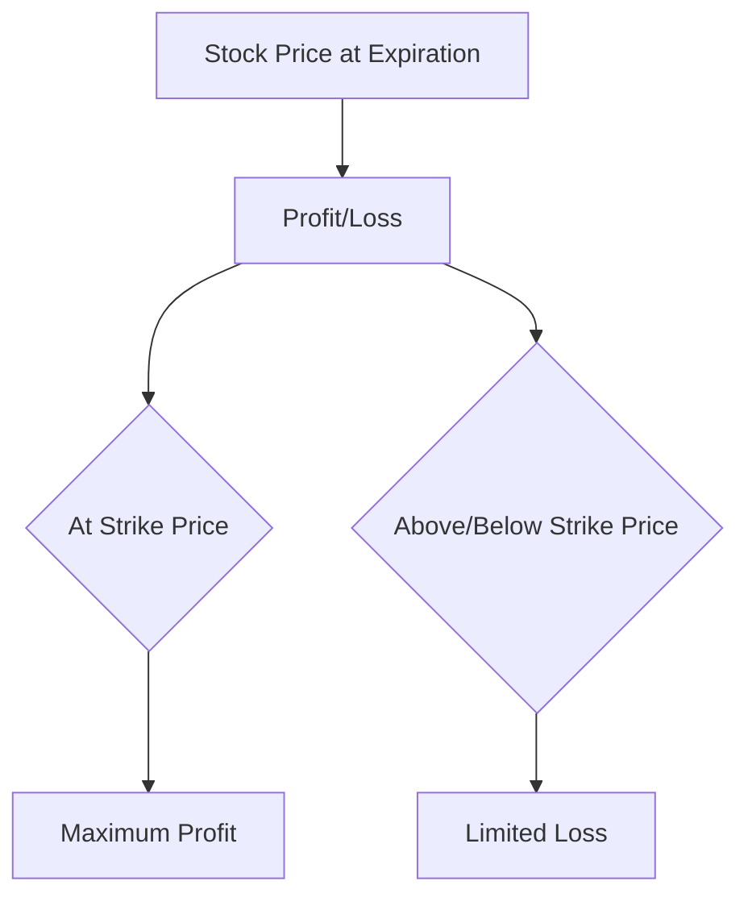
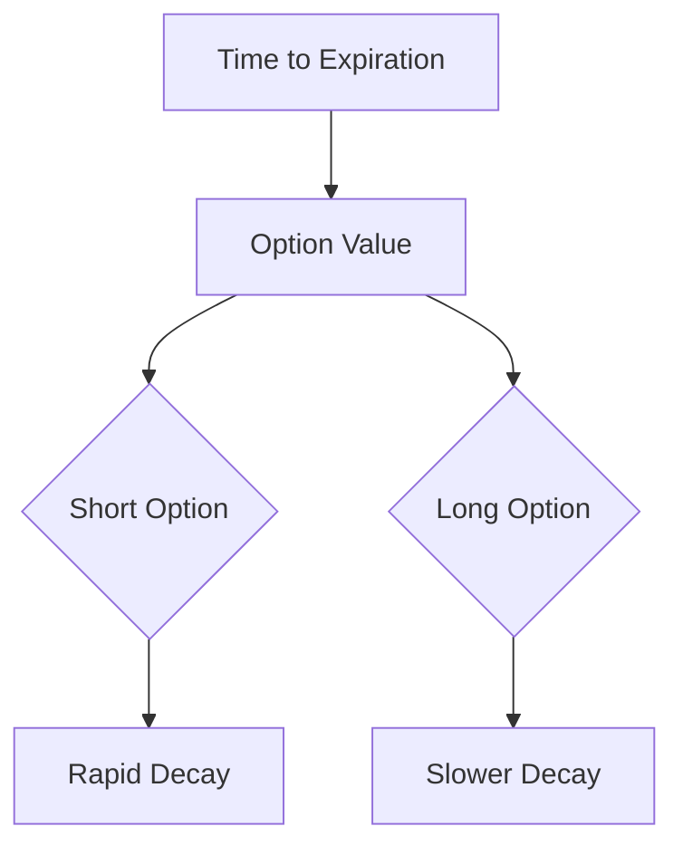

## 7.5.1.2 Horizontal Spreads

Horizontal spreads, also known as calendar spreads, are a sophisticated options trading strategy that involves the simultaneous purchase and sale of options of the same class and strike price but with different expiration dates. This strategy is primarily used to capitalize on the passage of time and changes in volatility, making it a valuable tool for traders who anticipate specific market conditions. In this section, we will delve into the mechanics of horizontal spreads, explore strategies based on volatility expectations, and illustrate the effects of time decay with charts and examples.

### Understanding Horizontal Spreads

Horizontal spreads are constructed by buying and selling options with the same strike price but different expiration dates. Typically, a trader will buy a longer-term option and sell a shorter-term option. This setup allows the trader to benefit from the time decay of the shorter-term option while maintaining a position in the longer-term option.

#### Key Components of Horizontal Spreads

1. **Strike Price**: The strike price remains constant in a horizontal spread, meaning both the long and short options have the same strike price.
   
2. **Expiration Dates**: The primary difference in a horizontal spread is the expiration dates. The long option has a later expiration date than the short option.

3. **Option Type**: Horizontal spreads can be constructed using either call options or put options, depending on the trader's market outlook.

4. **Net Debit**: Horizontal spreads are typically established for a net debit, meaning the cost of the long option exceeds the premium received from the short option.

### Calendar Spread Strategy

The calendar spread strategy is designed to profit from the differential in time decay between the short and long options. Time decay, or theta, is a critical factor in options pricing, and calendar spreads exploit this by selling options with higher theta (shorter-term) and buying options with lower theta (longer-term).

#### Time Decay and Volatility

Time decay works in favor of the trader in a calendar spread because the short option loses value more rapidly than the long option. This decay accelerates as the expiration date of the short option approaches, potentially allowing the trader to close the spread for a profit if the underlying asset remains near the strike price.

Volatility plays a significant role in the success of a calendar spread. Ideally, a trader would enter a calendar spread when they expect the underlying asset to experience low volatility until the expiration of the short option. This allows the trader to benefit from time decay without significant price movement affecting the spread.

### Practical Example of a Calendar Spread

Consider a trader who believes that a stock currently trading at $50 will remain relatively stable over the next month. The trader constructs a calendar spread by:

- **Buying** a 3-month call option with a $50 strike price for $3.00.
- **Selling** a 1-month call option with a $50 strike price for $1.50.

The net cost of the spread is $1.50 ($3.00 - $1.50). If the stock remains near $50 over the next month, the short call option will expire worthless, allowing the trader to potentially profit from the remaining value of the long call option.

### Analyzing the Payoff Diagram

To better understand the potential outcomes of a calendar spread, let's examine a payoff diagram. The diagram below illustrates the profit and loss potential of a calendar spread at expiration of the short option.

In this diagram, the maximum profit occurs when the stock price is at the strike price at expiration of the short option, as the short option expires worthless, and the long option retains its value. If the stock price moves significantly above or below the strike price, the trader may incur a limited loss, capped by the net debit paid to establish the spread.

### Strategies Based on Volatility Expectations

Horizontal spreads can be tailored to various market conditions, particularly changes in volatility. Here are some strategies based on volatility expectations:

1. **Low Volatility Expectation**: If a trader expects low volatility, a calendar spread can be an effective strategy to capitalize on time decay without significant price movement.

2. **Volatility Increase Expectation**: In some cases, traders may anticipate an increase in volatility after the expiration of the short option. In such scenarios, the long option can benefit from increased implied volatility, potentially offsetting losses from the short option.

3. **Neutral Market Outlook**: Traders with a neutral outlook on the underlying asset can use calendar spreads to profit from time decay while minimizing directional risk.

### Time Decay Effects

Time decay is a critical component of calendar spreads, and understanding its effects is essential for successful implementation. The chart below illustrates how time decay impacts the value of options in a calendar spread.

In this chart, the short option experiences rapid decay as it approaches expiration, while the long option decays more slowly. This differential in decay rates is what allows calendar spreads to potentially generate profits.

### Real-World Applications

Calendar spreads are widely used in the securities industry for various purposes:

- **Earnings Reports**: Traders may use calendar spreads around earnings reports to capitalize on anticipated volatility changes.
- **Event-Driven Strategies**: Calendar spreads can be employed for events such as product launches or regulatory announcements, where volatility is expected to change.
- **Hedging**: Investors may use calendar spreads to hedge existing positions against time decay and volatility changes.

### Compliance Considerations

When engaging in calendar spreads, traders must adhere to regulatory requirements and ensure that their strategies align with their risk tolerance and investment objectives. Key compliance considerations include:

- **Disclosure**: Clearly disclose the risks and potential outcomes of calendar spreads to clients.
- **Suitability**: Ensure that calendar spreads are suitable for the client's financial situation and investment goals.
- **Recordkeeping**: Maintain accurate records of all trades and strategies involving calendar spreads.

### Best Practices and Common Pitfalls

To maximize the effectiveness of calendar spreads, consider the following best practices and avoid common pitfalls:

- **Monitor Volatility**: Keep a close eye on volatility levels and adjust strategies as needed.
- **Manage Risk**: Use stop-loss orders or other risk management techniques to limit potential losses.
- **Avoid Over-Leveraging**: Ensure that the size of the calendar spread aligns with the overall portfolio risk.

### Conclusion

Horizontal spreads, or calendar spreads, offer a versatile and potentially profitable strategy for options traders who understand the nuances of time decay and volatility. By carefully analyzing market conditions and adhering to best practices, traders can effectively implement calendar spreads to achieve their investment objectives. As you prepare for the Series 7 Exam, mastering the intricacies of horizontal spreads will enhance your understanding of advanced options strategies and equip you with the knowledge to succeed in the securities industry.

## Series 7 Exam Practice Questions: Horizontal Spreads



### What is a horizontal spread in options trading?

- [x] A strategy involving options with the same strike price but different expiration dates.
- [ ] A strategy involving options with different strike prices and expiration dates.
- [ ] A strategy involving options with the same strike price and expiration dates.
- [ ] A strategy involving options with different strike prices but the same expiration date.

> **Explanation:** A horizontal spread, also known as a calendar spread, involves options with the same strike price but different expiration dates.

### What is the primary benefit of a calendar spread?

- [ ] Capturing large price movements in the underlying asset.
- [x] Profiting from time decay of the short option.
- [ ] Benefiting from dividends of the underlying asset.
- [ ] Hedging against currency risk.

> **Explanation:** The primary benefit of a calendar spread is to profit from the time decay of the short option, which loses value faster than the long option.

### In a calendar spread, what typically happens if the underlying asset remains near the strike price?

- [x] The short option expires worthless, and the trader profits.
- [ ] The long option expires worthless, and the trader incurs a loss.
- [ ] Both options expire worthless, resulting in no gain or loss.
- [ ] The trader must close the position early to avoid losses.

> **Explanation:** If the underlying asset remains near the strike price, the short option expires worthless, allowing the trader to potentially profit from the remaining value of the long option.

### How does volatility affect a calendar spread strategy?

- [ ] High volatility decreases the potential profit of the spread.
- [ ] Low volatility increases the risk of the spread.
- [x] Low volatility is ideal for profiting from time decay.
- [ ] High volatility is necessary for the spread to be profitable.

> **Explanation:** Low volatility is ideal for a calendar spread because it allows the trader to profit from time decay without significant price movement affecting the spread.

### What is the typical net cost of establishing a calendar spread?

- [ ] A net credit.
- [x] A net debit.
- [ ] Zero cost.
- [ ] It depends on the strike price.

> **Explanation:** A calendar spread is typically established for a net debit, meaning the cost of the long option exceeds the premium received from the short option.

### Which of the following best describes time decay in a calendar spread?

- [ ] The long option decays faster than the short option.
- [x] The short option decays faster than the long option.
- [ ] Both options decay at the same rate.
- [ ] Time decay is irrelevant in a calendar spread.

> **Explanation:** In a calendar spread, the short option decays faster than the long option, which is why the strategy can be profitable.

### When is a calendar spread most profitable?

- [ ] When the underlying asset moves significantly away from the strike price.
- [x] When the underlying asset remains near the strike price.
- [ ] When the market experiences high volatility.
- [ ] When interest rates are rising.

> **Explanation:** A calendar spread is most profitable when the underlying asset remains near the strike price, allowing the short option to expire worthless.

### What is a common use of calendar spreads in the securities industry?

- [ ] To hedge against currency fluctuations.
- [ ] To generate income from dividends.
- [x] To capitalize on anticipated volatility changes.
- [ ] To avoid paying taxes on capital gains.

> **Explanation:** Calendar spreads are commonly used to capitalize on anticipated volatility changes, such as around earnings reports or significant events.

### What is a key compliance consideration when using calendar spreads?

- [x] Ensuring the strategy is suitable for the client's financial situation.
- [ ] Avoiding the use of stop-loss orders.
- [ ] Maximizing leverage to increase potential profits.
- [ ] Only using calendar spreads in bullish markets.

> **Explanation:** A key compliance consideration is ensuring that the calendar spread strategy is suitable for the client's financial situation and investment goals.

### Which factor is least likely to affect the profitability of a calendar spread?

- [ ] Time decay.
- [ ] Volatility changes.
- [ ] The underlying asset's price movement.
- [x] Dividend payments.

> **Explanation:** Dividend payments are least likely to affect the profitability of a calendar spread, as the strategy primarily relies on time decay and volatility changes.



---
