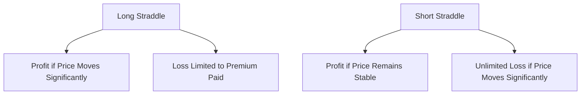
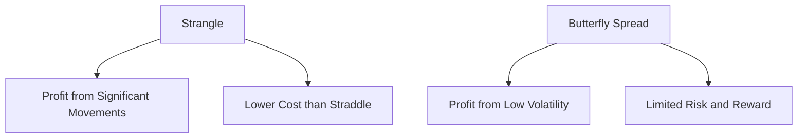

## 7.5.2 Combinations and Straddles

In the world of options trading, combinations and straddles are advanced strategies that offer traders the ability to capitalize on market volatility or lack thereof. These strategies can be powerful tools in a trader's arsenal, allowing for profit in various market conditions. Understanding when and how to implement these strategies is crucial for anyone preparing for the Series 7 Exam and looking to excel in the securities industry.

### Understanding Straddles

A **straddle** is an options strategy that involves purchasing or selling both a call and a put option with the same strike price and expiration date. This strategy is typically used when a trader expects significant volatility in the underlying asset but is uncertain about the direction of the price movement.

#### Types of Straddles

1. **Long Straddle**: Involves buying both a call and a put option. This strategy profits when the underlying asset's price makes a significant move in either direction. The potential loss is limited to the total premium paid for the options.

2. **Short Straddle**: Involves selling both a call and a put option. This strategy profits when the underlying asset's price remains relatively stable. However, it carries unlimited risk if the asset's price moves significantly in either direction.

#### When to Use Straddles

- **Volatile Markets**: Long straddles are ideal in volatile markets where large price swings are expected.
- **Stable Markets**: Short straddles are suitable for stable markets with low expected volatility.

#### Payoff Diagrams for Straddles

Below are the payoff diagrams for long and short straddles, illustrating potential profit and loss areas:

### Exploring Combinations

**Combinations** are options strategies that involve different strike prices or expiration dates. Unlike straddles, combinations provide more flexibility and can be tailored to specific market outlooks.

#### Types of Combinations

1. **Strangle**: Similar to a straddle but uses different strike prices for the call and put options. It is generally cheaper than a straddle and profits from significant price movements.

2. **Butterfly Spread**: Involves three strike prices and is used when minimal price movement is expected. It profits from low volatility.

3. **Iron Condor**: A more complex strategy involving four options with different strike prices. It profits from stable markets and has limited risk.

#### When to Use Combinations

- **Directional Bias**: Use combinations when you have a directional bias but still want to hedge against volatility.
- **Cost Efficiency**: Combinations can be more cost-effective than straddles due to the use of different strike prices.

#### Payoff Diagrams for Combinations

The following diagrams illustrate the payoff structures for strangles and butterfly spreads:

### Practical Examples and Case Studies

#### Example 1: Using a Long Straddle

Imagine a company, XYZ Corp, is about to release its quarterly earnings report. The market expects significant volatility, but the direction is uncertain. A trader buys a long straddle by purchasing a call and a put option with a strike price of $50 and an expiration date after the earnings release. If the stock price moves significantly above or below $50, the trader profits.

#### Example 2: Implementing a Strangle

A trader believes that the price of ABC Inc. will move significantly but is unsure of the direction. They purchase a strangle by buying a call option with a strike price of $55 and a put option with a strike price of $45. This strategy is cheaper than a straddle and profits from large price movements.

#### Case Study: Iron Condor in a Stable Market

In a stable market environment, a trader uses an iron condor strategy on DEF Ltd. by selling a call and put option at $60 and buying a call and put option at $70 and $50, respectively. The strategy profits if the stock remains between $60 and $70, with limited risk if the price moves outside this range.

### Regulatory Considerations and Compliance

When engaging in options trading, it is essential to adhere to regulatory requirements set by bodies such as the Financial Industry Regulatory Authority (FINRA) and the Securities and Exchange Commission (SEC). Traders must ensure they have the appropriate approvals and understand the suitability requirements for their clients.

### Best Practices and Common Pitfalls

- **Risk Management**: Always assess the risk-reward ratio before entering a trade. For short straddles, consider potential losses if the market moves significantly.
- **Market Analysis**: Conduct thorough market analysis to determine the expected volatility and choose the appropriate strategy.
- **Cost Considerations**: Evaluate the cost of entering a straddle or combination strategy, as premiums can affect profitability.

### Summary

Combinations and straddles are versatile options strategies that can be tailored to various market conditions. Understanding when and how to use these strategies is crucial for maximizing profits and managing risks. By mastering these strategies, you can enhance your trading skills and increase your chances of success on the Series 7 Exam.

## Series 7 Exam Practice Questions: Combinations and Straddles



### What is a key characteristic of a straddle in options trading?

- [x] It involves buying or selling both a call and a put with the same strike price and expiration.
- [ ] It involves only buying call options.
- [ ] It involves only selling put options.
- [ ] It requires different expiration dates for the call and put.

> **Explanation:** A straddle involves buying or selling both a call and a put option with the same strike price and expiration, allowing traders to profit from volatility.

### When is a long straddle strategy most appropriate?

- [ ] In a stable market with low volatility.
- [x] In a volatile market with expected large price swings.
- [ ] When the market is trending upwards.
- [ ] When the market is trending downwards.

> **Explanation:** A long straddle is most appropriate in a volatile market where significant price movements are expected, as it profits from large swings in either direction.

### What differentiates a strangle from a straddle?

- [ ] A strangle uses the same strike prices for both options.
- [ ] A strangle requires options with different expiration dates.
- [x] A strangle involves different strike prices for the call and put options.
- [ ] A strangle is only used in bullish markets.

> **Explanation:** A strangle involves different strike prices for the call and put options, making it generally cheaper than a straddle and suitable for significant price movements.

### What is the primary risk of a short straddle?

- [x] Unlimited risk if the underlying asset's price moves significantly.
- [ ] Limited risk due to premium collection.
- [ ] No risk if the market trends upwards.
- [ ] No risk if the market trends downwards.

> **Explanation:** A short straddle carries unlimited risk if the underlying asset's price moves significantly in either direction, as the trader is exposed to large potential losses.

### Which strategy profits from minimal price movement in the underlying asset?

- [ ] Long straddle
- [x] Butterfly spread
- [ ] Long call
- [ ] Short put

> **Explanation:** A butterfly spread profits from minimal price movement, as it is designed to capitalize on low volatility with limited risk and reward.

### How does an iron condor strategy differ from a butterfly spread?

- [ ] An iron condor uses only call options.
- [x] An iron condor involves four options with different strike prices.
- [ ] A butterfly spread requires options with different expiration dates.
- [ ] An iron condor is only used in bearish markets.

> **Explanation:** An iron condor involves four options with different strike prices, allowing it to profit from stable markets with limited risk.

### What is a potential benefit of using a strangle over a straddle?

- [ ] Strangles are more expensive than straddles.
- [ ] Strangles require less market analysis.
- [x] Strangles are generally cheaper due to different strike prices.
- [ ] Strangles are only used in bullish markets.

> **Explanation:** Strangles are generally cheaper than straddles because they involve different strike prices, making them cost-effective for significant price movements.

### In what scenario might a trader consider using a short straddle?

- [ ] When expecting significant market volatility.
- [x] When expecting the market to remain stable.
- [ ] When anticipating a market crash.
- [ ] When predicting a market rally.

> **Explanation:** A trader might use a short straddle when expecting the market to remain stable, as it profits from minimal price movement.

### What is a key consideration when implementing a combination strategy?

- [ ] Ensuring options have the same strike price.
- [ ] Avoiding any directional bias.
- [x] Assessing the cost efficiency and market outlook.
- [ ] Limiting the number of options used.

> **Explanation:** When implementing a combination strategy, it is crucial to assess the cost efficiency and market outlook to ensure it aligns with the trader's expectations and risk tolerance.

### Which regulatory body oversees options trading compliance?

- [ ] Federal Reserve Board (FRB)
- [ ] Municipal Securities Rulemaking Board (MSRB)
- [x] Financial Industry Regulatory Authority (FINRA)
- [ ] Office of the Comptroller of the Currency (OCC)

> **Explanation:** The Financial Industry Regulatory Authority (FINRA) oversees options trading compliance, ensuring that traders adhere to regulations and suitability requirements.



---

This comprehensive guide on combinations and straddles provides the necessary insights and strategies to master these advanced options techniques, helping you prepare effectively for the Series 7 Exam and excel in your securities career.
