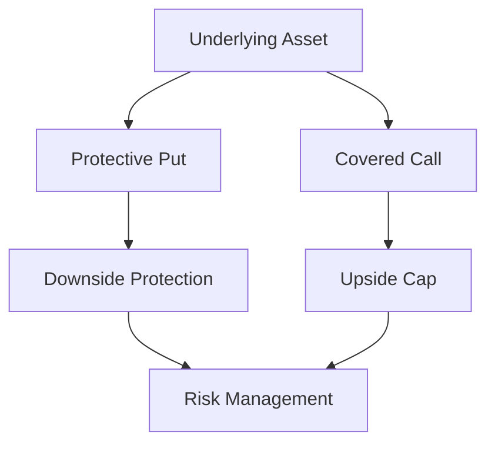

## 7.5.3 Collars and Index Options

In the world of options trading, collars and index options are powerful tools that can be used to manage risk and enhance portfolio performance. Understanding these strategies is crucial for those preparing for the Series 7 Exam, as they represent key components of advanced options trading. This section will provide you with a comprehensive understanding of collars and index options, their applications, and how they can be used effectively in various market conditions.

### Understanding Collars

A **collar** is an options strategy that combines a protective put and a covered call on the same underlying asset. This strategy is designed to limit both the upside and downside potential of an investment, providing a balanced approach to risk management.

#### Components of a Collar

1. **Protective Put**: This is an option that gives the holder the right to sell the underlying asset at a specified price (strike price) within a certain period. The protective put acts as insurance against a decline in the asset's price.

2. **Covered Call**: This is an option that gives the holder the right to buy the underlying asset at a specified price. By selling a call option, the investor receives a premium, which can offset the cost of purchasing the protective put.

#### How Collars Work

A collar is typically established when an investor owns the underlying asset and wants to protect against potential losses while still allowing for some upside potential. The strategy involves:

- Buying a put option with a strike price below the current market price of the asset.
- Selling a call option with a strike price above the current market price of the asset.

The premiums received from selling the call option can help finance the purchase of the put option, making the collar a cost-effective strategy.

#### Example of a Collar Strategy

Consider an investor who owns 100 shares of XYZ Corp, currently trading at $50 per share. The investor wants to protect against a decline in the stock price but is willing to cap the upside potential. The investor could:

- Buy a protective put with a strike price of $45, expiring in three months, for a premium of $2 per share.
- Sell a covered call with a strike price of $55, expiring in three months, for a premium of $2 per share.

In this scenario, the cost of the put option is offset by the premium received from the call option, creating a "zero-cost collar." The investor is protected against losses below $45, while gains are capped at $55.

#### Benefits and Limitations of Collars

**Benefits:**

- **Risk Management**: Collars provide downside protection, limiting potential losses.
- **Cost-Effectiveness**: The strategy can be implemented at a low or even zero net cost.
- **Flexibility**: Investors can adjust the strike prices and expiration dates to suit their risk tolerance and market outlook.

**Limitations:**

- **Limited Upside**: The potential for profit is capped by the strike price of the call option.
- **Complexity**: Implementing a collar requires a good understanding of options pricing and market conditions.

### Index Options: Hedging and Speculation

Index options are options contracts where the underlying asset is a stock market index, such as the S&P 500 or the NASDAQ-100. These options are used primarily for hedging and speculation purposes.

#### Hedging with Index Options

Investors use index options to protect their portfolios from broad market declines. By purchasing put options on a stock index, investors can hedge against losses in their equity holdings.

**Example of Hedging with Index Options**

Suppose an investor has a diversified portfolio that closely tracks the S&P 500 index. To hedge against a potential market downturn, the investor could purchase put options on the S&P 500 index. If the market declines, the gains from the put options can offset the losses in the portfolio.

#### Speculation with Index Options

Traders also use index options to speculate on the direction of the overall market. By buying call options, traders can profit from a rise in the index, while put options allow them to profit from a decline.

**Example of Speculating with Index Options**

A trader believes that the NASDAQ-100 index will rise over the next month. The trader buys call options on the NASDAQ-100 index. If the index rises, the trader can sell the options at a profit.

#### Advantages of Index Options

- **Diversification**: Index options provide exposure to a broad range of stocks, reducing the impact of individual stock volatility.
- **Liquidity**: Major index options are highly liquid, allowing for easy entry and exit.
- **Cash Settlement**: Index options are settled in cash, eliminating the need to deliver the underlying asset.

#### Risks of Index Options

- **Market Risk**: Index options are subject to market risk, as they reflect the performance of the entire index.
- **Complexity**: Understanding the pricing and behavior of index options requires a solid grasp of options theory and market dynamics.

### Practical Applications and Real-World Scenarios

#### Managing Portfolio Risk with Collars

Collars are particularly useful for investors who want to protect their gains in a volatile market. For example, an investor with significant unrealized gains in a tech stock might use a collar to lock in profits while still participating in potential upside.

#### Using Index Options for Tactical Adjustments

Institutional investors often use index options to make tactical adjustments to their portfolios. For instance, during periods of anticipated market volatility, a fund manager might buy put options on the S&P 500 to protect against downside risk while maintaining their equity positions.

### Step-by-Step Guide to Implementing Collars and Index Options

#### Implementing a Collar Strategy

1. **Assess the Portfolio**: Determine the underlying asset and the level of risk protection needed.
2. **Select Strike Prices**: Choose the strike prices for the put and call options based on the desired level of protection and potential upside.
3. **Calculate Costs**: Evaluate the net cost of the collar, considering the premiums for the put and call options.
4. **Execute the Strategy**: Purchase the protective put and sell the covered call simultaneously.
5. **Monitor and Adjust**: Regularly review the collar position and make adjustments as necessary based on market conditions and investment objectives.

#### Using Index Options for Hedging

1. **Identify the Index**: Choose an index that closely correlates with the portfolio.
2. **Determine the Hedge Ratio**: Calculate the number of index options needed to hedge the portfolio effectively.
3. **Select the Option Type**: Choose between puts for downside protection or calls for upside exposure.
4. **Execute the Trade**: Buy or sell the index options based on the hedging strategy.
5. **Evaluate Performance**: Continuously assess the effectiveness of the hedge and adjust positions as needed.

### Diagrams and Visual Aids

Below is a visual representation of a collar strategy using Mermaid.js to illustrate the relationship between the protective put, covered call, and underlying asset.

### Best Practices and Common Pitfalls

**Best Practices:**

- **Comprehensive Analysis**: Conduct thorough research and analysis before implementing collars or index options.
- **Regular Monitoring**: Keep a close eye on market conditions and adjust strategies as needed.
- **Risk Assessment**: Continuously evaluate the risk-reward profile of each strategy.

**Common Pitfalls:**

- **Overlooking Costs**: Failing to account for transaction costs and option premiums can erode potential profits.
- **Misjudging Market Conditions**: Implementing strategies without a clear understanding of market trends can lead to suboptimal outcomes.

### Regulatory Considerations

When trading options, it's essential to comply with the relevant regulations and guidelines set forth by regulatory bodies such as the Securities and Exchange Commission (SEC) and the Financial Industry Regulatory Authority (FINRA). Ensure that all trades are conducted in accordance with these regulations to avoid legal and financial repercussions.

### Summary

Collars and index options are versatile tools that can enhance your investment strategy by providing protection and opportunities for profit. By understanding how to implement these strategies effectively, you can manage risk and capitalize on market movements. As you prepare for the Series 7 Exam, focus on mastering these concepts and applying them to real-world scenarios.

## Series 7 Exam Practice Questions: Collars and Index Options



### What is the primary purpose of a collar strategy?

- [x] To limit both upside and downside potential
- [ ] To maximize upside potential
- [ ] To eliminate downside risk entirely
- [ ] To provide unlimited downside protection

> **Explanation:** A collar strategy is designed to limit both upside and downside potential by combining a protective put and a covered call.

### Which component of a collar strategy provides downside protection?

- [x] Protective put
- [ ] Covered call
- [ ] Long call
- [ ] Short put

> **Explanation:** The protective put in a collar strategy provides downside protection by allowing the holder to sell the underlying asset at a predetermined price.

### How can index options be used in portfolio management?

- [x] For hedging against market declines
- [ ] For eliminating individual stock risk
- [ ] For increasing leverage
- [ ] For reducing transaction costs

> **Explanation:** Index options can be used to hedge against market declines, protecting a portfolio from broad market movements.

### What is a key advantage of using index options?

- [x] Diversification
- [ ] Unlimited upside potential
- [ ] Elimination of all market risk
- [ ] Guaranteed profits

> **Explanation:** Index options provide diversification by offering exposure to a broad range of stocks, reducing individual stock volatility.

### In a collar strategy, what is the role of the covered call?

- [x] To cap the upside potential
- [ ] To provide downside protection
- [ ] To eliminate transaction costs
- [ ] To enhance dividend income

> **Explanation:** The covered call in a collar strategy caps the upside potential by obligating the investor to sell the asset at the call's strike price.

### What is the main risk associated with index options?

- [x] Market risk
- [ ] Credit risk
- [ ] Liquidity risk
- [ ] Currency risk

> **Explanation:** Index options are subject to market risk, reflecting the performance of the entire index.

### Which of the following is a common pitfall when implementing a collar strategy?

- [x] Overlooking transaction costs
- [ ] Choosing too high a strike price for the put
- [ ] Selling the underlying asset
- [ ] Ignoring dividend payments

> **Explanation:** Overlooking transaction costs can erode potential profits in a collar strategy.

### What is the settlement method for most index options?

- [x] Cash settlement
- [ ] Physical delivery
- [ ] Stock transfer
- [ ] Futures contract

> **Explanation:** Most index options are settled in cash, eliminating the need to deliver the underlying asset.

### Which regulatory body oversees options trading in the U.S.?

- [x] Securities and Exchange Commission (SEC)
- [ ] Federal Reserve Board (FRB)
- [ ] Commodity Futures Trading Commission (CFTC)
- [ ] National Futures Association (NFA)

> **Explanation:** The Securities and Exchange Commission (SEC) oversees options trading in the U.S.

### What is a zero-cost collar?

- [x] A collar strategy where the cost of the put is offset by the premium from the call
- [ ] A collar strategy with no downside protection
- [ ] A collar strategy with unlimited upside potential
- [ ] A collar strategy that eliminates all market risk

> **Explanation:** A zero-cost collar is a strategy where the cost of the protective put is offset by the premium received from the covered call.


