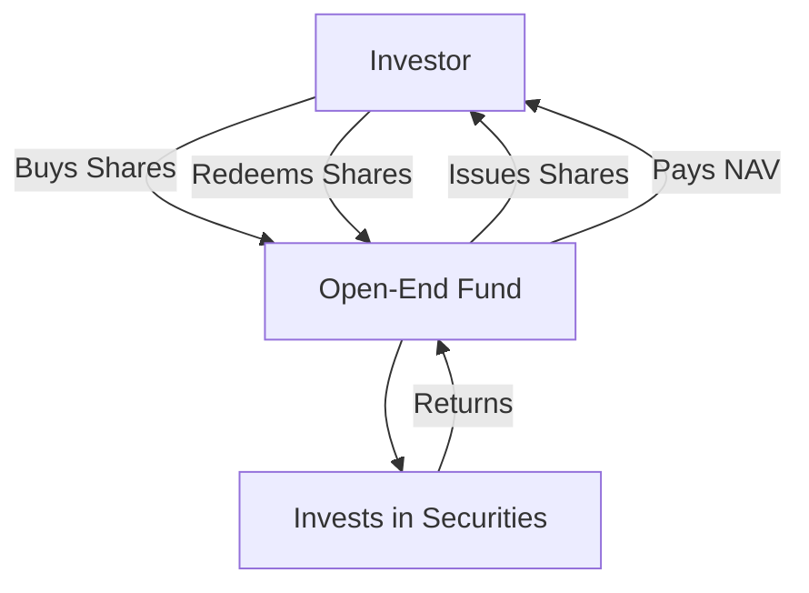
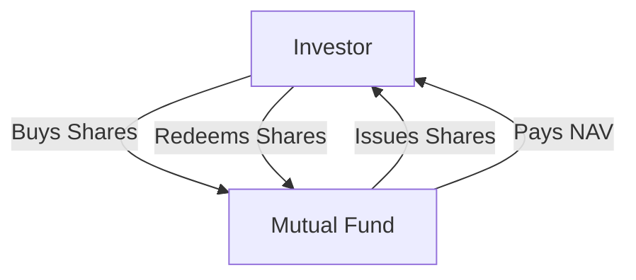

## 8.1.1 Structure and Operation

Mutual funds are a cornerstone of investment company securities, offering investors a diversified portfolio managed by professionals. Understanding the structure and operation of mutual funds is crucial for anyone preparing for the Series 7 Exam. This section provides an in-depth exploration of mutual funds, focusing on their open-end structure, the roles of key parties, and the continuous offering and redemption process.

### Open-End Structure of Mutual Funds

Mutual funds, specifically open-end funds, are designed to provide investors with flexibility and liquidity. An open-end fund does not have restrictions on the number of shares it can issue. Investors can buy and redeem shares directly from the fund at the net asset value (NAV), which is calculated at the end of each trading day.

#### Key Characteristics of Open-End Funds

- **Unlimited Shares:** Open-end funds can issue an unlimited number of shares, which are bought and sold at the fund's current NAV.
- **Daily NAV Calculation:** The NAV is determined by dividing the total value of the fund's assets by the number of outstanding shares, adjusted at the close of each trading day.
- **Liquidity:** Investors have the ability to redeem their shares at any time, receiving the current NAV minus any applicable fees.

#### Diagram: Open-End Fund Structure

### Roles of Key Parties in Mutual Fund Operations

The successful operation of a mutual fund relies on the collaboration of several key parties, each with specific responsibilities to ensure the fund's integrity and performance.

#### Fund Manager

The fund manager is responsible for making investment decisions and managing the fund's portfolio. They analyze market trends, select securities, and adjust the portfolio to align with the fund's investment objectives.

- **Investment Strategy:** The manager develops and implements strategies to achieve the fund's goals, balancing risk and return.
- **Performance Monitoring:** Regularly reviews the fund's performance and makes necessary adjustments to optimize returns.

#### Custodian

The custodian is a financial institution responsible for holding and safeguarding the fund's assets. This role is crucial for ensuring the security and integrity of the fund's investments.

- **Safekeeping of Assets:** Holds securities and cash, preventing unauthorized access or use.
- **Transaction Settlement:** Manages the settlement of trades and ensures accurate record-keeping.

#### Transfer Agent

The transfer agent handles the administrative aspects of the fund, including maintaining shareholder records, processing transactions, and distributing dividends.

- **Shareholder Services:** Manages account details, processes purchases and redemptions, and provides customer support.
- **Record Maintenance:** Keeps accurate records of ownership and transactions, ensuring compliance with regulatory requirements.

### Continuous Offering and Redemption Process

One of the defining features of open-end mutual funds is their continuous offering and redemption process, which allows for flexibility and liquidity.

#### Continuous Offering

- **Share Issuance:** Investors can purchase shares directly from the fund at the current NAV. This process is continuous, meaning shares are always available for purchase.
- **Pricing:** Shares are priced based on the fund's NAV, calculated at the end of each trading day.

#### Redemption Process

- **Share Redemption:** Investors can sell their shares back to the fund at the current NAV. The fund is obligated to redeem shares upon request.
- **Settlement:** The redemption process typically settles within a few business days, providing investors with timely access to their funds.

#### Diagram: Mutual Fund Offering and Redemption

### Practical Examples and Scenarios

To illustrate the operation of mutual funds, consider the following scenarios:

#### Example 1: Investing in an Open-End Fund

An investor decides to invest in an open-end mutual fund focusing on technology stocks. They purchase 100 shares at the fund's NAV of $50 per share. The total investment is $5,000. As the fund's portfolio appreciates, the NAV increases, and the investor's shares gain value. If the NAV rises to $55, the investment is now worth $5,500.

#### Example 2: Redeeming Shares

The same investor decides to redeem their shares when the NAV reaches $55. They submit a redemption request, and within a few days, the fund processes the request and transfers $5,500 to the investor's account, minus any applicable fees.

### Real-World Applications and Compliance Considerations

Understanding mutual fund operations is essential for compliance with regulatory standards. The Securities and Exchange Commission (SEC) oversees mutual funds, ensuring they adhere to regulations designed to protect investors.

- **Regulatory Compliance:** Mutual funds must comply with the Investment Company Act of 1940, which governs their structure, operations, and disclosures.
- **Investor Protection:** Funds are required to provide a prospectus detailing investment objectives, risks, fees, and performance history.

### Best Practices and Common Pitfalls

#### Best Practices

- **Diversification:** Mutual funds offer diversification, reducing risk by investing in a variety of securities.
- **Professional Management:** Relying on experienced fund managers can enhance returns and mitigate risks.

#### Common Pitfalls

- **Fee Awareness:** Investors should be aware of fees, including management fees and sales loads, which can impact returns.
- **Market Volatility:** While mutual funds offer diversification, they are still subject to market fluctuations, affecting NAV.

### Summary

Mutual funds, particularly open-end funds, provide investors with a flexible and professionally managed investment option. Understanding their structure and operation is crucial for success on the Series 7 Exam. Key concepts include the open-end structure, roles of fund managers, custodians, and transfer agents, and the continuous offering and redemption process. By mastering these topics, you will be well-prepared to navigate the complexities of mutual fund investments and excel in your career as a securities representative.

## Series 7 Exam Practice Questions: Structure and Operation



### What is a defining feature of open-end mutual funds?

- [x] They allow for continuous buying and redeeming of shares at NAV.
- [ ] They have a fixed number of shares available.
- [ ] They are traded on stock exchanges.
- [ ] They do not calculate NAV daily.

> **Explanation:** Open-end mutual funds allow investors to buy and redeem shares at the fund's NAV, which is calculated daily, making them flexible and liquid.

### Who is responsible for managing the investment portfolio of a mutual fund?

- [ ] Custodian
- [x] Fund Manager
- [ ] Transfer Agent
- [ ] Shareholder

> **Explanation:** The fund manager is responsible for making investment decisions and managing the mutual fund's portfolio to achieve its investment objectives.

### What role does the custodian play in mutual fund operations?

- [ ] Managing investment strategy
- [x] Safekeeping of assets
- [ ] Processing transactions
- [ ] Distributing dividends

> **Explanation:** The custodian is responsible for holding and safeguarding the fund's assets, ensuring their security and integrity.

### How is the NAV of a mutual fund calculated?

- [ ] By dividing the total liabilities by the number of shares
- [ ] By multiplying the total assets by the number of shares
- [x] By dividing the total value of assets by the number of outstanding shares
- [ ] By subtracting total expenses from total income

> **Explanation:** The NAV is calculated by dividing the total value of the fund's assets by the number of outstanding shares, determining the per-share value.

### What is the primary function of a transfer agent in mutual fund operations?

- [ ] Safeguarding assets
- [ ] Making investment decisions
- [x] Maintaining shareholder records and processing transactions
- [ ] Calculating NAV

> **Explanation:** The transfer agent handles administrative tasks such as maintaining shareholder records, processing transactions, and distributing dividends.

### What happens when an investor redeems shares in an open-end mutual fund?

- [ ] They receive shares of another fund.
- [ ] They must sell their shares on an exchange.
- [x] They receive the current NAV minus any applicable fees.
- [ ] They cannot redeem shares until the end of the fiscal year.

> **Explanation:** When an investor redeems shares, they receive the current NAV of the shares minus any applicable fees, providing liquidity.

### Which regulatory body oversees mutual funds in the United States?

- [ ] FINRA
- [x] SEC
- [ ] MSRB
- [ ] Federal Reserve

> **Explanation:** The Securities and Exchange Commission (SEC) regulates mutual funds, ensuring compliance with laws designed to protect investors.

### What is a potential disadvantage of investing in mutual funds?

- [ ] Professional management
- [x] Fees and expenses
- [ ] Diversification
- [ ] Liquidity

> **Explanation:** While mutual funds offer many benefits, fees and expenses can reduce overall returns, making it essential for investors to be aware of these costs.

### What document must mutual funds provide to investors detailing objectives, risks, and fees?

- [ ] Annual Report
- [x] Prospectus
- [ ] Financial Statement
- [ ] Investment Guide

> **Explanation:** Mutual funds are required to provide a prospectus, which details the fund's investment objectives, risks, fees, and historical performance.

### How does an open-end mutual fund differ from a closed-end fund?

- [ ] Open-end funds have a fixed number of shares.
- [ ] Closed-end funds allow continuous share redemption.
- [x] Open-end funds issue and redeem shares at NAV.
- [ ] Closed-end funds are not traded on exchanges.

> **Explanation:** Open-end funds issue and redeem shares at NAV, providing flexibility and liquidity, while closed-end funds have a fixed number of shares and are traded on exchanges.



---
