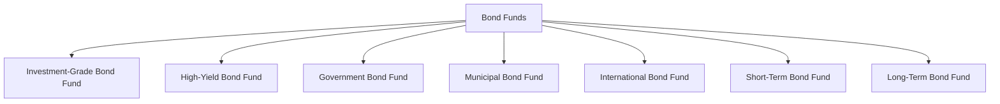

## 8.1.2.2 Bond Funds

Bond funds are a type of mutual fund that primarily invests in bonds and other debt instruments. These funds are designed to provide investors with a diversified portfolio of fixed-income securities, which can offer a steady stream of income and potential capital appreciation. Understanding bond funds is crucial for Series 7 exam candidates, as they play a significant role in the securities industry and investment strategies.

### Understanding Bond Funds

Bond funds pool money from multiple investors to purchase a diversified portfolio of bonds. By investing in a bond fund, investors gain exposure to a wide range of bonds, which can include government, corporate, municipal, and international bonds. This diversification helps mitigate the risk associated with investing in individual bonds.

#### Types of Bond Funds

Bond funds can be categorized based on the types of bonds they invest in, the duration of the bonds, and the credit quality of the bonds. Here are some common types of bond funds:

1. **Investment-Grade Bond Fund**: These funds invest in bonds with high credit quality, typically rated BBB or higher by major credit rating agencies. They are considered safer investments but tend to offer lower yields compared to high-yield bonds.

2. **High-Yield Bond Fund**: Also known as "junk bond funds," these funds invest in bonds with lower credit ratings (below BBB). While they offer higher yields to compensate for the increased risk, they are more susceptible to default risk.

3. **Government Bond Fund**: These funds invest in bonds issued by governments, such as U.S. Treasuries. They are considered low-risk investments and are often used as a safe haven during market volatility.

4. **Municipal Bond Fund**: These funds invest in bonds issued by state and local governments. They often offer tax advantages, as the interest income is typically exempt from federal taxes and, in some cases, state and local taxes.

5. **International Bond Fund**: These funds invest in bonds issued by foreign governments and corporations. They offer diversification benefits but come with additional risks, such as currency risk and geopolitical risk.

6. **Short-Term Bond Fund**: These funds invest in bonds with shorter durations, typically less than three years. They are less sensitive to interest rate changes but offer lower yields.

7. **Long-Term Bond Fund**: These funds invest in bonds with longer durations, usually more than ten years. They offer higher yields but are more sensitive to interest rate fluctuations.

### Income Generation and Interest Rate Impact

Bond funds generate income primarily through the interest payments received from the bonds in their portfolio. This income is typically distributed to investors in the form of dividends. The yield of a bond fund is an important metric, as it reflects the income generated relative to the fund's price.

#### Interest Rate Sensitivity

Interest rates have a significant impact on bond funds. When interest rates rise, the prices of existing bonds tend to fall, leading to a decrease in the net asset value (NAV) of bond funds. Conversely, when interest rates decline, bond prices generally increase, boosting the NAV of bond funds. Therefore, the duration of the bonds in a fund's portfolio is a critical factor in determining its sensitivity to interest rate changes.

- **Duration**: A measure of a bond's sensitivity to interest rate changes. Longer-duration bonds are more sensitive to interest rate fluctuations than shorter-duration bonds.

### Glossary of Key Terms

- **Investment-Grade Bond Fund**: A mutual fund that invests in bonds with high credit quality, typically rated BBB or higher.
- **High-Yield Bond Fund**: A mutual fund that focuses on bonds with lower credit ratings, offering higher yields to compensate for increased risk.

### Historical Performance of Bond Funds

The performance of bond funds can vary significantly based on the economic environment and interest rate trends. Historically, bond funds have provided investors with a reliable source of income and capital preservation, especially during periods of stock market volatility. However, their performance can be adversely affected by rising interest rates and credit downgrades.

### Practical Examples and Case Studies

1. **Case Study: Impact of Interest Rate Changes on Bond Funds**
   - In 2022, as the Federal Reserve increased interest rates to combat inflation, many bond funds experienced a decline in NAV. For instance, long-term bond funds saw a significant drop in value due to their higher duration and sensitivity to interest rate changes.

2. **Example: Diversification Benefits of Bond Funds**
   - An investor with a portfolio heavily weighted in equities might add a municipal bond fund to reduce overall portfolio risk and benefit from potential tax advantages.

### Real-World Applications and Regulatory Scenarios

Investors often use bond funds as part of a diversified investment strategy to balance risk and return. Financial advisors must consider the client's risk tolerance, investment goals, and tax situation when recommending bond funds. Regulatory bodies like the SEC and FINRA provide guidelines to ensure transparency and protect investors.

### Step-by-Step Guidance for Evaluating Bond Funds

1. **Assess Credit Quality**: Review the credit ratings of the bonds in the fund's portfolio to understand the risk level.
2. **Evaluate Duration**: Consider the average duration of the bonds to gauge interest rate sensitivity.
3. **Analyze Yield**: Compare the fund's yield to similar funds to assess income potential.
4. **Review Fees**: Examine the fund's expense ratio and any sales charges that may impact returns.
5. **Consider Tax Implications**: For municipal bond funds, evaluate the tax benefits based on the investor's tax bracket.

### Best Practices and Common Pitfalls

- **Best Practices**:
  - Diversify across different types of bond funds to manage risk.
  - Regularly review the bond fund's performance and adjust holdings as needed.
  - Stay informed about interest rate trends and economic indicators.

- **Common Pitfalls**:
  - Failing to consider the impact of rising interest rates on bond fund performance.
  - Overlooking the credit quality of bonds in high-yield bond funds.
  - Ignoring tax implications when investing in municipal bond funds.

### Exam Strategies and Tips

- Focus on understanding the relationship between interest rates and bond prices.
- Be familiar with the different types of bond funds and their characteristics.
- Practice calculating yield and duration to reinforce your understanding.

### Summary

Bond funds are a vital component of mutual fund investments, offering income generation and diversification benefits. Understanding the types of bond funds, their income potential, and the impact of interest rate changes is essential for Series 7 exam candidates and financial professionals. By mastering these concepts, you will be better equipped to advise clients and succeed in your securities career.

## Series 7 Exam Practice Questions: Bond Funds



### Which type of bond fund invests primarily in bonds with high credit quality?

- [x] Investment-Grade Bond Fund
- [ ] High-Yield Bond Fund
- [ ] Municipal Bond Fund
- [ ] International Bond Fund

> **Explanation:** Investment-Grade Bond Funds invest in bonds with high credit quality, typically rated BBB or higher.

### What is the primary risk associated with high-yield bond funds?

- [ ] Currency Risk
- [x] Default Risk
- [ ] Interest Rate Risk
- [ ] Tax Risk

> **Explanation:** High-yield bond funds invest in bonds with lower credit ratings, which have a higher risk of default.

### How does an increase in interest rates generally affect the net asset value of bond funds?

- [ ] Increases NAV
- [ ] No effect on NAV
- [x] Decreases NAV
- [ ] Stabilizes NAV

> **Explanation:** An increase in interest rates typically leads to a decrease in the net asset value of bond funds due to falling bond prices.

### What type of bond fund is likely to offer tax advantages?

- [ ] International Bond Fund
- [x] Municipal Bond Fund
- [ ] High-Yield Bond Fund
- [ ] Government Bond Fund

> **Explanation:** Municipal Bond Funds often offer tax advantages, as their interest income is usually exempt from federal taxes and possibly state and local taxes.

### Which bond fund is most sensitive to changes in interest rates?

- [ ] Short-Term Bond Fund
- [ ] Municipal Bond Fund
- [x] Long-Term Bond Fund
- [ ] Government Bond Fund

> **Explanation:** Long-Term Bond Funds are more sensitive to interest rate changes due to their longer duration.

### What is the main source of income for bond funds?

- [x] Interest Payments
- [ ] Capital Gains
- [ ] Dividends
- [ ] Rental Income

> **Explanation:** Bond funds generate income primarily through the interest payments received from the bonds in their portfolio.

### Which of the following is a characteristic of a short-term bond fund?

- [ ] High sensitivity to interest rate changes
- [x] Lower sensitivity to interest rate changes
- [ ] Higher yields than long-term bond funds
- [ ] Higher credit risk

> **Explanation:** Short-term bond funds have lower sensitivity to interest rate changes due to their shorter durations.

### What is a key benefit of investing in an international bond fund?

- [ ] Guaranteed returns
- [ ] Tax exemption
- [x] Diversification benefits
- [ ] No currency risk

> **Explanation:** International bond funds offer diversification benefits by investing in bonds issued by foreign governments and corporations.

### In which scenario might an investor prefer a government bond fund?

- [ ] Seeking high yields
- [x] Seeking low-risk investments
- [ ] Seeking tax advantages
- [ ] Seeking exposure to foreign markets

> **Explanation:** Government bond funds are considered low-risk investments, often used as a safe haven during market volatility.

### What factor should be considered when evaluating the interest rate sensitivity of a bond fund?

- [ ] Credit Rating
- [ ] Expense Ratio
- [x] Duration
- [ ] Tax Status

> **Explanation:** Duration is a measure of a bond's sensitivity to interest rate changes and is a critical factor in evaluating a bond fund's interest rate sensitivity.



By understanding these concepts and practicing with these questions, you'll be well-prepared to tackle bond fund-related questions on the Series 7 exam. Remember to review the key terms and concepts regularly to reinforce your knowledge and confidence.
