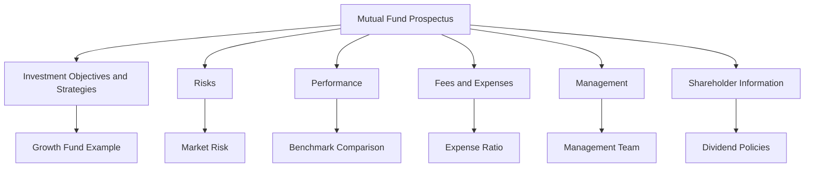

## 8.1.4 Mutual Fund Prospectus and Disclosures

A mutual fund prospectus is a vital document that provides investors with essential information about a mutual fund. Understanding how to read and interpret this document is crucial for anyone preparing for the Series 7 Exam, as it not only aids in evaluating mutual funds but also ensures compliance with regulatory requirements. This section will guide you through the key components of a mutual fund prospectus, how to evaluate fund disclosures, and the implications for both investors and financial professionals.

### Importance of the Mutual Fund Prospectus

The mutual fund prospectus serves several critical functions:

1. **Legal Requirement**: As per the Securities Act of 1933, mutual funds must provide a prospectus to potential investors. This document ensures transparency and helps investors make informed decisions.

2. **Comprehensive Information**: The prospectus includes details about the fund's objectives, strategies, risks, performance, fees, and management. It is the primary source of information for investors.

3. **Investor Protection**: By disclosing all relevant information, the prospectus protects investors from fraudulent schemes and ensures they understand what they are investing in.

4. **Regulatory Compliance**: Financial professionals must understand the prospectus to comply with regulations and provide accurate advice to clients.

### Key Sections of the Mutual Fund Prospectus

Understanding the structure and content of a mutual fund prospectus is essential for both investors and financial professionals. Here are the main sections you will encounter:

#### 1. Investment Objectives and Strategies

This section outlines the fund's goals and the strategies it employs to achieve them. For example, a growth fund might focus on capital appreciation by investing in stocks with high growth potential, while an income fund might prioritize generating regular income through dividends or interest.

- **Example**: A prospectus for a growth fund might state, "The fund seeks to achieve long-term capital appreciation by investing primarily in large-cap U.S. companies with above-average growth potential."

#### 2. Risks

Every investment carries risk, and the prospectus must clearly outline these risks. This section helps investors understand the potential downsides of investing in the fund.

- **Common Risks**: Market risk, interest rate risk, credit risk, and liquidity risk are among the typical risks disclosed.

- **Example**: "The fund is subject to market risk, meaning the value of its investments may decline due to market fluctuations."

#### 3. Performance

Historical performance data is provided to give investors an idea of how the fund has performed in the past. This section typically includes:

- **Annual Returns**: A chart or table showing the fund's annual returns over a specified period.
- **Benchmark Comparison**: Performance is often compared to a relevant benchmark index to provide context.

- **Example**: "Over the past five years, the fund has achieved an average annual return of 8%, compared to the S&P 500's 10%."

#### 4. Fees and Expenses

Understanding the costs associated with a mutual fund is crucial, as fees can significantly impact returns over time. The prospectus will detail:

- **Sales Charges**: Front-end loads, back-end loads, and level loads.
- **Annual Fund Operating Expenses**: Management fees, 12b-1 fees, and other expenses.

- **Example**: "The fund charges a 5% front-end load and has an annual expense ratio of 1.25%."

#### 5. Management

Information about the fund's management team, including their experience and track record, is provided. This section helps investors assess the expertise of those managing their money.

- **Example**: "The fund is managed by Jane Doe, who has over 20 years of experience in the financial industry and has been with the fund since 2015."

#### 6. Shareholder Information

Details about how to buy and sell shares, dividend policies, and tax considerations are included here. This section is important for understanding the logistics of investing in the fund.

- **Example**: "Dividends are distributed quarterly and may be reinvested in additional shares of the fund."

### Evaluating Fund Disclosures

When evaluating a mutual fund prospectus, consider the following factors:

1. **Alignment with Investment Goals**: Ensure the fund's objectives and strategies align with your or your client's investment goals and risk tolerance.

2. **Fee Structure**: Compare the fund's fees and expenses with similar funds to ensure they are competitive. High fees can erode returns over time.

3. **Performance Consistency**: Look for consistent performance relative to its benchmark. While past performance is not indicative of future results, it can provide insight into the fund's potential.

4. **Risk Assessment**: Understand the risks involved and determine if they are acceptable given the potential rewards.

5. **Management Quality**: Evaluate the experience and track record of the management team. A strong, experienced team can be a positive indicator of future performance.

### Practical Examples and Case Studies

#### Case Study: Evaluating a Growth Fund Prospectus

Imagine you are considering investing in the XYZ Growth Fund. The prospectus reveals the following:

- **Objective**: Seeks long-term capital appreciation.
- **Strategy**: Invests primarily in large-cap U.S. companies with high growth potential.
- **Risks**: Includes market risk and sector risk, as the fund is heavily invested in technology stocks.
- **Performance**: Over the past five years, the fund has outperformed its benchmark, the Russell 1000 Growth Index, with an average annual return of 12%.
- **Fees**: Charges a 4% front-end load and has an expense ratio of 1.5%.
- **Management**: Led by a seasoned manager with a decade of experience in growth investing.

**Analysis**: The fund's strategy aligns with your goal of capital appreciation, and its historical performance is strong. However, the high fees and concentration in technology stocks pose potential risks. You decide to proceed with caution, considering diversifying with other investments to mitigate sector risk.

### Real-World Applications and Regulatory Scenarios

#### Regulatory Compliance

As a financial professional, you must ensure that your clients receive and understand the prospectus before investing. This involves:

- **Providing the Prospectus**: Ensure clients receive the most current version of the prospectus.
- **Explaining Key Sections**: Help clients understand the investment objectives, risks, and fees.
- **Assessing Suitability**: Ensure the investment is suitable for the client's financial situation and goals.

#### Scenario: Addressing Client Concerns

A client expresses concern about the fees associated with a mutual fund. You review the prospectus with them, explaining the different types of fees and their impact on returns. You also compare the fund's fees with similar funds, helping the client make an informed decision.

### Step-by-Step Guidance for Reading a Prospectus

1. **Start with the Summary**: Begin by reading the summary section, which provides a concise overview of the fund's objectives, strategies, and risks.

2. **Review the Fees and Expenses**: Pay close attention to the fee table, as this will directly affect your returns.

3. **Examine the Performance Section**: Look at historical returns and compare them to the benchmark to gauge performance consistency.

4. **Understand the Risks**: Read the risk disclosure section thoroughly to understand what you're getting into.

5. **Check Management Credentials**: Review the management section to assess the team's expertise and experience.

6. **Evaluate Shareholder Information**: Understand how to buy, sell, and manage your investment, including dividend policies and tax implications.

### Diagrams and Visual Aids

To enhance your understanding, let's use a diagram to illustrate the relationship between key sections of a mutual fund prospectus:

### Best Practices and Common Pitfalls

#### Best Practices

- **Read the Prospectus Thoroughly**: Take the time to read and understand the entire document, not just the summary.
- **Ask Questions**: If anything is unclear, consult a financial advisor or the fund company for clarification.
- **Stay Informed**: Keep up with updates to the prospectus, as funds can change strategies, fees, or management.

#### Common Pitfalls

- **Ignoring Fees**: Overlooking the impact of fees can lead to lower-than-expected returns.
- **Focusing Solely on Past Performance**: While historical performance is important, it is not a guarantee of future results.
- **Underestimating Risks**: Failing to fully understand the risks can lead to unexpected losses.

### References to Official U.S. Securities Laws

- **Securities Act of 1933**: Requires the registration of securities and mandates the provision of a prospectus to investors.
- **Investment Company Act of 1940**: Regulates mutual funds and requires them to provide certain disclosures to investors.

### Additional Study Materials

To further enhance your understanding of mutual fund prospectuses and disclosures, consider exploring the following resources:

- **FINRA's Fund Analyzer**: A tool for comparing mutual fund fees and expenses.
- **SEC's Investor.gov**: Provides educational materials and resources for investors.
- **Practice Exams and Question Banks**: Available through various Series 7 exam preparation providers.

### Summary

The mutual fund prospectus is a critical document for both investors and financial professionals. By understanding its key components and learning how to evaluate fund disclosures, you can make informed investment decisions and ensure compliance with regulatory requirements. Remember to consider the fund's objectives, risks, fees, performance, and management when assessing its suitability for your investment goals.

---

## Series 7 Exam Practice Questions: Mutual Fund Prospectus and Disclosures



### What is the primary purpose of a mutual fund prospectus?

- [x] To provide detailed information about the fund to potential investors
- [ ] To offer investment advice to investors
- [ ] To guarantee a certain level of returns
- [ ] To serve as a marketing tool for the fund

> **Explanation:** The prospectus is a legal document that provides detailed information about the mutual fund, including its objectives, strategies, risks, fees, and management, to help investors make informed decisions.

### Which section of the prospectus details the fund's investment goals and methods?

- [x] Investment Objectives and Strategies
- [ ] Shareholder Information
- [ ] Management
- [ ] Performance

> **Explanation:** The Investment Objectives and Strategies section outlines the fund's goals and the strategies it employs to achieve them.

### What type of risk is commonly disclosed in a mutual fund prospectus?

- [x] Market risk
- [ ] Political risk
- [ ] Operational risk
- [ ] Currency risk

> **Explanation:** Market risk is commonly disclosed in a mutual fund prospectus as it refers to the potential for investment losses due to market fluctuations.

### How can high fees impact a mutual fund investment?

- [x] They can erode returns over time
- [ ] They can increase returns over time
- [ ] They have no impact on returns
- [ ] They guarantee higher performance

> **Explanation:** High fees can erode returns over time, as they reduce the overall amount of money invested and compounding.

### What is typically included in the performance section of a prospectus?

- [x] Historical returns and benchmark comparisons
- [ ] Future performance projections
- [ ] Detailed risk analysis
- [ ] Management biographies

> **Explanation:** The performance section typically includes historical returns and benchmark comparisons to provide context for the fund's past performance.

### What should an investor consider when evaluating the management section of a prospectus?

- [x] The experience and track record of the management team
- [ ] The fund's future performance
- [ ] The fund's marketing strategy
- [ ] The investor's personal financial goals

> **Explanation:** Evaluating the experience and track record of the management team is crucial, as it can indicate the team's ability to manage the fund effectively.

### What is a common pitfall when reading a mutual fund prospectus?

- [x] Ignoring the impact of fees
- [ ] Overanalyzing the management team
- [ ] Focusing too much on shareholder information
- [ ] Underestimating the importance of dividends

> **Explanation:** Ignoring the impact of fees is a common pitfall, as fees can significantly affect the overall returns of the investment.

### Why is it important to understand the risks section of a prospectus?

- [x] To assess the potential downsides of the investment
- [ ] To predict future returns
- [ ] To understand the fund's marketing strategy
- [ ] To determine the fund's tax implications

> **Explanation:** Understanding the risks section is important to assess the potential downsides and ensure that the investment aligns with the investor's risk tolerance.

### What regulatory act requires mutual funds to provide a prospectus?

- [x] Securities Act of 1933
- [ ] Investment Company Act of 1940
- [ ] Securities Exchange Act of 1934
- [ ] Sarbanes-Oxley Act

> **Explanation:** The Securities Act of 1933 requires mutual funds to provide a prospectus to ensure transparency and protect investors.

### How can investors use the prospectus to align investments with their goals?

- [x] By comparing the fund's objectives and strategies with their own financial goals
- [ ] By focusing solely on past performance
- [ ] By ignoring the fee structure
- [ ] By relying on the fund's marketing materials

> **Explanation:** Investors can use the prospectus to align investments with their goals by comparing the fund's objectives and strategies with their own financial goals and risk tolerance.


