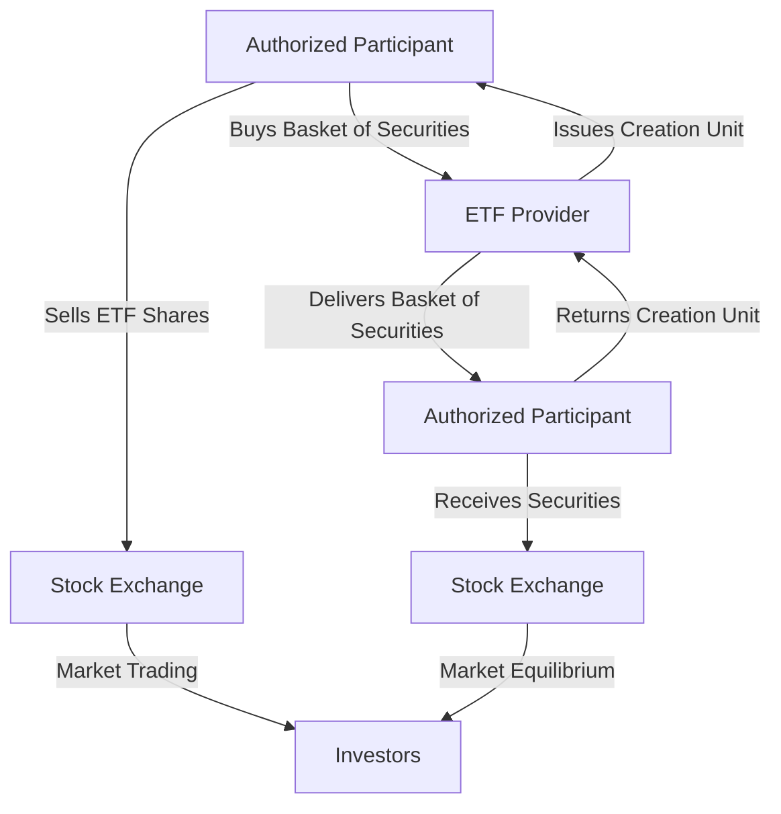

## 8.3.1 ETF Structure and Creation Units

Exchange-Traded Funds (ETFs) have revolutionized the investment landscape by providing a flexible and cost-effective way to gain exposure to a wide range of asset classes. At the heart of this innovation is the concept of **creation units**, which are essential for the efficient functioning of ETFs. In this section, we will delve into the structure of ETFs, the creation and redemption process, and the critical role played by authorized participants. Understanding these concepts is crucial for anyone preparing for the Series 7 Exam and aspiring to excel in the securities industry.

### Understanding the ETF Structure

ETFs are investment funds that are traded on stock exchanges, much like stocks. They hold assets such as stocks, commodities, or bonds and generally operate with an arbitrage mechanism designed to keep trading close to its net asset value (NAV), though deviations can occasionally occur. The structure of ETFs is designed to offer the liquidity of stocks while providing the diversification benefits of mutual funds.

#### Key Components of ETFs

1. **Basket of Securities**: ETFs represent a basket of securities, which can include stocks, bonds, commodities, or a mix of these. The composition of this basket is typically aligned with a specific index.

2. **Net Asset Value (NAV)**: The NAV of an ETF is calculated based on the value of the underlying assets. It is updated at the end of each trading day.

3. **Exchange Trading**: Unlike mutual funds, which are priced at the end of the trading day, ETFs can be bought and sold throughout the trading day at market prices.

4. **Liquidity and Flexibility**: ETFs offer high liquidity and flexibility, allowing investors to trade them like individual stocks. This is facilitated by the creation and redemption process, which ensures that supply and demand are balanced.

### Creation Units: The Building Blocks of ETFs

The concept of **creation units** is central to the operation of ETFs. A creation unit is a large block of ETF shares, typically consisting of 50,000 shares, though this can vary depending on the ETF provider. These units are used in the creation and redemption process, which is essential for maintaining the liquidity and price stability of ETFs.

#### The Creation Process

The creation process involves the following steps:

1. **Authorized Participants (APs)**: The creation and redemption of ETFs are facilitated by authorized participants, which are typically large financial institutions. These APs have the exclusive right to create and redeem ETF shares.

2. **Basket of Securities**: To create new ETF shares, an AP buys a basket of securities that mirrors the ETF's holdings. This basket is then delivered to the ETF provider.

3. **Creation of ETF Shares**: In exchange for the basket of securities, the ETF provider issues a creation unit of ETF shares to the AP. These shares can then be sold on the stock exchange.

4. **Market Liquidity**: The creation process ensures that the supply of ETF shares can meet demand, maintaining liquidity and helping to keep the ETF's market price in line with its NAV.

#### The Redemption Process

The redemption process is essentially the reverse of the creation process:

1. **Redemption Request**: An AP can redeem ETF shares by returning a creation unit to the ETF provider.

2. **Receipt of Securities**: In exchange for the ETF shares, the AP receives the underlying basket of securities.

3. **Market Equilibrium**: The redemption process helps to remove excess ETF shares from the market, preventing the ETF's price from deviating significantly from its NAV.

### Role of Authorized Participants (APs)

Authorized participants play a pivotal role in the ETF ecosystem. They are responsible for the creation and redemption of ETF shares, ensuring that ETFs remain liquid and that their prices closely track the NAV of the underlying assets.

#### Functions of Authorized Participants

1. **Arbitrage Opportunities**: APs engage in arbitrage activities to profit from discrepancies between the ETF's market price and its NAV. This arbitrage mechanism helps to keep the ETF's price aligned with its NAV.

2. **Market Making**: APs often act as market makers, providing liquidity by buying and selling ETF shares on the exchange.

3. **Facilitating Large Transactions**: By creating and redeeming ETF shares, APs facilitate large transactions that might otherwise impact the market price of the ETF.

#### Importance of APs in the ETF Market

The presence of authorized participants is crucial for the efficient functioning of the ETF market. They ensure that:

- **ETFs remain liquid**: By constantly creating and redeeming shares, APs provide the liquidity necessary for ETFs to be traded like stocks.

- **Price stability is maintained**: The arbitrage activities of APs help to minimize the price deviation of ETFs from their NAV.

- **Efficient market operation**: APs contribute to the overall efficiency of the ETF market by facilitating large trades and maintaining market equilibrium.

### Diagrams of ETF Operations

To better understand the creation and redemption process, let's visualize the operations of ETFs using diagrams. These diagrams illustrate the flow of securities and ETF shares between authorized participants and ETF providers.

### Practical Examples and Case Studies

Let's consider a practical example to illustrate the creation and redemption process:

**Example: Creation of ETF Shares**

Suppose an authorized participant identifies an opportunity where the market price of an ETF is slightly higher than its NAV. To exploit this arbitrage opportunity, the AP decides to create new ETF shares. The AP purchases the underlying securities that make up the ETF's basket and delivers them to the ETF provider. In return, the ETF provider issues a creation unit of ETF shares to the AP. The AP then sells these shares on the stock exchange, profiting from the price difference.

**Example: Redemption of ETF Shares**

Conversely, if the market price of an ETF is lower than its NAV, the AP can redeem ETF shares. The AP buys ETF shares on the exchange and returns a creation unit to the ETF provider. In exchange, the AP receives the underlying basket of securities. The AP can then sell these securities in the open market, again profiting from the price discrepancy.

### Real-World Applications and Regulatory Scenarios

The creation and redemption process is not only crucial for the functioning of ETFs but also has significant implications for regulatory compliance and market stability.

#### Regulatory Considerations

1. **SEC Oversight**: The U.S. Securities and Exchange Commission (SEC) regulates ETFs, ensuring that they operate transparently and fairly. The creation and redemption process must comply with SEC rules and guidelines.

2. **Market Surveillance**: Regulatory bodies monitor the activities of authorized participants to prevent market manipulation and ensure that the ETF market operates efficiently.

3. **Disclosure Requirements**: ETF providers are required to disclose the composition of the underlying basket of securities, allowing investors to make informed decisions.

#### Market Stability

The creation and redemption process contributes to market stability by:

- **Providing liquidity**: The ability to create and redeem shares ensures that ETFs remain liquid, even during periods of market volatility.

- **Aligning prices with NAV**: The arbitrage activities of APs help to keep ETF prices aligned with their NAV, reducing the risk of significant price deviations.

### Best Practices and Common Pitfalls

For those preparing for the Series 7 Exam, understanding the creation and redemption process is essential. Here are some best practices and common pitfalls to be aware of:

#### Best Practices

1. **Understand the Role of APs**: Recognize the critical role that authorized participants play in maintaining ETF liquidity and price stability.

2. **Familiarize Yourself with Regulatory Requirements**: Be aware of the regulatory framework governing ETFs and the responsibilities of ETF providers and APs.

3. **Practice Analyzing ETF Structures**: Use practical examples and case studies to deepen your understanding of how ETFs are structured and operated.

#### Common Pitfalls

1. **Overlooking the Importance of Liquidity**: Failing to appreciate the role of liquidity in the ETF market can lead to misunderstandings about how ETFs function.

2. **Ignoring Regulatory Compliance**: Neglecting the regulatory aspects of ETFs can result in a lack of preparedness for exam questions related to compliance and market stability.

3. **Misunderstanding Arbitrage Mechanisms**: Misinterpreting the arbitrage process can lead to confusion about how ETF prices are kept in line with their NAV.

### Summary

The structure of ETFs and the creation and redemption process are fundamental concepts for anyone preparing for the Series 7 Exam. By understanding how creation units function and the role of authorized participants, you will be better equipped to navigate the complexities of the ETF market. This knowledge is not only crucial for exam success but also for a successful career in the securities industry.

### Additional Resources

For further exploration of ETFs and their structure, consider the following resources:

- **U.S. Securities and Exchange Commission (SEC)**: Visit the SEC's website for official guidelines and regulations regarding ETFs.
- **Financial Industry Regulatory Authority (FINRA)**: Access FINRA's resources for information on market regulations and compliance.
- **ETF Providers**: Explore educational materials and resources provided by leading ETF providers such as iShares, Vanguard, and SPDR.

By leveraging these resources, you can deepen your understanding of ETFs and enhance your preparation for the Series 7 Exam.

---

## Series 7 Exam Practice Questions: Structure and Creation Units



### What is a creation unit in the context of ETFs?

- [x] A large block of ETF shares typically consisting of 50,000 shares
- [ ] A single share of an ETF
- [ ] A mutual fund share equivalent
- [ ] A fixed-income security

> **Explanation:** A creation unit is a large block of ETF shares, usually consisting of 50,000 shares, used in the creation and redemption process.

### Who are the primary facilitators of the creation and redemption process in ETFs?

- [ ] Retail investors
- [x] Authorized participants
- [ ] Mutual fund managers
- [ ] Stockbrokers

> **Explanation:** Authorized participants are large financial institutions that facilitate the creation and redemption of ETF shares.

### What is the main purpose of the creation and redemption process in ETFs?

- [x] To maintain liquidity and keep ETF prices aligned with their NAV
- [ ] To increase the NAV of the ETF
- [ ] To decrease the number of shares available
- [ ] To eliminate market volatility

> **Explanation:** The creation and redemption process ensures liquidity and helps keep ETF prices aligned with their net asset value (NAV).

### How do authorized participants profit from the creation and redemption process?

- [ ] By charging fees to investors
- [ ] By holding ETF shares long-term
- [x] Through arbitrage opportunities
- [ ] By issuing new shares directly to investors

> **Explanation:** Authorized participants profit from arbitrage opportunities by exploiting price discrepancies between the ETF's market price and its NAV.

### What is the role of the SEC in the ETF market?

- [ ] To set ETF prices
- [x] To regulate and ensure transparency and fairness
- [ ] To create ETF shares
- [ ] To manage ETF portfolios

> **Explanation:** The SEC regulates ETFs to ensure they operate transparently and fairly, protecting investors and maintaining market integrity.

### What happens during the redemption process of ETF shares?

- [x] ETF shares are returned to the provider in exchange for the underlying securities
- [ ] ETF shares are sold at a premium
- [ ] ETF shares are converted into mutual fund shares
- [ ] ETF shares are held indefinitely

> **Explanation:** During redemption, authorized participants return ETF shares to the provider and receive the underlying basket of securities.

### How does the creation and redemption process contribute to market stability?

- [ ] By increasing the number of ETFs available
- [x] By providing liquidity and aligning prices with NAV
- [ ] By reducing trading volume
- [ ] By fixing ETF prices

> **Explanation:** The process provides liquidity and helps align ETF prices with their NAV, contributing to market stability.

### What is a potential risk if the creation and redemption process fails?

- [ ] Increased ETF supply
- [ ] Decreased investor interest
- [x] Significant price deviations from NAV
- [ ] Higher ETF dividends

> **Explanation:** If the process fails, ETF prices may deviate significantly from their NAV, leading to potential market instability.

### What is a common misconception about ETFs?

- [ ] They are traded like stocks
- [x] They are always actively managed
- [ ] They offer diversification
- [ ] They can be bought and sold throughout the trading day

> **Explanation:** A common misconception is that all ETFs are actively managed, while many are passively managed to track an index.

### What is a key advantage of ETFs over mutual funds?

- [ ] Higher fees
- [ ] Limited trading hours
- [x] Intraday trading capability
- [ ] Fixed share prices

> **Explanation:** ETFs can be traded throughout the trading day, offering more flexibility compared to mutual funds, which are priced at the end of the day.



---

By understanding the intricacies of ETF structure and creation units, you are better prepared to tackle questions on the Series 7 Exam and apply this knowledge in your professional practice.
