## 8.3.3 Comparison with Mutual Funds

In the world of investment vehicles, Exchange-Traded Funds (ETFs) and Mutual Funds are two of the most popular options available to investors. Both offer diversification and professional management, but they differ significantly in terms of trading, pricing, cost structures, and other features. Understanding these differences is crucial for aspiring General Securities Representatives, as it helps in guiding clients to make informed investment decisions.

### Key Differences Between ETFs and Mutual Funds

#### Trading and Liquidity

**ETFs** are traded on stock exchanges, much like individual stocks. This means that they can be bought and sold throughout the trading day at market prices, which can fluctuate based on supply and demand. This intraday trading capability provides investors with flexibility and liquidity, allowing them to react quickly to market changes.

**Mutual Funds**, on the other hand, are not traded on exchanges. Instead, they are bought and sold directly through the fund company at the net asset value (NAV), which is calculated at the end of each trading day. This means that investors must wait until the end of the day to know the price at which they are buying or selling shares.

**Scenarios:**
- **ETFs** are often preferred by investors who wish to take advantage of short-term price movements or who need the ability to trade quickly.
- **Mutual Funds** may be more suitable for long-term investors who are less concerned with intraday price fluctuations.

#### Pricing

**ETFs** have a transparent pricing structure, with prices available in real-time throughout the trading day. The market price of an ETF can be above (premium) or below (discount) its NAV, depending on market demand.

**Mutual Funds** are priced once per day after the market closes. The price is based on the NAV, which is calculated by dividing the total value of the fund's assets by the number of outstanding shares.

**Scenarios:**
- **ETFs** are ideal for investors who want real-time pricing information and the ability to execute trades at specific prices.
- **Mutual Funds** are suitable for investors who are comfortable with end-of-day pricing and are focused on long-term growth.

#### Cost Structures

**ETFs** typically have lower expense ratios compared to mutual funds, making them a cost-effective option for many investors. They do not have sales loads, but investors may incur brokerage commissions when buying or selling ETF shares.

**Mutual Funds** often have higher expense ratios and may include sales loads (front-end or back-end) and 12b-1 fees, which can increase the overall cost of investing in these funds.

**Scenarios:**
- **ETFs** are advantageous for cost-conscious investors who prefer to minimize ongoing expenses.
- **Mutual Funds** may be preferred by investors who value the potential for active management and are willing to pay higher fees for it.

#### Management Style

**ETFs** are predominantly passively managed, tracking a specific index. This passive management approach often results in lower fees and fewer capital gains distributions.

**Mutual Funds** can be either actively or passively managed. Actively managed mutual funds aim to outperform the market through strategic stock selection, which can potentially lead to higher returns but also higher fees and tax implications.

**Scenarios:**
- **ETFs** are suitable for investors seeking low-cost, passive investment strategies that mirror market indices.
- **Mutual Funds** may appeal to investors looking for active management and the potential for market outperformance.

#### Tax Efficiency

**ETFs** are generally more tax-efficient than mutual funds. This is due to their unique creation and redemption process, which allows them to minimize capital gains distributions.

**Mutual Funds** may distribute capital gains to shareholders, which can result in tax liabilities even if the investor does not sell any shares.

**Scenarios:**
- **ETFs** are a better choice for tax-sensitive investors who want to minimize tax liabilities.
- **Mutual Funds** may be suitable for investors who are less concerned with tax efficiency and more focused on investment returns.

### Side-by-Side Comparison Table

To further illustrate the differences between ETFs and Mutual Funds, the following table provides a side-by-side comparison of key features:

```mermaid
graph TD;
    A[Feature] --> B[ETFs]
    A --> C[Mutual Funds]
    B1[Trading] --> B
    B2[Pricing] --> B
    B3[Cost Structure] --> B
    B4[Management Style] --> B
    B5[Tax Efficiency] --> B
    C1[Trading] --> C
    C2[Pricing] --> C
    C3[Cost Structure] --> C
    C4[Management Style] --> C
    C5[Tax Efficiency] --> C
    B1 --> D[Intraday on exchanges]
    C1 --> E[End of day at NAV]
    B2 --> F[Real-time market price]
    C2 --> G[Daily NAV]
    B3 --> H[Lower expense ratios, no loads]
    C3 --> I[Higher expense ratios, possible loads]
    B4 --> J[Typically passive]
    C4 --> K[Active or passive]
    B5 --> L[More tax-efficient]
    C5 --> M[Less tax-efficient]
```

### Practical Examples and Case Studies

#### Example 1: Short-Term Trading

Consider an investor who wants to take advantage of short-term market movements. This investor may choose an ETF due to its ability to be traded intraday. For instance, if the investor anticipates a market rally, they can quickly buy an ETF that tracks a broad market index and sell it later in the day if the rally occurs.

#### Example 2: Long-Term Growth

A long-term investor focused on retirement savings might prefer a mutual fund, especially if they value active management. For example, a mutual fund managed by a team of experienced analysts may offer the potential for higher returns through strategic stock selection, aligning with the investor's long-term growth objectives.

#### Example 3: Cost Considerations

An investor with a limited budget may opt for ETFs to minimize costs. By choosing an ETF with a low expense ratio and no sales loads, the investor can maximize their investment returns over time.

#### Example 4: Tax Efficiency

A tax-sensitive investor looking to minimize capital gains distributions might favor ETFs. Due to their tax-efficient structure, ETFs can help reduce the investor's tax liabilities, especially in a taxable account.

### Regulatory Considerations

Both ETFs and Mutual Funds are subject to regulatory oversight, primarily by the Securities and Exchange Commission (SEC). However, there are some differences in their regulatory frameworks:

- **ETFs**: The creation and redemption process of ETFs is regulated to ensure transparency and fairness in pricing. ETFs must comply with the Investment Company Act of 1940 and other relevant securities laws.

- **Mutual Funds**: Mutual funds are also regulated under the Investment Company Act of 1940, with additional rules regarding disclosure, fees, and shareholder rights. Mutual funds must provide a prospectus that outlines the fund's objectives, risks, and costs.

### Best Practices and Common Pitfalls

#### Best Practices

- **For ETFs**: Monitor market conditions and use limit orders to control the price at which trades are executed. Consider the bid-ask spread and liquidity when trading ETFs.

- **For Mutual Funds**: Review the fund's prospectus and performance history before investing. Understand the fee structure and any potential sales charges.

#### Common Pitfalls

- **For ETFs**: Avoid overtrading, as frequent trading can erode returns through transaction costs. Be aware of the potential for tracking error, where the ETF's performance deviates from its benchmark.

- **For Mutual Funds**: Watch out for high expense ratios and sales loads, which can significantly impact long-term returns. Be cautious of funds with high turnover rates, as they may generate more taxable events.

### Conclusion

Both ETFs and Mutual Funds offer unique advantages and disadvantages. The choice between them depends on the investor's individual needs, investment strategy, and financial goals. By understanding the key differences in trading, pricing, cost structures, management styles, and tax efficiency, aspiring General Securities Representatives can better advise clients and help them make informed investment decisions.

### Additional Resources

For further exploration of ETFs and Mutual Funds, consider the following resources:

- **Securities and Exchange Commission (SEC) Website**: Provides regulatory information and educational materials on investment products.
- **Financial Industry Regulatory Authority (FINRA) Website**: Offers investor alerts, tools, and resources to help investors understand different investment vehicles.
- **Investment Company Institute (ICI) Website**: Features research and data on mutual funds and ETFs, including industry trends and statistics.

### Summary

In summary, ETFs and Mutual Funds are both valuable investment vehicles, each with its own set of features and benefits. By leveraging the knowledge gained from this comparison, you can confidently guide clients in selecting the investment options that best align with their financial objectives and risk tolerance.

---

## Series 7 Exam Practice Questions: Comparison with Mutual Funds



### What is a primary advantage of ETFs over mutual funds in terms of trading?

- [x] ETFs can be traded throughout the day at market prices.
- [ ] ETFs have higher expense ratios.
- [ ] ETFs are only available through fund companies.
- [ ] ETFs require a minimum investment.

> **Explanation:** ETFs are traded on stock exchanges and can be bought and sold throughout the trading day at market prices, providing greater flexibility than mutual funds, which are priced at the end of the day.

### How is the pricing of mutual funds different from that of ETFs?

- [ ] Mutual funds are priced in real-time.
- [x] Mutual funds are priced once a day based on NAV.
- [ ] Mutual funds have no pricing transparency.
- [ ] Mutual funds' prices fluctuate throughout the day.

> **Explanation:** Mutual funds are priced once at the end of the trading day based on the net asset value (NAV), whereas ETFs have real-time pricing.

### Which type of fund typically has lower expense ratios?

- [x] ETFs
- [ ] Actively managed mutual funds
- [ ] All mutual funds
- [ ] Hedge funds

> **Explanation:** ETFs generally have lower expense ratios compared to actively managed mutual funds due to their passive management style.

### Why might an investor choose a mutual fund over an ETF?

- [ ] For intraday trading opportunities.
- [x] For active management and potential market outperformance.
- [ ] For lower trading costs.
- [ ] For real-time pricing.

> **Explanation:** An investor might choose a mutual fund for active management, which aims to outperform the market, despite potentially higher costs.

### What is a key tax advantage of ETFs compared to mutual funds?

- [ ] ETFs distribute more capital gains.
- [x] ETFs are generally more tax-efficient.
- [ ] ETFs have higher tax liabilities.
- [ ] ETFs are not subject to capital gains taxes.

> **Explanation:** ETFs are generally more tax-efficient than mutual funds due to their unique creation and redemption process, which minimizes capital gains distributions.

### Which investment vehicle is more suitable for short-term trading?

- [x] ETFs
- [ ] Mutual funds
- [ ] Certificates of deposit
- [ ] Real estate investment trusts

> **Explanation:** ETFs are more suitable for short-term trading due to their ability to be traded intraday on stock exchanges.

### What is a potential disadvantage of mutual funds?

- [ ] They offer active management.
- [x] They may have higher fees and sales loads.
- [ ] They are tax-efficient.
- [ ] They provide real-time pricing.

> **Explanation:** Mutual funds may have higher fees and sales loads, which can impact the investor's overall returns.

### How do ETFs achieve their tax efficiency?

- [ ] By distributing capital gains frequently.
- [x] Through their creation and redemption process.
- [ ] By avoiding investments in stocks.
- [ ] By being actively managed.

> **Explanation:** ETFs achieve tax efficiency through their creation and redemption process, which allows them to minimize capital gains distributions.

### What is a common feature of both ETFs and mutual funds?

- [ ] Both are traded on stock exchanges.
- [x] Both offer diversification.
- [ ] Both have high liquidity.
- [ ] Both are actively managed.

> **Explanation:** Both ETFs and mutual funds offer diversification, allowing investors to spread risk across a variety of assets.

### Which regulatory body oversees both ETFs and mutual funds?

- [ ] Federal Reserve Board
- [ ] Commodity Futures Trading Commission (CFTC)
- [x] Securities and Exchange Commission (SEC)
- [ ] Office of the Comptroller of the Currency (OCC)

> **Explanation:** The Securities and Exchange Commission (SEC) oversees both ETFs and mutual funds, ensuring compliance with securities laws.



---
