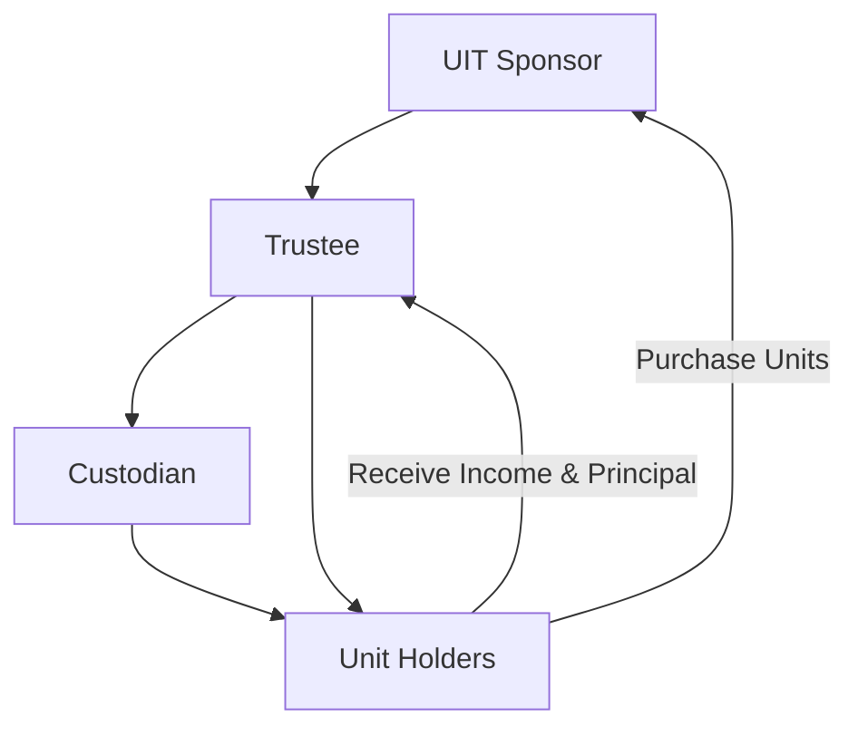

## 8.4 Unit Investment Trusts (UITs)

Unit Investment Trusts (UITs) are a unique type of investment company that offer investors a fixed portfolio of securities, typically bonds or stocks, for a predetermined period. Unlike mutual funds, which are actively managed, UITs are passively managed, meaning that once the portfolio is established, it remains unchanged throughout the life of the trust. This section will explore the intricacies of UITs, their structure, benefits, and how they fit into the broader landscape of investment company securities. Understanding UITs is crucial for the Series 7 Exam, as they represent a distinct investment vehicle with specific features and benefits.

### Understanding Unit Investment Trusts (UITs)

#### What is a Unit Investment Trust (UIT)?

A Unit Investment Trust (UIT) is a type of investment company that offers a fixed, unmanaged portfolio of securities. These securities are typically selected to achieve a specific investment objective, such as income generation or capital appreciation. Once the portfolio is established, it is not actively managed, meaning that the securities within the trust are not bought or sold unless there is a corporate action, such as a merger or bankruptcy, that necessitates a change.

**Key Characteristics of UITs:**

- **Fixed Portfolio:** The portfolio of a UIT is fixed at the time of creation and remains unchanged for the life of the trust.
- **Defined Life Span:** UITs have a set termination date, which can range from a few months to several years, depending on the securities held within the trust.
- **Passively Managed:** Unlike mutual funds, UITs do not have a portfolio manager actively buying and selling securities. This passive management leads to lower operating costs.
- **Redeemable Units:** Investors purchase units in the trust, which represent a proportional interest in the portfolio. These units can be redeemed at the net asset value (NAV) at the end of the trust's term.

#### Structure and Operation of UITs

UITs are structured as trusts and are governed by a trust indenture, a legal document that outlines the terms and conditions of the trust. The trustee is responsible for administering the trust, ensuring that it operates in accordance with the trust indenture, and distributing income and principal to unit holders.

**Components of a UIT:**

- **Sponsor:** The entity that creates the UIT, selects the securities, and markets the units to investors.
- **Trustee:** An independent entity that oversees the administration of the trust, including the distribution of income and principal.
- **Custodian:** Responsible for holding the securities in the trust's portfolio.
- **Unit Holders:** Investors who purchase units in the trust and have a proportional interest in the underlying portfolio.

**Mermaid Diagram: UIT Structure**

#### Types of Unit Investment Trusts

UITs can be broadly categorized into two types: bond UITs and equity UITs. Each type serves different investment objectives and has distinct characteristics.

**Bond UITs:**

- **Objective:** Typically aim to provide a steady stream of income to investors.
- **Portfolio Composition:** Consists primarily of fixed-income securities such as municipal bonds, corporate bonds, or government securities.
- **Maturity:** The trust's life is often aligned with the maturity dates of the bonds in the portfolio.

**Example:** A bond UIT might hold a diversified portfolio of municipal bonds from various states, providing investors with tax-exempt income until the bonds mature.

**Equity UITs:**

- **Objective:** Generally focus on capital appreciation or dividend income.
- **Portfolio Composition:** Consists of a fixed selection of stocks, often chosen based on specific criteria such as dividend yield or market capitalization.
- **Maturity:** The trust's life can vary, but it is typically shorter than that of bond UITs.

**Example:** An equity UIT might invest in a basket of high-dividend-yielding stocks, offering investors potential income and capital growth.

### Benefits of Investing in UITs

UITs offer several advantages to investors, making them an attractive option for certain investment strategies.

#### Predictable Nature and Transparency

One of the primary benefits of UITs is their predictability. Because the portfolio is fixed, investors know exactly what securities they are investing in and can anticipate the income or growth potential. This transparency allows investors to align their investments with their financial goals and risk tolerance.

#### Cost-Effectiveness

UITs are generally more cost-effective than mutual funds due to their passive management. Without the need for active portfolio management, UITs incur lower management fees, which can enhance overall returns for investors.

#### Diversification

By investing in a diversified portfolio of securities, UITs offer investors exposure to a broad range of asset classes and sectors. This diversification can help mitigate risk and enhance returns over the life of the trust.

#### Tax Efficiency

UITs can be more tax-efficient than mutual funds because they have lower portfolio turnover. With fewer transactions, there are fewer taxable events, which can result in lower capital gains taxes for investors.

### Risks and Considerations

While UITs offer several benefits, there are also risks and considerations that investors should be aware of before investing.

#### Lack of Flexibility

Once a UIT is established, the portfolio is fixed, which means that investors cannot make changes to the securities held within the trust. This lack of flexibility can be a disadvantage if market conditions change or if the securities underperform.

#### Market Risk

Like all investments, UITs are subject to market risk. The value of the units can fluctuate based on changes in interest rates, economic conditions, and the performance of the underlying securities.

#### Liquidity Risk

Although UIT units are redeemable at the end of the trust's term, they may not be as liquid as other investment vehicles. Investors may have difficulty selling their units before the trust's termination date without incurring a loss.

#### Income Risk

For bond UITs, there is a risk that the income generated by the trust may be lower than expected if interest rates decline or if the bonds in the portfolio default.

### Real-World Applications and Scenarios

To better understand how UITs function in practice, consider the following scenarios:

**Scenario 1: Income-Focused Investor**

An investor seeking a steady stream of income might invest in a bond UIT that holds a diversified portfolio of high-quality municipal bonds. The investor benefits from the predictable income generated by the bonds and the tax-exempt status of municipal bond interest.

**Scenario 2: Growth-Oriented Investor**

An investor looking for capital appreciation might choose an equity UIT that invests in a basket of growth stocks. The fixed portfolio allows the investor to benefit from the potential upside of the selected stocks over the life of the trust.

**Scenario 3: Diversification Strategy**

An investor seeking diversification might invest in a UIT that holds a mix of bonds and stocks. This approach provides exposure to multiple asset classes, helping to spread risk and enhance returns.

### Regulatory Considerations and Compliance

UITs are regulated by the Securities and Exchange Commission (SEC) under the Investment Company Act of 1940. This regulation ensures that UITs operate in a manner that protects investors and maintains transparency.

**Key Regulatory Requirements:**

- **Registration:** UITs must be registered with the SEC and provide a prospectus to investors outlining the trust's objectives, risks, and fees.
- **Disclosure:** UITs are required to disclose information about the underlying securities, the trust's performance, and any changes to the portfolio.
- **Compliance:** UITs must adhere to strict compliance standards, including maintaining accurate records and ensuring that the trust operates in accordance with the trust indenture.

### Best Practices for Investing in UITs

When considering an investment in UITs, it is important to follow best practices to maximize potential returns and minimize risks.

#### Conduct Thorough Research

Before investing in a UIT, conduct thorough research to understand the trust's objectives, the composition of the portfolio, and the associated risks. Review the prospectus and any available performance data to make an informed decision.

#### Align Investments with Financial Goals

Ensure that the UIT aligns with your financial goals and risk tolerance. Consider factors such as income needs, growth potential, and investment horizon when selecting a UIT.

#### Monitor Performance

While UITs are passively managed, it is important to monitor the performance of the trust and the underlying securities. Stay informed about market conditions and any factors that could impact the trust's performance.

#### Diversify Investments

Consider diversifying your investments across multiple UITs or asset classes to spread risk and enhance returns. This approach can help mitigate the impact of underperformance in any single trust.

### Conclusion

Unit Investment Trusts (UITs) offer a unique investment opportunity for investors seeking a fixed, predictable portfolio with potential income or growth benefits. By understanding the structure, benefits, and risks of UITs, you can make informed investment decisions and effectively prepare for the Series 7 Exam. Remember to conduct thorough research, align your investments with your financial goals, and monitor performance to maximize the potential benefits of UITs.

## Series 7 Exam Practice Questions: Unit Investment Trusts (UITs)



### What is a key characteristic of a Unit Investment Trust (UIT)?

- [x] A fixed portfolio of securities
- [ ] Actively managed portfolio
- [ ] Unlimited life span
- [ ] Variable portfolio composition

> **Explanation:** UITs have a fixed portfolio of securities that does not change over the life of the trust, unlike actively managed funds.

### How are UITs typically managed?

- [ ] Actively managed
- [x] Passively managed
- [ ] Managed by a hedge fund
- [ ] Managed by a mutual fund manager

> **Explanation:** UITs are passively managed, meaning the portfolio is fixed and not actively traded.

### What type of securities can a bond UIT hold?

- [x] Municipal bonds
- [ ] Common stocks
- [ ] Preferred stocks
- [ ] Real estate

> **Explanation:** Bond UITs typically hold fixed-income securities such as municipal bonds.

### Which of the following is a benefit of investing in UITs?

- [ ] High management fees
- [x] Predictable income
- [ ] Frequent portfolio changes
- [ ] High liquidity

> **Explanation:** UITs offer predictable income due to their fixed portfolio and passive management.

### What is a potential risk of investing in a bond UIT?

- [ ] High portfolio turnover
- [x] Interest rate risk
- [ ] High management fees
- [ ] Frequent trading

> **Explanation:** Bond UITs are subject to interest rate risk, which can affect the value of the underlying bonds.

### How are UIT units typically redeemed?

- [x] At the end of the trust's term
- [ ] Daily at the market price
- [ ] Weekly at the NAV
- [ ] Monthly at a fixed price

> **Explanation:** UIT units are typically redeemed at the end of the trust's term at the net asset value (NAV).

### What is the role of the trustee in a UIT?

- [x] Administer the trust and distribute income
- [ ] Select securities for the portfolio
- [ ] Actively manage the portfolio
- [ ] Market the units to investors

> **Explanation:** The trustee administers the trust and is responsible for distributing income and principal to unit holders.

### Which regulatory body oversees UITs?

- [x] Securities and Exchange Commission (SEC)
- [ ] Federal Reserve Board (FRB)
- [ ] Financial Industry Regulatory Authority (FINRA)
- [ ] Municipal Securities Rulemaking Board (MSRB)

> **Explanation:** UITs are regulated by the Securities and Exchange Commission (SEC) under the Investment Company Act of 1940.

### What is a common feature of an equity UIT?

- [ ] High turnover
- [ ] Fixed-income securities
- [x] Capital appreciation focus
- [ ] Daily trading

> **Explanation:** Equity UITs often focus on capital appreciation by holding a fixed selection of stocks.

### Why might an investor choose a UIT over a mutual fund?

- [ ] To benefit from active management
- [ ] To have a flexible portfolio
- [x] For lower management fees
- [ ] For high liquidity

> **Explanation:** UITs typically have lower management fees due to their passive management style.



---
