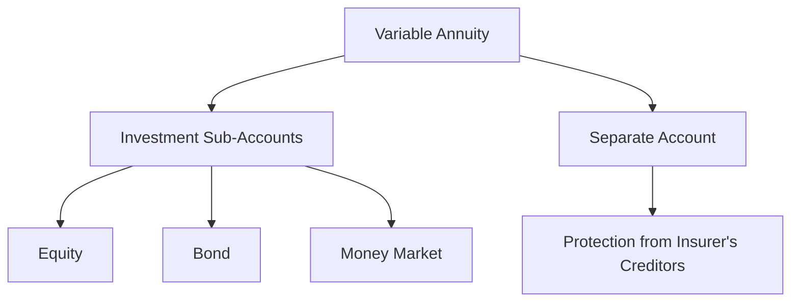

## 9.1.2 Variable Annuities

Variable annuities are a type of insurance product that offer a unique blend of investment and insurance features. They are designed to provide investors with the potential for higher returns through investment in sub-accounts, which are similar to mutual funds. Unlike fixed annuities, where returns are predetermined, variable annuities offer returns that are linked to the performance of these investment sub-accounts. This section will delve into the intricacies of variable annuities, exploring their structure, benefits, risks, and regulatory considerations, all of which are crucial for the Series 7 Exam.

### Understanding Variable Annuities

Variable annuities are contracts between an investor and an insurance company. They are designed to provide periodic payments to the investor, either immediately or at some point in the future. The key feature of variable annuities is that they allow investors to allocate their premiums among a variety of investment options, typically mutual funds. The value of the annuity and the income it generates can fluctuate based on the performance of these underlying investments.

#### Structure of Variable Annuities

Variable annuities consist of two main phases: the accumulation phase and the annuitization phase.

1. **Accumulation Phase**: During this phase, the investor makes contributions to the annuity. These contributions are invested in a selection of sub-accounts chosen by the investor. The value of the annuity during this phase is determined by the performance of these sub-accounts.

2. **Annuitization Phase**: This phase begins when the investor decides to start receiving payments from the annuity. The payments can be structured in various ways, such as a lifetime income, a fixed period, or a lump sum. The amount of the payments depends on the value of the annuity at the time of annuitization and the payout option selected.

#### Investment Sub-Accounts

The investment sub-accounts within a variable annuity are similar to mutual funds and can include a wide range of asset classes, such as equities, bonds, and money market instruments. The performance of these sub-accounts directly impacts the value of the annuity.

- **Equity Sub-Accounts**: These invest in stocks and have the potential for high returns, but also come with higher risk.
- **Bond Sub-Accounts**: These invest in fixed-income securities and generally offer more stability but lower returns.
- **Money Market Sub-Accounts**: These provide the lowest risk and return, focusing on short-term, high-quality investments.

#### Separate Account

A key feature of variable annuities is the **separate account**, which is a distinct account established by the insurance company to hold the assets of the variable annuity. This separation ensures that the annuity's assets are not commingled with the insurance company's general account, providing an additional layer of protection for the investor.

#### Performance Variability

The performance of a variable annuity is inherently variable, as it is directly linked to the performance of the chosen investment sub-accounts. This variability means that the value of the annuity can increase or decrease, and the income it provides can fluctuate over time.

### Benefits of Variable Annuities

Variable annuities offer several benefits that make them attractive to investors seeking growth potential and income flexibility.

1. **Potential for Higher Returns**: By investing in a diversified range of sub-accounts, investors have the opportunity to achieve higher returns compared to fixed annuities.

2. **Tax-Deferred Growth**: The earnings on investments within a variable annuity grow on a tax-deferred basis, meaning taxes are not paid until withdrawals are made.

3. **Death Benefit**: Many variable annuities offer a death benefit, ensuring that beneficiaries receive at least the amount of the original investment, regardless of market performance.

4. **Income Flexibility**: Variable annuities offer various payout options, allowing investors to tailor their income stream to their specific needs.

### Risks Associated with Variable Annuities

While variable annuities offer potential benefits, they also come with certain risks that investors must consider.

1. **Market Risk**: The value of a variable annuity can fluctuate based on the performance of the underlying investments, leading to potential losses.

2. **High Fees**: Variable annuities often come with higher fees than other investment products, including management fees, mortality and expense risk charges, and administrative fees.

3. **Surrender Charges**: Investors may face surrender charges if they withdraw funds from the annuity within a certain period after purchase, typically ranging from 5 to 10 years.

4. **Complexity**: The structure and features of variable annuities can be complex, making it essential for investors to fully understand the product before investing.

### Regulatory Considerations

Variable annuities are regulated by both the Securities and Exchange Commission (SEC) and the Financial Industry Regulatory Authority (FINRA). As securities products, they must be registered with the SEC, and sales representatives must be licensed to sell them.

#### Disclosure Requirements

Insurance companies are required to provide a prospectus to potential investors, detailing the features, fees, risks, and investment options of the variable annuity. This document is essential for investors to make informed decisions.

#### Suitability Standards

FINRA imposes suitability standards on the sale of variable annuities, ensuring that the product is appropriate for the investor's financial situation, investment objectives, and risk tolerance.

### Practical Examples and Scenarios

To illustrate the concepts discussed, consider the following scenarios:

- **Scenario 1**: An investor allocates their variable annuity premiums across several equity sub-accounts. Over time, the stock market experiences significant growth, resulting in substantial gains in the annuity's value. However, during a market downturn, the value of the annuity decreases, highlighting the inherent market risk.

- **Scenario 2**: An investor nearing retirement chooses a conservative allocation, focusing on bond and money market sub-accounts. While the returns are lower, the investor benefits from reduced volatility and a more stable income stream during retirement.

### Best Practices and Strategies

1. **Diversification**: To manage risk, investors should diversify their investments across multiple sub-accounts with varying asset classes.

2. **Fee Awareness**: Understanding and comparing the fees associated with different variable annuities can help investors minimize costs and maximize returns.

3. **Long-Term Perspective**: Given the potential for market fluctuations, variable annuities are best suited for investors with a long-term investment horizon.

4. **Regular Review**: Investors should regularly review their annuity's performance and adjust their investment strategy as needed to align with their financial goals.

### Summary

Variable annuities offer a unique combination of investment and insurance features, providing investors with the potential for higher returns and income flexibility. However, they also come with risks and complexities that require careful consideration. By understanding the structure, benefits, risks, and regulatory considerations of variable annuities, investors can make informed decisions and effectively prepare for the Series 7 Exam.

## Series 7 Exam Practice Questions: Variable Annuities



### What is a key feature that distinguishes variable annuities from fixed annuities?

- [x] Returns linked to investment sub-accounts
- [ ] Guaranteed fixed returns
- [ ] No risk of principal loss
- [ ] Immediate tax benefits

> **Explanation:** Variable annuities have returns linked to the performance of investment sub-accounts, unlike fixed annuities which offer guaranteed returns.

### Which phase of a variable annuity involves the investor making contributions?

- [x] Accumulation phase
- [ ] Annuitization phase
- [ ] Distribution phase
- [ ] Maturity phase

> **Explanation:** The accumulation phase is when the investor makes contributions to the annuity and selects investment sub-accounts.

### What type of account holds the assets of a variable annuity?

- [x] Separate account
- [ ] General account
- [ ] Trust account
- [ ] Brokerage account

> **Explanation:** A separate account is used to hold the assets of a variable annuity, keeping them distinct from the insurance company's general account.

### What is a primary benefit of tax-deferred growth in variable annuities?

- [x] Taxes are deferred until withdrawals
- [ ] Immediate tax deductions
- [ ] No taxes on investment gains
- [ ] Reduced capital gains tax rate

> **Explanation:** Tax-deferred growth means that taxes on investment gains are not paid until funds are withdrawn from the annuity.

### Which regulatory body requires the registration of variable annuities?

- [x] Securities and Exchange Commission (SEC)
- [ ] Internal Revenue Service (IRS)
- [ ] Federal Reserve Board (FRB)
- [ ] Department of Labor (DOL)

> **Explanation:** The SEC requires the registration of variable annuities as they are considered securities products.

### What is a common fee associated with variable annuities?

- [x] Mortality and expense risk charge
- [ ] Front-end sales load
- [ ] Redemption fee
- [ ] Advisory fee

> **Explanation:** Variable annuities often include a mortality and expense risk charge, which covers the insurance aspects of the product.

### Which investment option within a variable annuity typically offers the highest potential returns?

- [x] Equity sub-accounts
- [ ] Bond sub-accounts
- [ ] Money market sub-accounts
- [ ] Fixed income sub-accounts

> **Explanation:** Equity sub-accounts invest in stocks and generally offer the highest potential returns, albeit with higher risk.

### What is a surrender charge in the context of variable annuities?

- [x] A fee for early withdrawal
- [ ] A charge for switching sub-accounts
- [ ] A penalty for not annuitizing
- [ ] A cost for adding riders

> **Explanation:** A surrender charge is a fee imposed for withdrawing funds from a variable annuity within a specified period after purchase.

### Which feature of variable annuities can provide a minimum payout to beneficiaries?

- [x] Death benefit
- [ ] Living benefit
- [ ] Guaranteed minimum income benefit
- [ ] Enhanced withdrawal benefit

> **Explanation:** The death benefit ensures that beneficiaries receive at least the amount of the original investment, even if the annuity's value has decreased.

### What is a key consideration when selecting investment sub-accounts in a variable annuity?

- [x] Diversification to manage risk
- [ ] Selecting only high-risk options
- [ ] Avoiding bond sub-accounts
- [ ] Choosing based on past performance only

> **Explanation:** Diversification helps manage risk by spreading investments across various asset classes, aligning with the investor's risk tolerance and goals.



---
