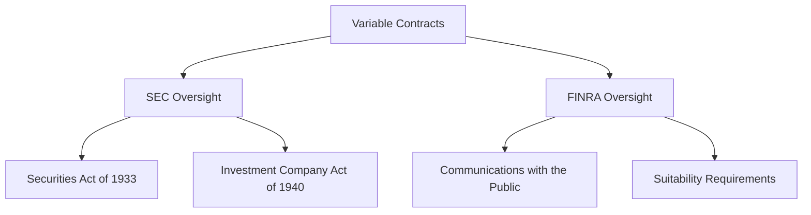

## 9.4.1 SEC and FINRA Oversight

In the realm of securities regulation, the oversight of variable contracts and insurance products by the Securities and Exchange Commission (SEC) and the Financial Industry Regulatory Authority (FINRA) plays a crucial role in maintaining market integrity and protecting investors. This section delves into the federal securities laws applicable to variable contracts, discusses FINRA rules on communications and suitability, and offers practical insights into compliance requirements.

### Overview of Variable Contracts

Variable contracts, such as variable annuities and variable life insurance, are unique financial products that combine features of insurance and investment. These contracts allow policyholders to allocate premiums among a variety of investment options, typically mutual funds, and the value of the contract varies based on the performance of these underlying investments. Due to their investment component, variable contracts are subject to federal securities laws and regulations.

### Federal Securities Laws Applicable to Variable Contracts

The regulation of variable contracts is primarily governed by the Securities Act of 1933 and the Investment Company Act of 1940. These laws ensure that investors receive adequate disclosure and protection when purchasing variable contracts.

#### Securities Act of 1933

The Securities Act of 1933 requires the registration of securities offerings and mandates that investors receive significant information regarding the securities being offered. Variable annuities and variable life insurance policies are considered securities under this Act, and thus, they must be registered with the SEC. The registration process involves the filing of a prospectus, which provides detailed information about the contract, including its fees, investment options, and risks.

#### Investment Company Act of 1940

The Investment Company Act of 1940 regulates the structure and operations of investment companies, including the separate accounts used by insurance companies to manage the assets of variable contracts. These separate accounts are treated as investment companies under the Act and must comply with its provisions, which include requirements for diversification, custody of assets, and fiduciary duties.

#### Key SEC Regulations

- **Rule 6e-3(T):** This rule provides exemptions for variable life insurance policies from certain provisions of the Investment Company Act, allowing for more flexibility in their design and operation.
- **Rule 22c-1:** This rule requires that the price of mutual fund shares, including those in variable contracts, be determined based on the net asset value (NAV) at the time of purchase or redemption, ensuring fair pricing for investors.

### FINRA Rules on Communications and Suitability

FINRA plays a critical role in overseeing the sales practices and communications related to variable contracts. Its rules are designed to ensure that communications are fair and balanced and that the sale of these products is suitable for the investor.

#### Communications with the Public

FINRA Rule 2210 governs communications with the public, including advertisements and sales literature related to variable contracts. The rule requires that all communications be fair, balanced, and not misleading. Key provisions include:

- **Content Standards:** Communications must provide a balanced presentation of risks and benefits, avoid exaggerated claims, and disclose material information.
- **Principal Approval:** Most communications must be approved by a registered principal before use.
- **Recordkeeping:** Firms must maintain records of all communications for a specified period.

#### Suitability Requirements

FINRA Rule 2111 outlines the suitability obligations of firms and their registered representatives when recommending variable contracts. The rule requires that recommendations be based on a reasonable belief that the product is suitable for the customer, taking into account the customer's financial situation, investment objectives, and risk tolerance.

- **Customer Profile:** Firms must gather and analyze detailed information about the customer's financial status, tax status, investment objectives, and other relevant factors.
- **Reasonable-Basis Suitability:** The firm must have a reasonable basis to believe that the product is suitable for at least some investors.
- **Customer-Specific Suitability:** The firm must have a reasonable basis to believe that the product is suitable for the particular customer.
- **Quantitative Suitability:** The firm must ensure that the number of recommended transactions is not excessive in light of the customer's profile.

### Practical Examples and Case Studies

To illustrate the application of SEC and FINRA oversight, consider the following scenarios:

#### Case Study 1: Misleading Advertising

A brokerage firm published an advertisement for a variable annuity that highlighted the potential for high returns without adequately disclosing the associated risks. The SEC and FINRA intervened, requiring the firm to revise its advertising materials to provide a balanced presentation of risks and returns and to include clear disclosures about fees and potential losses.

#### Case Study 2: Unsuitable Sales Practices

A registered representative recommended a variable life insurance policy to a retiree with a low risk tolerance and limited income. The policy involved significant market risk and high fees, making it unsuitable for the customer's financial situation. FINRA imposed disciplinary actions, emphasizing the importance of conducting thorough suitability analyses before making recommendations.

### Compliance Considerations and Best Practices

To ensure compliance with SEC and FINRA regulations, firms should implement robust compliance programs that include:

- **Training and Education:** Regular training sessions for registered representatives on the regulatory requirements and ethical considerations related to variable contracts.
- **Supervisory Procedures:** Establishing comprehensive supervisory procedures to monitor sales practices and communications.
- **Compliance Audits:** Conducting periodic audits to assess compliance with regulatory requirements and identify areas for improvement.
- **Customer Disclosures:** Providing clear and comprehensive disclosures to customers about the features, risks, and fees associated with variable contracts.

### Diagrams and Visual Aids

To enhance understanding, consider the following diagram illustrating the regulatory framework for variable contracts:

### Conclusion

Understanding the SEC and FINRA oversight of variable contracts is essential for anyone involved in the sale or management of these products. By adhering to federal securities laws and FINRA rules, firms can ensure that their practices are aligned with regulatory expectations, thereby protecting investors and maintaining market integrity. As you prepare for the Series 7 Exam, focus on the key regulations and best practices discussed in this section to enhance your knowledge and confidence in this critical area.

---

## Series 7 Exam Practice Questions: SEC and FINRA Oversight



### What is the primary purpose of the Securities Act of 1933 in relation to variable contracts?

- [x] To require registration and disclosure of securities offerings
- [ ] To regulate the trading of securities in the secondary market
- [ ] To establish the SEC as a regulatory body
- [ ] To provide exemptions for certain types of securities

> **Explanation:** The Securities Act of 1933 is designed to ensure that investors receive significant information about securities being offered for public sale, including variable contracts, through the registration process.

### Under the Investment Company Act of 1940, what are separate accounts used for in variable contracts?

- [x] To manage the assets of variable contracts
- [ ] To provide insurance coverage for policyholders
- [ ] To determine the price of mutual fund shares
- [ ] To facilitate the trading of securities

> **Explanation:** Separate accounts are used to manage the assets of variable contracts and are treated as investment companies under the Investment Company Act of 1940.

### Which FINRA rule governs communications with the public, including advertisements for variable contracts?

- [ ] FINRA Rule 2111
- [x] FINRA Rule 2210
- [ ] FINRA Rule 3110
- [ ] FINRA Rule 4512

> **Explanation:** FINRA Rule 2210 governs communications with the public, ensuring that all advertisements and sales literature are fair, balanced, and not misleading.

### What is a key requirement of FINRA Rule 2111 regarding the sale of variable contracts?

- [ ] Approval of all communications by a registered principal
- [x] Suitability of recommendations based on customer profiles
- [ ] Disclosure of all fees and expenses
- [ ] Recordkeeping of all transactions

> **Explanation:** FINRA Rule 2111 requires that recommendations of variable contracts be suitable for the customer, taking into account their financial situation, investment objectives, and risk tolerance.

### In the context of variable contracts, what does the term "reasonable-basis suitability" refer to?

- [x] The belief that a product is suitable for at least some investors
- [ ] The belief that a product is suitable for a specific customer
- [ ] The requirement to disclose all risks associated with a product
- [ ] The need to provide a balanced presentation of risks and benefits

> **Explanation:** Reasonable-basis suitability refers to the requirement that a firm must have a reasonable basis to believe that a product is suitable for at least some investors.

### What is the role of the SEC in the oversight of variable contracts?

- [x] To ensure compliance with federal securities laws
- [ ] To regulate the trading of securities in the secondary market
- [ ] To approve all communications with the public
- [ ] To determine the suitability of individual transactions

> **Explanation:** The SEC ensures compliance with federal securities laws, including the registration and disclosure requirements for variable contracts.

### Which rule provides exemptions for variable life insurance policies from certain provisions of the Investment Company Act?

- [ ] Rule 22c-1
- [x] Rule 6e-3(T)
- [ ] Rule 144A
- [ ] Rule 506(b)

> **Explanation:** Rule 6e-3(T) provides exemptions for variable life insurance policies from certain provisions of the Investment Company Act, allowing for more flexibility in their design and operation.

### What is a common compliance practice to ensure adherence to FINRA's suitability requirements?

- [ ] Conducting periodic audits of customer accounts
- [x] Gathering detailed customer profile information
- [ ] Approving all advertisements by a registered principal
- [ ] Maintaining records of all communications

> **Explanation:** Gathering detailed customer profile information is essential to ensure that recommendations are suitable for the customer's financial situation and investment objectives.

### Which of the following is a key feature of FINRA Rule 2210 regarding advertisements?

- [ ] They must be filed with the SEC
- [x] They must be fair, balanced, and not misleading
- [ ] They must include a list of all potential risks
- [ ] They must be approved by the customer

> **Explanation:** FINRA Rule 2210 requires that advertisements be fair, balanced, and not misleading, providing a balanced presentation of risks and benefits.

### How does the SEC's Rule 22c-1 impact the pricing of mutual fund shares in variable contracts?

- [x] It requires pricing based on the net asset value at purchase or redemption
- [ ] It allows for flexible pricing based on market conditions
- [ ] It mandates a fixed price for all transactions
- [ ] It exempts certain transactions from pricing requirements

> **Explanation:** Rule 22c-1 requires that the price of mutual fund shares, including those in variable contracts, be determined based on the net asset value at the time of purchase or redemption, ensuring fair pricing for investors.


