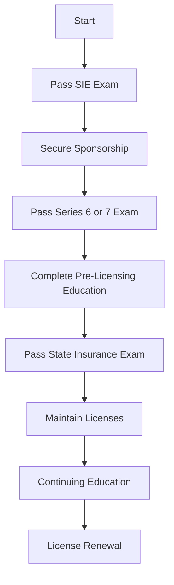

## 9.4.3 Licensing Requirements

### Introduction

The financial industry is heavily regulated to ensure the protection of investors and maintain the integrity of the markets. When dealing with variable contracts and insurance products, obtaining the appropriate licenses is crucial. This section will guide you through the licensing requirements needed to sell variable contracts, such as variable annuities and variable life insurance, which require both securities and insurance licenses. We will cover the steps to obtain these licenses, the importance of maintaining them, and practical examples to illustrate the process.

### Understanding Variable Contracts

Variable contracts, including variable annuities and variable life insurance, are unique financial products that blend insurance features with investment options. These products allow policyholders to allocate a portion of their premiums into various investment accounts, which can include stocks, bonds, or mutual funds. The value of these contracts can fluctuate based on the performance of the chosen investments, offering the potential for higher returns compared to traditional fixed insurance products.

### Licensing Overview

To sell variable contracts, you must be licensed as both a securities representative and an insurance agent. This dual licensing requirement ensures that professionals have the necessary knowledge and skills to advise clients on both the investment and insurance aspects of these products.

#### Securities Licensing

1. **FINRA Series 6 or Series 7 Exam**: 
   - The Series 6 exam qualifies individuals to sell mutual funds, variable annuities, and insurance products. It is often referred to as the "Investment Company and Variable Contracts Products Representative Exam."
   - The Series 7 exam, known as the "General Securities Representative Exam," is more comprehensive and allows individuals to sell a broader range of securities, including stocks, bonds, options, and variable contracts.

2. **Securities Industry Essentials (SIE) Exam**: 
   - Before taking the Series 6 or 7 exams, candidates must pass the SIE exam, which tests basic securities industry knowledge.

3. **Sponsorship**: 
   - To take the Series 6 or 7 exams, you must be sponsored by a FINRA-member firm. This sponsorship is crucial as it provides the necessary backing and resources to prepare for the exams.

#### Insurance Licensing

1. **State Insurance Exam**: 
   - Each state requires a separate insurance license to sell insurance products, including variable contracts. The licensing process involves passing a state-specific exam that covers insurance fundamentals, state laws, and regulations.

2. **Pre-Licensing Education**: 
   - Most states require candidates to complete pre-licensing education courses before sitting for the insurance exam. These courses provide essential knowledge about insurance principles and state-specific regulations.

3. **Continuing Education**: 
   - To maintain the insurance license, agents must complete continuing education (CE) credits periodically. This ensures that they stay updated with the latest industry developments and regulatory changes.

### Step-by-Step Licensing Process

#### Step 1: Pass the SIE Exam

- **Preparation**: 
  - Begin by studying the SIE exam content, which includes topics such as types of products and their risks, trading, customer accounts, and prohibited activities.
  - Utilize study guides, practice exams, and online courses to reinforce your understanding.

- **Registration**: 
  - Register for the SIE exam through FINRA's website. No sponsorship is required, making it accessible for anyone interested in entering the securities industry.

- **Exam Day**: 
  - The SIE exam consists of 75 multiple-choice questions, with a passing score of 70%. Allocate sufficient time for preparation to ensure success.

#### Step 2: Obtain Sponsorship

- **Find a Sponsor**: 
  - Secure sponsorship from a FINRA-member firm. This involves applying for positions at brokerage firms or financial institutions that offer sponsorship for the Series 6 or 7 exams.

- **Form U4 Submission**: 
  - Once sponsored, complete and submit Form U4 (Uniform Application for Securities Industry Registration or Transfer) through the Central Registration Depository (CRD) system. This form collects personal information and authorizes a background check.

#### Step 3: Pass the Series 6 or Series 7 Exam

- **Series 6 Exam**: 
  - Focus on investment company products, variable contracts, and the regulatory environment. The exam consists of 100 questions, with a passing score of 70%.

- **Series 7 Exam**: 
  - Prepare for a broader range of topics, including equity and debt securities, options, and municipal securities. The exam includes 125 questions, with a passing score of 72%.

- **Study Resources**: 
  - Leverage study materials, such as textbooks, online courses, and practice exams, to enhance your preparation. Joining study groups can also provide valuable insights and support.

#### Step 4: Pass the State Insurance Exam

- **Pre-Licensing Education**: 
  - Complete the required pre-licensing education courses specific to your state. These courses cover insurance basics, state laws, and ethical practices.

- **Exam Registration**: 
  - Register for the state insurance exam through the designated state insurance department or testing provider.

- **Exam Content**: 
  - The exam typically includes questions on insurance regulations, policy types, and ethical considerations. Passing scores vary by state.

#### Step 5: Maintain Your Licenses

- **Continuing Education (CE)**: 
  - Fulfill continuing education requirements to keep your licenses active. CE courses are available online or in-person and cover various topics, including ethics, product updates, and regulatory changes.

- **License Renewal**: 
  - Renew your licenses periodically as required by FINRA and your state insurance department. This often involves paying renewal fees and submitting proof of completed CE credits.

### Practical Examples and Scenarios

#### Case Study: Navigating Dual Licensing

Consider the case of Alex, a financial advisor who wants to expand their services to include variable annuities. Alex starts by passing the SIE exam to demonstrate a foundational understanding of securities. Next, Alex secures sponsorship from a brokerage firm and passes the Series 6 exam, focusing on investment company products and variable contracts. Simultaneously, Alex completes the state-required pre-licensing education and passes the state insurance exam. By obtaining both securities and insurance licenses, Alex can now offer comprehensive financial planning services, including variable annuities, to clients.

#### Real-World Application: Maintaining Compliance

Imagine Jamie, an experienced advisor, who must renew their licenses. Jamie enrolls in online CE courses to fulfill the continuing education requirements, focusing on recent regulatory changes and ethical practices. By staying informed and compliant, Jamie ensures their ability to continue advising clients on variable contracts without interruption.

### Common Pitfalls and Best Practices

#### Pitfalls

- **Lack of Preparation**: 
  - Underestimating the complexity of the exams can lead to failure. Allocate ample time for study and practice.

- **Ignoring CE Requirements**: 
  - Failing to complete CE credits can result in license suspension. Set reminders and plan your CE activities in advance.

#### Best Practices

- **Structured Study Plan**: 
  - Develop a study schedule that covers all exam topics systematically. Use a mix of study materials to reinforce learning.

- **Networking and Support**: 
  - Join study groups or professional networks to gain insights and support from peers and mentors.

- **Stay Informed**: 
  - Regularly review updates from FINRA and state insurance departments to stay current with regulatory changes.

### Diagrams and Visual Aids

Here is a visual representation of the licensing process for variable contracts:

### Conclusion

Obtaining and maintaining the necessary licenses to sell variable contracts and insurance products is a multi-step process that requires dedication and continuous learning. By following the outlined steps and adhering to best practices, you can successfully navigate the licensing requirements and provide valuable financial services to your clients. Remember, staying informed and compliant is key to a successful career in the financial industry.

## Series 7 Exam Practice Questions: Licensing Requirements



### What is the first step in obtaining a license to sell variable contracts?

- [x] Passing the Securities Industry Essentials (SIE) Exam
- [ ] Securing sponsorship from a FINRA-member firm
- [ ] Passing the Series 6 or 7 Exam
- [ ] Completing state insurance pre-licensing education

> **Explanation:** The first step is to pass the SIE exam, which is required before taking the Series 6 or 7 exams.

### Why is sponsorship from a FINRA-member firm necessary?

- [ ] To receive financial support for exam fees
- [x] To be eligible to take the Series 6 or 7 exams
- [ ] To access exclusive study materials
- [ ] To gain experience in the securities industry

> **Explanation:** Sponsorship from a FINRA-member firm is necessary to be eligible to take the Series 6 or 7 exams.

### What is a requirement for maintaining an insurance license?

- [ ] Passing the SIE exam annually
- [ ] Completing a new state insurance exam every year
- [x] Fulfilling continuing education (CE) requirements
- [ ] Obtaining sponsorship from a new firm

> **Explanation:** Continuing education (CE) requirements must be fulfilled to maintain an insurance license.

### Which exam allows you to sell a broader range of securities, including stocks and bonds?

- [ ] Series 6 Exam
- [x] Series 7 Exam
- [ ] State Insurance Exam
- [ ] SIE Exam

> **Explanation:** The Series 7 exam allows individuals to sell a broader range of securities, including stocks and bonds.

### What is the purpose of pre-licensing education for insurance?

- [ ] To provide hands-on experience with insurance products
- [x] To cover insurance fundamentals and state regulations
- [ ] To prepare candidates for the Series 6 exam
- [ ] To offer networking opportunities with other candidates

> **Explanation:** Pre-licensing education covers insurance fundamentals and state-specific regulations.

### How often must you renew your securities and insurance licenses?

- [ ] Every year
- [ ] Every two years
- [x] As required by FINRA and state regulations
- [ ] Every three years

> **Explanation:** Licenses must be renewed as required by FINRA and state regulations, which can vary.

### What is a common pitfall when preparing for licensing exams?

- [x] Underestimating the complexity of the exams
- [ ] Over-preparing and studying too much
- [ ] Focusing solely on practice exams
- [ ] Ignoring networking opportunities

> **Explanation:** Underestimating the complexity of the exams can lead to inadequate preparation and failure.

### What is the role of Form U4 in the licensing process?

- [ ] To register for the SIE exam
- [x] To authorize a background check and collect personal information
- [ ] To apply for state insurance exams
- [ ] To document continuing education credits

> **Explanation:** Form U4 is used to authorize a background check and collect personal information for registration.

### Which of the following is NOT a focus of continuing education courses?

- [ ] Ethics and regulatory changes
- [ ] Product updates
- [ ] Sales techniques
- [x] Networking with peers

> **Explanation:** Continuing education courses focus on ethics, regulatory changes, and product updates, not networking.

### What is a key benefit of joining study groups?

- [ ] Access to exclusive exam questions
- [ ] Reduced exam fees
- [x] Gaining insights and support from peers
- [ ] Guaranteed passing scores

> **Explanation:** Study groups provide valuable insights and support from peers, enhancing exam preparation.


