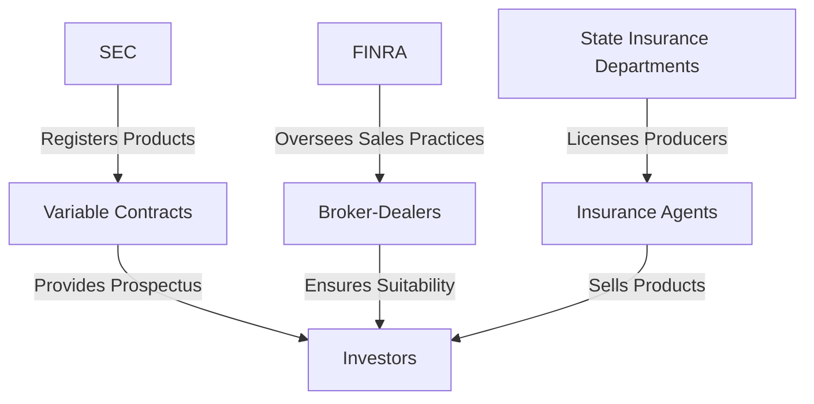

## 9.4 Regulation and Compliance

Regulation and compliance in the realm of variable contracts and insurance products are critical components of the securities industry, ensuring that financial professionals adhere to legal standards and ethical practices. This section provides a comprehensive overview of the regulatory oversight by the Securities and Exchange Commission (SEC), the Financial Industry Regulatory Authority (FINRA), and state insurance departments. Additionally, it covers the licensing requirements for selling variable contracts, offering practical insights and resources for aspiring securities representatives.

### Regulatory Oversight of Annuities and Insurance Products

The regulation of annuities and insurance products involves multiple layers of oversight to protect consumers and maintain the integrity of the financial markets. Understanding the roles of the SEC, FINRA, and state insurance departments is essential for compliance and successful practice in the securities industry.

#### Securities and Exchange Commission (SEC)

The SEC plays a pivotal role in regulating variable annuities and variable life insurance products. These products are considered securities because they involve investment risk, and their value is tied to the performance of underlying investments, such as mutual funds.

- **Prospectus Requirement:** The SEC mandates that issuers of variable contracts provide a prospectus to potential buyers, detailing the investment options, fees, risks, and other essential information. This ensures transparency and informed decision-making by consumers.

- **Registration of Products:** Variable contracts must be registered with the SEC, similar to mutual funds. This process involves filing a registration statement, which includes the prospectus and other financial disclosures.

- **Advertising Regulations:** The SEC sets strict guidelines for the advertising of variable contracts to prevent misleading claims. Advertisements must be clear, balanced, and not omit material facts.

#### Financial Industry Regulatory Authority (FINRA)

FINRA is a self-regulatory organization responsible for overseeing broker-dealers and their registered representatives. It enforces rules that govern the sale of variable contracts to ensure fair practices and protect investors.

- **Suitability Standards:** FINRA requires that registered representatives assess the suitability of variable contracts for each client, considering factors such as financial goals, risk tolerance, and investment horizon.

- **Supervision and Compliance:** Broker-dealers must establish supervisory systems to ensure compliance with FINRA rules. This includes regular training, audits, and monitoring of sales practices.

- **Continuing Education:** FINRA mandates continuing education for registered representatives to keep them informed of regulatory changes and industry developments.

#### State Insurance Departments

State insurance departments regulate the insurance aspects of variable contracts. Each state has its own insurance commissioner and regulatory framework, which can vary significantly.

- **Licensing and Examination:** Insurance producers must obtain a state license to sell variable contracts. This typically involves passing a state-specific exam and meeting continuing education requirements.

- **Consumer Protection:** State insurance departments handle consumer complaints and enforce regulations to protect policyholders from unfair practices.

- **Product Approval:** Insurance products, including variable contracts, must be approved by the state insurance department before they can be sold within the state.

### Licensing Requirements for Selling Variable Contracts

To sell variable contracts, securities professionals must meet specific licensing requirements that demonstrate their competence and understanding of these complex products.

#### Variable Contracts License

A Variable Contracts License is essential for selling variable annuities and variable life insurance. This license ensures that representatives have the necessary knowledge to advise clients on these products.

- **Prerequisite Exams:** Candidates must pass the Series 6 or Series 7 exam, which covers investment company products and variable contracts. The Series 7 exam is more comprehensive and includes a broader range of securities topics.

- **State Insurance License:** In addition to the securities license, representatives must obtain a state insurance license. This involves passing a state-specific exam that tests knowledge of insurance laws and regulations.

- **Continuing Education:** Both securities and insurance licenses require ongoing education to maintain. This ensures that representatives stay current with regulatory changes and industry best practices.

### Practical Examples and Case Studies

Understanding regulation and compliance is enhanced through practical examples and case studies that illustrate real-world applications.

#### Case Study: Misleading Advertising of Variable Annuities

In a notable case, a financial firm was fined by the SEC for misleading advertising of variable annuities. The firm had emphasized high returns without adequately disclosing the associated risks and fees. This case underscores the importance of adhering to SEC advertising regulations and ensuring that all promotional materials are accurate and balanced.

#### Example: Suitability Assessment for a Retiree

A registered representative is evaluating a variable annuity for a retiree client. The representative conducts a thorough suitability assessment, considering the client's need for income, risk tolerance, and investment horizon. By documenting the assessment process and discussing the product's features and risks with the client, the representative ensures compliance with FINRA's suitability standards.

### Real-World Applications and Regulatory Scenarios

The regulatory landscape for variable contracts is dynamic, with ongoing changes that impact compliance practices. Staying informed and adaptable is crucial for success in the securities industry.

#### Scenario: Navigating State and Federal Regulations

A broker-dealer operating in multiple states must navigate both state and federal regulations when selling variable contracts. This requires a robust compliance program that addresses the nuances of each state's requirements while adhering to SEC and FINRA rules. Regular training and audits help ensure that representatives understand the regulatory framework and can effectively serve clients across different jurisdictions.

#### Actionable Insights for Compliance

- **Develop a Comprehensive Compliance Program:** Establish a compliance program that includes regular training, audits, and monitoring of sales practices. This helps ensure adherence to regulatory standards and protects the firm from potential violations.

- **Stay Informed of Regulatory Changes:** Keep abreast of changes in SEC, FINRA, and state insurance regulations. This can be achieved through continuing education, industry publications, and participation in professional organizations.

- **Document Suitability Assessments:** Thoroughly document the suitability assessments for each client, including the rationale for recommending specific variable contracts. This documentation is crucial for demonstrating compliance with FINRA's suitability standards.

### Diagrams and Visual Aids

To enhance understanding, visual aids such as diagrams and charts can illustrate regulatory frameworks and compliance processes.

### Best Practices and Common Pitfalls

Adhering to best practices and avoiding common pitfalls are essential for maintaining compliance and fostering trust with clients.

#### Best Practices

- **Clear Communication:** Ensure that all communications with clients are clear, transparent, and free from misleading information. This includes advertising, prospectuses, and verbal discussions.

- **Regular Training:** Conduct regular training sessions for representatives to keep them informed of regulatory changes and compliance expectations.

- **Robust Supervision:** Implement a robust supervisory system to monitor sales practices and ensure adherence to regulatory standards.

#### Common Pitfalls

- **Inadequate Disclosure:** Failing to disclose material information, such as fees and risks, can lead to regulatory violations and damage client trust.

- **Poor Documentation:** Inadequate documentation of suitability assessments and client interactions can result in compliance issues and legal challenges.

- **Neglecting State Regulations:** Overlooking state-specific regulations can lead to fines and disciplinary actions. Ensure that compliance programs address both federal and state requirements.

### Resources for Regulatory Guidelines

For further exploration of regulatory guidelines, the following resources are recommended:

- **SEC Website:** Provides comprehensive information on securities regulations, including variable contracts. Visit [www.sec.gov](https://www.sec.gov).

- **FINRA Website:** Offers resources on compliance, continuing education, and suitability standards. Visit [www.finra.org](https://www.finra.org).

- **State Insurance Departments:** Each state's insurance department website provides information on licensing requirements, consumer protection, and regulatory updates.

### Encouragement and Exam Preparation

Preparing for the Series 7 exam requires a thorough understanding of regulation and compliance for variable contracts. By mastering these concepts, you will be well-equipped to navigate the regulatory landscape and serve your clients with integrity and professionalism.

- **Practice Questions:** Regularly test your knowledge with practice questions and quizzes to reinforce learning and identify areas for improvement.

- **Study Groups:** Join study groups or forums to discuss regulatory topics and share insights with peers.

- **Exam Strategies:** Develop effective exam strategies, such as time management and question analysis, to enhance your performance on test day.

### Summary

Regulation and compliance for variable contracts and insurance products are fundamental to the securities industry. By understanding the roles of the SEC, FINRA, and state insurance departments, and meeting licensing requirements, you can ensure compliance and build a successful career as a securities representative. Stay informed, adhere to best practices, and continually refine your knowledge to excel in the dynamic regulatory environment.

## Series 7 Exam Practice Questions: Regulation and Compliance



### Which organization is primarily responsible for the registration of variable annuities?

- [x] Securities and Exchange Commission (SEC)
- [ ] Financial Industry Regulatory Authority (FINRA)
- [ ] State Insurance Departments
- [ ] Federal Reserve Board

> **Explanation:** The SEC is responsible for the registration of variable annuities as they are considered securities.

### What is a key requirement for advertising variable contracts?

- [ ] Must include testimonials from satisfied clients
- [ ] Can highlight only the potential returns
- [x] Must be clear, balanced, and not misleading
- [ ] Should focus primarily on the benefits

> **Explanation:** Advertisements for variable contracts must be clear, balanced, and not misleading, ensuring that all material facts are disclosed.

### What is the role of FINRA in the regulation of variable contracts?

- [ ] Approves state insurance licenses
- [x] Oversees broker-dealers and ensures fair sales practices
- [ ] Registers variable annuities
- [ ] Sets federal tax policies

> **Explanation:** FINRA oversees broker-dealers and ensures that sales practices for variable contracts are fair and compliant with regulations.

### Which license is required to sell variable annuities?

- [ ] Series 3 License
- [x] Variable Contracts License
- [ ] Series 65 License
- [ ] Commodities License

> **Explanation:** A Variable Contracts License is required to sell variable annuities, along with a state insurance license.

### What is a common pitfall in the sale of variable contracts?

- [ ] Over-disclosure of risks
- [ ] Focusing on state regulations
- [ ] Providing too much documentation
- [x] Inadequate disclosure of fees and risks

> **Explanation:** Inadequate disclosure of fees and risks is a common pitfall that can lead to regulatory violations and damage client trust.

### What is the purpose of a prospectus in variable contracts?

- [ ] To serve as a marketing brochure
- [ ] To outline the company's history
- [x] To provide essential information about investment options, fees, and risks
- [ ] To offer tax advice

> **Explanation:** A prospectus provides essential information about investment options, fees, and risks, ensuring that investors make informed decisions.

### How does the SEC regulate advertising for variable contracts?

- [ ] By allowing only online advertisements
- [ ] By reviewing each advertisement before publication
- [ ] By setting guidelines to prevent misleading claims
- [x] By requiring state approval for all ads

> **Explanation:** The SEC sets guidelines to prevent misleading claims in advertisements for variable contracts, ensuring transparency and accuracy.

### What is a key component of a compliance program for variable contracts?

- [ ] Focus solely on state regulations
- [ ] Conduct annual audits only
- [x] Include regular training and monitoring of sales practices
- [ ] Rely on self-reporting by representatives

> **Explanation:** A comprehensive compliance program includes regular training and monitoring of sales practices to ensure adherence to regulatory standards.

### Which entity handles consumer complaints regarding variable contracts?

- [ ] Federal Reserve Board
- [ ] SEC
- [ ] FINRA
- [x] State Insurance Departments

> **Explanation:** State Insurance Departments handle consumer complaints related to variable contracts and enforce regulations to protect policyholders.

### What is the significance of a suitability assessment in selling variable contracts?

- [ ] It is optional for experienced clients
- [ ] It focuses only on the client's income
- [x] It ensures the product aligns with the client's financial goals and risk tolerance
- [ ] It is primarily for documentation purposes

> **Explanation:** A suitability assessment ensures that the variable contract aligns with the client's financial goals and risk tolerance, complying with FINRA standards.


