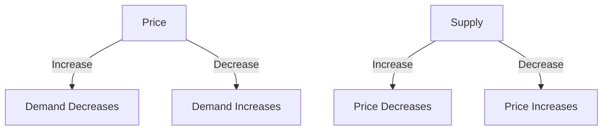

## 11.5 The Impact of Supply and Demand on Prices

In the world of investing, understanding the forces that drive the prices of securities is crucial. At the heart of this dynamic is the fundamental economic principle of supply and demand. This principle not only governs the prices of goods and services in everyday markets but also plays a pivotal role in financial markets. In this section, we will explore how supply and demand affect security prices, the factors influencing these forces, and how investors can leverage this knowledge to make informed decisions.

### Understanding Supply and Demand

**Supply and Demand** is a core concept in economics that describes the relationship between the availability of a product (supply) and the desire for that product (demand). The interaction of supply and demand determines the market price and quantity of goods sold.

#### The Law of Demand

The law of demand states that, all else being equal, as the price of a product decreases, the quantity demanded increases, and vice versa. This inverse relationship is due to the substitution effect (consumers switch to cheaper alternatives) and the income effect (a lower price increases consumers' purchasing power).

#### The Law of Supply

Conversely, the law of supply suggests that as the price of a product increases, the quantity supplied also increases. Producers are more willing to sell more of a product at higher prices because they can achieve greater profit margins.

#### Equilibrium Price

The equilibrium price is the point at which the quantity demanded equals the quantity supplied. At this price, the market is in balance, and there is neither a surplus nor a shortage of the product.

### Supply and Demand in Financial Markets

In financial markets, the principles of supply and demand apply to securities such as stocks, bonds, and commodities. The price of a security is determined by the interaction between buyers (demand) and sellers (supply).

#### Demand for Securities

Demand for securities can be influenced by various factors, including:

- **Economic Data:** Positive economic indicators, such as GDP growth or low unemployment rates, can increase demand for securities as investors anticipate higher corporate profits.
- **Company News:** Announcements of strong earnings, new product launches, or strategic partnerships can boost demand for a company's stock.
- **Investor Sentiment:** Market sentiment, often driven by psychological factors and media coverage, can significantly influence demand. Bullish sentiment can lead to increased buying activity, driving prices up.

#### Supply of Securities

The supply of securities is affected by:

- **New Issuances:** Companies issuing new shares or bonds increase the supply of securities in the market.
- **Insider Selling:** When company insiders sell their shares, it can increase supply and potentially depress prices.
- **Economic Conditions:** In times of economic uncertainty, investors may sell off securities, increasing supply.

### How Supply and Demand Affect Security Prices

The interaction between supply and demand determines the price of securities. Let's explore how changes in these forces impact prices:

#### Increased Demand

When demand for a security increases while supply remains constant, prices tend to rise. This scenario often occurs when positive news or economic data boosts investor confidence. For example, if a company reports better-than-expected earnings, more investors may want to buy its stock, driving the price up.

#### Increased Supply

Conversely, when the supply of a security increases while demand remains constant, prices tend to fall. This can happen when a company issues additional shares or when insiders sell significant portions of their holdings. An increase in supply without a corresponding increase in demand leads to downward pressure on prices.

#### Shifts in Supply and Demand

Prices can also be affected by shifts in supply and demand curves. For instance, if a new technology emerges that reduces production costs, the supply curve may shift to the right, leading to lower prices. Similarly, if consumer preferences change in favor of a particular security, the demand curve may shift to the right, resulting in higher prices.

### Factors Influencing Supply and Demand

Several factors can influence supply and demand in financial markets:

#### Economic Indicators

Economic indicators such as interest rates, inflation, and employment data can impact supply and demand. For example, rising interest rates may reduce demand for stocks as borrowing costs increase, while low inflation may boost demand for bonds as real returns improve.

#### Market Sentiment

Investor sentiment, driven by emotions and perceptions, can lead to irrational market behavior. Fear and greed are powerful forces that can cause demand to fluctuate rapidly, leading to price volatility.

#### External Events

Geopolitical events, natural disasters, and regulatory changes can disrupt supply and demand dynamics. For instance, a geopolitical conflict may increase demand for safe-haven assets like gold, while regulatory changes may affect the supply of certain securities.

### Practical Examples and Case Studies

To illustrate the impact of supply and demand on prices, consider the following examples:

#### Example 1: Tech Boom

During the tech boom of the late 1990s, demand for technology stocks surged as investors anticipated rapid growth in the sector. The increased demand led to soaring stock prices, despite limited changes in supply. However, when the bubble burst, demand plummeted, and prices fell sharply.

#### Example 2: Oil Market

The oil market provides a clear example of supply and demand dynamics. When geopolitical tensions threaten oil supply, prices rise due to fears of shortages. Conversely, when new oil reserves are discovered, increasing supply, prices tend to fall.

### Visualizing Supply and Demand

To better understand the concept, let's visualize supply and demand using a basic graph:

This diagram illustrates the inverse relationship between price and demand, as well as the direct relationship between supply and price.

### Strategies for Investors

Investors can use their understanding of supply and demand to make informed decisions:

- **Monitor Economic Indicators:** Keep an eye on key economic data releases that can impact supply and demand dynamics.
- **Stay Informed:** Follow company news and market trends to anticipate changes in demand for specific securities.
- **Diversify:** Diversification can help mitigate the impact of supply and demand fluctuations on your portfolio.

### Conclusion

The principles of supply and demand are fundamental to understanding how security prices are determined in financial markets. By recognizing the factors that influence these forces, investors can better navigate market dynamics and make informed investment decisions. As you continue your investing journey, remember that supply and demand are ever-present forces that shape the financial landscape.

## Quiz Time!



### What is the law of demand?

- [x] As the price of a product decreases, the quantity demanded increases.
- [ ] As the price of a product increases, the quantity demanded increases.
- [ ] As the price of a product decreases, the quantity supplied increases.
- [ ] As the price of a product increases, the quantity supplied decreases.

> **Explanation:** The law of demand states that, all else being equal, as the price of a product decreases, the quantity demanded increases.

### What typically happens to prices when demand for a security increases while supply remains constant?

- [x] Prices tend to rise.
- [ ] Prices tend to fall.
- [ ] Prices remain constant.
- [ ] Prices become unpredictable.

> **Explanation:** When demand increases while supply remains constant, prices tend to rise due to higher competition for the same quantity of the security.

### Which of the following factors can influence the demand for securities?

- [x] Economic data
- [x] Company news
- [x] Investor sentiment
- [ ] Supply of securities

> **Explanation:** Economic data, company news, and investor sentiment can all influence the demand for securities.

### What is the equilibrium price?

- [x] The price at which the quantity demanded equals the quantity supplied.
- [ ] The price at which demand exceeds supply.
- [ ] The price at which supply exceeds demand.
- [ ] The price set by government regulation.

> **Explanation:** The equilibrium price is the point at which the quantity demanded equals the quantity supplied.

### How can geopolitical events affect supply and demand?

- [x] They can increase demand for safe-haven assets.
- [x] They can disrupt supply chains.
- [ ] They have no impact on supply and demand.
- [ ] They only affect demand, not supply.

> **Explanation:** Geopolitical events can increase demand for safe-haven assets and disrupt supply chains, affecting both supply and demand.

### What is the effect of increased supply on security prices, assuming demand remains constant?

- [x] Prices tend to fall.
- [ ] Prices tend to rise.
- [ ] Prices remain constant.
- [ ] Prices become unpredictable.

> **Explanation:** Increased supply with constant demand tends to lower prices due to excess availability.

### Which of the following is an example of a supply factor in financial markets?

- [x] New issuances of securities
- [ ] Positive economic data
- [ ] Investor sentiment
- [ ] Company earnings reports

> **Explanation:** New issuances of securities are a supply factor as they increase the availability of securities in the market.

### What does a shift to the right in the demand curve indicate?

- [x] An increase in demand
- [ ] A decrease in demand
- [ ] An increase in supply
- [ ] A decrease in supply

> **Explanation:** A shift to the right in the demand curve indicates an increase in demand.

### How does investor sentiment affect the market?

- [x] It can lead to irrational market behavior and price volatility.
- [ ] It has no impact on market prices.
- [ ] It only affects supply, not demand.
- [ ] It only affects demand, not supply.

> **Explanation:** Investor sentiment can lead to irrational market behavior and cause price volatility.

### True or False: The principles of supply and demand only apply to physical goods, not financial markets.

- [ ] True
- [x] False

> **Explanation:** The principles of supply and demand apply to both physical goods and financial markets, influencing prices in both areas.



By understanding and applying the principles of supply and demand, you can gain insights into market movements and make informed investment decisions. Keep exploring these concepts to enhance your investing skills and confidence.
