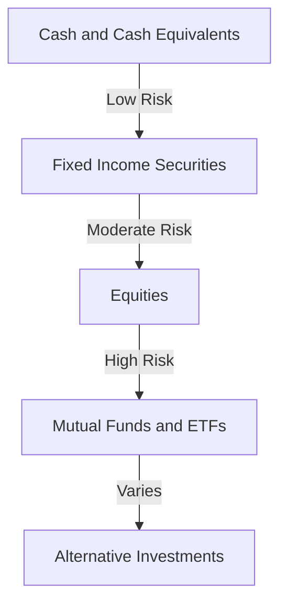

## 3.1 The Risk-Return Tradeoff

Investing is a journey filled with opportunities and challenges. At the heart of this journey lies a fundamental principle: the risk-return tradeoff. Understanding this concept is crucial for making informed investment decisions that align with your financial goals and risk tolerance. In this section, we will delve into the intricacies of the risk-return tradeoff, explore the risk-return spectrum, and provide practical insights to help you navigate the world of investing with confidence.

### The Core Principle: Higher Risk, Higher Return

The risk-return tradeoff is a foundational concept in investing, emphasizing that the potential for higher returns comes with an increased level of risk. This principle is based on the idea that investors who are willing to accept more risk should be compensated with the possibility of higher returns. Conversely, investments with lower risk typically offer lower potential returns.

#### Understanding Risk and Return

- **Risk** refers to the uncertainty associated with the potential outcomes of an investment. It encompasses the possibility of losing some or all of the invested capital.
- **Return** is the gain or loss generated by an investment over a specific period. It is often expressed as a percentage of the initial investment.

Investors must balance these two elements to achieve their financial objectives. The challenge lies in determining the level of risk they are comfortable with and the corresponding returns they expect.

### The Risk-Return Spectrum

The risk-return spectrum is a visual representation of the relationship between the risk of an investment and its expected return. It illustrates how different asset classes fall along this spectrum, helping investors understand the tradeoffs involved in their investment choices.

#### Asset Classes on the Spectrum

1. **Cash and Cash Equivalents**
   - **Risk Level:** Low
   - **Expected Return:** Low
   - **Examples:** Savings accounts, money market funds, Treasury bills
   - **Characteristics:** These investments are highly liquid and offer stability, making them suitable for risk-averse investors or as a short-term savings vehicle.

2. **Fixed Income Securities (Bonds)**
   - **Risk Level:** Moderate
   - **Expected Return:** Moderate
   - **Examples:** Government bonds, corporate bonds, municipal bonds
   - **Characteristics:** Bonds provide regular interest payments and are generally less volatile than stocks. However, they are subject to interest rate and credit risks.

3. **Equities (Stocks)**
   - **Risk Level:** High
   - **Expected Return:** High
   - **Examples:** Common stocks, preferred stocks
   - **Characteristics:** Stocks offer the potential for significant capital appreciation but come with higher volatility and risk of loss.

4. **Mutual Funds and Exchange-Traded Funds (ETFs)**
   - **Risk Level:** Varies
   - **Expected Return:** Varies
   - **Examples:** Index funds, sector-specific funds
   - **Characteristics:** These funds pool money from multiple investors to invest in a diversified portfolio. The risk and return depend on the underlying assets.

5. **Alternative Investments**
   - **Risk Level:** High
   - **Expected Return:** High
   - **Examples:** Real estate, commodities, hedge funds, cryptocurrencies
   - **Characteristics:** These investments often have low correlation with traditional asset classes, providing diversification benefits but also higher risk.

### Assessing Your Risk Tolerance

Understanding your risk tolerance is a critical step in building an investment portfolio. Risk tolerance refers to your ability and willingness to endure market volatility and potential losses. It is influenced by several factors, including:

- **Investment Goals:** Long-term goals may allow for higher risk, while short-term goals may require more conservative investments.
- **Time Horizon:** A longer time horizon can accommodate more risk, as there is time to recover from market downturns.
- **Financial Situation:** Your income, savings, and financial obligations can impact your capacity to take on risk.
- **Emotional Comfort:** Your psychological ability to handle market fluctuations without making impulsive decisions.

### Practical Example: Balancing Risk and Return

Consider two investors, Alex and Jamie, who are building their investment portfolios.

- **Alex** is a young professional with a long-term investment horizon and a high risk tolerance. They choose to allocate 70% of their portfolio to stocks, 20% to bonds, and 10% to alternative investments. Alex is comfortable with the volatility of stocks, aiming for higher returns over time.

- **Jamie** is nearing retirement and has a low risk tolerance. They allocate 20% of their portfolio to stocks, 50% to bonds, and 30% to cash equivalents. Jamie prioritizes capital preservation and stable income, accepting lower potential returns.

These examples highlight the importance of aligning your investment strategy with your risk tolerance and financial goals.

### Real-World Applications and Regulatory Considerations

In the U.S. securities industry, understanding the risk-return tradeoff is essential for compliance and investor protection. The Securities and Exchange Commission (SEC) provides educational resources to help investors make informed decisions. Additionally, investment risk charts from Morningstar offer valuable insights into the historical performance and risk levels of various asset classes.

### Best Practices for Managing the Risk-Return Tradeoff

1. **Diversification:** Spread your investments across different asset classes to reduce risk and enhance potential returns.
2. **Regular Review:** Periodically assess your portfolio to ensure it aligns with your risk tolerance and financial goals.
3. **Stay Informed:** Keep up with market trends and economic developments that may impact your investments.
4. **Seek Professional Advice:** Consider consulting a financial advisor to tailor an investment strategy that suits your needs.

### Common Pitfalls and Strategies to Overcome Them

- **Chasing High Returns:** Avoid the temptation to invest solely in high-risk assets for the sake of higher returns. Balance your portfolio to manage risk effectively.
- **Ignoring Risk Tolerance:** Be honest about your comfort level with risk and adjust your investments accordingly.
- **Overreacting to Market Volatility:** Maintain a long-term perspective and avoid making impulsive decisions based on short-term market movements.

### Summary

The risk-return tradeoff is a cornerstone of investing, guiding investors in balancing potential gains with the level of risk they are willing to accept. By understanding the risk-return spectrum, assessing your risk tolerance, and implementing best practices, you can build a portfolio that aligns with your financial goals and provides a path to long-term success.

For further exploration, consider reviewing educational articles from the SEC and investment risk charts from Morningstar to deepen your understanding of the risk-return tradeoff.

## Quiz Time!



### What is the primary principle of the risk-return tradeoff?

- [x] Higher potential returns come with higher risk.
- [ ] Lower potential returns come with higher risk.
- [ ] There is no relationship between risk and return.
- [ ] Risk and return are inversely related.

> **Explanation:** The risk-return tradeoff principle states that higher potential returns are associated with higher risk.

### Which asset class is typically considered low risk and low return?

- [x] Cash and Cash Equivalents
- [ ] Equities
- [ ] Alternative Investments
- [ ] Mutual Funds

> **Explanation:** Cash and cash equivalents, such as savings accounts and Treasury bills, are considered low risk and low return investments.

### What factor does not influence an individual's risk tolerance?

- [ ] Time Horizon
- [ ] Financial Situation
- [ ] Emotional Comfort
- [x] Investment Type

> **Explanation:** Investment type does not influence risk tolerance; instead, risk tolerance affects the choice of investment type.

### Which of the following is a high-risk, high-return asset class?

- [ ] Bonds
- [ ] Cash Equivalents
- [x] Equities
- [ ] Money Market Funds

> **Explanation:** Equities (stocks) are considered high-risk, high-return investments due to their potential for significant capital appreciation.

### What is the purpose of diversification in a portfolio?

- [x] To reduce risk by spreading investments across asset classes
- [ ] To increase risk by concentrating investments in one asset class
- [ ] To maximize returns by investing in high-risk assets only
- [ ] To eliminate all investment risk

> **Explanation:** Diversification aims to reduce risk by spreading investments across different asset classes, balancing potential returns.

### Which regulatory body provides educational resources on investing?

- [x] Securities and Exchange Commission (SEC)
- [ ] Federal Reserve
- [ ] Internal Revenue Service (IRS)
- [ ] Financial Industry Regulatory Authority (FINRA)

> **Explanation:** The SEC provides educational resources to help investors make informed decisions.

### What is a key strategy for managing the risk-return tradeoff?

- [x] Regularly reviewing and adjusting your portfolio
- [ ] Investing only in high-risk, high-return assets
- [ ] Ignoring market trends
- [ ] Avoiding professional financial advice

> **Explanation:** Regularly reviewing and adjusting your portfolio ensures it aligns with your risk tolerance and financial goals.

### What is the relationship between risk and return on the risk-return spectrum?

- [x] Direct relationship
- [ ] Inverse relationship
- [ ] No relationship
- [ ] Random relationship

> **Explanation:** On the risk-return spectrum, there is a direct relationship where higher risk is associated with higher potential returns.

### Which of the following is a common pitfall in managing the risk-return tradeoff?

- [x] Chasing high returns without considering risk
- [ ] Diversifying investments
- [ ] Seeking professional advice
- [ ] Staying informed about market trends

> **Explanation:** Chasing high returns without considering risk can lead to an unbalanced and risky portfolio.

### True or False: The risk-return tradeoff implies that all high-risk investments will yield high returns.

- [ ] True
- [x] False

> **Explanation:** False. While high-risk investments have the potential for high returns, there is no guarantee they will yield such returns.



By mastering the risk-return tradeoff, you are better equipped to make strategic investment decisions that align with your financial aspirations and risk tolerance. Continue to explore and apply these principles as you advance in your investing journey.
