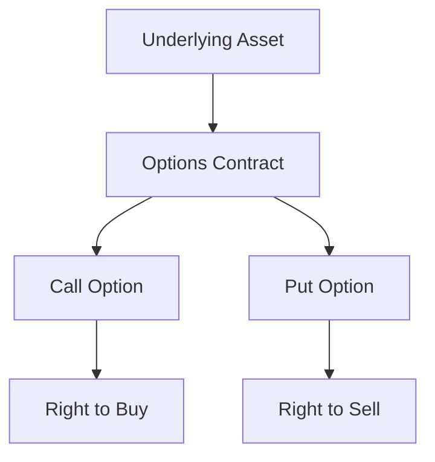

## 5.6 Understanding Derivatives: Options and Futures

As you embark on your journey to build a robust investment portfolio, understanding derivatives is crucial. Derivatives, including options and futures, are sophisticated financial instruments that derive their value from an underlying asset, such as stocks, bonds, commodities, or currencies. These instruments offer investors a variety of strategies for hedging risk and speculating on price movements. In this section, we'll delve into the mechanics of options and futures, their purposes, and how they fit into the broader investment landscape.

### What Are Derivatives?

Derivatives are contracts whose value is dependent on or derived from the performance of an underlying entity. This entity can be an asset, index, or interest rate. Derivatives are primarily used for hedging risk or for speculative purposes. They can be traded on exchanges or over-the-counter (OTC), and their complexity can range from simple to highly complex.

#### Key Characteristics of Derivatives

- **Leverage:** Derivatives allow investors to gain exposure to an asset without owning it outright, often using borrowed funds to amplify potential returns.
- **Hedging:** Investors use derivatives to protect against price fluctuations in an asset they own or plan to own.
- **Speculation:** Traders can use derivatives to bet on the future direction of market prices, potentially profiting from price movements.

### Options Contracts

Options are a type of derivative that give the holder the right, but not the obligation, to buy or sell an underlying asset at a predetermined price (strike price) before or at a specified expiration date. Options are versatile financial instruments used for hedging and speculative purposes.

#### Types of Options

- **Call Options:** Grant the holder the right to buy an asset at the strike price.
- **Put Options:** Grant the holder the right to sell an asset at the strike price.

#### Key Terms in Options

- **Option Premium:** The price paid by the buyer to the seller (writer) for the option. It represents the cost of acquiring the right to buy or sell the underlying asset.
- **Strike Price:** The price at which the option holder can buy (call) or sell (put) the underlying asset.
- **Expiration Date:** The date on which the option expires and becomes void.

#### Example of an Options Contract

Imagine you believe that the stock of XYZ Corporation, currently trading at $100, will rise in the next three months. You purchase a call option with a strike price of $105, expiring in three months, for a premium of $5 per share. If the stock price exceeds $105 before expiration, you can exercise the option to buy the stock at $105, potentially profiting from the difference minus the premium paid.

### Futures Contracts

Futures contracts are standardized agreements to buy or sell an asset at a predetermined price at a specified time in the future. Unlike options, futures contracts obligate both the buyer and the seller to fulfill the contract terms at expiration.

#### Characteristics of Futures

- **Standardization:** Futures contracts are standardized in terms of quantity, quality, and delivery time, facilitating trading on exchanges.
- **Margin Requirements:** Traders must deposit a margin, a fraction of the contract's value, to enter a futures position. This acts as a performance bond.
- **Mark-to-Market:** Futures positions are marked to market daily, meaning gains and losses are settled at the end of each trading day.

#### Example of a Futures Contract

Suppose you are a wheat farmer worried about a potential drop in wheat prices. You enter into a futures contract to sell 1,000 bushels of wheat at $5 per bushel, three months from now. If the market price falls to $4 per bushel at expiration, you still sell your wheat at the agreed $5 per bushel, thus hedging against the price decline.

### Hedging and Speculation

Derivatives serve two primary purposes: hedging and speculation. Understanding these concepts is essential for effectively using derivatives in your investment strategy.

#### Hedging

Hedging involves taking a position in a derivative to offset potential losses in an existing position. It is a risk management strategy used to protect against adverse price movements.

- **Example:** An airline company may use futures contracts to lock in fuel prices, protecting against future price increases.

#### Speculation

Speculation involves taking a position in a derivative to profit from expected price movements. Speculators assume the risk of price changes in the hope of making a profit.

- **Example:** A trader may buy call options on a stock they believe will rise, aiming to profit from the stock's price increase.

### Real-World Applications and Regulatory Considerations

Derivatives play a significant role in global financial markets, offering liquidity and price discovery. However, they also pose risks, which is why regulatory oversight is crucial.

#### Regulatory Bodies

In the U.S., the Commodity Futures Trading Commission (CFTC) regulates futures and options markets, ensuring transparency and protecting market participants from fraud and manipulation. The Securities and Exchange Commission (SEC) also plays a role in overseeing options markets.

#### Resources for Further Learning

- **Options Industry Council (OIC):** Offers educational resources for understanding options, including beginner guides and strategies.
- **CME Group:** Provides information on futures and options trading, market data, and educational materials.

### Practical Examples and Scenarios

To solidify your understanding of derivatives, consider these practical scenarios:

1. **Hedging with Options:** A portfolio manager holds a large position in a technology stock. To protect against a potential downturn, they purchase put options, allowing them to sell the stock at a predetermined price if the market declines.

2. **Speculating with Futures:** A commodities trader anticipates a rise in crude oil prices due to geopolitical tensions. They buy futures contracts, aiming to profit from the expected price increase.

### Diagrams and Visuals

To enhance your understanding, let's visualize the relationship between options and their underlying assets:

This diagram illustrates how options derive their value from an underlying asset, with call and put options providing rights to buy or sell, respectively.

### Best Practices and Common Pitfalls

When dealing with derivatives, keep these best practices in mind:

- **Understand the Product:** Before trading options or futures, ensure you understand the product's mechanics and risks.
- **Define Your Strategy:** Clearly define your objectives, whether hedging or speculating, and choose derivatives that align with your goals.
- **Monitor Positions:** Regularly monitor your positions and adjust your strategy as market conditions change.

Avoid common pitfalls such as:

- **Over-Leveraging:** Excessive use of leverage can lead to significant losses.
- **Ignoring Expiration Dates:** Be aware of expiration dates and the potential for options to expire worthless.

### Conclusion

Understanding derivatives, particularly options and futures, is essential for any investor looking to diversify their portfolio and manage risk effectively. These instruments offer powerful tools for hedging and speculation, but they require a solid understanding of their mechanics and risks. By leveraging educational resources and adhering to best practices, you can confidently incorporate derivatives into your investment strategy.

## Quiz Time!



### What is a derivative?

- [x] A financial instrument deriving its value from an underlying asset
- [ ] A type of stock
- [ ] A bond with a fixed interest rate
- [ ] A savings account

> **Explanation:** Derivatives are financial instruments whose value is dependent on the performance of an underlying asset, such as stocks or commodities.

### What does a call option grant the holder?

- [x] The right to buy an asset at a predetermined price
- [ ] The obligation to sell an asset
- [ ] The right to sell an asset at a predetermined price
- [ ] The obligation to buy an asset

> **Explanation:** A call option gives the holder the right, but not the obligation, to buy an underlying asset at a specified strike price.

### What is the primary purpose of hedging?

- [x] To offset potential losses in an existing position
- [ ] To maximize profits
- [ ] To speculate on price movements
- [ ] To increase leverage

> **Explanation:** Hedging involves using derivatives to protect against adverse price movements, thereby offsetting potential losses.

### What is a futures contract?

- [x] A standardized agreement to buy or sell an asset at a predetermined price in the future
- [ ] A type of bond with variable interest rates
- [ ] A savings account with fixed interest
- [ ] A stock option

> **Explanation:** Futures contracts are standardized agreements obligating the buyer and seller to transact an asset at a predetermined price at a future date.

### Which regulatory body oversees futures markets in the U.S.?

- [x] Commodity Futures Trading Commission (CFTC)
- [ ] Securities and Exchange Commission (SEC)
- [ ] Federal Reserve
- [ ] Financial Industry Regulatory Authority (FINRA)

> **Explanation:** The CFTC is responsible for regulating futures and options markets in the United States.

### What is the option premium?

- [x] The price paid for an options contract
- [ ] The strike price of an option
- [ ] The interest rate on a futures contract
- [ ] The expiration date of an option

> **Explanation:** The option premium is the cost paid by the buyer to acquire the rights conferred by the options contract.

### What does "mark-to-market" mean in futures trading?

- [x] Daily settlement of gains and losses
- [ ] The final settlement at contract expiration
- [ ] The initial margin requirement
- [ ] The option premium adjustment

> **Explanation:** Mark-to-market refers to the daily adjustment of futures contracts to reflect gains and losses based on market prices.

### What is the strike price?

- [x] The set price at which an option can be exercised
- [ ] The price of the underlying asset
- [ ] The option premium
- [ ] The expiration date

> **Explanation:** The strike price is the predetermined price at which the holder of an option can buy or sell the underlying asset.

### How can derivatives be used for speculation?

- [x] By betting on future price movements
- [ ] By locking in current prices
- [ ] By reducing leverage
- [ ] By minimizing transaction costs

> **Explanation:** Speculators use derivatives to profit from anticipated price movements in the market.

### True or False: Futures contracts obligate both parties to fulfill the contract terms at expiration.

- [x] True
- [ ] False

> **Explanation:** Futures contracts require both the buyer and seller to execute the transaction at the agreed-upon price and date.


