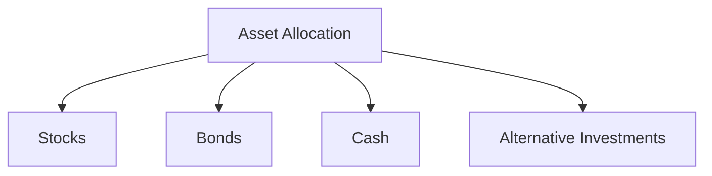
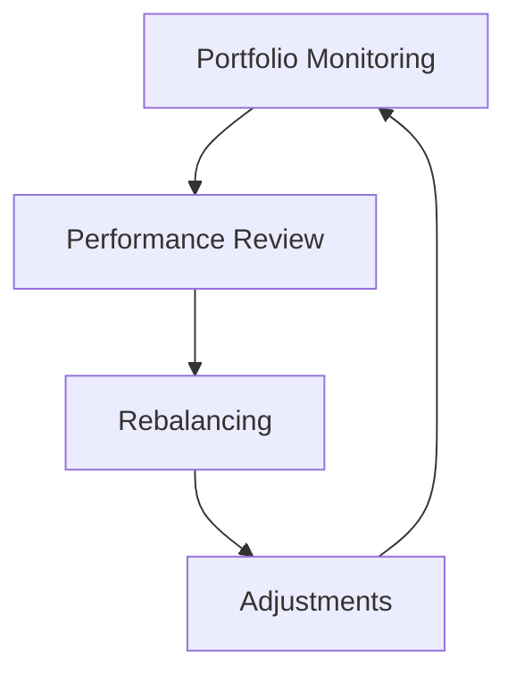

## 8.1 Steps to Building a Portfolio

Building an investment portfolio is a crucial step in achieving your financial goals. Whether you're saving for retirement, a child's education, or a major purchase, a well-constructed portfolio can help you reach your objectives. This section will guide you through the essential steps to building a portfolio, ensuring it aligns with your personal circumstances and financial goals.

### Step 1: Define Financial Goals and Time Horizons

The first step in building a portfolio is to clearly define your financial goals and the time horizons for achieving them. Your goals might include saving for retirement, buying a home, or funding your children's education. Each goal will have a different time horizon, which can be short-term (less than 3 years), medium-term (3-10 years), or long-term (more than 10 years).

#### Practical Example:

Consider a 30-year-old investor, Alex, who aims to retire at 65, buy a house in 5 years, and save for a child's college education starting in 18 years. Alex's portfolio should be diversified to address each of these goals with their respective time horizons.

#### Actionable Insight:

Create a list of your financial goals and assign a time horizon to each. This will help you determine the appropriate level of risk and asset allocation for each goal.

### Step 2: Assess Risk Tolerance

Risk tolerance is your ability and willingness to endure market fluctuations in pursuit of higher returns. It is influenced by factors such as age, income, financial goals, and investment experience. Understanding your risk tolerance is crucial for selecting investments that match your comfort level.

#### Case Study:

Emily, a 40-year-old professional, has a high risk tolerance due to her stable income and long-term investment horizon. She is comfortable with a portfolio that includes a significant portion of equities, which historically offer higher returns but come with greater volatility.

#### Regulatory Scenario:

FINRA Rule 2111 requires brokers to have a reasonable basis to believe that a recommended transaction or investment strategy is suitable for the customer, based on the customer's investment profile, including their risk tolerance.

#### Actionable Insight:

Use a risk tolerance questionnaire to evaluate your comfort with risk. Many financial planning resources, such as the Financial Planning Standards Board, offer templates to help you assess your risk tolerance.

### Step 3: Choose an Appropriate Asset Allocation

Asset allocation is the process of dividing your investment portfolio among different asset categories, such as stocks, bonds, and cash. The right asset allocation depends on your financial goals, risk tolerance, and investment horizon.

#### Diagram: Asset Allocation Strategy

#### Example:

A young investor with a high risk tolerance might allocate 70% to stocks, 20% to bonds, and 10% to cash. Conversely, a retiree may prefer a more conservative allocation, such as 40% stocks, 50% bonds, and 10% cash.

#### Actionable Insight:

Consider using a target-date fund, which automatically adjusts the asset allocation as you approach your goal date. This can simplify the process for novice investors.

### Step 4: Select Individual Investments or Funds

Once you have determined your asset allocation, the next step is to select specific investments. You can choose individual stocks and bonds or invest in mutual funds and exchange-traded funds (ETFs) that offer diversification.

#### Practical Example:

John, a new investor, decides to invest in a mix of index funds and ETFs to achieve broad market exposure while keeping costs low. He selects an S&P 500 index fund for equities and a total bond market ETF for fixed income.

#### Regulatory Consideration:

Ensure that any investment products you choose comply with U.S. securities regulations and are suitable for your investment profile. For instance, FINRA provides guidelines on the suitability of investment recommendations.

#### Actionable Insight:

Research and compare different investment products using online brokerage accounts and investment research platforms. Pay attention to fees, historical performance, and the fund manager's track record.

### Step 5: Implement the Investment Plan

With your asset allocation and investment selections in place, it's time to implement your plan. This involves purchasing the chosen investments through a brokerage account or financial advisor.

#### Case Study:

Sarah, after selecting her investments, sets up an automatic investment plan to contribute a fixed amount monthly. This approach, known as dollar-cost averaging, reduces the impact of market volatility by spreading purchases over time.

#### Actionable Insight:

Consider using a robo-advisor, which automates the investment process based on your risk tolerance and goals. Robo-advisors offer a cost-effective solution for managing a diversified portfolio.

### Step 6: Monitor and Adjust the Portfolio as Needed

Building a portfolio is not a one-time task. Regular monitoring and rebalancing are essential to ensure your portfolio remains aligned with your goals and risk tolerance. Rebalancing involves adjusting your portfolio's asset allocation back to its original state by buying or selling assets.

#### Diagram: Portfolio Management Process

#### Practical Example:

Every year, Mark reviews his portfolio and finds that his equity allocation has increased due to market gains. To maintain his desired risk level, he sells some stocks and buys bonds to rebalance his portfolio.

#### Actionable Insight:

Set a regular schedule for reviewing your portfolio, such as quarterly or annually. Use financial news and publications to stay informed about market developments that may impact your investments.

### Aligning the Portfolio with Personal Circumstances and Objectives

It's crucial to ensure that your portfolio reflects your personal circumstances and financial objectives. Life events, such as marriage, the birth of a child, or a job change, can significantly impact your financial situation and necessitate adjustments to your portfolio.

#### Example:

Lisa, after having her first child, decides to increase her allocation to more conservative investments to ensure stability and reduce risk.

#### Actionable Insight:

Revisit your financial goals and risk tolerance periodically, especially after major life changes, to ensure your portfolio remains aligned with your objectives.

### Glossary

- **Investment Plan:** A detailed strategy for allocating assets to meet specific financial goals.

### References

- Financial Planning Standards Board: [https://www.fpsb.org](https://www.fpsb.org)
- FINRA: [https://www.finra.org](https://www.finra.org)

---

## Quiz Time!



### What is the first step in building a portfolio?

- [x] Define financial goals and time horizons
- [ ] Assess risk tolerance
- [ ] Choose an appropriate asset allocation
- [ ] Select individual investments or funds

> **Explanation:** Defining financial goals and time horizons is crucial to understanding what you are investing for and how long you have to achieve these goals.

### What influences your risk tolerance?

- [x] Age
- [x] Income
- [x] Investment experience
- [ ] Asset allocation

> **Explanation:** Risk tolerance is influenced by factors such as age, income, and investment experience, which affect your ability and willingness to endure market fluctuations.

### What is asset allocation?

- [x] Dividing an investment portfolio among different asset categories
- [ ] Selecting individual stocks and bonds
- [ ] Monitoring and adjusting the portfolio
- [ ] Setting financial goals

> **Explanation:** Asset allocation involves dividing your investment portfolio among different asset categories to balance risk and return.

### What is the purpose of rebalancing a portfolio?

- [x] To maintain the desired asset allocation
- [ ] To maximize short-term gains
- [ ] To avoid paying taxes
- [ ] To increase risk

> **Explanation:** Rebalancing ensures that your portfolio maintains its desired asset allocation, which helps manage risk and aligns with your investment strategy.

### Which of the following is a benefit of using a robo-advisor?

- [x] Automates the investment process
- [x] Offers a cost-effective solution
- [ ] Provides personalized human advice
- [ ] Guarantees high returns

> **Explanation:** Robo-advisors automate the investment process based on your risk tolerance and goals, offering a cost-effective way to manage a diversified portfolio.

### What should you do after a major life change, like marriage or having a child?

- [x] Revisit your financial goals and risk tolerance
- [ ] Ignore your portfolio
- [ ] Increase risk without consideration
- [ ] Stop investing

> **Explanation:** Major life changes can impact your financial situation, so it's important to revisit your financial goals and risk tolerance to ensure your portfolio remains aligned with your objectives.

### What is dollar-cost averaging?

- [x] Investing a fixed amount regularly
- [ ] Investing a lump sum at once
- [ ] Selling investments frequently
- [ ] Avoiding market volatility

> **Explanation:** Dollar-cost averaging involves investing a fixed amount regularly, which helps reduce the impact of market volatility by spreading purchases over time.

### Which regulatory body provides guidelines on the suitability of investment recommendations?

- [x] FINRA
- [ ] SEC
- [ ] MSRB
- [ ] CFTC

> **Explanation:** FINRA provides guidelines to ensure that investment recommendations are suitable for the customer's investment profile, including their risk tolerance.

### What is a target-date fund?

- [x] A fund that automatically adjusts asset allocation as you approach your goal date
- [ ] A fund that targets high returns
- [ ] A fund that invests only in bonds
- [ ] A fund that invests only in stocks

> **Explanation:** A target-date fund automatically adjusts its asset allocation to become more conservative as you approach the target date, making it suitable for long-term goals.

### True or False: Monitoring your portfolio regularly is essential for successful investing.

- [x] True
- [ ] False

> **Explanation:** Regularly monitoring your portfolio is essential to ensure it remains aligned with your goals and risk tolerance, allowing for necessary adjustments.


