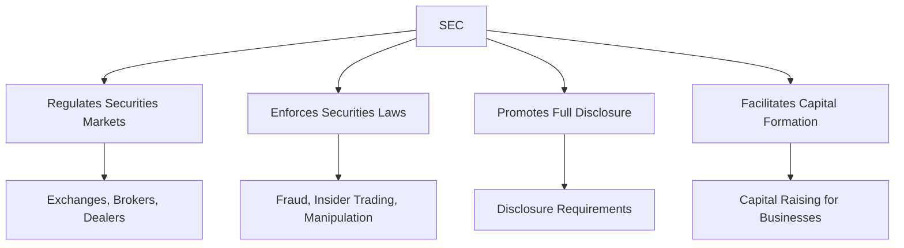

## 13.2.1 Securities and Exchange Commission (SEC)

The Securities and Exchange Commission (SEC) is a cornerstone of the U.S. financial regulatory framework, playing a crucial role in overseeing the securities markets and protecting investors. Established in response to the stock market crash of 1929 and the subsequent Great Depression, the SEC was created to restore investor confidence and ensure the integrity of the securities markets. This section will delve into the SEC's functions, enforcement actions, regulatory framework, and its significance in maintaining a fair and efficient market.

### The Role of the SEC in Securities Markets

The SEC's primary mission is to protect investors, maintain fair, orderly, and efficient markets, and facilitate capital formation. To achieve these objectives, the SEC engages in a variety of activities, including:

- **Regulating Securities Markets:** The SEC oversees securities exchanges, brokers, dealers, investment advisors, and mutual funds to ensure compliance with securities laws.
- **Enforcing Securities Laws:** The SEC investigates and prosecutes violations of securities laws, including fraud, insider trading, and market manipulation.
- **Promoting Full and Fair Disclosure:** The SEC requires public companies to disclose meaningful financial and other information to the public, enabling investors to make informed decisions.
- **Facilitating Capital Formation:** By ensuring that the securities markets operate fairly and efficiently, the SEC helps businesses raise capital to grow and innovate.

### SEC's Enforcement Actions Against Fraud and Market Manipulation

Enforcement is a critical component of the SEC's mission. The agency has the authority to bring civil enforcement actions against individuals and companies that violate securities laws. Some common types of enforcement actions include:

- **Fraudulent Schemes:** The SEC targets fraudulent schemes such as Ponzi schemes, pyramid schemes, and other scams designed to deceive investors.
- **Insider Trading:** The SEC prosecutes individuals who trade securities based on non-public, material information in violation of fiduciary duty or other relationships of trust and confidence.
- **Market Manipulation:** The SEC combats practices that artificially affect the supply or demand for securities, such as pump-and-dump schemes.
- **Financial Reporting Violations:** The SEC ensures that companies adhere to accurate and timely financial reporting standards, taking action against those that misrepresent financial information.

### How the SEC Regulates Disclosures, Financial Reporting, and Compliance

The SEC's regulatory framework is designed to ensure transparency and accountability in the securities markets. Key aspects of this framework include:

- **Disclosure Requirements:** Public companies must file regular reports with the SEC, including annual reports (Form 10-K), quarterly reports (Form 10-Q), and current reports (Form 8-K) to disclose significant events.
- **Financial Reporting Standards:** The SEC mandates that companies follow Generally Accepted Accounting Principles (GAAP) when preparing their financial statements, ensuring consistency and comparability.
- **Compliance Inspections:** The SEC conducts inspections and examinations of registered entities, such as broker-dealers and investment advisors, to assess compliance with securities laws and regulations.
- **Investor Education:** The SEC provides resources and tools to help investors understand financial markets and make informed investment decisions. The SEC's Office of Investor Education and Advocacy offers educational materials and outreach programs.

### Real-World Applications and Regulatory Scenarios

The SEC's actions have far-reaching implications for market participants. Consider the following scenarios:

- **Case Study: Enron Corporation:** The Enron scandal highlighted the importance of accurate financial reporting and the SEC's role in enforcing compliance. Enron's fraudulent accounting practices led to significant reforms, including the Sarbanes-Oxley Act of 2002, which enhanced corporate governance and financial disclosures.
- **Scenario: Insider Trading Investigation:** Imagine a scenario where a corporate executive learns about an upcoming merger and purchases stock in the company before the information is public. The SEC would investigate this potential insider trading violation, potentially leading to fines and penalties.
- **Example: Initial Public Offering (IPO) Compliance:** A company planning to go public must comply with SEC registration requirements, providing detailed information about its business, financial condition, and management. The SEC reviews the registration statement to ensure compliance with disclosure requirements.

### Practical Guidance for Compliance

Compliance with SEC regulations is essential for market participants. Here are some best practices:

- **Maintain Accurate Records:** Companies and individuals should keep detailed records of financial transactions and communications to ensure compliance with reporting requirements.
- **Implement Robust Internal Controls:** Establishing strong internal controls can help prevent and detect fraudulent activities and ensure accurate financial reporting.
- **Stay Informed About Regulatory Changes:** The SEC frequently updates its rules and regulations. Staying informed about these changes can help market participants remain compliant.
- **Seek Legal and Professional Advice:** Consulting with legal and financial professionals can provide valuable guidance on navigating complex regulatory requirements.

### Diagrams and Visuals

To better understand the SEC's regulatory framework and enforcement process, consider the following diagram:

### References and Additional Resources

For more information about the SEC and its role in the securities markets, visit the [SEC's official website](https://www.sec.gov). The website offers a wealth of resources, including investor education materials, regulatory updates, and enforcement actions.

### Summary

The SEC plays a vital role in maintaining the integrity of the U.S. securities markets. By regulating market participants, enforcing securities laws, and promoting transparency, the SEC helps protect investors and foster confidence in the financial system. Understanding the SEC's functions and compliance requirements is essential for anyone involved in the securities industry.

## Quiz Time!



### What is the primary mission of the SEC?

- [x] To protect investors, maintain fair, orderly, and efficient markets, and facilitate capital formation.
- [ ] To maximize corporate profits.
- [ ] To regulate international trade.
- [ ] To set interest rates.

> **Explanation:** The SEC's primary mission is to protect investors, maintain fair, orderly, and efficient markets, and facilitate capital formation.

### Which of the following is NOT an enforcement action taken by the SEC?

- [ ] Insider trading prosecution
- [ ] Fraudulent scheme investigation
- [ ] Market manipulation combat
- [x] Setting tax rates

> **Explanation:** The SEC does not set tax rates; it focuses on enforcing securities laws, including actions against insider trading, fraud, and market manipulation.

### What is a key aspect of the SEC's regulatory framework?

- [x] Disclosure requirements for public companies
- [ ] Setting minimum wage levels
- [ ] Regulating international shipping
- [ ] Managing social security benefits

> **Explanation:** A key aspect of the SEC's regulatory framework is the disclosure requirements for public companies, ensuring transparency and informed decision-making.

### How does the SEC promote full and fair disclosure?

- [x] By requiring public companies to file regular reports
- [ ] By providing tax incentives
- [ ] By setting interest rates
- [ ] By managing retirement accounts

> **Explanation:** The SEC promotes full and fair disclosure by requiring public companies to file regular reports, such as Form 10-K and Form 10-Q.

### What is an example of a financial reporting violation?

- [x] Misrepresenting financial information
- [ ] Offering a new product line
- [ ] Hiring a new CEO
- [ ] Expanding into a new market

> **Explanation:** Misrepresenting financial information is a financial reporting violation that the SEC may investigate and prosecute.

### What is the significance of the Enron scandal in relation to the SEC?

- [x] It led to significant reforms, including the Sarbanes-Oxley Act.
- [ ] It resulted in the SEC being disbanded.
- [ ] It caused the SEC to increase tax rates.
- [ ] It led to the SEC regulating international trade.

> **Explanation:** The Enron scandal led to significant reforms, including the Sarbanes-Oxley Act, which enhanced corporate governance and financial disclosures.

### What should companies do to ensure compliance with SEC regulations?

- [x] Maintain accurate records and implement robust internal controls
- [ ] Focus solely on maximizing profits
- [ ] Ignore regulatory changes
- [ ] Avoid seeking legal advice

> **Explanation:** Companies should maintain accurate records and implement robust internal controls to ensure compliance with SEC regulations.

### What is a common type of fraudulent scheme the SEC targets?

- [x] Ponzi schemes
- [ ] Legitimate business expansions
- [ ] New product launches
- [ ] Corporate mergers

> **Explanation:** The SEC targets fraudulent schemes such as Ponzi schemes, which are designed to deceive investors.

### How does the SEC facilitate capital formation?

- [x] By ensuring fair and efficient market operations
- [ ] By setting interest rates
- [ ] By providing direct loans to companies
- [ ] By managing social security benefits

> **Explanation:** The SEC facilitates capital formation by ensuring that the securities markets operate fairly and efficiently.

### True or False: The SEC sets tax rates for securities transactions.

- [ ] True
- [x] False

> **Explanation:** False. The SEC does not set tax rates; it regulates securities markets and enforces securities laws.


