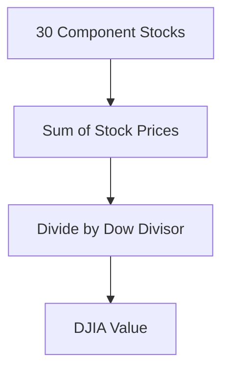

## 16.1.1 Dow Jones Industrial Average (DJIA)

The Dow Jones Industrial Average (DJIA) stands as one of the most iconic and enduring symbols of the financial markets. As a cornerstone of stock market indices, it provides investors with a snapshot of the economic health of the United States. This section will delve into the history, composition, and significance of the DJIA, offering insights into its role in the world of investing.

### History and Overview

The DJIA was created in 1896 by Charles Dow and Edward Jones, founders of Dow Jones & Company. Initially, it comprised 12 companies, predominantly from the industrial sector, reflecting the economic landscape of the time. Today, it is one of the oldest and most widely recognized stock market indices globally, serving as a barometer for the overall health of the U.S. stock market and economy.

#### The Evolution of the DJIA

The DJIA has evolved significantly since its inception. Originally, the index included companies like American Cotton Oil and U.S. Rubber, which were pivotal during the industrial revolution. Over the years, the index has expanded to include 30 large, publicly owned blue-chip companies, representing a broad spectrum of industries beyond just manufacturing.

The DJIA's longevity and adaptability have cemented its status as a vital tool for investors and economists alike, providing insights into market trends and economic shifts.

### Composition

The DJIA is composed of 30 major companies that are leaders in their respective industries. These companies are selected by the editors of The Wall Street Journal, a practice that underscores the index's qualitative approach to representation. The selection process considers factors such as company reputation, sustained growth, and interest to investors.

#### Current Components

The DJIA includes a diverse array of companies, such as:

- **Apple Inc.** - A leader in technology and consumer electronics.
- **The Walt Disney Company** - A giant in entertainment and media.
- **Goldman Sachs** - A key player in financial services.

These companies are not only prominent in their sectors but also influential in shaping the economic landscape.

### Weighting Method

The DJIA is a **price-weighted index**, which means that stocks with higher prices have a greater influence on the index's movement. This methodology contrasts with market capitalization-weighted indices, where a company's market value determines its impact.

#### Calculating the DJIA

The calculation of the DJIA involves adding the prices of the 30 component stocks and dividing by the **Dow Divisor**. The Dow Divisor is a factor that adjusts for stock splits, dividends, and other structural changes to maintain continuity in the index's value.

This approach allows the DJIA to reflect price movements accurately, although it has been critiqued for potentially skewing the index based on the price of individual stocks rather than their overall market value.

### Significance and Criticism

The DJIA is a key indicator of market sentiment and economic health. Its movements are closely watched by investors, policymakers, and analysts worldwide. However, the index is not without its criticisms.

#### Significance

- **Market Sentiment:** The DJIA is often used as a proxy for investor confidence. A rising DJIA suggests optimism, while a declining index may indicate caution or pessimism.
- **Economic Indicator:** The DJIA's performance can provide insights into broader economic trends, influencing decisions in both the public and private sectors.

#### Criticism

- **Limited Scope:** With only 30 stocks, the DJIA may not fully capture the diversity of the U.S. stock market.
- **Price-Weighted Methodology:** Critics argue that the price-weighted approach can lead to disproportionate impacts from high-priced stocks, potentially skewing the index's representation of market performance.

Despite these criticisms, the DJIA remains a vital tool for understanding market dynamics.

### Glossary

- **Price-Weighted Index:** An index where each stock influences the index in proportion to its price per share.
- **Dow Divisor:** A factor used to maintain the continuity of the DJIA when component companies undergo events like stock splits.

### References

- **S&P Dow Jones Indices - DJIA Overview:** [www.spglobal.com/spdji](https://www.spglobal.com/spdji/en/indices/equity/dow-jones-industrial-average/)
- **Investopedia - Dow Jones Industrial Average:** [www.investopedia.com](https://www.investopedia.com/terms/d/djia.asp)

Understanding the DJIA is crucial for any investor looking to navigate the complexities of the stock market. By grasping its history, composition, and significance, you can better appreciate its role in the financial world and leverage its insights for informed investment decisions.

## Quiz Time!



### What is the primary purpose of the Dow Jones Industrial Average (DJIA)?

- [x] To serve as a barometer for the overall health of the U.S. stock market and economy.
- [ ] To track the performance of all U.S. publicly traded companies.
- [ ] To measure the economic output of industrial sectors only.
- [ ] To provide investment advice to individual investors.

> **Explanation:** The DJIA is designed to reflect the overall health of the U.S. stock market and economy, not to track every publicly traded company or provide investment advice.

### How many companies currently comprise the DJIA?

- [x] 30
- [ ] 12
- [ ] 50
- [ ] 100

> **Explanation:** The DJIA is composed of 30 large, publicly owned blue-chip companies.

### What type of index is the DJIA?

- [x] Price-weighted index
- [ ] Market capitalization-weighted index
- [ ] Equal-weighted index
- [ ] Revenue-weighted index

> **Explanation:** The DJIA is a price-weighted index, meaning stocks with higher prices have a greater impact on the index's movement.

### What is the Dow Divisor used for?

- [x] To maintain continuity of the DJIA when component companies undergo events like stock splits.
- [ ] To calculate the market capitalization of companies in the DJIA.
- [ ] To determine the dividend yield of the DJIA.
- [ ] To adjust the index for inflation.

> **Explanation:** The Dow Divisor is used to adjust the DJIA for structural changes like stock splits, ensuring continuity in the index's value.

### Which of the following companies is a component of the DJIA?

- [x] Apple Inc.
- [ ] Tesla Inc.
- [ ] Amazon.com Inc.
- [ ] Alphabet Inc.

> **Explanation:** Apple Inc. is a component of the DJIA, while Tesla, Amazon, and Alphabet are not.

### Why is the DJIA sometimes criticized?

- [x] For its limited number of stocks and price-weighted methodology.
- [ ] For including too many small-cap companies.
- [ ] For being a global index rather than a U.S.-focused index.
- [ ] For being too volatile.

> **Explanation:** The DJIA is criticized for its limited number of stocks and the price-weighted methodology, which may not accurately reflect the market's overall performance.

### What does a rising DJIA typically indicate?

- [x] Optimism in the market
- [ ] A recession
- [ ] A decrease in investor confidence
- [ ] A bear market

> **Explanation:** A rising DJIA typically indicates optimism and confidence in the market.

### How are companies selected for inclusion in the DJIA?

- [x] By the editors of The Wall Street Journal
- [ ] By the U.S. Securities and Exchange Commission (SEC)
- [ ] By a public vote
- [ ] By the companies themselves

> **Explanation:** Companies are selected for inclusion in the DJIA by the editors of The Wall Street Journal.

### What is a key characteristic of the companies included in the DJIA?

- [x] They are leaders in their respective industries.
- [ ] They are all technology companies.
- [ ] They are all based outside the United States.
- [ ] They are all new startups.

> **Explanation:** Companies in the DJIA are leaders in their respective industries, not limited to any specific sector or location.

### True or False: The DJIA is the only index that tracks the U.S. stock market.

- [ ] True
- [x] False

> **Explanation:** False. The DJIA is one of several indices that track the U.S. stock market, alongside others like the S&P 500 and NASDAQ Composite.


