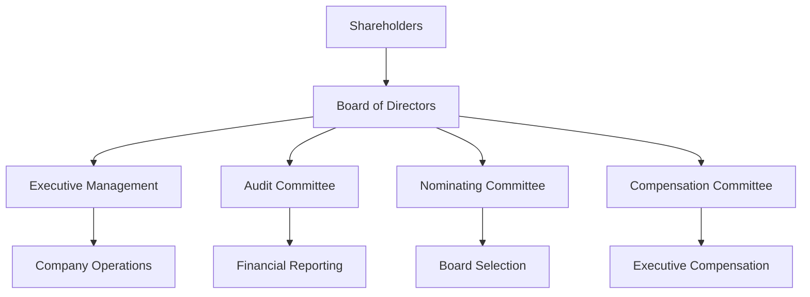

## 19.1.3 Governance Criteria

In the realm of sustainable and ethical investing, governance criteria play a pivotal role in assessing a company's commitment to ethical practices and long-term sustainability. Governance, the "G" in ESG (Environmental, Social, and Governance), encompasses the systems, principles, and processes by which companies are directed and controlled. This section delves into the critical aspects of governance criteria, including board composition, executive compensation, shareholder rights, transparency, and ethical conduct. Understanding these elements is essential for investors who aim to build portfolios that not only yield financial returns but also adhere to ethical standards.

### Areas of Focus in Governance Criteria

#### Board Composition

The composition of a company's board of directors is fundamental to its governance framework. A well-structured board is characterized by diversity, independence, and competence. 

- **Diversity:** A diverse board includes members with varied backgrounds, experiences, and perspectives, which can enhance decision-making and innovation. Diversity extends beyond gender and ethnicity to include age, professional experience, and cultural background.
  
- **Independence:** Independent directors are those who do not have any significant relationship with the company that could influence their judgment. The presence of independent directors helps ensure that the board acts in the best interests of shareholders rather than management.

- **Competence:** Board members should possess the necessary skills and expertise to effectively oversee the company's strategy and operations. This includes financial acumen, industry knowledge, and leadership experience.

#### Executive Compensation

Executive compensation is another critical element of governance, as it aligns the interests of management with those of shareholders. 

- **Performance-Based Incentives:** Compensation packages should be structured to reward executives for achieving long-term strategic goals rather than short-term financial performance. This can include stock options, bonuses tied to key performance indicators (KPIs), and long-term incentive plans.

- **Transparency:** Companies should clearly disclose their executive compensation policies and practices, enabling shareholders to assess whether they are fair and aligned with the company's performance.

#### Shareholder Rights

Protecting shareholder rights is central to good governance. Shareholders should have the ability to influence corporate decisions through mechanisms such as proxy voting and shareholder meetings.

- **Proxy Voting:** Shareholders often vote on corporate matters through proxies, allowing them to express their views on issues such as board elections, mergers, and executive compensation. Proxy voting is a powerful tool for holding management accountable.

- **Shareholder Engagement:** Companies should actively engage with shareholders, providing them with timely and relevant information and opportunities to voice their concerns and suggestions.

#### Transparency and Ethical Conduct

Transparency and ethical conduct are foundational to trust and integrity in corporate governance.

- **Disclosure Practices:** Companies should maintain high standards of transparency by providing accurate and timely information about their financial performance, governance practices, and ESG initiatives.

- **Ethical Conduct:** A strong ethical framework is essential for preventing conflicts of interest and corruption. Companies should establish codes of conduct and ethics policies that outline expected behaviors and provide mechanisms for reporting and addressing unethical practices.

### Best Practices in Governance

#### Independent and Diverse Boards

- **Board Independence:** Ensure that a significant portion of the board consists of independent directors. This independence is crucial for unbiased oversight and decision-making.

- **Diversity Initiatives:** Implement policies and practices that promote diversity in board recruitment and selection. Diverse boards are better equipped to understand and address the needs of a diverse stakeholder base.

#### Policies Preventing Conflicts of Interest and Corruption

- **Conflict of Interest Policies:** Establish clear policies to identify and manage conflicts of interest among board members and executives. This includes regular disclosure of any potential conflicts and recusal from decision-making where conflicts exist.

- **Anti-Corruption Measures:** Develop and enforce anti-corruption policies that comply with international standards, such as the OECD Anti-Bribery Convention. Training programs and whistleblower protections can further strengthen these measures.

### Real-World Applications and Case Studies

#### Case Study: The Impact of Board Diversity on Corporate Performance

A study conducted by McKinsey & Company found that companies with diverse boards are more likely to outperform their peers financially. For example, a leading global technology firm implemented a diversity initiative that resulted in a 30% increase in female board representation. This shift led to more innovative product development and enhanced customer satisfaction, ultimately boosting the company's market share.

#### Scenario: Shareholder Activism and Proxy Voting

In recent years, shareholder activism has gained momentum, with investors using proxy voting to push for changes in corporate governance. A notable example is the campaign led by a prominent investment firm to improve the environmental and social practices of a major oil company. Through coordinated proxy voting, shareholders successfully elected new board members committed to sustainability, leading to significant changes in the company's strategy and operations.

### Governance Criteria in the Context of U.S. Securities Regulations

In the United States, corporate governance is shaped by a combination of federal laws, state laws, and stock exchange listing requirements. Key regulatory frameworks include:

- **Securities Exchange Act of 1934:** This act established the Securities and Exchange Commission (SEC), which oversees corporate governance practices, including disclosure requirements and proxy voting rules.

- **Sarbanes-Oxley Act of 2002:** Enacted in response to corporate scandals, this act introduced stringent reforms to improve financial disclosures and prevent accounting fraud. It mandates the independence of audit committees and imposes penalties for corporate misconduct.

- **Dodd-Frank Wall Street Reform and Consumer Protection Act:** This act includes provisions to enhance corporate governance, such as requiring shareholder advisory votes on executive compensation (say-on-pay) and mandating disclosure of CEO pay ratios.

### Diagrams and Visual Aids

To better understand the relationships between governance components, consider the following diagram illustrating the structure of a typical corporate governance framework:

### Best Practices, Challenges, and Strategies

#### Best Practices

- **Regular Board Evaluations:** Conduct regular evaluations of board performance to identify areas for improvement and ensure alignment with the company's strategic goals.

- **Stakeholder Engagement:** Develop robust stakeholder engagement strategies to understand and address the concerns of investors, employees, customers, and other stakeholders.

#### Common Challenges

- **Resistance to Change:** Implementing governance reforms can face resistance from entrenched interests within the company. Overcoming this requires strong leadership and clear communication of the benefits of change.

- **Balancing Short-Term and Long-Term Goals:** Companies often struggle to balance short-term financial performance with long-term sustainability goals. Governance structures should support strategic planning that considers both.

#### Strategies to Overcome Challenges

- **Leadership Development:** Invest in leadership development programs to cultivate a pipeline of future board members and executives who are committed to ethical governance.

- **Continuous Improvement:** Foster a culture of continuous improvement by regularly reviewing and updating governance policies and practices in response to changing regulatory and market conditions.

### References and Further Reading

- **OECD Principles of Corporate Governance:** These principles provide a comprehensive framework for evaluating and improving corporate governance practices. [OECD Principles](https://www.oecd.org/corporate/principles-corporate-governance.htm)

- **Corporate Governance Codes:** National guidelines and standards that outline best practices for corporate governance. These codes vary by country but generally emphasize transparency, accountability, and stakeholder engagement.

### Conclusion

Governance criteria are a cornerstone of ESG investing, providing a framework for evaluating a company's commitment to ethical practices and sustainable growth. By focusing on board composition, executive compensation, shareholder rights, transparency, and ethical conduct, investors can build portfolios that align with their values and contribute to positive societal outcomes. As you prepare for your US Securities Exams, understanding these governance principles will equip you with the knowledge to make informed investment decisions and advocate for responsible corporate practices.

## Quiz Time!



### Which of the following is NOT a focus area in governance criteria?

- [ ] Board composition
- [ ] Executive compensation
- [ ] Shareholder rights
- [x] Environmental impact

> **Explanation:** Environmental impact is part of the "E" in ESG, not governance criteria.

### What is the primary benefit of having independent directors on a board?

- [x] Unbiased oversight and decision-making
- [ ] Increased company profits
- [ ] Reduced operational costs
- [ ] Enhanced marketing strategies

> **Explanation:** Independent directors provide unbiased oversight, ensuring decisions are made in the best interest of shareholders.

### How does executive compensation align management interests with those of shareholders?

- [x] Through performance-based incentives
- [ ] By increasing fixed salaries
- [ ] By offering company cars
- [ ] By providing free stock options

> **Explanation:** Performance-based incentives align management interests with long-term strategic goals of the company.

### What is proxy voting?

- [x] Shareholders voting on corporate matters through representatives
- [ ] Executives voting on behalf of shareholders
- [ ] Board members voting on executive compensation
- [ ] Employees voting on company policies

> **Explanation:** Proxy voting allows shareholders to vote on corporate matters, often through representatives.

### Which act established the SEC?

- [x] Securities Exchange Act of 1934
- [ ] Sarbanes-Oxley Act of 2002
- [ ] Dodd-Frank Act
- [ ] Glass-Steagall Act

> **Explanation:** The Securities Exchange Act of 1934 established the Securities and Exchange Commission (SEC).

### What is a common challenge in implementing governance reforms?

- [x] Resistance to change
- [ ] Lack of financial resources
- [ ] High employee turnover
- [ ] Excessive marketing costs

> **Explanation:** Resistance to change from entrenched interests can be a significant challenge in implementing governance reforms.

### What is the role of the audit committee?

- [x] Overseeing financial reporting
- [ ] Selecting board members
- [ ] Setting executive compensation
- [ ] Managing company operations

> **Explanation:** The audit committee is responsible for overseeing the company's financial reporting and ensuring accuracy and compliance.

### What is the purpose of anti-corruption measures in governance?

- [x] To prevent conflicts of interest and corruption
- [ ] To increase company profits
- [ ] To enhance marketing strategies
- [ ] To reduce operational costs

> **Explanation:** Anti-corruption measures are designed to prevent conflicts of interest and corruption, ensuring ethical conduct.

### Why is board diversity important?

- [x] It enhances decision-making and innovation
- [ ] It increases company profits
- [ ] It reduces operational costs
- [ ] It improves marketing strategies

> **Explanation:** Board diversity brings varied perspectives and experiences, enhancing decision-making and innovation.

### True or False: Governance criteria are only concerned with financial performance.

- [ ] True
- [x] False

> **Explanation:** Governance criteria encompass ethical conduct, transparency, shareholder rights, and more, beyond just financial performance.


