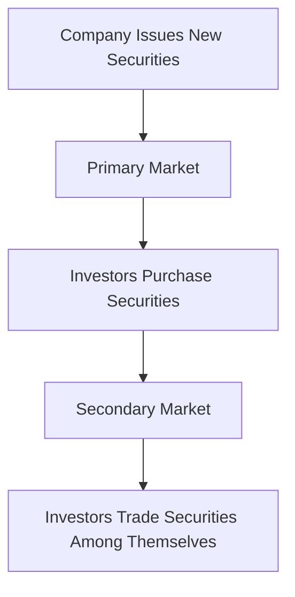

## 3.1 Primary Market vs. Secondary Market

Understanding the distinction between the primary and secondary markets is crucial for anyone looking to build a solid foundation in investing. These two markets serve different purposes and play pivotal roles in the financial ecosystem. Let's delve into what each market entails, their significance, and how they operate within the broader context of the stock market.

### What is the Primary Market?

The primary market is the financial platform where new securities are issued and sold for the first time. This is the market where companies, governments, and other entities raise capital by issuing new stocks or bonds. The primary market is essential for capital formation and is the first step in the lifecycle of a security.

#### Initial Public Offerings (IPOs)

One of the most well-known processes in the primary market is the Initial Public Offering (IPO). An IPO is when a company offers its shares to the public for the first time. This process allows companies to raise funds from a broad base of investors and is often used by companies to finance growth, pay off debt, or fund other corporate activities.

**Example:** When a tech startup decides to go public, it will issue shares in the primary market through an IPO. Investors can purchase these shares directly from the company, providing the company with the capital it needs.

#### Other Primary Market Transactions

Besides IPOs, the primary market includes other transactions such as:

- **Private Placements:** Securities are sold directly to a small group of institutional or accredited investors rather than the general public.
- **Rights Offerings:** Existing shareholders are given the right to purchase additional shares at a discount before the company offers them to the public.
- **Preferential Allotment:** Shares are issued to a select group of investors, often at a discount, to raise capital quickly.

### What is the Secondary Market?

The secondary market is where existing securities are traded among investors after their initial issuance. Unlike the primary market, the secondary market does not involve the issuing company directly. Instead, it provides a platform for investors to buy and sell securities with each other.

#### Stock Exchanges and Over-the-Counter (OTC) Markets

The secondary market includes organized exchanges like the New York Stock Exchange (NYSE) and NASDAQ, as well as over-the-counter (OTC) markets where securities not listed on formal exchanges are traded.

**Example:** After purchasing shares in an IPO, an investor can sell these shares on the NYSE, where other investors can buy them. This transaction occurs in the secondary market, and the issuing company does not receive any proceeds from this sale.

### Significance of the Primary and Secondary Markets

#### Capital Raising in the Primary Market

The primary market is vital for capital raising. It enables companies to secure the funds necessary for expansion, research and development, and other business activities. By issuing new securities, companies can access a wide pool of investors and raise substantial amounts of capital.

#### Liquidity in the Secondary Market

The secondary market provides liquidity, allowing investors to buy and sell securities easily. This liquidity is crucial for the functioning of financial markets, as it ensures that investors can enter and exit positions without significant price disruptions.

### Transactions in the Primary and Secondary Markets

#### Primary Market Transactions

1. **Company XYZ IPO:** Company XYZ issues 1 million shares at $10 each through an IPO. Investors purchase these shares directly from the company, raising $10 million for Company XYZ.

2. **Private Placement by ABC Corp:** ABC Corp sells $5 million worth of bonds to a group of institutional investors. These bonds are not offered to the general public, and the transaction occurs in the primary market.

#### Secondary Market Transactions

1. **Trading XYZ Shares on NYSE:** An investor who purchased XYZ shares during the IPO decides to sell them on the NYSE. Another investor buys these shares, and the transaction occurs in the secondary market.

2. **Buying Bonds on the OTC Market:** An investor purchases bonds issued by ABC Corp from another investor in the OTC market. This transaction does not involve ABC Corp directly.

### Glossary

- **Primary Market:** The financial market where new securities are issued and become available for trading by individuals and institutions.
- **Secondary Market:** The financial market where previously issued securities such as stocks and bonds are bought and sold.

### Real-World Applications and Regulatory Scenarios

Understanding the primary and secondary markets is essential for navigating the regulatory landscape of securities trading. The Securities Act of 1933 regulates the primary market, ensuring that companies provide essential information to investors during the issuance of new securities. The Securities Exchange Act of 1934 governs the secondary market, focusing on the trading of securities and protecting investors from fraud.

### Practical Examples and Case Studies

1. **Case Study: Facebook IPO:** Facebook's IPO in 2012 is a classic example of a primary market transaction. The company raised $16 billion, making it one of the largest IPOs in history. After the IPO, Facebook shares began trading on the NASDAQ, transitioning to the secondary market.

2. **Scenario: Trading Tesla Shares:** An investor buys Tesla shares on the NASDAQ, participating in the secondary market. The investor later sells these shares at a profit, showcasing the liquidity and potential for capital gains in the secondary market.

### Diagrams and Visuals

To better understand the flow of securities between the primary and secondary markets, consider the following diagram:

### Best Practices and Common Pitfalls

- **Best Practice:** Conduct thorough research before participating in an IPO or purchasing securities in the secondary market. Understanding the company's fundamentals and market conditions is crucial.
- **Common Pitfall:** Avoid the temptation to buy into IPOs solely based on hype. Not all IPOs result in immediate profits, and some may underperform.

### References and Additional Resources

For further exploration of the primary and secondary markets, consider the following resources:

- **Coursera:** Financial Markets by Yale University
- **Khan Academy:** Introduction to the Stock Market

### Summary and Key Points

- The primary market is where new securities are issued, allowing companies to raise capital.
- The secondary market facilitates the trading of existing securities, providing liquidity to investors.
- Understanding both markets is essential for making informed investment decisions and navigating the regulatory landscape.

## Quiz Time!



### What is the primary market?

- [x] The market where new securities are issued for the first time.
- [ ] The market where existing securities are traded among investors.
- [ ] The market for trading commodities.
- [ ] The market for foreign exchange.

> **Explanation:** The primary market is where new securities are issued and sold for the first time, allowing companies to raise capital.

### What is the secondary market?

- [ ] The market where new securities are issued for the first time.
- [x] The market where existing securities are traded among investors.
- [ ] The market for trading commodities.
- [ ] The market for foreign exchange.

> **Explanation:** The secondary market is where existing securities are bought and sold among investors after their initial issuance.

### Which of the following is an example of a primary market transaction?

- [x] A company issuing new shares through an IPO.
- [ ] An investor buying shares on the NYSE.
- [ ] An investor selling bonds on the OTC market.
- [ ] A company repurchasing its own shares.

> **Explanation:** A company issuing new shares through an IPO is a primary market transaction, as it involves the issuance of new securities.

### Which regulatory body oversees the primary market in the U.S.?

- [x] Securities and Exchange Commission (SEC)
- [ ] Financial Industry Regulatory Authority (FINRA)
- [ ] Commodity Futures Trading Commission (CFTC)
- [ ] Federal Reserve

> **Explanation:** The SEC oversees the primary market, ensuring that companies provide necessary information to investors during the issuance of new securities.

### What is the main purpose of the secondary market?

- [ ] To issue new securities.
- [x] To provide liquidity for existing securities.
- [ ] To regulate financial institutions.
- [ ] To set interest rates.

> **Explanation:** The secondary market provides liquidity, allowing investors to buy and sell existing securities easily.

### Which of the following is an example of a secondary market transaction?

- [ ] A company issuing new bonds.
- [x] An investor buying shares on the NASDAQ.
- [ ] A company offering a rights issue.
- [ ] An investor participating in a private placement.

> **Explanation:** An investor buying shares on the NASDAQ is a secondary market transaction, as it involves trading existing securities.

### What is an IPO?

- [x] Initial Public Offering
- [ ] Initial Private Offering
- [ ] International Public Offering
- [ ] Internal Public Offering

> **Explanation:** An IPO, or Initial Public Offering, is when a company offers its shares to the public for the first time.

### What is a common pitfall when investing in IPOs?

- [x] Buying based on hype without research.
- [ ] Conducting thorough research before investing.
- [ ] Diversifying investments.
- [ ] Setting realistic investment goals.

> **Explanation:** A common pitfall is buying into IPOs based on hype without conducting proper research, which can lead to losses.

### What is the role of the primary market in capital raising?

- [x] To enable companies to raise funds by issuing new securities.
- [ ] To facilitate trading of existing securities.
- [ ] To regulate financial institutions.
- [ ] To provide liquidity to investors.

> **Explanation:** The primary market enables companies to raise funds by issuing new securities, which is essential for capital formation.

### True or False: The secondary market directly involves the issuing company in transactions.

- [ ] True
- [x] False

> **Explanation:** False. The secondary market does not involve the issuing company directly; it facilitates trading among investors.



By understanding the primary and secondary markets, you are better equipped to navigate the complexities of investing and make informed decisions that align with your financial goals.
