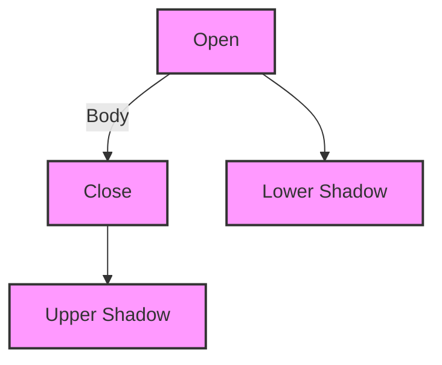

## 8.2.3 Candlestick Charts

Candlestick charts are a cornerstone of technical analysis, providing a visual representation of price movements over a specific period. They are an essential tool for investors and traders to interpret market sentiment and make informed decisions. In this section, we will delve into the components of candlestick charts, the significance of various candlestick patterns, and how they can be used to predict market direction.

### Introduction to Candlestick Charts

Candlestick charts originated in Japan over 100 years before the West developed bar and point-and-figure charts. They were first used by rice traders to track market prices and daily momentum centuries ago. Today, they are widely used in stock trading, forex, and commodities markets.

A candlestick chart displays the high, low, open, and close prices of a security for a specific period. Each candlestick represents a single time period, which could be a minute, an hour, a day, a week, or even a month. The visual nature of candlestick charts makes them an invaluable tool for quickly assessing market conditions and trends.

### Components of a Candlestick

Understanding the structure of a candlestick is crucial for interpreting the information it conveys. Each candlestick consists of three main components:

1. **The Body**: This is the thick part of the candlestick, representing the range between the opening and closing prices. A filled or colored body typically indicates a bearish period (where the closing price is lower than the opening price), while a hollow or uncolored body indicates a bullish period (where the closing price is higher than the opening price).

2. **Upper Shadow (Wick)**: The line extending above the body represents the highest price reached during the period. It shows the upper price range and is sometimes referred to as the wick or tail.

3. **Lower Shadow (Wick)**: The line extending below the body represents the lowest price reached during the period. Like the upper shadow, it shows the lower price range.

Here's a visual representation of a typical candlestick:

### Interpreting Candlestick Patterns

Candlestick patterns are formed by one or more candlesticks and can indicate potential market reversals or continuations. Here are some commonly observed patterns:

#### Single Candlestick Patterns

- **Doji**: A doji occurs when the opening and closing prices are virtually equal, creating a very small body. This pattern suggests indecision in the market and can signal a potential reversal when found at the top or bottom of a trend.

- **Hammer and Hanging Man**: Both patterns have small bodies and long lower shadows. A hammer, found at the bottom of a downtrend, suggests a potential reversal to the upside. Conversely, a hanging man, found at the top of an uptrend, indicates a potential reversal to the downside.

- **Shooting Star and Inverted Hammer**: These patterns have small bodies and long upper shadows. A shooting star, found at the top of an uptrend, suggests a potential reversal to the downside, while an inverted hammer, found at the bottom of a downtrend, indicates a potential reversal to the upside.

#### Multiple Candlestick Patterns

- **Engulfing Patterns**: A bullish engulfing pattern occurs when a small bearish candlestick is followed by a larger bullish candlestick that completely engulfs it. This pattern suggests a potential reversal to the upside. Conversely, a bearish engulfing pattern occurs when a small bullish candlestick is followed by a larger bearish candlestick, indicating a potential reversal to the downside.

- **Morning Star and Evening Star**: These are three-candlestick patterns. A morning star, found at the bottom of a downtrend, suggests a potential reversal to the upside. It consists of a long bearish candlestick, a small-bodied candlestick (indicating indecision), and a long bullish candlestick. An evening star, found at the top of an uptrend, indicates a potential reversal to the downside and consists of a long bullish candlestick, a small-bodied candlestick, and a long bearish candlestick.

- **Harami Patterns**: A bullish harami occurs when a large bearish candlestick is followed by a smaller bullish candlestick that is completely contained within the previous candle's body. This pattern suggests a potential reversal to the upside. A bearish harami occurs when a large bullish candlestick is followed by a smaller bearish candlestick, indicating a potential reversal to the downside.

### Significance of Candlestick Patterns

Candlestick patterns are significant because they provide insights into market psychology and potential future price movements. They help traders and investors identify entry and exit points, manage risk, and develop trading strategies. However, it is important to note that candlestick patterns are not foolproof and should be used in conjunction with other technical analysis tools and indicators.

### Practical Examples and Case Studies

To illustrate the practical application of candlestick charts, let's consider a few scenarios:

1. **Scenario 1: Identifying a Bullish Reversal**: Imagine you are analyzing the stock of a company that has been in a downtrend for several weeks. You notice a hammer pattern forming at the bottom of the trend. This pattern, combined with increasing trading volume, suggests a potential reversal to the upside. You decide to enter a long position, setting a stop-loss order below the hammer's low to manage risk.

2. **Scenario 2: Spotting a Bearish Reversal**: You are monitoring a stock that has been in a strong uptrend. You observe a shooting star pattern forming at the top of the trend. This pattern, along with decreasing volume, indicates a potential reversal to the downside. You decide to exit your long position and consider entering a short position to capitalize on the anticipated decline.

### Best Practices and Common Pitfalls

- **Best Practices**:
  - Use candlestick patterns in conjunction with other technical indicators, such as moving averages, RSI, or MACD, to confirm signals.
  - Consider the context of the overall trend and market conditions when interpreting candlestick patterns.
  - Practice analyzing candlestick charts with historical data to develop your pattern recognition skills.

- **Common Pitfalls**:
  - Relying solely on candlestick patterns without considering other factors can lead to false signals.
  - Overlooking the importance of trading volume, which can provide additional confirmation of candlestick patterns.
  - Ignoring the broader market context and economic indicators that may influence price movements.

### Tutorials and Further Learning

To deepen your understanding of candlestick charts, consider exploring the following resources:

- **Books**: "Japanese Candlestick Charting Techniques" by Steve Nison is a comprehensive guide to candlestick charting.
- **Online Courses**: Platforms like Coursera and Udemy offer courses on technical analysis and candlestick charting.
- **Websites**: Investopedia and TradingView provide tutorials and articles on reading candlestick charts.

### Glossary

- **Candlestick Chart**: A type of financial chart used to describe price movements of a security, derivative, or currency, characterized by its visual representation of open, high, low, and close prices.

### Conclusion

Candlestick charts are a powerful tool for investors and traders seeking to understand market dynamics and make informed decisions. By mastering the interpretation of candlestick patterns, you can enhance your ability to predict market movements and improve your investment strategy. Remember to combine candlestick analysis with other technical and fundamental analysis tools to achieve the best results.

## Quiz Time!



### What does a filled or colored candlestick body typically indicate?

- [x] A bearish period where the closing price is lower than the opening price
- [ ] A bullish period where the closing price is higher than the opening price
- [ ] Indecision in the market
- [ ] A reversal pattern

> **Explanation:** A filled or colored candlestick body indicates a bearish period, where the closing price is lower than the opening price.

### Which candlestick pattern suggests a potential reversal to the upside when found at the bottom of a downtrend?

- [ ] Shooting Star
- [x] Hammer
- [ ] Hanging Man
- [ ] Doji

> **Explanation:** A hammer pattern, found at the bottom of a downtrend, suggests a potential reversal to the upside.

### What is the significance of the upper shadow in a candlestick?

- [ ] It represents the opening price
- [ ] It indicates market indecision
- [x] It represents the highest price reached during the period
- [ ] It shows the closing price

> **Explanation:** The upper shadow represents the highest price reached during the period.

### What does a doji pattern indicate?

- [ ] A strong bullish trend
- [ ] A strong bearish trend
- [x] Indecision in the market
- [ ] A reversal pattern

> **Explanation:** A doji pattern indicates indecision in the market, as the opening and closing prices are virtually equal.

### Which pattern consists of a long bearish candlestick, a small-bodied candlestick, and a long bullish candlestick?

- [ ] Evening Star
- [x] Morning Star
- [ ] Engulfing Pattern
- [ ] Harami Pattern

> **Explanation:** A morning star pattern consists of a long bearish candlestick, a small-bodied candlestick, and a long bullish candlestick, indicating a potential reversal to the upside.

### What should you consider when interpreting candlestick patterns?

- [x] The context of the overall trend and market conditions
- [ ] Only the color of the candlestick
- [ ] The size of the upper shadow
- [ ] The number of candlesticks in the pattern

> **Explanation:** When interpreting candlestick patterns, consider the context of the overall trend and market conditions.

### Which pattern suggests a potential reversal to the downside when found at the top of an uptrend?

- [x] Shooting Star
- [ ] Hammer
- [ ] Doji
- [ ] Morning Star

> **Explanation:** A shooting star pattern, found at the top of an uptrend, suggests a potential reversal to the downside.

### What does a bullish engulfing pattern indicate?

- [ ] Continuation of a downtrend
- [ ] Indecision in the market
- [x] A potential reversal to the upside
- [ ] A potential reversal to the downside

> **Explanation:** A bullish engulfing pattern indicates a potential reversal to the upside, as a small bearish candlestick is followed by a larger bullish candlestick.

### What is the role of trading volume in confirming candlestick patterns?

- [x] It provides additional confirmation of candlestick patterns
- [ ] It has no significance in candlestick analysis
- [ ] It only affects the size of the candlestick body
- [ ] It determines the color of the candlestick

> **Explanation:** Trading volume provides additional confirmation of candlestick patterns, indicating the strength of the signal.

### True or False: Candlestick patterns should be used in isolation for making trading decisions.

- [ ] True
- [x] False

> **Explanation:** False. Candlestick patterns should not be used in isolation; they should be combined with other technical indicators and analysis tools for more reliable signals.


