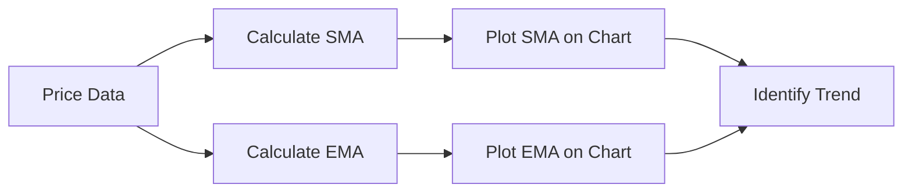

## 8.4.1 Moving Averages

Moving averages are among the most widely used technical indicators in stock market analysis. They play a crucial role in smoothing out price data to help investors identify trends, support, and resistance levels. By understanding moving averages, you can make more informed decisions about buying or selling stocks, enhancing your investment strategy.

### What Are Moving Averages?

A moving average (MA) is a calculation used to analyze data points by creating a series of averages of different subsets of the full data set. In the context of stock market analysis, moving averages help smooth out price data by creating a constantly updated average price. This smoothing effect makes it easier to identify the direction of the trend, whether it's upward, downward, or sideways.

#### Types of Moving Averages

There are several types of moving averages, but the two most common are the Simple Moving Average (SMA) and the Exponential Moving Average (EMA).

### Simple Moving Average (SMA)

The Simple Moving Average is the most basic form of moving average. It is calculated by adding up the closing prices of a stock over a specific number of periods and then dividing by that number of periods. For example, a 10-day SMA adds up the closing prices of the last 10 days and divides by 10.

**Formula for SMA:**

 \text{SMA} = \frac{P_1 + P_2 + \cdots + P_n}{n} 

Where \\( P \\) represents the price at each period, and \\( n \\) is the number of periods.

**Advantages of SMA:**

- **Simplicity:** Easy to calculate and understand.
- **Stability:** Less sensitive to short-term fluctuations, providing a clearer picture of the overall trend.

**Disadvantages of SMA:**

- **Lagging Indicator:** Can be slow to react to rapid price changes.
- **Equal Weighting:** Gives equal weight to all data points, which may not reflect the most recent price movements accurately.

### Exponential Moving Average (EMA)

The Exponential Moving Average is a type of moving average that gives more weight to the most recent prices, making it more responsive to new information. The EMA is calculated using a more complex formula that includes a smoothing factor, which determines how much weight is given to the most recent price.

**Formula for EMA:**

 \text{EMA} = \left( \frac{2}{n+1} \right) \times \left( \text{Current Price} - \text{Previous EMA} \right) + \text{Previous EMA} 

Where \\( n \\) is the number of periods.

**Advantages of EMA:**

- **Responsiveness:** More sensitive to recent price changes, making it ideal for short-term trading.
- **Timeliness:** Provides signals more quickly than the SMA.

**Disadvantages of EMA:**

- **Complexity:** More complicated to calculate than the SMA.
- **Potential for False Signals:** Can be more prone to false signals due to its sensitivity.

### Using Moving Averages to Identify Trends

Moving averages are primarily used to identify the direction of the trend. By plotting moving averages on a price chart, investors can see whether the stock is in an uptrend, downtrend, or sideways trend.

- **Uptrend:** When the price is consistently above the moving average, it indicates an uptrend.
- **Downtrend:** When the price is consistently below the moving average, it indicates a downtrend.
- **Sideways Trend:** When the price oscillates around the moving average, it indicates a sideways trend.

### Moving Averages as Support and Resistance Levels

Moving averages can also act as dynamic support and resistance levels. In an uptrend, a moving average may act as a support level, where the price tends to bounce off the moving average line. Conversely, in a downtrend, a moving average may act as a resistance level, where the price struggles to break above the moving average line.

### Practical Examples and Charting

To better understand how moving averages work, let's look at a practical example using a stock chart. Consider a stock that has been in an uptrend for several months. By plotting a 50-day SMA on the chart, you can see that the price consistently stays above the SMA, confirming the uptrend. If the price begins to fall below the SMA, it may signal a potential trend reversal.

Below is a simple representation of how moving averages can be visualized on a stock chart:

### Moving Average Crossovers

One popular strategy involving moving averages is the crossover strategy. This involves using two moving averages of different lengths, such as a short-term 20-day EMA and a long-term 50-day EMA. When the short-term EMA crosses above the long-term EMA, it generates a buy signal, indicating a potential uptrend. Conversely, when the short-term EMA crosses below the long-term EMA, it generates a sell signal, indicating a potential downtrend.

### Best Practices and Common Pitfalls

**Best Practices:**

- **Use Multiple Time Frames:** Analyze moving averages over different time frames to get a comprehensive view of the trend.
- **Combine with Other Indicators:** Use moving averages in conjunction with other technical indicators, such as the Relative Strength Index (RSI) or Moving Average Convergence Divergence (MACD), for more robust analysis.

**Common Pitfalls:**

- **Over-Reliance:** Avoid relying solely on moving averages for trading decisions. They should be part of a broader analysis.
- **Ignoring Market Context:** Consider the overall market conditions and other factors that may influence stock prices.

### Conclusion

Moving averages are a fundamental tool in technical analysis, providing valuable insights into market trends and potential support and resistance levels. By understanding and applying moving averages, you can enhance your investment strategy and make more informed trading decisions.

## Quiz Time!



### What is the primary purpose of moving averages in stock analysis?

- [x] To smooth out price data and identify trends
- [ ] To calculate the intrinsic value of a stock
- [ ] To determine the exact entry and exit points
- [ ] To predict future stock prices with certainty

> **Explanation:** Moving averages are used to smooth out price data, making it easier to identify trends over time.

### How is a Simple Moving Average (SMA) calculated?

- [x] By averaging the closing prices over a specific number of periods
- [ ] By giving more weight to recent prices
- [ ] By using a complex mathematical formula
- [ ] By averaging the opening and closing prices

> **Explanation:** A Simple Moving Average is calculated by adding up the closing prices over a specific number of periods and dividing by that number of periods.

### What is the main advantage of an Exponential Moving Average (EMA) over a Simple Moving Average (SMA)?

- [x] It is more responsive to recent price changes
- [ ] It is easier to calculate
- [ ] It gives equal weight to all data points
- [ ] It is less prone to false signals

> **Explanation:** The EMA gives more weight to recent prices, making it more responsive to new information compared to the SMA.

### In which scenario does a moving average act as a support level?

- [x] When the price bounces off the moving average line in an uptrend
- [ ] When the price consistently stays below the moving average
- [ ] When the price crosses below the moving average
- [ ] When the price oscillates around the moving average

> **Explanation:** In an uptrend, the moving average can act as a support level where the price tends to bounce off the moving average line.

### What does a moving average crossover strategy involve?

- [x] Using two moving averages of different lengths to generate buy or sell signals
- [ ] Using a single moving average to determine entry points
- [ ] Calculating the difference between two moving averages
- [ ] Using moving averages to predict future price movements

> **Explanation:** A crossover strategy involves using two moving averages of different lengths to generate buy or sell signals when they cross each other.

### Which of the following is a common pitfall when using moving averages?

- [x] Over-reliance on moving averages for trading decisions
- [ ] Using multiple time frames for analysis
- [ ] Combining moving averages with other indicators
- [ ] Considering market context

> **Explanation:** Over-relying on moving averages without considering other factors can lead to poor trading decisions.

### How can moving averages be used in conjunction with other indicators?

- [x] To provide more robust analysis and confirm signals
- [ ] To replace other indicators entirely
- [ ] To eliminate the need for fundamental analysis
- [ ] To predict exact price movements

> **Explanation:** Combining moving averages with other indicators can provide more robust analysis and help confirm signals.

### What does it mean when the price consistently stays above a moving average?

- [x] It indicates an uptrend
- [ ] It indicates a downtrend
- [ ] It indicates a sideways trend
- [ ] It indicates market volatility

> **Explanation:** When the price consistently stays above a moving average, it typically indicates an uptrend.

### How does the Exponential Moving Average (EMA) differ from the Simple Moving Average (SMA)?

- [x] The EMA gives more weight to recent prices
- [ ] The EMA is calculated using only closing prices
- [ ] The EMA is less responsive to recent price changes
- [ ] The EMA gives equal weight to all data points

> **Explanation:** The EMA differs from the SMA by giving more weight to recent prices, making it more responsive to new information.

### True or False: Moving averages can be used to predict future stock prices with certainty.

- [ ] True
- [x] False

> **Explanation:** Moving averages help identify trends and potential support/resistance levels but cannot predict future stock prices with certainty.


