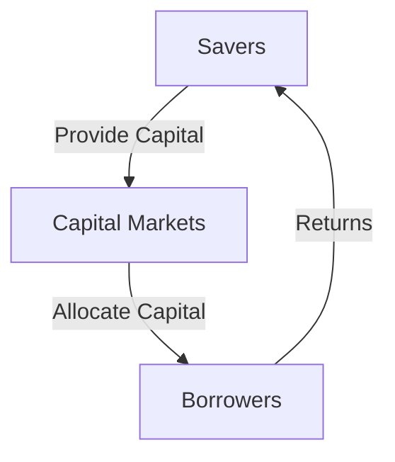

## 1.2 Importance in the Financial Markets

Financial instruments are the lifeblood of modern financial markets, playing a pivotal role in the efficient allocation of resources and the facilitation of economic growth. They serve as the primary means through which savings are transformed into investments, enabling the flow of capital in the economy. This section delves into the significance of financial instruments, highlighting their role in investment, savings, lending, diversification, and risk management.

### Facilitating the Flow of Capital

Financial instruments are crucial in channeling funds from savers to borrowers, thus facilitating the flow of capital. This process is essential for economic development, as it ensures that resources are allocated to their most productive uses. The capital markets, comprising stock exchanges, bond markets, and other financial platforms, serve as intermediaries that connect those with surplus funds (savers) with those in need of funds (borrowers).

#### Capital Markets: A Brief Overview

Capital markets are where long-term debt or equity-backed securities are bought and sold. They are essential for economic growth as they provide a platform for raising capital. Companies and governments issue securities to raise funds for various projects, while investors purchase these securities to earn returns. This interaction is fundamental to the functioning of the economy.

In this diagram, savers provide capital to the capital markets, which in turn allocate it to borrowers. The borrowers then generate returns, which are passed back to the savers, completing the cycle of capital flow.

### Role in Investment, Savings, and Lending

Financial instruments are indispensable tools for investment, savings, and lending. They provide a mechanism for individuals and institutions to earn returns on their surplus funds while enabling borrowers to access the capital needed for growth and development.

#### Investment Opportunities

Financial instruments offer a wide array of investment opportunities, ranging from low-risk government bonds to high-risk equity shares. This diversity allows investors to tailor their portfolios according to their risk tolerance and investment goals. By investing in financial instruments, individuals can grow their wealth over time, contributing to economic stability and prosperity.

#### Savings Vehicles

For savers, financial instruments such as savings bonds and certificates of deposit provide a secure way to preserve capital while earning interest. These instruments are crucial for individuals looking to safeguard their wealth against inflation and other economic uncertainties.

#### Lending Mechanisms

On the lending side, financial instruments facilitate the extension of credit to individuals, businesses, and governments. Instruments like bonds and loans are vital for financing infrastructure projects, business expansions, and other initiatives that drive economic growth.

### Enabling Diversification and Risk Management

One of the key benefits of financial instruments is their ability to enable diversification and risk management. By holding a diverse portfolio of financial instruments, investors can mitigate risks and enhance their potential returns.

#### Diversification

Diversification involves spreading investments across various financial instruments to reduce exposure to any single asset or risk. This strategy is fundamental in minimizing the impact of market volatility on an investment portfolio. For example, an investor might hold a mix of stocks, bonds, and derivatives to achieve a balanced risk-return profile.

#### Risk Management

Financial instruments such as options, futures, and derivatives are powerful tools for managing risk. They allow investors to hedge against potential losses by locking in prices or transferring risk to other parties. This capability is crucial for maintaining financial stability, especially in volatile markets.

### Real-World Applications and Regulatory Scenarios

Financial instruments are not only theoretical constructs but have practical applications in real-world scenarios. They are subject to a complex web of regulations designed to ensure transparency, fairness, and stability in financial markets.

#### Regulatory Framework

In the United States, financial instruments are regulated by various agencies, including the Securities and Exchange Commission (SEC) and the Commodity Futures Trading Commission (CFTC). These bodies enforce rules that govern the issuance, trading, and settlement of financial instruments, ensuring that markets operate efficiently and protect investors from fraud and manipulation.

#### Case Study: The Role of Derivatives in Risk Management

Consider a multinational corporation that uses currency derivatives to hedge against exchange rate fluctuations. By entering into a forward contract, the company can lock in an exchange rate for a future transaction, thereby mitigating the risk of adverse currency movements. This strategy is a practical example of how financial instruments can be used to manage risk effectively.

### References to Market Reports

To further understand the importance of financial instruments, it is beneficial to refer to market reports and analyses from reputable institutions such as the World Bank and the International Monetary Fund (IMF). These reports provide insights into global economic trends, the performance of financial markets, and the impact of financial instruments on economic growth.

#### World Bank and IMF Reports

The World Bank and IMF regularly publish reports that highlight the role of financial instruments in economic development. These reports underscore the importance of well-functioning financial markets in promoting investment, enhancing productivity, and fostering sustainable growth.

### Glossary

- **Capital Markets:** Markets where savings and investments are channeled between suppliers and those in need.

### Conclusion

In conclusion, financial instruments are indispensable components of the financial markets. They facilitate the flow of capital, provide opportunities for investment and savings, enable diversification and risk management, and are governed by a robust regulatory framework. Understanding the importance of financial instruments is crucial for anyone looking to navigate the complex world of finance and investing.

## Quiz Time!



### Financial instruments primarily facilitate the flow of capital by:

- [x] Channeling funds from savers to borrowers
- [ ] Increasing government spending
- [ ] Reducing interest rates
- [ ] Limiting investment opportunities

> **Explanation:** Financial instruments channel funds from savers to borrowers, facilitating the flow of capital in the economy.

### Capital markets are essential because they:

- [x] Provide a platform for raising capital
- [ ] Limit investor access to funds
- [ ] Decrease market volatility
- [ ] Restrict financial transactions

> **Explanation:** Capital markets provide a platform for raising capital, which is vital for economic growth.

### Diversification in investment refers to:

- [x] Spreading investments across various financial instruments
- [ ] Investing all funds in a single asset
- [ ] Avoiding high-risk investments
- [ ] Focusing solely on short-term gains

> **Explanation:** Diversification involves spreading investments across various financial instruments to reduce exposure to any single asset or risk.

### Which of the following is a key benefit of financial instruments?

- [x] Enabling risk management
- [ ] Increasing market volatility
- [ ] Restricting capital flow
- [ ] Limiting investment opportunities

> **Explanation:** Financial instruments enable risk management, allowing investors to hedge against potential losses.

### Regulatory bodies like the SEC and CFTC:

- [x] Ensure transparency and fairness in financial markets
- [ ] Increase market volatility
- [ ] Restrict investor access to information
- [ ] Limit the issuance of financial instruments

> **Explanation:** Regulatory bodies like the SEC and CFTC ensure transparency and fairness in financial markets.

### Derivatives are used primarily for:

- [x] Hedging against potential losses
- [ ] Increasing investment costs
- [ ] Limiting market access
- [ ] Reducing market efficiency

> **Explanation:** Derivatives are used to hedge against potential losses by locking in prices or transferring risk.

### Financial instruments are subject to:

- [x] A complex web of regulations
- [ ] Minimal regulatory oversight
- [ ] No government intervention
- [ ] Unlimited trading hours

> **Explanation:** Financial instruments are subject to a complex web of regulations to ensure market stability and investor protection.

### The World Bank and IMF reports highlight:

- [x] The role of financial instruments in economic development
- [ ] The decline of financial markets
- [ ] The reduction of global trade
- [ ] The elimination of financial risks

> **Explanation:** World Bank and IMF reports highlight the role of financial instruments in economic development.

### A forward contract is used to:

- [x] Lock in an exchange rate for a future transaction
- [ ] Increase currency exposure
- [ ] Limit investment opportunities
- [ ] Reduce market efficiency

> **Explanation:** A forward contract is used to lock in an exchange rate for a future transaction, mitigating currency risk.

### True or False: Financial instruments restrict the flow of capital in the economy.

- [ ] True
- [x] False

> **Explanation:** Financial instruments facilitate, rather than restrict, the flow of capital in the economy.


