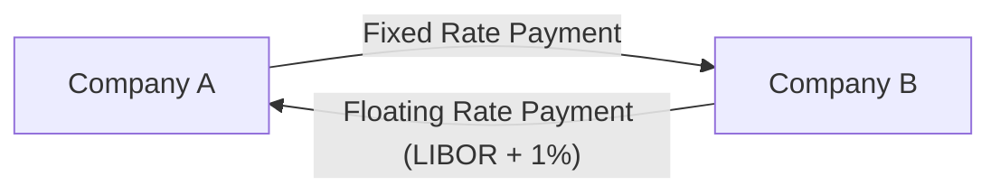

## 17.4 Understanding a Swap Agreement

In the world of finance, swap agreements are powerful tools that allow entities to manage risk, optimize their financial strategies, and achieve more favorable terms on their financial obligations. Among the various types of swaps, interest rate swaps are particularly prevalent and valuable. This section will delve into the mechanics of interest rate swaps, illustrating how they work, the benefits they offer, and the role of financial intermediaries in facilitating these agreements.

### What is an Interest Rate Swap?

An **Interest Rate Swap** is a contractual agreement between two parties to exchange one stream of interest payments for another, over a specified period. Typically, one party pays a fixed interest rate while the other pays a floating interest rate, usually linked to a benchmark such as the London Interbank Offered Rate (LIBOR) or the Secured Overnight Financing Rate (SOFR).

### Example of an Interest Rate Swap

To better understand how interest rate swaps work, let's consider a practical example involving two companies: Company A and Company B.

- **Company A** has a loan with a floating interest rate, which exposes it to interest rate volatility. Company A prefers the predictability of fixed payments.
- **Company B** has a loan with a fixed interest rate but believes that interest rates will decrease, making a floating rate more advantageous.

By entering into an interest rate swap, these companies can exchange their interest payment obligations to better align with their financial strategies.

#### Swap Agreement Details

- **Company A** agrees to pay Company B a fixed interest rate of 3% on a notional principal amount of $10 million.
- **Company B** agrees to pay Company A a floating interest rate equivalent to LIBOR + 1% on the same notional principal.

This swap allows Company A to effectively convert its floating-rate loan into a fixed-rate obligation, while Company B converts its fixed-rate loan into a floating-rate obligation.

### Benefits of Swapping Fixed for Floating Rates

Interest rate swaps offer several benefits:

1. **Risk Management:** By swapping fixed for floating rates, or vice versa, companies can manage their exposure to interest rate fluctuations.
2. **Cost Savings:** Companies can potentially reduce their interest expenses by taking advantage of favorable market conditions.
3. **Predictability:** Fixed-rate payers gain predictability in their cash flows, aiding in budgeting and financial planning.
4. **Flexibility:** Swaps provide the flexibility to tailor financial obligations to match a company's risk appetite and market outlook.

### Role of Financial Intermediaries

Financial intermediaries, such as banks and brokerage firms, play a crucial role in facilitating interest rate swaps. They:

- **Match Counterparties:** Intermediaries help identify and connect parties with complementary needs.
- **Provide Expertise:** They offer expertise in structuring swaps to meet specific financial goals.
- **Mitigate Risk:** By acting as intermediaries, they can assume counterparty risk, ensuring that both parties fulfill their obligations.
- **Market Access:** Intermediaries provide access to a broader market, increasing the likelihood of finding suitable swap partners.

### Diagram: Cash Flow Exchanges in an Interest Rate Swap

To visualize the cash flow exchanges in an interest rate swap, consider the following diagram:

In this diagram, Company A pays a fixed rate to Company B, while Company B pays a floating rate to Company A. The net effect is that each company achieves its desired interest rate exposure.

### Impact on Financials

The impact of an interest rate swap on a company's financials can be significant. For Company A, the swap transforms its variable interest payments into fixed payments, reducing uncertainty and aiding in financial planning. For Company B, the swap allows it to benefit from potential decreases in interest rates, potentially lowering its interest expenses.

### Real-World Applications

Interest rate swaps are widely used in various sectors, including:

- **Corporate Finance:** Companies use swaps to manage interest rate exposure on loans and bonds.
- **Investment Management:** Portfolio managers use swaps to hedge interest rate risk in bond portfolios.
- **Government Finance:** Municipalities and government entities use swaps to manage debt service costs.

### Regulatory Considerations

Interest rate swaps are subject to regulatory oversight to ensure transparency and mitigate systemic risk. In the U.S., the Commodity Futures Trading Commission (CFTC) regulates swaps under the Dodd-Frank Wall Street Reform and Consumer Protection Act. Key regulatory requirements include:

- **Central Clearing:** Many swaps must be cleared through central counterparties to reduce counterparty risk.
- **Reporting:** Swap transactions must be reported to swap data repositories to enhance market transparency.
- **Margin Requirements:** Parties may be required to post collateral to cover potential losses.

### Conclusion

Interest rate swaps are versatile financial instruments that enable companies to manage interest rate risk effectively. By understanding the mechanics of swaps and the role of financial intermediaries, you can appreciate how these agreements contribute to financial stability and strategic planning.

### Key Takeaways

- Interest rate swaps involve exchanging fixed and floating interest payments.
- Swaps offer risk management, cost savings, and cash flow predictability.
- Financial intermediaries facilitate swaps by matching counterparties and providing expertise.
- Regulatory oversight ensures transparency and reduces systemic risk.

## Quiz Time!



### What is an interest rate swap?

- [x] An agreement to exchange one stream of interest payments for another
- [ ] A contract to buy or sell a commodity at a future date
- [ ] A type of equity security
- [ ] A method of issuing bonds

> **Explanation:** An interest rate swap involves exchanging interest payment streams, typically between fixed and floating rates.

### Why might a company enter into an interest rate swap?

- [x] To manage interest rate risk
- [x] To achieve more favorable loan terms
- [ ] To increase equity holdings
- [ ] To issue new shares

> **Explanation:** Companies use swaps to manage risk and optimize loan terms, not to alter equity positions.

### What role do financial intermediaries play in swaps?

- [x] They match counterparties and provide expertise
- [ ] They issue new shares
- [ ] They regulate swap transactions
- [ ] They provide equity financing

> **Explanation:** Intermediaries match parties with complementary needs and offer expertise in structuring swaps.

### What is a benefit of swapping a fixed rate for a floating rate?

- [x] Potential cost savings if interest rates decrease
- [ ] Guaranteed lower interest expenses
- [ ] Increased equity value
- [ ] Higher bond yields

> **Explanation:** Swapping to a floating rate can save costs if rates fall, but it doesn't guarantee savings.

### What is the regulatory body overseeing swaps in the U.S.?

- [x] Commodity Futures Trading Commission (CFTC)
- [ ] Securities and Exchange Commission (SEC)
- [ ] Federal Reserve
- [ ] Financial Industry Regulatory Authority (FINRA)

> **Explanation:** The CFTC regulates swaps under the Dodd-Frank Act.

### What is a central counterparty's role in swaps?

- [x] To reduce counterparty risk
- [ ] To issue new swaps
- [ ] To provide equity financing
- [ ] To regulate swap transactions

> **Explanation:** Central counterparties clear swaps to mitigate counterparty risk.

### What is a floating rate typically linked to in a swap?

- [x] LIBOR or SOFR
- [ ] The company's stock price
- [ ] The company's bond yield
- [ ] The Federal Reserve's discount rate

> **Explanation:** Floating rates in swaps are often linked to benchmarks like LIBOR or SOFR.

### What is a key regulatory requirement for swaps?

- [x] Central clearing
- [ ] Issuing new shares
- [ ] Increasing equity value
- [ ] Selling bonds

> **Explanation:** Central clearing is required for many swaps to reduce systemic risk.

### What is the impact of a swap on Company A's financials in the example?

- [x] Converts variable interest payments to fixed payments
- [ ] Increases equity value
- [ ] Issues new shares
- [ ] Sells bonds

> **Explanation:** The swap converts Company A's variable payments to fixed, aiding in financial planning.

### True or False: Interest rate swaps are used only by financial institutions.

- [ ] True
- [x] False

> **Explanation:** Interest rate swaps are used by various entities, including corporations and government bodies, to manage interest rate risk.


