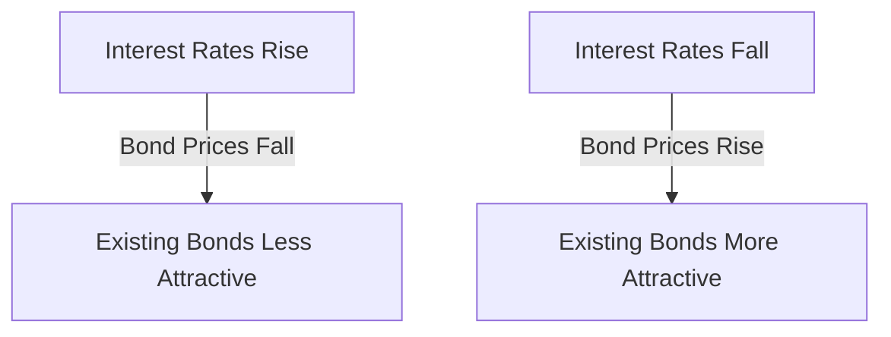

## 3.4 Risks Associated with Debt Instruments

Debt instruments, such as bonds, are essential components of financial markets, providing investors with opportunities to earn returns through interest payments while offering issuers a means to raise capital. However, investing in debt instruments is not without risk. Understanding these risks is crucial for making informed investment decisions and effectively managing portfolios. In this section, we will delve into the primary risks associated with debt instruments: interest rate risk, credit risk, and inflation risk. We will explore how these risks impact bond prices and investor decisions, and provide practical examples and strategies for mitigating these risks.

### Interest Rate Risk

**Interest Rate Risk** is the risk that changes in interest rates will affect the price of bonds. This risk is particularly significant for fixed-income securities, where the interest payments are set at the time of issuance. When interest rates rise, the prices of existing bonds typically fall, and vice versa. This inverse relationship occurs because new bonds are issued with higher yields, making existing bonds with lower yields less attractive.

#### How Interest Rates Affect Bond Prices

To understand the impact of interest rate changes on bond prices, consider the following example:

Imagine you own a bond with a face value of $1,000, a coupon rate of 5%, and a maturity of 10 years. If market interest rates rise to 6%, new bonds are issued with a 6% coupon rate. To sell your bond in the secondary market, you would need to offer it at a discount to make it competitive with new bonds. Conversely, if interest rates fall to 4%, your bond becomes more valuable, as it offers a higher yield than newly issued bonds.

This relationship can be visualized in the following diagram:

#### Duration and Convexity

Two key concepts that help measure interest rate risk are **duration** and **convexity**. Duration measures the sensitivity of a bond's price to changes in interest rates, expressed in years. The higher the duration, the more sensitive the bond is to interest rate changes. Convexity accounts for the curvature in the price-yield relationship, providing a more accurate measure of interest rate risk for large changes in interest rates.

### Credit Risk

**Credit Risk** refers to the risk of loss due to a borrower's failure to make payments on a debt obligation. This risk is particularly relevant for corporate bonds and bonds issued by entities with lower credit ratings.

#### Importance of Credit Ratings

Credit rating agencies, such as **Standard & Poor's**, **Moody's**, and **Fitch Ratings**, assess the creditworthiness of bond issuers and assign ratings that reflect the likelihood of default. These ratings range from high-grade (low risk) to speculative (high risk). Investors rely on these ratings to gauge the credit risk associated with a bond.

Here's a simplified breakdown of credit ratings:

- **Investment Grade:** Bonds rated BBB- (S&P/Fitch) or Baa3 (Moody's) and above. These bonds are considered to have a low risk of default.
- **Speculative Grade (Junk Bonds):** Bonds rated below BBB- (S&P/Fitch) or Baa3 (Moody's). These bonds carry a higher risk of default but offer higher yields to compensate for the increased risk.

#### Default Risk

Default risk is the possibility that an issuer will be unable to meet its financial obligations, leading to missed interest payments or principal repayment. This risk is more pronounced for issuers with lower credit ratings. Investors must assess the creditworthiness of issuers and consider the potential impact of default on their portfolios.

### Inflation Risk

**Inflation Risk** is the risk that the purchasing power of the interest payments and principal repayment will be eroded by inflation. While bonds provide fixed interest payments, inflation reduces the real value of these payments over time.

#### Impact of Inflation on Bonds

When inflation rises, the real return on bonds decreases, as the fixed interest payments lose purchasing power. This can lead to a decline in bond prices, as investors demand higher yields to compensate for the loss in purchasing power. Inflation-protected securities, such as Treasury Inflation-Protected Securities (TIPS), can help mitigate this risk by adjusting the principal value based on inflation.

### Strategies for Managing Risks

Investors can employ various strategies to manage the risks associated with debt instruments:

- **Diversification:** By holding a diversified portfolio of bonds with varying maturities, credit ratings, and issuers, investors can reduce the impact of any single bond's performance on their overall portfolio.

- **Laddering:** This strategy involves purchasing bonds with different maturities, allowing investors to reinvest maturing bonds at prevailing interest rates, reducing interest rate risk.

- **Credit Analysis:** Conducting thorough credit analysis and monitoring changes in credit ratings can help investors manage credit risk and avoid potential defaults.

- **Inflation-Protected Securities:** Investing in TIPS or other inflation-linked bonds can help protect against inflation risk.

### Real-World Applications and Regulatory Considerations

In the U.S., the Securities and Exchange Commission (SEC) regulates the issuance and trading of debt securities to protect investors. Understanding the regulatory environment and staying informed about changes in regulations is crucial for managing risks effectively.

### Conclusion

Understanding and managing the risks associated with debt instruments is essential for successful investing. By recognizing the impact of interest rate changes, assessing credit risk through ratings, and considering the effects of inflation, investors can make informed decisions and build resilient portfolios. As you prepare for the U.S. Securities Exams, focus on these key concepts and strategies to enhance your understanding and confidence in navigating the financial markets.

## Quiz Time!



### What is the relationship between interest rates and bond prices?

- [x] Inverse relationship
- [ ] Direct relationship
- [ ] No relationship
- [ ] Complex relationship

> **Explanation:** When interest rates rise, bond prices fall, and vice versa, due to the inverse relationship between interest rates and bond prices.

### What does a bond's duration measure?

- [x] Sensitivity to interest rate changes
- [ ] Time to maturity
- [ ] Credit risk
- [ ] Inflation risk

> **Explanation:** Duration measures a bond's sensitivity to interest rate changes, expressed in years.

### Which credit rating agency is NOT mentioned in the text?

- [ ] Standard & Poor's
- [ ] Moody's
- [x] AM Best
- [ ] Fitch Ratings

> **Explanation:** AM Best is not mentioned in the text; it is a credit rating agency focusing on the insurance industry.

### What is the primary risk associated with bonds during periods of high inflation?

- [x] Inflation risk
- [ ] Credit risk
- [ ] Interest rate risk
- [ ] Liquidity risk

> **Explanation:** Inflation risk is the primary concern during high inflation, as it erodes the purchasing power of fixed interest payments.

### How can investors protect against inflation risk?

- [x] Investing in TIPS
- [ ] Investing in junk bonds
- [ ] Holding cash
- [ ] Buying stocks

> **Explanation:** Treasury Inflation-Protected Securities (TIPS) adjust for inflation, protecting against inflation risk.

### What is the risk of a bond issuer failing to make payments called?

- [x] Credit risk
- [ ] Interest rate risk
- [ ] Inflation risk
- [ ] Liquidity risk

> **Explanation:** Credit risk is the risk that a bond issuer will fail to make payments.

### What strategy involves purchasing bonds with varying maturities?

- [x] Laddering
- [ ] Diversification
- [ ] Hedging
- [ ] Speculation

> **Explanation:** Laddering involves purchasing bonds with different maturities to reduce interest rate risk.

### What type of bonds are considered speculative grade?

- [x] Junk bonds
- [ ] Investment-grade bonds
- [ ] Municipal bonds
- [ ] Treasury bonds

> **Explanation:** Junk bonds are considered speculative grade and carry a higher risk of default.

### Which of the following is NOT a strategy for managing bond risks?

- [ ] Diversification
- [ ] Laddering
- [ ] Credit analysis
- [x] Short selling

> **Explanation:** Short selling is not a strategy for managing bond risks; it involves selling securities not owned by the seller.

### True or False: Credit ratings are assigned by agencies like Moody's and reflect the likelihood of default.

- [x] True
- [ ] False

> **Explanation:** Credit ratings are assigned by agencies like Moody's and reflect the likelihood of default.


