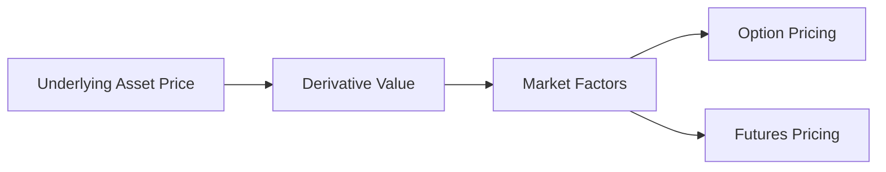

## 5.2 How Derivatives Derive Value from Underlying Assets

Derivatives are financial instruments whose value is intrinsically linked to the value of another asset, known as the underlying asset. Understanding this relationship is crucial for anyone involved in trading or investing in derivatives, as it forms the foundation of how these instruments are priced and traded in the financial markets.

### What is an Underlying Asset?

An **underlying asset** is the financial asset upon which a derivative's price is based. This can be a wide range of assets including stocks, bonds, commodities, currencies, interest rates, or market indexes. The performance and characteristics of the underlying asset determine the value of the derivative contract.

### The Relationship Between Derivatives and Underlying Assets

The value of a derivative is directly tied to the price movements of its underlying asset. This relationship can be linear or non-linear, depending on the type of derivative. For instance, futures and forwards have a linear relationship with the underlying asset, meaning that changes in the asset's price will result in proportional changes in the derivative's price. Options, on the other hand, have a non-linear relationship due to their asymmetric payoff structure.

#### Linear Relationship: Futures and Forwards

Futures and forwards are agreements to buy or sell an asset at a predetermined price at a specific future date. The value of these contracts is directly proportional to the price of the underlying asset. If the price of the underlying asset increases, the value of a long futures contract will increase, while the value of a short futures contract will decrease, and vice versa.

**Example:**

Consider a futures contract on crude oil with a price of $70 per barrel. If the market price of crude oil rises to $75 per barrel, the value of the futures contract will increase by $5 per barrel for a long position. Conversely, for a short position, the contract's value will decrease by $5 per barrel.

#### Non-Linear Relationship: Options

Options provide the right, but not the obligation, to buy or sell an underlying asset at a specified price before a certain date. The value of options is influenced by several factors, including the price of the underlying asset, the strike price, time to expiration, volatility, and interest rates. This creates a non-linear relationship between the option's value and the underlying asset's price.

**Example:**

Imagine a call option on a stock with a strike price of $100. If the stock price rises from $100 to $110, the intrinsic value of the option increases by $10. However, if the stock price falls to $90, the option may become worthless, but the loss is limited to the premium paid for the option.

### Price Movements and Derivative Valuation

The price of a derivative is sensitive to changes in the underlying asset's price. This sensitivity is quantified using a set of metrics known as the "Greeks," which include Delta, Gamma, Theta, Vega, and Rho. These metrics help traders and investors understand how different factors affect the price of derivatives.

#### Delta

Delta measures the rate of change in the derivative's price relative to a one-unit change in the underlying asset's price. For options, delta can range from 0 to 1 for calls and -1 to 0 for puts. A delta of 0.5 means that for every $1 increase in the underlying asset's price, the option's price will increase by $0.50.

#### Gamma

Gamma measures the rate of change of delta over time, providing insight into how the delta will change as the underlying asset's price changes. High gamma indicates that delta is likely to change significantly, which can impact the option's price.

#### Theta

Theta represents the rate of decline in the value of an option due to the passage of time, also known as time decay. As expiration approaches, the time value of an option decreases, which can erode its price if other factors remain constant.

#### Vega

Vega measures the sensitivity of the option's price to changes in the volatility of the underlying asset. Higher volatility generally increases the option's price, as it raises the probability of the option ending in-the-money.

#### Rho

Rho measures the sensitivity of the option's price to changes in interest rates. An increase in interest rates can raise the price of call options and lower the price of put options, and vice versa.

### Practical Example: Pricing a Call Option

Consider a call option on a stock with the following parameters:
- Stock price: $50
- Strike price: $55
- Time to expiration: 6 months
- Volatility: 20%
- Risk-free interest rate: 5%

Using the Black-Scholes model, we can calculate the theoretical price of this call option. The Black-Scholes model considers the above factors to determine the option's fair value.

### Diagram: Price Linkage Between Derivatives and Underlying Assets

To visualize the relationship between derivatives and their underlying assets, consider the following diagram:

This diagram illustrates how the underlying asset price influences the derivative's value, which is further affected by market factors such as volatility and interest rates.

### Real-World Applications

In the real world, derivatives are used for various purposes, including hedging, speculation, and arbitrage. Understanding how derivatives derive their value from underlying assets is essential for effectively using these instruments in financial strategies.

#### Hedging

Investors use derivatives to hedge against potential losses in their portfolios. For example, a farmer might use futures contracts to lock in a price for their crops, protecting against price fluctuations.

#### Speculation

Traders speculate on the future price movements of underlying assets using derivatives. For instance, an investor might purchase call options on a stock they believe will rise in value.

#### Arbitrage

Arbitrageurs exploit price discrepancies between derivatives and their underlying assets to earn risk-free profits. This involves buying the undervalued asset and selling the overvalued derivative, or vice versa.

### Conclusion

Understanding how derivatives derive value from underlying assets is crucial for anyone involved in the financial markets. By comprehending the relationship between derivatives and their underlying assets, investors can make informed decisions and effectively manage risk.

## Quiz Time!



### What is an underlying asset?

- [x] The financial asset upon which a derivative's price is based
- [ ] The derivative itself
- [ ] A type of security
- [ ] A financial market

> **Explanation:** An underlying asset is the financial asset upon which a derivative's price is based, such as stocks, bonds, or commodities.

### How does a futures contract derive its value?

- [x] From the price of the underlying asset
- [ ] From interest rates
- [ ] From market volatility
- [ ] From the time to expiration

> **Explanation:** A futures contract derives its value directly from the price of the underlying asset, with changes in the asset's price affecting the contract's value proportionally.

### What does delta measure in options trading?

- [x] The rate of change in the option's price relative to a one-unit change in the underlying asset's price
- [ ] The time decay of the option
- [ ] The volatility of the underlying asset
- [ ] The interest rate sensitivity of the option

> **Explanation:** Delta measures the rate of change in the option's price relative to a one-unit change in the underlying asset's price.

### Which of the following is a non-linear derivative?

- [x] Options
- [ ] Futures
- [ ] Forwards
- [ ] Swaps

> **Explanation:** Options are non-linear derivatives due to their asymmetric payoff structure, unlike futures and forwards which have a linear relationship with the underlying asset.

### What is the main purpose of using derivatives for hedging?

- [x] To protect against potential losses in a portfolio
- [ ] To speculate on future price movements
- [ ] To exploit price discrepancies
- [ ] To increase portfolio volatility

> **Explanation:** The main purpose of using derivatives for hedging is to protect against potential losses in a portfolio by managing risk.

### What does gamma measure in options trading?

- [x] The rate of change of delta over time
- [ ] The time decay of the option
- [ ] The volatility of the underlying asset
- [ ] The interest rate sensitivity of the option

> **Explanation:** Gamma measures the rate of change of delta over time, indicating how delta will change as the underlying asset's price changes.

### How does an increase in volatility affect the price of an option?

- [x] It generally increases the option's price
- [ ] It decreases the option's price
- [ ] It has no effect on the option's price
- [ ] It only affects call options

> **Explanation:** An increase in volatility generally increases the option's price, as it raises the probability of the option ending in-the-money.

### What is the primary factor affecting the value of a futures contract?

- [x] The price of the underlying asset
- [ ] The time to expiration
- [ ] The volatility of the underlying asset
- [ ] The interest rate

> **Explanation:** The primary factor affecting the value of a futures contract is the price of the underlying asset, as the contract's value changes proportionally with the asset's price.

### Which metric measures the sensitivity of an option's price to changes in interest rates?

- [x] Rho
- [ ] Delta
- [ ] Gamma
- [ ] Vega

> **Explanation:** Rho measures the sensitivity of an option's price to changes in interest rates, affecting call and put options differently.

### True or False: The value of an option is only influenced by the price of the underlying asset.

- [ ] True
- [x] False

> **Explanation:** False. The value of an option is influenced by multiple factors, including the price of the underlying asset, volatility, time to expiration, and interest rates.


