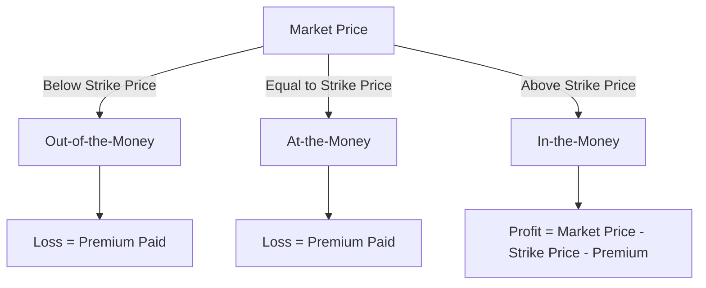
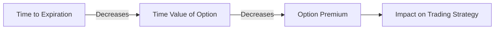

## 6.2 Key Terms: Strike Price, Expiration Date, Premium

Options trading can appear complex at first glance, but understanding its key terms can simplify the process significantly. In this section, we will delve into three critical components of an options contract: the **strike price**, the **expiration date**, and the **premium**. Each of these elements plays a vital role in determining the value and strategy of an option, and mastering these concepts is essential for anyone preparing for US Securities Exams or looking to navigate the financial markets effectively.

### Understanding the Strike Price

**Strike Price (Exercise Price):** The strike price is the predetermined price at which the option holder can buy (in the case of a call option) or sell (in the case of a put option) the underlying asset. It serves as the benchmark for determining whether an option is in-the-money, at-the-money, or out-of-the-money.

- **In-the-Money (ITM):** For a call option, when the market price of the underlying asset is above the strike price. For a put option, when the market price is below the strike price.
- **At-the-Money (ATM):** When the market price of the underlying asset is equal to the strike price.
- **Out-of-the-Money (OTM):** For a call option, when the market price is below the strike price. For a put option, when the market price is above the strike price.

The strike price is crucial because it determines the intrinsic value of the option. Intrinsic value is the real, tangible value of an option if it were exercised immediately. For example, if you hold a call option with a strike price of $50 and the current market price of the underlying asset is $60, the intrinsic value of the option is $10.

#### Visual Aid: Option Payoff Diagram for Call Options

### The Expiration Date Explained

**Expiration Date:** The expiration date is the last day on which the option can be exercised. After this date, the option becomes void and worthless. The time remaining until expiration is a critical factor in an option's time value, which is part of the option's premium.

- **American Options:** Can be exercised at any time up to the expiration date.
- **European Options:** Can only be exercised on the expiration date itself.

The expiration date affects the option's time value, which decreases as the expiration date approaches. This phenomenon is known as time decay or theta decay. As an option nears its expiration, its time value diminishes, potentially impacting the overall premium of the option.

#### Visual Aid: Time Decay in Options

### Exploring the Premium

**Premium:** The premium is the price paid by the buyer to the seller to acquire the option. It consists of two components: intrinsic value and time value. The premium is influenced by several factors, including the underlying asset's price, the strike price, the time until expiration, volatility, and interest rates.

- **Intrinsic Value:** The difference between the underlying asset's market price and the strike price, if favorable to the option holder.
- **Time Value:** The additional amount paid over the intrinsic value, reflecting the potential for future profitability.

The premium is a crucial consideration for both buyers and sellers of options. Buyers pay the premium to gain the right to exercise the option, while sellers receive the premium as compensation for taking on the obligation to fulfill the contract if the buyer exercises their right.

#### Factors Affecting Option Premium

1. **Underlying Asset Price:** Changes in the asset's price can significantly impact the premium.
2. **Volatility:** Higher volatility increases the premium due to greater potential for price swings.
3. **Time to Expiration:** More time until expiration generally increases the premium due to greater opportunity for the asset's price to move favorably.
4. **Interest Rates:** Changes in interest rates can affect the time value component of the premium.

### How These Terms Affect Option Value and Strategy

Understanding the interplay between the strike price, expiration date, and premium is vital for developing effective options trading strategies. Here are some ways these terms influence option value and strategy:

- **Strike Price Selection:** Choosing the right strike price is essential for aligning with your market outlook and risk tolerance. A lower strike price for call options or a higher strike price for put options generally increases the likelihood of the option being in-the-money.
- **Expiration Date Considerations:** Longer expiration dates provide more time for the underlying asset to move favorably, but they also come with higher premiums. Shorter expiration dates may offer lower premiums but require more precise timing.
- **Premium Evaluation:** Assessing whether the premium is justified based on the intrinsic and time values helps determine the potential profitability of the option. A high premium may require a significant move in the underlying asset to be profitable.

### Practical Example: Call Option Strategy

Imagine you are considering purchasing a call option for Company XYZ, which is currently trading at $100. You have the following options:

1. **Option A:** Strike Price of $95, Expiration in 1 month, Premium of $8.
2. **Option B:** Strike Price of $105, Expiration in 3 months, Premium of $5.

- **Option A** is in-the-money and has a higher premium due to its intrinsic value. It offers immediate profitability if the market price remains above the strike price but comes with a higher upfront cost.
- **Option B** is out-of-the-money but provides more time for the market price to rise above the strike price. It has a lower premium, reflecting its speculative nature.

Your choice will depend on your market outlook, risk tolerance, and strategy. If you expect a significant price increase, Option B might offer higher returns for a lower initial investment.

### Conclusion

Mastering the concepts of strike price, expiration date, and premium is essential for anyone involved in options trading. These terms form the foundation of option valuation and strategy, influencing decisions and potential outcomes. By understanding how these elements interact, you can develop more informed trading strategies and enhance your ability to navigate the financial markets.

## Quiz Time!



### What is the strike price in an options contract?

- [x] The predetermined price at which the option holder can buy or sell the underlying asset.
- [ ] The price paid to purchase the option contract.
- [ ] The last day the option can be exercised.
- [ ] The current market price of the underlying asset.

> **Explanation:** The strike price is the predetermined price at which the option holder can buy or sell the underlying asset, also known as the exercise price.

### What happens to an option on its expiration date?

- [x] It becomes void and worthless if not exercised.
- [ ] It automatically converts to a futures contract.
- [ ] It retains its premium value indefinitely.
- [ ] It can be exercised at any time after the expiration date.

> **Explanation:** On its expiration date, an option becomes void and worthless if not exercised. It cannot be exercised after this date.

### What component of the option premium reflects the potential for future profitability?

- [ ] Intrinsic value
- [x] Time value
- [ ] Strike price
- [ ] Expiration date

> **Explanation:** The time value component of the option premium reflects the potential for future profitability, representing the additional amount paid over the intrinsic value.

### How does higher volatility affect the option premium?

- [x] It increases the premium due to greater potential for price swings.
- [ ] It decreases the premium due to reduced market risk.
- [ ] It has no effect on the premium.
- [ ] It only affects the intrinsic value.

> **Explanation:** Higher volatility increases the option premium due to the greater potential for price swings, which can lead to profitable opportunities.

### Which type of option can be exercised at any time up to the expiration date?

- [x] American options
- [ ] European options
- [ ] Asian options
- [ ] Barrier options

> **Explanation:** American options can be exercised at any time up to the expiration date, providing more flexibility compared to European options.

### What is the intrinsic value of a call option with a strike price of $50 and a market price of $60?

- [x] $10
- [ ] $0
- [ ] $50
- [ ] $60

> **Explanation:** The intrinsic value of a call option is the difference between the market price and the strike price, which is $60 - $50 = $10.

### What does the time decay or theta decay refer to in options trading?

- [x] The decrease in an option's time value as the expiration date approaches.
- [ ] The increase in an option's intrinsic value over time.
- [ ] The stability of an option's premium regardless of time.
- [ ] The fluctuation of the underlying asset's price.

> **Explanation:** Time decay or theta decay refers to the decrease in an option's time value as the expiration date approaches, impacting the overall premium.

### How does the expiration date affect an option's time value?

- [x] More time until expiration generally increases the time value.
- [ ] Less time until expiration increases the time value.
- [ ] The expiration date has no impact on the time value.
- [ ] The expiration date only affects the intrinsic value.

> **Explanation:** More time until expiration generally increases the time value, as there is a greater opportunity for the asset's price to move favorably.

### Which factor is NOT a component of the option premium?

- [ ] Intrinsic value
- [x] Market risk
- [ ] Time value
- [ ] Volatility

> **Explanation:** Market risk is not a direct component of the option premium. The premium consists of intrinsic value and time value, influenced by factors such as volatility.

### True or False: European options can be exercised at any time before the expiration date.

- [ ] True
- [x] False

> **Explanation:** False. European options can only be exercised on the expiration date itself, unlike American options, which can be exercised at any time before expiration.


