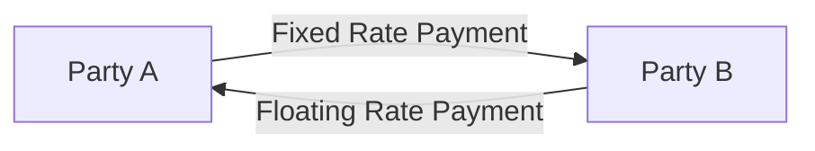

## 8.2.1 Interest Rate Swaps

Interest rate swaps are a fundamental component of the financial derivatives market, allowing institutions to manage interest rate exposure effectively. This section will provide a comprehensive understanding of interest rate swaps, their mechanics, applications, and their role in risk management. By the end of this section, you will have a solid grasp of how interest rate swaps function and how they can be used strategically in financial markets.

### Understanding Swaps

Swaps are financial agreements between two parties to exchange cash flows or liabilities from different financial instruments. These agreements are typically over-the-counter (OTC) contracts, meaning they are privately negotiated and not traded on an exchange. Swaps are used for various purposes, including hedging, speculation, and arbitrage.

### What is an Interest Rate Swap?

An interest rate swap is a contract in which two parties agree to exchange interest rate payments on a specified notional principal amount. The principal itself is not exchanged. Instead, the swap involves exchanging interest payments, typically one fixed-rate payment for one floating-rate payment. This exchange allows parties to manage their interest rate risk by altering their interest rate exposure.

**Glossary:**

- **Interest Rate Swap:** A financial contract in which two parties exchange interest rate payments on a specified principal amount.

### Mechanics of Interest Rate Swaps

Interest rate swaps involve two primary legs: the fixed leg and the floating leg. In a standard interest rate swap:

- **Fixed Leg:** One party agrees to pay a fixed interest rate on the notional principal amount.
- **Floating Leg:** The other party agrees to pay a floating interest rate, usually tied to a benchmark such as the London Interbank Offered Rate (LIBOR) or the Secured Overnight Financing Rate (SOFR).

The payments are typically made on a net basis, meaning that only the difference between the fixed and floating payments is exchanged. This reduces the cash flow exchanged between parties.

#### Diagram: Cash Flow Exchange in an Interest Rate Swap

Below is a simplified diagram illustrating the cash flow exchanges in an interest rate swap:

In this diagram, Party A pays a fixed rate to Party B, while Party B pays a floating rate to Party A.

### Applications of Interest Rate Swaps

Interest rate swaps are versatile instruments used for various purposes, including:

1. **Managing Interest Rate Exposure:** Companies and financial institutions use swaps to hedge against interest rate fluctuations. For example, a company with a floating-rate loan might enter into a swap to pay a fixed rate, thus stabilizing its interest payments.

2. **Speculation:** Traders and investors can use swaps to speculate on the direction of interest rates. By entering into a swap, they can take a position on whether rates will rise or fall.

3. **Arbitrage:** Swaps can be used to exploit differences in interest rates across markets, allowing arbitrageurs to profit from discrepancies.

4. **Asset and Liability Management:** Financial institutions use swaps to match the interest rate characteristics of their assets and liabilities, thereby managing their balance sheet risk.

### Benefits of Interest Rate Swaps

Interest rate swaps offer several benefits:

- **Flexibility:** Swaps can be tailored to meet the specific needs of the parties involved, including the notional amount, maturity, and payment frequency.

- **Cost-Effectiveness:** Swaps can be more cost-effective than other hedging instruments, such as futures or options, because they do not require an upfront premium.

- **Risk Management:** Swaps provide an efficient way to manage interest rate risk, helping institutions stabilize cash flows and reduce uncertainty.

### Practical Example: Managing Interest Rate Risk

Consider a company, XYZ Corp, with a $100 million floating-rate loan tied to LIBOR. XYZ Corp is concerned about rising interest rates and wants to lock in a fixed rate to stabilize its interest payments. XYZ Corp enters into an interest rate swap with a financial institution, agreeing to pay a fixed rate of 3% and receive LIBOR.

- **Fixed Leg:** XYZ Corp pays 3% on the $100 million notional amount.
- **Floating Leg:** The financial institution pays LIBOR on the $100 million notional amount.

By entering into this swap, XYZ Corp effectively converts its floating-rate loan into a fixed-rate obligation, thus hedging against the risk of rising interest rates.

### Risks Associated with Interest Rate Swaps

While interest rate swaps offer significant benefits, they also come with risks:

- **Counterparty Risk:** The risk that the other party in the swap agreement may default on its obligations. This risk can be mitigated through credit support annexes and collateral agreements.

- **Market Risk:** Changes in interest rates can affect the value of the swap, leading to potential losses if the market moves against the position.

- **Liquidity Risk:** Swaps are OTC instruments and may not be as liquid as exchange-traded derivatives, making it difficult to unwind positions quickly.

### Regulatory Considerations

Interest rate swaps are subject to regulatory oversight to ensure transparency and reduce systemic risk. In the United States, the Dodd-Frank Wall Street Reform and Consumer Protection Act introduced several measures, including:

- **Central Clearing:** Many swaps must be cleared through central counterparties (CCPs) to reduce counterparty risk.
- **Reporting Requirements:** Swaps must be reported to swap data repositories (SDRs) to enhance market transparency.
- **Margin Requirements:** Parties may be required to post collateral to cover potential losses.

### Conclusion

Interest rate swaps are powerful financial instruments that play a crucial role in managing interest rate risk. By understanding the mechanics, applications, and risks associated with swaps, you can effectively use them to achieve your financial objectives. Whether you are looking to hedge against interest rate fluctuations, speculate on rate movements, or manage your balance sheet, interest rate swaps offer a flexible and cost-effective solution.

---

## Quiz Time!



### What is an interest rate swap?

- [x] A contract where two parties exchange interest rate payments on a specified principal amount.
- [ ] A contract to buy or sell a commodity at a future date.
- [ ] An agreement to exchange currencies at a fixed rate.
- [ ] A derivative used exclusively for speculation.

> **Explanation:** An interest rate swap is a contract in which two parties exchange interest rate payments on a specified notional principal amount.

### In an interest rate swap, what is typically exchanged?

- [x] Interest rate payments
- [ ] Principal amounts
- [ ] Stock shares
- [ ] Currency

> **Explanation:** In an interest rate swap, only the interest rate payments are exchanged, not the principal amounts.

### What is the primary purpose of an interest rate swap?

- [x] To manage interest rate exposure
- [ ] To exchange currencies
- [ ] To speculate on stock prices
- [ ] To hedge against commodity price changes

> **Explanation:** The primary purpose of an interest rate swap is to manage interest rate exposure by converting fixed-rate payments to floating-rate payments or vice versa.

### Which of the following is a risk associated with interest rate swaps?

- [x] Counterparty risk
- [ ] Inflation risk
- [ ] Currency risk
- [ ] Political risk

> **Explanation:** Counterparty risk is a significant risk in interest rate swaps, as there is a possibility that the other party may default on its obligations.

### How can interest rate swaps be used in asset and liability management?

- [x] By matching the interest rate characteristics of assets and liabilities
- [ ] By converting assets into liabilities
- [ ] By increasing the volatility of cash flows
- [ ] By reducing the duration of liabilities

> **Explanation:** Interest rate swaps can be used to match the interest rate characteristics of assets and liabilities, helping institutions manage their balance sheet risk.

### What is the fixed leg in an interest rate swap?

- [x] The party that pays a fixed interest rate
- [ ] The party that pays a floating interest rate
- [ ] The party that exchanges principal amounts
- [ ] The party that speculates on interest rate movements

> **Explanation:** The fixed leg in an interest rate swap is the party that pays a fixed interest rate on the notional principal amount.

### What regulatory measure requires swaps to be cleared through central counterparties?

- [x] Central Clearing
- [ ] Margin Requirements
- [ ] Reporting Requirements
- [ ] Capital Adequacy

> **Explanation:** Central Clearing is a regulatory measure that requires many swaps to be cleared through central counterparties to reduce counterparty risk.

### Which benchmark is commonly used for the floating leg in an interest rate swap?

- [x] LIBOR
- [ ] S&P 500
- [ ] NASDAQ
- [ ] Dow Jones

> **Explanation:** LIBOR (London Interbank Offered Rate) is a common benchmark used for the floating leg in an interest rate swap.

### What is the benefit of netting payments in an interest rate swap?

- [x] It reduces the cash flow exchanged between parties.
- [ ] It increases the interest rate exposure.
- [ ] It eliminates counterparty risk.
- [ ] It guarantees a profit for both parties.

> **Explanation:** Netting payments in an interest rate swap reduces the cash flow exchanged between parties, making the transaction more efficient.

### True or False: Interest rate swaps are typically exchange-traded instruments.

- [ ] True
- [x] False

> **Explanation:** False. Interest rate swaps are typically over-the-counter (OTC) instruments, meaning they are privately negotiated and not traded on an exchange.



---

By understanding the intricacies of interest rate swaps, you are better equipped to manage interest rate risk and make informed financial decisions. This knowledge is crucial for both exam preparation and practical application in the financial industry.
