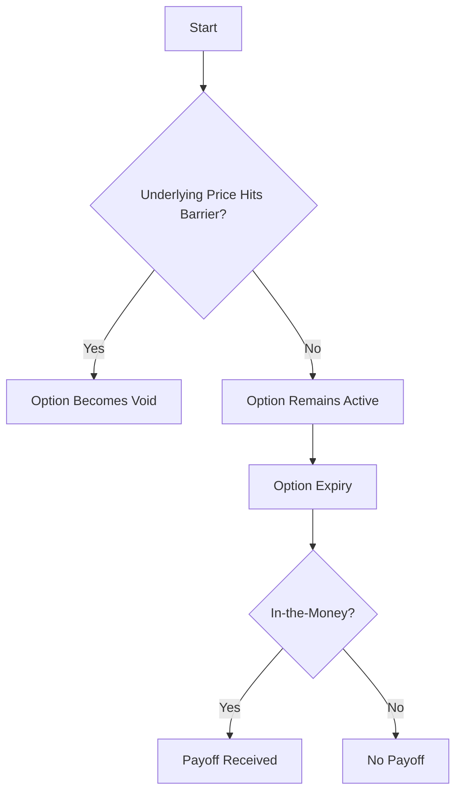

## 9.3 Exotic Options

In the world of financial derivatives, exotic options stand out due to their unique and complex features that differentiate them from standard options. These instruments are tailored to meet specific financial needs and strategies, offering investors and traders a range of possibilities beyond the conventional call and put options. This section delves into the intricacies of exotic options, providing a comprehensive understanding of their types, purposes, risks, and real-world applications.

### Understanding Exotic Options

**Exotic Options** are non-standard option contracts that possess more intricate features compared to traditional options. They are often customized to suit the specific requirements of investors, allowing for tailored risk management and speculative strategies. Unlike standard options, which have straightforward structures and are traded on regulated exchanges, exotic options are typically traded over-the-counter (OTC), providing flexibility in terms of contract specifications.

#### Key Characteristics of Exotic Options

- **Complex Structures:** Exotic options can have multiple underlying assets, varying payoff structures, and conditions that must be met for execution.
- **Tailored Contracts:** These options are often customized to meet specific investor needs, making them ideal for unique hedging or speculative strategies.
- **OTC Trading:** Most exotic options are traded in the over-the-counter market, allowing for greater flexibility but also introducing counterparty risk.

### Types of Exotic Options

Exotic options come in various forms, each with distinct features and applications. Below are some of the most common types of exotic options:

#### Barrier Options

Barrier options are a type of exotic option where the payoff depends on whether the underlying asset's price reaches a predetermined barrier level during the option's life. They are further divided into knock-in and knock-out options.

- **Knock-In Options:** These options become active only if the underlying asset's price hits a specific barrier level.
- **Knock-Out Options:** These options become void if the underlying asset's price hits a specific barrier level.

**Example:** Consider a knock-out call option on a stock with a barrier level set at $150. If the stock price reaches or exceeds $150 during the option's life, the option becomes void, regardless of its intrinsic value.

#### Asian Options

Asian options, also known as average options, derive their value from the average price of the underlying asset over a specified period rather than the price at a single point in time. This feature reduces the impact of volatility and price manipulation.

- **Average Price Options:** The payoff is determined by the difference between the average price of the underlying asset and the strike price.
- **Average Strike Options:** The strike price is set as the average price of the underlying asset over the option's life.

**Example:** An Asian call option on a commodity might use the average price of the commodity over the last month to determine its payoff, providing a more stable return profile.

#### Binary Options

Binary options, also known as digital options, offer a fixed payoff based on whether a certain condition is met at expiration. They are often used for speculative purposes due to their all-or-nothing payoff structure.

- **Cash-or-Nothing:** Pays a fixed amount if the option expires in-the-money.
- **Asset-or-Nothing:** Pays the value of the underlying asset if the option expires in-the-money.

**Example:** A binary option on a currency pair might pay $100 if the exchange rate is above a certain level at expiration, offering a straightforward risk-reward scenario.

### Purposes and Applications of Exotic Options

Exotic options serve various purposes in the financial markets, offering unique advantages for hedging, speculation, and arbitrage.

#### Hedging

Exotic options can be tailored to provide precise hedging solutions for complex financial exposures. For instance, a company with exposure to foreign exchange risk might use barrier options to hedge against adverse currency movements while minimizing premium costs.

#### Speculation

Traders often use exotic options to speculate on market movements with a defined risk profile. Binary options, for example, allow traders to take directional bets on asset prices with a clear understanding of potential gains and losses.

#### Arbitrage

Exotic options can also be used in arbitrage strategies to exploit price discrepancies in the market. Their complex structures allow for unique combinations that can capitalize on inefficiencies between related financial instruments.

### Risks Associated with Exotic Options

While exotic options offer numerous benefits, they also come with inherent risks that must be carefully considered.

#### Complexity

The intricate structures of exotic options can make them difficult to understand and value accurately. This complexity can lead to mispricing and unexpected outcomes if not managed properly.

#### Liquidity

Exotic options are primarily traded OTC, which can result in lower liquidity compared to standard exchange-traded options. This lack of liquidity can make it challenging to enter or exit positions at desired prices.

#### Counterparty Risk

Since exotic options are often traded OTC, they carry counterparty risk, meaning that the other party in the transaction may fail to fulfill their obligations.

#### Regulatory Considerations

The regulatory environment for exotic options can vary significantly across jurisdictions. Traders and investors must be aware of the specific rules and regulations governing these instruments in their respective markets.

### Practical Examples and Case Studies

To illustrate the practical applications of exotic options, consider the following scenarios:

#### Case Study 1: Using Barrier Options for Cost-Effective Hedging

A multinational corporation expects to receive a large payment in euros in six months. To hedge against a potential decline in the euro's value, the company purchases a knock-in put option with a barrier level slightly below the current exchange rate. This strategy provides a cost-effective hedge, as the option premium is lower than a standard put option due to the barrier feature.

#### Case Study 2: Speculating with Binary Options

An investor believes that a specific stock will experience a significant price increase following an upcoming earnings announcement. They purchase a binary call option with a payoff of $500 if the stock price exceeds a certain threshold. This speculative bet offers a high potential return with a fixed risk, aligning with the investor's market view.

### Diagrams and Visuals

To enhance your understanding of exotic options, consider the following diagram illustrating the payoff structure of a barrier option:

### Best Practices and Cautionary Notes

When dealing with exotic options, it is crucial to adhere to best practices to manage risks effectively:

- **Thorough Understanding:** Ensure a comprehensive understanding of the option's structure and payoff conditions before entering a position.
- **Risk Assessment:** Conduct a detailed risk assessment to evaluate potential outcomes and their impact on your overall portfolio.
- **Regulatory Compliance:** Stay informed about the regulatory requirements governing exotic options in your jurisdiction to avoid legal complications.

### Conclusion

Exotic options offer a fascinating and complex world of financial derivatives that can be leveraged for various strategic purposes. While they provide unique opportunities for hedging, speculation, and arbitrage, they also come with significant risks that require careful consideration and management. By understanding the features, applications, and risks of exotic options, you can make informed decisions and effectively integrate these instruments into your financial strategies.

## Quiz Time!



### Which of the following is a characteristic of exotic options?

- [x] Complex structures
- [ ] Standardized contracts
- [ ] Traded on regulated exchanges
- [ ] Simple payoff structures

> **Explanation:** Exotic options are known for their complex structures, which differentiate them from standard options.

### What is a knock-out option?

- [x] An option that becomes void if the underlying price hits a barrier
- [ ] An option that activates when the underlying price hits a barrier
- [ ] An option with a fixed payoff
- [ ] An option with no expiration date

> **Explanation:** A knock-out option becomes void if the underlying asset's price hits a predetermined barrier level.

### How do Asian options determine their payoff?

- [x] Based on the average price of the underlying asset
- [ ] Based on the highest price of the underlying asset
- [ ] Based on the lowest price of the underlying asset
- [ ] Based on the initial price of the underlying asset

> **Explanation:** Asian options use the average price of the underlying asset over a specified period to determine their payoff.

### What is a binary option?

- [x] An option with an all-or-nothing payoff
- [ ] An option with a variable payoff
- [ ] An option based on multiple assets
- [ ] An option with no strike price

> **Explanation:** Binary options offer a fixed payoff based on whether a certain condition is met at expiration.

### Which of the following is a risk associated with exotic options?

- [x] Complexity
- [ ] High liquidity
- [ ] Standardized pricing
- [ ] Regulated trading

> **Explanation:** The complexity of exotic options can lead to mispricing and unexpected outcomes.

### What is the primary market for trading exotic options?

- [x] Over-the-counter (OTC) market
- [ ] New York Stock Exchange (NYSE)
- [ ] Chicago Board Options Exchange (CBOE)
- [ ] NASDAQ

> **Explanation:** Exotic options are primarily traded in the over-the-counter market, allowing for customized contracts.

### How can exotic options be used for hedging?

- [x] By tailoring contracts to specific financial exposures
- [ ] By providing standardized risk management
- [ ] By offering high liquidity
- [ ] By eliminating all market risks

> **Explanation:** Exotic options can be customized to provide precise hedging solutions for complex financial exposures.

### What is counterparty risk in exotic options?

- [x] The risk that the other party may fail to fulfill their obligations
- [ ] The risk of market volatility
- [ ] The risk of regulatory changes
- [ ] The risk of high trading fees

> **Explanation:** Counterparty risk refers to the possibility that the other party in an OTC transaction may not meet their contractual obligations.

### Which type of exotic option uses the average price of the underlying asset?

- [x] Asian option
- [ ] Barrier option
- [ ] Binary option
- [ ] Vanilla option

> **Explanation:** Asian options determine their payoff based on the average price of the underlying asset over a specified period.

### Exotic options are typically traded on regulated exchanges.

- [ ] True
- [x] False

> **Explanation:** Exotic options are usually traded over-the-counter (OTC), not on regulated exchanges.


