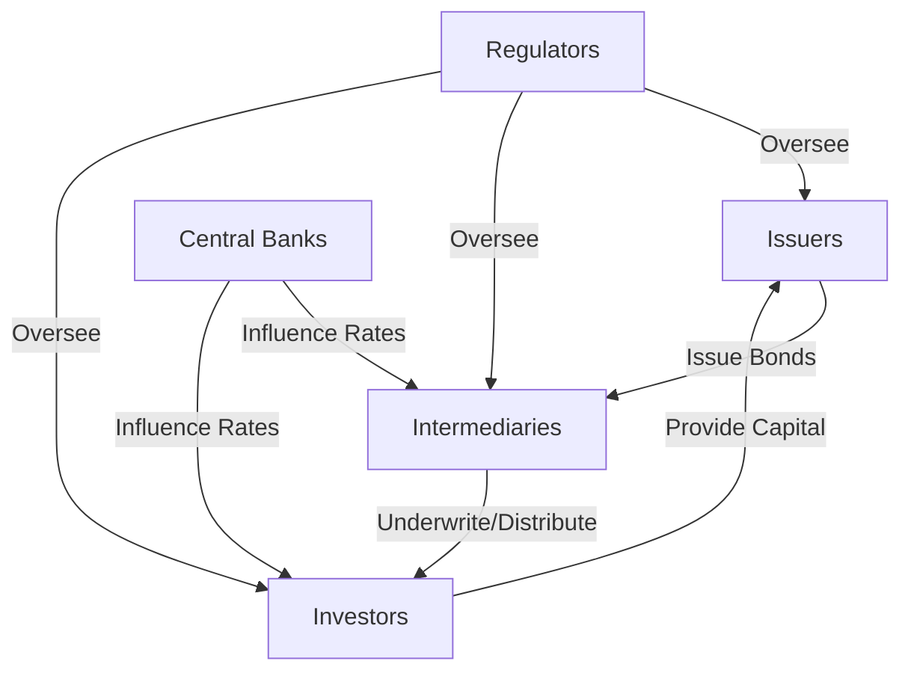

## 1.1.2 Key Participants in the Fixed Income Markets

Understanding the key participants in the fixed income markets is essential for anyone looking to master bonds and fixed income securities. These markets are complex ecosystems where various entities interact to facilitate the issuance, trading, and regulation of bonds and other fixed income instruments. In this section, we will explore the roles of issuers, investors, intermediaries, and regulators, and examine how each contributes to the functioning and efficiency of the bond market. We will also discuss the impact of central banks and their monetary policies on these markets.

### Issuers

Issuers are entities that develop, register, and sell securities to finance their operations. They are the primary source of fixed income securities and play a crucial role in the bond markets.

#### 1. Government Issuers

Governments issue bonds to finance public projects and manage national debt. These bonds are considered low-risk investments due to the backing of governmental authority. Government bonds include:

- **U.S. Treasury Securities**: These are issued by the U.S. Department of the Treasury and include Treasury bills, notes, and bonds. They are considered the safest investments due to the full faith and credit of the U.S. government.
- **Municipal Bonds**: Issued by states, cities, and other local government entities, these bonds finance public infrastructure projects. They often offer tax advantages to investors.

#### 2. Corporate Issuers

Corporations issue bonds to raise capital for expansion, acquisitions, and other business activities. Corporate bonds can vary widely in terms of risk and return, depending on the issuing company's creditworthiness.

- **Investment-Grade Bonds**: Issued by companies with strong credit ratings, these bonds offer lower yields but are considered safer investments.
- **High-Yield Bonds**: Also known as junk bonds, these are issued by companies with lower credit ratings and offer higher yields to compensate for increased risk.

#### 3. International Issuers

International entities, including foreign governments and corporations, issue bonds to tap into the global capital markets. These bonds can provide diversification benefits but also come with additional risks, such as currency and geopolitical risks.

### Investors

Investors are individuals or institutions that allocate capital with the expectation of receiving financial returns. They are the demand side of the bond market and play a vital role in determining market dynamics.

#### 1. Individual Investors

Individual investors, often referred to as retail investors, participate in the bond markets by purchasing government and corporate bonds through brokerage accounts or mutual funds. They seek stable income and capital preservation.

#### 2. Institutional Investors

Institutional investors include entities such as pension funds, insurance companies, mutual funds, and hedge funds. These participants have significant capital and influence market trends due to their large-scale investments.

- **Pension Funds**: These funds invest in bonds to match their long-term liabilities with stable income streams.
- **Insurance Companies**: They invest in fixed income securities to ensure they can meet future policyholder claims.
- **Mutual Funds and ETFs**: These funds pool capital from many investors to invest in diversified portfolios of bonds.

### Intermediaries

Intermediaries are financial institutions that act as middlemen between two parties in a financial transaction. They facilitate the issuance, trading, and settlement of bonds.

#### 1. Investment Banks

Investment banks play a crucial role in the bond markets by underwriting new bond issues, providing advisory services, and facilitating mergers and acquisitions. They help issuers structure and price their bond offerings.

#### 2. Brokers and Dealers

Brokers and dealers facilitate the buying and selling of bonds in the secondary market. Brokers act as agents for investors, while dealers trade bonds for their own accounts, providing liquidity to the market.

#### 3. Rating Agencies

Credit rating agencies assess the creditworthiness of bond issuers and assign ratings that influence the interest rates and terms of bond issues. Major agencies include Moody's, Standard & Poor's, and Fitch Ratings.

### Regulators

Regulators oversee the bond markets to ensure transparency, fairness, and investor protection. They establish rules and guidelines that govern market activities.

#### 1. Securities and Exchange Commission (SEC)

The SEC regulates the U.S. securities markets, including the issuance and trading of bonds. It enforces securities laws to protect investors and maintain orderly markets.

#### 2. Financial Industry Regulatory Authority (FINRA)

FINRA oversees broker-dealers and enforces rules that govern the conduct of market participants. It plays a key role in ensuring market integrity and investor protection.

#### 3. Municipal Securities Rulemaking Board (MSRB)

The MSRB regulates the municipal securities market, establishing rules for brokers, dealers, and municipal advisors to ensure fair and efficient market practices.

### Central Banks and Monetary Policy

Central banks, such as the Federal Reserve in the United States, have a significant impact on the fixed income markets through their monetary policy decisions. They influence interest rates, which directly affect bond prices and yields.

- **Open Market Operations**: Central banks buy and sell government securities to influence the money supply and interest rates.
- **Interest Rate Policy**: By setting benchmark interest rates, central banks guide economic activity and inflation, impacting bond market conditions.
- **Quantitative Easing**: In times of economic stress, central banks may purchase large quantities of bonds to inject liquidity into the financial system.

### Flow of Capital in the Fixed Income Markets

To better understand the interactions between these participants, consider the following diagram illustrating the flow of capital in the fixed income markets:

### Conclusion

The fixed income markets are a dynamic and complex ecosystem with multiple participants, each playing a critical role in ensuring market efficiency and stability. Issuers provide the supply of bonds, while investors create demand. Intermediaries facilitate transactions, and regulators ensure the integrity of the markets. Central banks influence these markets through monetary policy, impacting interest rates and economic conditions. Understanding the roles and interactions of these participants is essential for mastering bonds and fixed income securities.

---

## Bonds and Fixed Income Securities Quiz: Key Participants in the Fixed Income Markets



### Who are the primary issuers in the fixed income markets?

- [x] Governments, municipalities, and corporations
- [ ] Only governments
- [ ] Only corporations
- [ ] Only international entities

> **Explanation:** The primary issuers in the fixed income markets include governments, municipalities, and corporations. These entities issue bonds to raise capital for various purposes.

### What role do institutional investors play in the bond markets?

- [ ] They only provide advisory services
- [x] They invest large amounts of capital, influencing market trends
- [ ] They act as intermediaries between buyers and sellers
- [ ] They regulate the bond markets

> **Explanation:** Institutional investors, such as pension funds and insurance companies, invest large amounts of capital in the bond markets, significantly influencing market trends due to their scale.

### How do investment banks contribute to the bond markets?

- [ ] By regulating market activities
- [ ] By investing in bonds for long-term gains
- [x] By underwriting new bond issues and providing advisory services
- [ ] By setting interest rates

> **Explanation:** Investment banks contribute to the bond markets by underwriting new bond issues, providing advisory services, and facilitating mergers and acquisitions.

### Which entity regulates the U.S. securities markets, including bonds?

- [ ] FINRA
- [ ] MSRB
- [x] SEC
- [ ] Federal Reserve

> **Explanation:** The Securities and Exchange Commission (SEC) regulates the U.S. securities markets, including the issuance and trading of bonds, ensuring transparency and investor protection.

### What is the role of central banks in the fixed income markets?

- [x] To influence interest rates through monetary policy
- [ ] To issue corporate bonds
- [ ] To provide credit ratings for bonds
- [ ] To act as brokers in the bond market

> **Explanation:** Central banks influence the fixed income markets by setting interest rates and conducting monetary policy, which directly affects bond prices and yields.

### What is a key function of credit rating agencies in the bond markets?

- [ ] To regulate bond issuance
- [x] To assess the creditworthiness of bond issuers
- [ ] To underwrite new bond issues
- [ ] To buy and sell bonds

> **Explanation:** Credit rating agencies assess the creditworthiness of bond issuers and assign ratings that influence the interest rates and terms of bond issues.

### How do brokers and dealers facilitate bond trading?

- [x] By acting as intermediaries in the secondary market
- [ ] By issuing new bonds
- [ ] By setting regulatory standards
- [ ] By providing credit ratings

> **Explanation:** Brokers and dealers facilitate bond trading by acting as intermediaries in the secondary market, helping investors buy and sell bonds.

### Which participant is responsible for overseeing broker-dealers in the U.S.?

- [ ] SEC
- [x] FINRA
- [ ] MSRB
- [ ] Federal Reserve

> **Explanation:** The Financial Industry Regulatory Authority (FINRA) oversees broker-dealers in the U.S., ensuring compliance with market rules and protecting investors.

### What is the impact of quantitative easing on the bond markets?

- [ ] It decreases bond prices
- [x] It injects liquidity into the financial system
- [ ] It increases interest rates
- [ ] It reduces the money supply

> **Explanation:** Quantitative easing involves central banks purchasing large quantities of bonds to inject liquidity into the financial system, supporting economic activity.

### What is the primary goal of municipal bond issuance?

- [ ] To finance corporate acquisitions
- [ ] To influence monetary policy
- [x] To finance public infrastructure projects
- [ ] To regulate the bond markets

> **Explanation:** Municipal bonds are issued by local governments to finance public infrastructure projects, such as schools, roads, and utilities.



---
