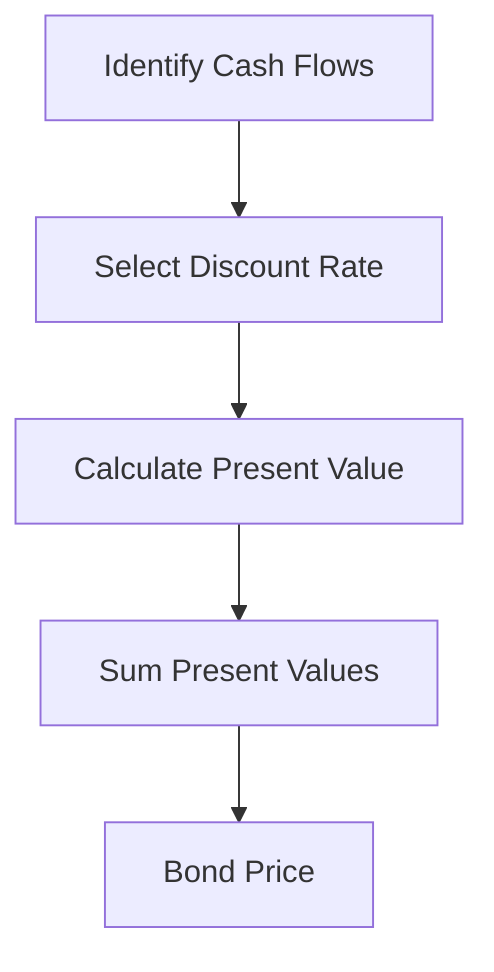

## 1.2.1 Defining Bonds and Fixed Income Securities

In the world of finance, bonds and fixed income securities represent a cornerstone of investment strategies, offering a reliable means to generate income while preserving capital. Understanding these instruments is crucial for anyone involved in financial markets, whether as an investor, analyst, or finance professional. This section provides a comprehensive overview of bonds, their defining features, and their role as fixed income securities.

### What is a Bond?

At its core, a bond is a debt instrument issued by entities such as governments, municipalities, or corporations to raise capital. When you purchase a bond, you are essentially lending money to the issuer in exchange for periodic interest payments and the return of the bond's face value, or principal, upon maturity.

#### The Contractual Agreement

A bond represents a contractual obligation between the issuer and the bondholder. This agreement includes:

- **Principal:** The face value of the bond, which is the amount borrowed by the issuer and repaid at maturity.
- **Interest (Coupon):** The periodic payments made to the bondholder as compensation for lending funds. These payments are typically made semi-annually or annually and are calculated based on the coupon rate.
- **Maturity Date:** The date on which the bond's principal is repaid to the bondholder, marking the end of the bond's life.

The issuer is legally bound to meet these obligations, making bonds a relatively secure investment compared to equities, where dividends are not guaranteed.

### Bonds vs. Other Forms of Debt

While bonds are a form of debt, they differ from other debt instruments like loans or notes in several key ways:

1. **Marketability:** Bonds are generally more liquid than loans, as they are traded on secondary markets, allowing investors to buy and sell them before maturity.

2. **Standardization:** Bonds are typically standardized in terms of face value, coupon rate, and maturity, making them easier to trade and analyze.

3. **Regulation:** Bonds, especially those issued in public markets, are subject to regulatory oversight, ensuring transparency and protection for investors.

4. **Interest Payments:** Unlike loans, which may have variable interest rates, bonds usually have fixed coupon rates, providing predictable income streams.

### Key Characteristics of Bonds

To be classified as a bond, an instrument must possess certain characteristics:

- **Issuer:** Bonds can be issued by various entities, including sovereign governments, municipalities, and corporations. The creditworthiness of the issuer is a critical factor in determining the bond's risk and yield.

- **Coupon Rate:** This is the interest rate that the bond issuer agrees to pay the bondholder. It is expressed as a percentage of the bond's face value.

- **Face Value (Par Value):** The amount that the bondholder will receive upon the bond's maturity. This is typically $1,000 for corporate bonds, though it can vary.

- **Maturity:** Bonds can have varying maturities, ranging from short-term (less than one year) to long-term (over ten years). The maturity affects the bond's interest rate risk and price volatility.

- **Yield:** The bond's yield is a measure of its return, taking into account the coupon payments and any capital gains or losses if the bond is sold before maturity.

### Practical Examples and Case Studies

To illustrate the practical applications of bonds, consider the following scenarios:

#### Example 1: Government Bonds

Government bonds, such as U.S. Treasury securities, are considered one of the safest investments due to the backing of the federal government. They are used to finance government spending and manage monetary policy. For instance, during economic downturns, governments may issue bonds to stimulate growth by funding infrastructure projects.

#### Example 2: Corporate Bonds

Corporations issue bonds to raise capital for expansion, acquisitions, or refinancing existing debt. A well-known example is Apple's issuance of corporate bonds to fund its stock buyback program. Despite having substantial cash reserves, Apple opted for debt financing to take advantage of low-interest rates, demonstrating strategic financial management.

#### Example 3: Municipal Bonds

Municipal bonds are issued by state and local governments to fund public projects like schools, highways, and hospitals. These bonds often offer tax-exempt interest, making them attractive to investors in higher tax brackets. For example, the construction of a new public school may be financed through the issuance of municipal bonds, providing benefits to both the community and investors.

### Real-World Applications and Regulatory Scenarios

Understanding bonds also involves recognizing the regulatory environment and compliance considerations. In the U.S., the Securities and Exchange Commission (SEC) oversees the issuance and trading of bonds to protect investors and maintain fair markets. Key regulations include:

- **Securities Act of 1933:** Requires issuers to register new securities offerings with the SEC, providing investors with essential information through a prospectus.

- **Securities Exchange Act of 1934:** Regulates secondary trading of securities, including bonds, and establishes the SEC to enforce securities laws.

### Step-by-Step Guidance: Bond Valuation

Valuing bonds involves calculating the present value of future cash flows, including coupon payments and the principal repayment. Here's a step-by-step guide:

1. **Identify Cash Flows:** Determine the bond's coupon payments and principal repayment.

2. **Select a Discount Rate:** Use the bond's yield to maturity as the discount rate.

3. **Calculate Present Value:** Discount each cash flow back to the present using the formula:

   
   PV = \frac{C}{(1 + r)^1} + \frac{C}{(1 + r)^2} + \ldots + \frac{C + FV}{(1 + r)^n}
   

   Where \\( PV \\) is the present value, \\( C \\) is the coupon payment, \\( r \\) is the discount rate, and \\( FV \\) is the face value of the bond.

4. **Sum the Present Values:** The bond's price is the sum of the present values of all cash flows.

### Diagrams and Visual Aids

To enhance understanding, consider the following diagram illustrating the bond valuation process:

### Best Practices and Common Pitfalls

When investing in bonds, consider the following best practices:

- **Assess Credit Risk:** Evaluate the issuer's creditworthiness to understand the risk of default.

- **Consider Interest Rate Risk:** Be aware of how changes in interest rates affect bond prices, particularly for long-term bonds.

- **Diversify:** Spread investments across different issuers, sectors, and maturities to mitigate risk.

Common pitfalls include:

- **Ignoring Inflation:** Inflation can erode the real return on bonds, particularly those with fixed coupon rates.

- **Overlooking Tax Implications:** Understand the tax treatment of bond interest and capital gains to optimize after-tax returns.

### References and Further Reading

For a deeper understanding of bonds and fixed income securities, consider these resources:

- Corporate Finance Institute (CFI) - [What is a Bond?](https://corporatefinanceinstitute.com/resources/knowledge/trading-investing/bond/)
- Securities and Exchange Commission (SEC) - [Bond Basics](https://www.investor.gov/introduction-investing/investing-basics/investment-products/bonds)

### Conclusion

Bonds and fixed income securities play a vital role in financial markets, offering a stable income source and diversification benefits. By understanding their defining features and how they function, you can make informed investment decisions and effectively manage risk. As you prepare for the US Securities Exams, remember to focus on the key characteristics of bonds, the regulatory environment, and valuation techniques to enhance your mastery of this essential asset class.

---

## Bonds and Fixed Income Securities Quiz: Defining Bonds and Fixed Income Securities



### What is the primary function of a bond?

- [x] To raise capital by borrowing funds from investors
- [ ] To provide equity ownership in a company
- [ ] To offer a platform for trading derivatives
- [ ] To facilitate foreign exchange transactions

> **Explanation:** A bond is a debt instrument used by issuers to raise capital by borrowing funds from investors, who in return receive periodic interest payments and the principal at maturity.

### Which of the following is NOT a characteristic of bonds?

- [ ] Fixed interest payments
- [ ] Maturity date
- [ ] Ownership rights in a company
- [x] Equity stake in the issuer

> **Explanation:** Bonds do not provide ownership rights or equity stakes in the issuing entity. They are debt instruments obligating the issuer to repay the principal with interest.

### What is the term for the periodic interest payment made to bondholders?

- [ ] Principal
- [x] Coupon
- [ ] Dividend
- [ ] Premium

> **Explanation:** The periodic interest payment made to bondholders is known as the coupon. It is typically expressed as a percentage of the bond's face value.

### How does a bond differ from a loan?

- [x] Bonds are typically traded in secondary markets, while loans are not.
- [ ] Loans have fixed interest rates, while bonds do not.
- [ ] Bonds provide ownership rights, while loans do not.
- [ ] Loans are issued by governments, while bonds are not.

> **Explanation:** Bonds are generally more liquid than loans because they are traded in secondary markets, allowing investors to buy and sell them before maturity.

### Which regulatory body oversees the issuance and trading of bonds in the U.S.?

- [ ] Federal Reserve
- [ ] Department of Treasury
- [x] Securities and Exchange Commission (SEC)
- [ ] Financial Industry Regulatory Authority (FINRA)

> **Explanation:** The Securities and Exchange Commission (SEC) regulates the issuance and trading of securities, including bonds, to protect investors and maintain fair markets.

### What is the face value of a bond?

- [ ] The market price at which the bond is traded
- [ ] The interest payment received by the bondholder
- [x] The amount repaid to the bondholder at maturity
- [ ] The annual yield of the bond

> **Explanation:** The face value, or par value, of a bond is the amount that will be repaid to the bondholder at maturity.

### Which of the following best describes a bond's yield?

- [ ] The bond's market price
- [ ] The bond's maturity date
- [x] The bond's return, considering coupon payments and capital gains/losses
- [ ] The bond's credit rating

> **Explanation:** A bond's yield is a measure of its return, accounting for coupon payments and any capital gains or losses if the bond is sold before maturity.

### What is a key risk associated with investing in bonds?

- [ ] Currency risk
- [x] Interest rate risk
- [ ] Commodity price risk
- [ ] Political risk

> **Explanation:** Interest rate risk is a key concern for bond investors, as changes in interest rates can significantly affect bond prices, especially for long-term bonds.

### Which type of bond is considered one of the safest investments?

- [ ] Corporate bonds
- [x] Government bonds
- [ ] High-yield bonds
- [ ] Convertible bonds

> **Explanation:** Government bonds, such as U.S. Treasury securities, are considered one of the safest investments due to the backing of the federal government.

### What is the purpose of a bond's maturity date?

- [ ] To determine the bond's interest rate
- [x] To specify when the principal will be repaid to the bondholder
- [ ] To calculate the bond's yield
- [ ] To assess the bond's credit risk

> **Explanation:** The maturity date of a bond specifies when the principal will be repaid to the bondholder, marking the end of the bond's life.



---

