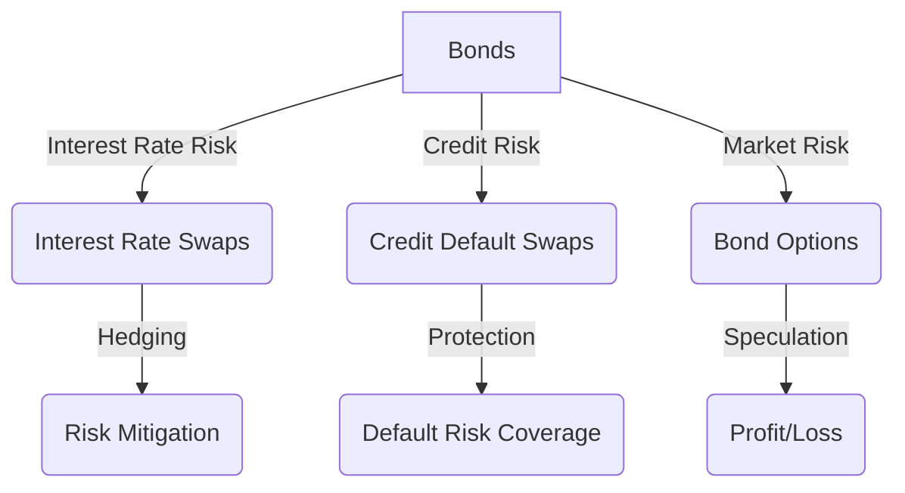

## 1.2.3.2 Bonds vs. Derivatives

In the realm of financial markets, bonds and derivatives serve distinct yet interconnected purposes, each playing a pivotal role in investment strategies, risk management, and market dynamics. Understanding these instruments, their characteristics, and how they differ is crucial for anyone involved in finance, whether as an investor, a finance professional, or a student preparing for securities exams.

### Primary Purposes of Bonds and Derivatives

**Bonds** are debt instruments issued by corporations, governments, and other entities to raise capital. They are essentially loans made by investors to the issuer, which promises to pay back the principal amount on a specified maturity date along with periodic interest payments (coupons). Bonds are primarily used for:

- **Income Generation**: Bonds provide a steady stream of income through interest payments, making them attractive to income-focused investors.
- **Capital Preservation**: As relatively low-risk investments compared to equities, bonds are often used to preserve capital.
- **Diversification**: Bonds can help diversify a portfolio, reducing overall risk due to their typically lower correlation with stocks.

**Derivatives**, on the other hand, are financial contracts whose value is derived from an underlying asset, index, or rate. They are used for:

- **Hedging**: Derivatives allow investors and companies to hedge against price fluctuations in underlying assets, protecting against adverse price movements.
- **Speculation**: Traders use derivatives to speculate on future price movements of underlying assets, aiming to profit from market volatility.
- **Leverage**: Derivatives can provide significant leverage, allowing investors to gain large exposures with a relatively small amount of capital.

### Risk Differences: Market Risk, Credit Risk, and Counterparty Risk

The risks associated with bonds and derivatives differ significantly due to their nature and structure:

#### Bonds

- **Market Risk**: Bond prices are sensitive to changes in interest rates. When rates rise, bond prices typically fall, and vice versa. This inverse relationship poses a market risk to bondholders.
- **Credit Risk**: This is the risk that the bond issuer will default on its payments. Credit ratings provided by agencies like Moody's and Standard & Poor's help assess this risk.
- **Inflation Risk**: Inflation can erode the purchasing power of the fixed interest payments from bonds.

#### Derivatives

- **Market Risk**: Derivatives are highly sensitive to changes in the value of the underlying assets, which can lead to significant gains or losses.
- **Counterparty Risk**: This is the risk that the other party in the derivative contract will default on its obligations. Over-the-counter (OTC) derivatives are particularly exposed to this risk due to the lack of a central clearinghouse.
- **Leverage Risk**: The leverage inherent in many derivatives can amplify both gains and losses, leading to potentially significant financial exposure.

### Common Derivatives and Their Relationship with Bonds

Derivatives can be linked to bonds in various ways, serving as tools for managing bond-related risks or enhancing returns. Here are some common derivatives associated with bonds:

#### Options

- **Bond Options**: These are options on bonds, allowing the holder to buy or sell a bond at a specified price before a certain date. They can be used to hedge against interest rate movements or speculate on bond price changes.
- **Interest Rate Options**: These include options on interest rates, such as caps, floors, and collars, which can help manage interest rate exposure.

#### Futures

- **Bond Futures**: These are standardized contracts to buy or sell a bond at a predetermined price on a specified future date. They are often used to hedge against interest rate risk.
- **Interest Rate Futures**: Similar to bond futures, these are based on interest rates and are used to hedge against fluctuations in interest rates.

#### Swaps

- **Interest Rate Swaps**: These involve exchanging fixed interest payments for floating rate payments, or vice versa. They are commonly used to manage interest rate risk associated with bond portfolios.
- **Credit Default Swaps (CDS)**: These are insurance-like contracts that provide protection against the default of a bond issuer. They are used to hedge credit risk.

### Practical Examples and Case Studies

To illustrate the interplay between bonds and derivatives, consider the following scenarios:

#### Example 1: Hedging with Interest Rate Swaps

A corporation with a large portfolio of fixed-rate bonds is concerned about rising interest rates, which could decrease the market value of its bonds. To hedge this risk, the corporation enters into an interest rate swap, exchanging its fixed interest payments for floating rate payments. This strategy helps mitigate the impact of rising rates on the bond portfolio's value.

#### Example 2: Speculating with Bond Futures

An investor anticipates a decline in interest rates, which would increase bond prices. To capitalize on this expectation, the investor buys bond futures contracts, betting that bond prices will rise. If the investor's prediction is correct, they can sell the futures at a higher price, realizing a profit.

### Diagrams and Visual Aids

To further clarify the concepts discussed, consider the following diagram illustrating the relationship between bonds and derivatives:

### Best Practices and Common Pitfalls

When dealing with bonds and derivatives, it's essential to follow best practices and be aware of common pitfalls:

- **Understand the Instruments**: Before engaging in derivatives trading, ensure a thorough understanding of the instruments and the risks involved.
- **Monitor Counterparty Risk**: Especially in OTC derivatives, assess the creditworthiness of counterparties to mitigate default risk.
- **Leverage Cautiously**: While leverage can enhance returns, it also increases risk. Use it judiciously and within risk tolerance limits.

### Regulatory Considerations

The use of derivatives is subject to regulatory oversight to ensure market stability and protect investors. Key regulatory bodies include:

- **Securities and Exchange Commission (SEC)**: Oversees securities markets, including derivatives.
- **Commodity Futures Trading Commission (CFTC)**: Regulates futures and options markets in the U.S.
- **Dodd-Frank Act**: Enacted to increase transparency and reduce systemic risk in the derivatives market.

### Conclusion

Understanding the differences between bonds and derivatives is crucial for navigating financial markets effectively. While bonds offer stability and income, derivatives provide flexibility and risk management capabilities. By grasping the nuances of these instruments, you can make informed investment decisions and optimize your financial strategies.

## Bonds and Fixed Income Securities Quiz: Bonds vs. Derivatives



### What is the primary purpose of bonds in financial markets?

- [x] Income generation and capital preservation
- [ ] Speculation on price movements
- [ ] Providing leverage
- [ ] Hedging against currency risk

> **Explanation:** Bonds are primarily used for income generation and capital preservation due to their regular interest payments and relative stability.

### Which of the following is a key risk associated with derivatives?

- [ ] Inflation risk
- [ ] Liquidity risk
- [x] Counterparty risk
- [ ] Tax risk

> **Explanation:** Counterparty risk is a significant concern in derivatives, especially in OTC markets, where the other party may default on their obligations.

### How do interest rate swaps help manage bond-related risks?

- [ ] By providing leverage
- [ ] By increasing credit risk
- [x] By exchanging fixed for floating rate payments
- [ ] By speculating on currency movements

> **Explanation:** Interest rate swaps allow entities to exchange fixed interest payments for floating rates, helping to manage interest rate exposure.

### What is the relationship between bond prices and interest rates?

- [ ] Directly proportional
- [x] Inversely proportional
- [ ] No relationship
- [ ] Exponentially related

> **Explanation:** Bond prices and interest rates have an inverse relationship; as interest rates rise, bond prices typically fall.

### Which derivative is often used to hedge against credit risk in bonds?

- [ ] Interest rate futures
- [ ] Currency options
- [ ] Equity swaps
- [x] Credit default swaps

> **Explanation:** Credit default swaps provide protection against the default of a bond issuer, effectively hedging credit risk.

### What is a futures contract primarily used for?

- [ ] Generating income
- [ ] Capital preservation
- [x] Speculating or hedging future price movements
- [ ] Reducing leverage

> **Explanation:** Futures contracts are used to speculate on or hedge against future price movements of underlying assets.

### Which regulatory body oversees futures and options markets in the U.S.?

- [x] Commodity Futures Trading Commission (CFTC)
- [ ] Securities and Exchange Commission (SEC)
- [ ] Federal Reserve
- [ ] Financial Industry Regulatory Authority (FINRA)

> **Explanation:** The CFTC regulates futures and options markets in the United States.

### What is the role of a bond option?

- [ ] To provide leverage
- [x] To allow buying or selling a bond at a specified price
- [ ] To hedge against currency risk
- [ ] To generate fixed income

> **Explanation:** Bond options give the holder the right to buy or sell a bond at a predetermined price, useful for hedging or speculation.

### How can derivatives provide leverage?

- [ ] By reducing counterparty risk
- [ ] By increasing credit risk
- [x] By allowing large exposures with small capital
- [ ] By ensuring capital preservation

> **Explanation:** Derivatives allow investors to gain significant exposure to underlying assets with a relatively small amount of capital, providing leverage.

### What is a common pitfall when using derivatives?

- [ ] Overestimating inflation risk
- [ ] Underestimating tax implications
- [x] Misjudging leverage and risk exposure
- [ ] Ignoring credit ratings

> **Explanation:** A common pitfall is misjudging the leverage and associated risks, which can lead to significant financial exposure.


