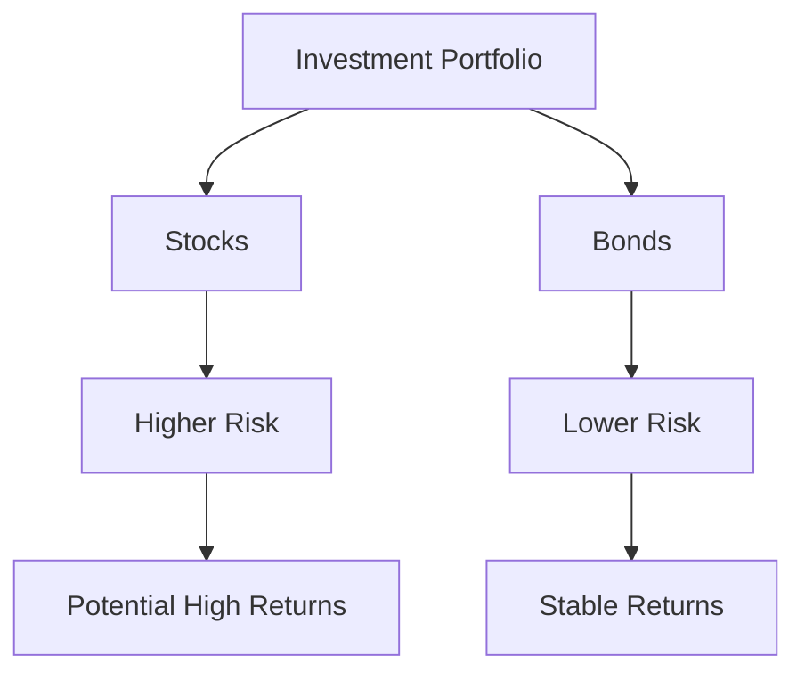

## 1.3.1 Income Generation and Capital Preservation

Investing in bonds is a strategic choice for many investors seeking a balance between income generation and capital preservation. This section delves into how bonds serve these dual purposes, making them a cornerstone in many investment portfolios, especially for those prioritizing stability and reliable income streams.

### Understanding Fixed Income from Bonds

Bonds are a form of fixed income security, meaning they provide regular interest payments to investors. This characteristic makes them particularly appealing to individuals seeking a steady cash flow. The fixed income from bonds is typically paid semi-annually, although some bonds may offer monthly, quarterly, or annual payments. These predictable payments are a key reason why bonds are favored by conservative investors, retirees, and those looking to supplement their income.

#### Regular Interest Income

The primary allure of bonds is their ability to generate regular interest income. When you invest in a bond, you essentially lend money to the issuer, who, in return, agrees to pay you interest over the bond's life. This interest, known as the coupon, is expressed as a percentage of the bond's face value and is paid at regular intervals. For instance, a bond with a face value of $1,000 and a coupon rate of 5% will pay $50 annually, typically split into two $25 payments every six months.

**Example:**

Consider a retired individual who invests $100,000 in bonds with an average coupon rate of 4%. This investment will yield $4,000 annually, providing a steady income stream that can be used to cover living expenses without dipping into the principal amount.

#### Tax Considerations

While the interest income from bonds is generally taxable, certain bonds, such as municipal bonds, offer tax advantages. Interest from municipal bonds is often exempt from federal income taxes and, in some cases, state and local taxes if the investor resides in the state where the bond is issued. This tax-exempt feature can enhance the effective yield of municipal bonds, making them even more attractive for income-seeking investors in higher tax brackets.

### Capital Preservation

Capital preservation is a fundamental investment strategy aimed at preventing loss of principal. Bonds play a crucial role in this strategy due to their inherent characteristics, such as lower volatility compared to stocks and the return of principal at maturity.

#### Stability and Lower Volatility

Bonds are generally considered less volatile than stocks, which makes them a safer investment option for those who prioritize capital preservation. The fixed interest payments and the promise of principal repayment at maturity provide a level of predictability and security that is often absent in the equity markets.

**Case Study:**

During the 2008 financial crisis, many investors experienced significant losses in their stock portfolios. However, those with a diversified portfolio that included bonds saw less drastic declines, as bonds, particularly government and high-quality corporate bonds, maintained their value better during the downturn.

#### Return of Principal

One of the most reassuring aspects of investing in bonds is the return of the principal amount at maturity. This feature ensures that, barring default, investors will receive the full face value of the bond when it matures. This aspect is particularly appealing to conservative investors and those nearing retirement, who may be more risk-averse and focused on preserving their capital.

**Practical Scenario:**

Imagine an investor nearing retirement who allocates a significant portion of their portfolio to bonds with varying maturities. This strategy not only provides regular income but also ensures that funds will be available at different stages of retirement, aligning with their financial needs and reducing the risk of outliving their assets.

### The Role of Bonds in a Diversified Portfolio

Bonds are an essential component of a diversified investment portfolio. They provide a counterbalance to the volatility of equities, helping to stabilize returns and reduce overall portfolio risk. By including bonds in a portfolio, investors can achieve a more consistent performance across different market cycles.

#### Diversification Benefits

Diversification is a risk management strategy that involves spreading investments across various asset classes to reduce exposure to any single asset or risk. Bonds, with their low correlation to stocks, can enhance portfolio diversification. During periods of stock market downturns, bonds often perform well or maintain their value, providing a buffer against equity losses.

**Mermaid Diagram:**

Below is a simplified diagram illustrating the diversification benefits of including bonds in a portfolio:

### Strategies for Income Generation and Capital Preservation

Investors can adopt various strategies to maximize income generation and capital preservation through bonds. These strategies can be tailored to individual risk tolerance, investment goals, and market conditions.

#### Laddering Strategy

A bond ladder is a strategy where an investor purchases bonds with staggered maturities. This approach allows for regular reinvestment opportunities and helps manage interest rate risk. As each bond matures, the principal can be reinvested in new bonds, potentially at higher interest rates if rates have risen.

**Example:**

An investor might create a bond ladder with bonds maturing in one, three, five, seven, and ten years. This setup ensures that a portion of the portfolio matures regularly, providing liquidity and the opportunity to adjust to changing interest rate environments.

#### Barbell Strategy

The barbell strategy involves investing in short-term and long-term bonds while avoiding intermediate maturities. This approach provides a balance between income generation and capital preservation. Short-term bonds offer liquidity and lower interest rate risk, while long-term bonds provide higher yields.

**Scenario:**

An investor concerned about rising interest rates might allocate 50% of their bond portfolio to short-term bonds and the remaining 50% to long-term bonds. This strategy allows them to benefit from higher yields on long-term bonds while maintaining flexibility with short-term investments.

### Conclusion

Bonds play a vital role in income generation and capital preservation, offering regular interest payments and the return of principal at maturity. They are an essential component of a diversified portfolio, providing stability and reducing overall risk. By understanding the characteristics and benefits of bonds, investors can effectively incorporate them into their investment strategies to achieve their financial goals.

### References

- Vanguard - [Understanding the Role of Bonds in a Portfolio](https://investor.vanguard.com/investing/how-to-invest/investment-risk-and-return)

## Bonds and Fixed Income Securities Quiz: Income Generation and Capital Preservation



### What is the primary benefit of investing in bonds for income generation?

- [x] Regular interest payments
- [ ] High capital gains
- [ ] Dividend income
- [ ] Tax-free growth

> **Explanation:** Bonds provide regular interest payments, making them a reliable source of income for investors.

### How do bonds contribute to capital preservation?

- [x] They return the principal at maturity
- [ ] They offer high growth potential
- [ ] They have no risk of default
- [ ] They are always tax-exempt

> **Explanation:** Bonds return the principal amount to investors at maturity, which is a key aspect of capital preservation.

### Which type of bonds typically offers tax advantages?

- [ ] Corporate bonds
- [x] Municipal bonds
- [ ] Treasury bonds
- [ ] Junk bonds

> **Explanation:** Municipal bonds often offer tax advantages, such as exemption from federal income taxes.

### What is a bond ladder strategy?

- [x] Purchasing bonds with staggered maturities
- [ ] Buying only short-term bonds
- [ ] Investing in bonds with the same maturity date
- [ ] Focusing on high-yield bonds

> **Explanation:** A bond ladder involves purchasing bonds with staggered maturities to manage interest rate risk and provide regular reinvestment opportunities.

### What is the main risk associated with long-term bonds?

- [x] Interest rate risk
- [ ] Credit risk
- [ ] Liquidity risk
- [ ] Inflation risk

> **Explanation:** Long-term bonds are particularly susceptible to interest rate risk, as changes in rates can significantly affect their prices.

### How can bonds help in portfolio diversification?

- [x] They have a low correlation with stocks
- [ ] They always increase in value
- [ ] They are risk-free
- [ ] They provide high returns

> **Explanation:** Bonds typically have a low correlation with stocks, which helps in diversifying and reducing overall portfolio risk.

### What is the barbell strategy in bond investing?

- [x] Investing in both short-term and long-term bonds
- [ ] Focusing only on long-term bonds
- [ ] Buying bonds with intermediate maturities
- [ ] Investing in foreign bonds

> **Explanation:** The barbell strategy involves investing in both short-term and long-term bonds, balancing income generation with capital preservation.

### Why are bonds considered less volatile than stocks?

- [x] They offer fixed interest payments and principal repayment
- [ ] They are traded less frequently
- [ ] They have higher returns
- [ ] They are not affected by market conditions

> **Explanation:** Bonds are less volatile because they provide fixed interest payments and return the principal at maturity, offering predictability.

### What is a key feature of municipal bonds?

- [x] Tax-exempt interest income
- [ ] High default risk
- [ ] High liquidity
- [ ] Variable interest rates

> **Explanation:** Municipal bonds often provide tax-exempt interest income, making them attractive to investors in higher tax brackets.

### How does the return of principal at maturity benefit bond investors?

- [x] It ensures capital preservation
- [ ] It guarantees high returns
- [ ] It eliminates all investment risk
- [ ] It provides tax benefits

> **Explanation:** The return of principal at maturity ensures that investors receive their original investment back, aiding in capital preservation.



This comprehensive exploration of income generation and capital preservation through bonds provides a robust foundation for understanding their role in financial planning and investment strategies. By leveraging the stability and predictability of bonds, investors can achieve a balanced portfolio that meets their income needs and risk tolerance.
