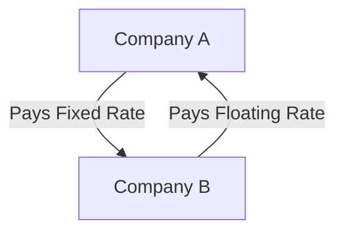

## 10.1.1.1 Mechanics of Swaps

Interest rate swaps are a fundamental component of the derivatives market, playing a crucial role in managing interest rate risks and optimizing investment strategies. Understanding the mechanics of swaps is essential for finance professionals, investors, and students aiming to master fixed income securities. This section will delve into the intricacies of interest rate swaps, explaining their structure, types, and applications in the financial markets.

### What is an Interest Rate Swap?

An **Interest Rate Swap** is a financial derivative contract between two parties who agree to exchange interest rate payments on a specified notional principal amount. The notional amount is not exchanged; it merely serves as the basis for calculating the interest payments. Swaps are primarily used to manage exposure to fluctuations in interest rates, allowing parties to achieve a desired interest rate profile.

### Types of Interest Rate Swaps

Interest rate swaps come in various forms, each serving different purposes in financial management. The most common type is the **Plain Vanilla Swap**, but other variations exist to cater to specific needs.

#### Plain Vanilla Swap

A **Plain Vanilla Swap** involves the exchange of fixed interest payments for floating-rate payments, typically linked to a benchmark interest rate such as the London Interbank Offered Rate (LIBOR) or the Secured Overnight Financing Rate (SOFR). In this swap, one party pays a fixed rate, while the other pays a floating rate, allowing both parties to manage their interest rate exposure according to their preferences.

**Example:**

Consider two companies, Company A and Company B. Company A has a loan with a floating interest rate and expects interest rates to rise. To hedge against this risk, it enters into a swap agreement with Company B, which prefers the predictability of fixed payments. Through the swap, Company A pays a fixed rate to Company B, while Company B pays a floating rate to Company A. This arrangement allows Company A to stabilize its interest expenses, while Company B benefits from potential declines in interest rates.

### Mechanics of Interest Rate Swaps

The mechanics of interest rate swaps involve several key components, including the notional principal, fixed and floating rates, and cash flow exchanges. Understanding these elements is crucial for navigating the complexities of swaps.

#### Notional Principal

The notional principal is the hypothetical amount upon which the swap payments are based. It is important to note that the notional principal is not exchanged between the parties; it merely serves as a reference for calculating interest payments.

#### Fixed and Floating Rates

In a plain vanilla swap, one party agrees to pay a fixed interest rate, while the other pays a floating rate. The fixed rate remains constant throughout the swap's duration, providing predictability for the payer. The floating rate, on the other hand, fluctuates based on market conditions, typically linked to a benchmark rate like LIBOR or SOFR.

#### Cash Flow Exchanges

Interest rate swaps involve periodic cash flow exchanges between the parties. These exchanges are typically netted, meaning only the difference between the fixed and floating payments is exchanged. This netting reduces the cash flow exchanged, minimizing transaction costs and counterparty risk.

### Diagram: Cash Flow Exchanges in a Plain Vanilla Swap

To better understand the cash flow exchanges in a plain vanilla swap, consider the following diagram:

In this diagram, Company A pays a fixed interest rate to Company B, while Company B pays a floating rate to Company A. The net cash flow is the difference between these payments, which is exchanged between the parties.

### Applications of Interest Rate Swaps

Interest rate swaps are versatile instruments used for various purposes in financial markets. They are commonly employed for hedging, speculation, and arbitrage.

#### Hedging

Hedging is the primary use of interest rate swaps, allowing parties to manage their exposure to interest rate fluctuations. By converting floating-rate liabilities to fixed-rate payments, or vice versa, companies can stabilize their interest expenses and protect against adverse market movements.

**Example:**

A corporation with a floating-rate debt portfolio may enter into a swap to pay a fixed rate, thereby hedging against potential interest rate hikes. Conversely, a company with fixed-rate debt might use a swap to gain exposure to potentially lower floating rates.

#### Speculation

Speculators use interest rate swaps to profit from anticipated movements in interest rates. By taking positions in swaps, they can bet on the direction of interest rates, hoping to benefit from favorable changes in the market.

**Example:**

An investor anticipating a rise in interest rates might enter into a swap to receive floating payments, expecting the floating rate to increase and generate higher returns than the fixed rate paid.

#### Arbitrage

Arbitrageurs exploit price discrepancies in the swap market to earn risk-free profits. By identifying mispriced swaps, they can enter into offsetting positions to capture the price differential.

**Example:**

If a swap is mispriced relative to the underlying interest rate curve, an arbitrageur might simultaneously enter into a swap and a reverse swap to lock in a profit from the price discrepancy.

### Real-World Applications and Regulatory Considerations

Interest rate swaps are widely used by corporations, financial institutions, and governments to manage interest rate risk. However, their use is subject to regulatory oversight to ensure transparency and mitigate systemic risk.

#### Regulatory Framework

In the United States, interest rate swaps are regulated by the Commodity Futures Trading Commission (CFTC) under the Dodd-Frank Wall Street Reform and Consumer Protection Act. The act mandates the clearing of standardized swaps through central counterparties (CCPs) to reduce counterparty risk and enhance market transparency.

#### Compliance Considerations

Market participants must adhere to regulatory requirements, including reporting swap transactions to swap data repositories (SDRs) and maintaining adequate risk management practices. Compliance with these regulations is essential for mitigating legal and operational risks.

### Practical Example: Hedging with Interest Rate Swaps

Consider a utility company with a significant amount of floating-rate debt. Concerned about rising interest rates, the company enters into a plain vanilla swap to pay a fixed rate and receive a floating rate. This swap allows the company to lock in its interest expenses, protecting its cash flow from interest rate volatility.

**Scenario:**

- **Floating Rate Debt:** $100 million, LIBOR + 2%
- **Fixed Rate in Swap:** 5%
- **Floating Rate in Swap:** LIBOR

By entering into the swap, the utility company effectively converts its floating-rate debt into fixed-rate debt, stabilizing its interest payments and reducing financial uncertainty.

### Conclusion

Interest rate swaps are powerful tools for managing interest rate risk and optimizing investment strategies. By understanding the mechanics of swaps, finance professionals can effectively navigate the complexities of the derivatives market and leverage these instruments to achieve their financial objectives.

For further exploration of interest rate swaps and their applications, consider reviewing resources from the International Swaps and Derivatives Association (ISDA) and Investopedia.

### References

- Investopedia - [Interest Rate Swap](https://www.investopedia.com/terms/i/interestrateswap.asp)
- International Swaps and Derivatives Association (ISDA) - [Swaps Overview](https://www.isda.org/)

---

## Bonds and Fixed Income Securities Quiz: Mechanics of Swaps



### What is an Interest Rate Swap?

- [x] A derivative contract where parties exchange interest rate payments.
- [ ] A contract to exchange principal amounts.
- [ ] A contract to exchange currencies.
- [ ] A contract to exchange commodities.

> **Explanation:** An interest rate swap is a derivative contract where two parties agree to exchange interest rate payments on a specified notional principal amount.

### In a plain vanilla interest rate swap, what does one party typically exchange?

- [x] Fixed interest payments for floating-rate payments.
- [ ] Fixed interest payments for currency payments.
- [ ] Floating-rate payments for currency payments.
- [ ] Floating-rate payments for commodity payments.

> **Explanation:** In a plain vanilla interest rate swap, one party exchanges fixed interest payments for floating-rate payments, typically linked to a benchmark rate like LIBOR or SOFR.

### What is the notional principal in an interest rate swap?

- [ ] The amount of money exchanged between parties.
- [x] The hypothetical amount used to calculate interest payments.
- [ ] The total interest paid over the swap's life.
- [ ] The interest rate benchmark used in the swap.

> **Explanation:** The notional principal is a hypothetical amount that serves as the basis for calculating interest payments in an interest rate swap. It is not exchanged between the parties.

### Why are interest rate swaps commonly used?

- [x] To manage exposure to interest rate fluctuations.
- [ ] To exchange principal amounts.
- [ ] To speculate on currency movements.
- [ ] To hedge against commodity price changes.

> **Explanation:** Interest rate swaps are commonly used to manage exposure to interest rate fluctuations, allowing parties to achieve a desired interest rate profile.

### What is the primary regulatory body overseeing interest rate swaps in the U.S.?

- [ ] Securities and Exchange Commission (SEC)
- [x] Commodity Futures Trading Commission (CFTC)
- [ ] Federal Reserve
- [ ] Financial Industry Regulatory Authority (FINRA)

> **Explanation:** The Commodity Futures Trading Commission (CFTC) is the primary regulatory body overseeing interest rate swaps in the U.S., under the Dodd-Frank Act.

### What is the purpose of netting cash flow exchanges in swaps?

- [ ] To increase transaction costs.
- [x] To reduce the cash flow exchanged and minimize transaction costs.
- [ ] To increase counterparty risk.
- [ ] To eliminate the need for regulatory oversight.

> **Explanation:** Netting cash flow exchanges in swaps reduces the cash flow exchanged between parties, minimizing transaction costs and counterparty risk.

### Which of the following is a common benchmark rate used in floating-rate swaps?

- [x] LIBOR
- [ ] Federal Funds Rate
- [ ] Prime Rate
- [ ] Discount Rate

> **Explanation:** LIBOR (London Interbank Offered Rate) is a common benchmark rate used in floating-rate swaps, although it is being phased out in favor of alternatives like SOFR.

### How do speculators use interest rate swaps?

- [x] To profit from anticipated movements in interest rates.
- [ ] To hedge against currency risk.
- [ ] To eliminate credit risk.
- [ ] To exchange commodities.

> **Explanation:** Speculators use interest rate swaps to profit from anticipated movements in interest rates by taking positions based on their expectations of market changes.

### What is a key benefit of using interest rate swaps for hedging?

- [ ] They eliminate all financial risk.
- [x] They stabilize interest expenses.
- [ ] They increase exposure to interest rate volatility.
- [ ] They reduce the need for regulatory compliance.

> **Explanation:** A key benefit of using interest rate swaps for hedging is that they stabilize interest expenses, protecting against adverse interest rate movements.

### What is the role of central counterparties (CCPs) in swap transactions?

- [x] To reduce counterparty risk and enhance market transparency.
- [ ] To increase transaction costs.
- [ ] To eliminate the need for regulatory oversight.
- [ ] To provide speculative opportunities.

> **Explanation:** Central counterparties (CCPs) reduce counterparty risk and enhance market transparency by clearing standardized swaps, as mandated by the Dodd-Frank Act.



--- 

This comprehensive section on the mechanics of swaps provides a detailed understanding of interest rate swaps, their types, applications, and regulatory considerations. The included quiz reinforces key concepts, preparing readers for exams and practical applications in the securities industry.
