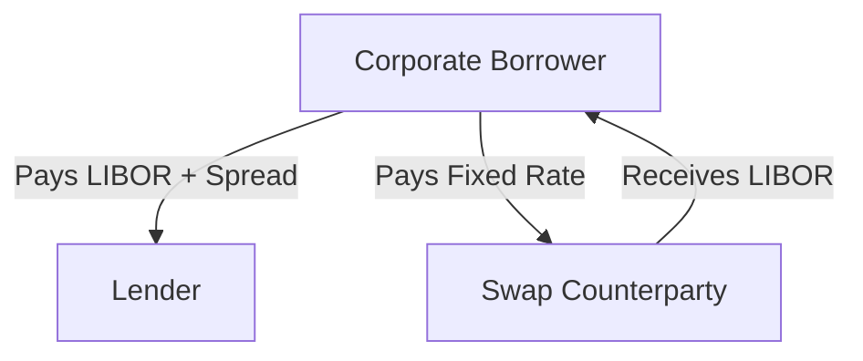
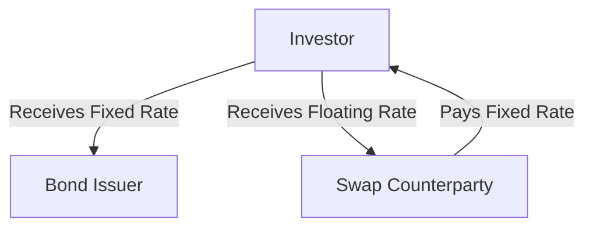

## 10.1.1.2 Uses in Hedging

Interest rate swaps are a fundamental tool in the arsenal of financial instruments used for hedging interest rate risk. By allowing parties to exchange cash flows based on different interest rate structures, swaps provide a flexible mechanism to manage exposure to interest rate fluctuations. In this section, we will delve into the practical applications of interest rate swaps in hedging, focusing on how they can be utilized by borrowers and investors to mitigate interest rate risk. We will also explore real-world examples to illustrate these concepts in action.

### Understanding Interest Rate Swaps

An interest rate swap is a contractual agreement between two parties to exchange interest payments on a specified principal amount, known as the notional principal. Typically, one party agrees to pay a fixed interest rate, while the other pays a floating rate, often tied to a benchmark such as the London Interbank Offered Rate (LIBOR) or the Secured Overnight Financing Rate (SOFR). The primary purpose of an interest rate swap is to hedge against interest rate risk, which can arise from fluctuations in market interest rates.

### Hedging Floating-Rate Debt with Swaps

Borrowers with floating-rate debt are exposed to the risk of rising interest rates, which can increase their interest expenses and affect their cash flow stability. By entering into an interest rate swap, these borrowers can effectively convert their floating-rate obligations into fixed-rate payments, thereby locking in their interest costs and reducing uncertainty.

#### Example: Corporate Borrower Hedging Strategy

Consider a corporation with a $100 million loan tied to LIBOR, with interest payments due quarterly. Concerned about potential interest rate hikes, the corporation enters into a swap agreement to pay a fixed rate of 3% while receiving LIBOR from the swap counterparty. This arrangement ensures that the corporation's interest payments remain stable, regardless of fluctuations in LIBOR.

#### Diagram: Swap Mechanism for Borrowers

### Hedging Fixed-Rate Assets with Swaps

Investors holding fixed-rate assets, such as bonds, face the risk of declining asset values in a rising interest rate environment. To mitigate this risk, they can use interest rate swaps to swap into floating rates, allowing them to benefit from potential increases in interest rates.

#### Example: Fixed-Income Investor Strategy

An investment fund holds a portfolio of fixed-rate bonds with a total value of $50 million. Anticipating an upward trend in interest rates, the fund enters into a swap agreement to receive a floating rate while paying a fixed rate of 2.5%. This strategy enables the fund to gain from rising rates, as the floating-rate receipts will increase, potentially offsetting the decline in bond values.

#### Diagram: Swap Mechanism for Investors

### Real-World Examples of Hedging with Swaps

Interest rate swaps are widely used across various sectors to manage interest rate exposure. Here are some notable examples:

#### Example 1: Municipal Bond Issuer

A municipal bond issuer with outstanding fixed-rate bonds anticipates a future refinancing at potentially higher rates. To hedge this risk, the issuer enters into a swap to receive fixed and pay floating, aligning its cash flows with expected market conditions and reducing the impact of rate increases on future debt service costs.

#### Example 2: Financial Institution

A bank with a large portfolio of floating-rate loans seeks to stabilize its interest income. By entering into a swap to pay floating and receive fixed, the bank can protect its net interest margin from adverse rate movements, ensuring consistent profitability.

### Benefits and Considerations in Using Swaps for Hedging

Interest rate swaps offer several advantages as a hedging tool:

- **Flexibility**: Swaps can be tailored to meet specific hedging needs, including notional amounts, maturities, and rate structures.
- **Cost-Effectiveness**: Compared to other hedging instruments, swaps may offer a more cost-effective solution, particularly for long-term hedging.
- **Market Access**: Swaps provide access to a broader range of interest rate environments, allowing hedgers to take advantage of favorable market conditions.

However, there are also important considerations:

- **Counterparty Risk**: The effectiveness of a swap depends on the creditworthiness of the counterparty. It is crucial to assess and manage this risk.
- **Complexity**: Swaps can be complex instruments, requiring a thorough understanding of their mechanics and potential impacts on financial statements.
- **Regulatory Compliance**: Participants must adhere to relevant regulatory requirements, including reporting and collateralization, to ensure compliance and mitigate systemic risk.

### Conclusion

Interest rate swaps are a versatile and powerful tool for managing interest rate risk. By allowing parties to exchange cash flows and align their interest rate exposures with their financial objectives, swaps facilitate effective hedging strategies for both borrowers and investors. Understanding the mechanics and applications of interest rate swaps is essential for navigating the complexities of the fixed income markets and optimizing risk management practices.

### Further Reading and Resources

For more in-depth information on interest rate swaps and their applications, consider exploring the following resources:

- CFA Institute - [Applications of Interest Rate Swaps](https://www.cfainstitute.org/en/membership/professional-development/refresher-readings/derivative-markets)
- Investopedia - [Interest Rate Swap Definition](https://www.investopedia.com/terms/i/interestrateswap.asp)
- Financial Times - [Interest Rate Swaps Explained](https://www.ft.com/content/interest-rate-swaps)

## Bonds and Fixed Income Securities Quiz: Uses in Hedging



### What is the primary purpose of using interest rate swaps in hedging?

- [x] To manage exposure to interest rate fluctuations
- [ ] To increase leverage in a portfolio
- [ ] To speculate on currency movements
- [ ] To enhance credit risk

> **Explanation:** Interest rate swaps are primarily used to manage exposure to interest rate fluctuations, allowing parties to stabilize cash flows and reduce risk.

### How can a borrower with floating-rate debt benefit from an interest rate swap?

- [x] By converting floating-rate payments into fixed-rate payments
- [ ] By reducing the principal amount of the debt
- [ ] By increasing the loan term
- [ ] By eliminating interest payments

> **Explanation:** Borrowers with floating-rate debt can use swaps to convert their payments into fixed rates, thus locking in their interest costs and protecting against rate increases.

### What is a potential risk associated with interest rate swaps?

- [ ] Guaranteed profit
- [x] Counterparty risk
- [ ] Elimination of all financial risks
- [ ] Increased liquidity

> **Explanation:** Counterparty risk is a potential risk in swaps, as the effectiveness of the hedge depends on the creditworthiness of the counterparty.

### In a rising interest rate environment, how can investors with fixed-rate assets use swaps?

- [x] By swapping into floating rates to benefit from rising rates
- [ ] By locking in lower fixed rates
- [ ] By converting assets into equity
- [ ] By reducing asset duration

> **Explanation:** Investors with fixed-rate assets can swap into floating rates to benefit from rising rates, as the floating-rate receipts will increase.

### Which of the following is a real-world example of using swaps for hedging?

- [x] A bank stabilizing its interest income from floating-rate loans
- [ ] A company issuing new equity to raise capital
- [ ] An investor buying options to speculate on stock prices
- [ ] A government reducing its fiscal deficit

> **Explanation:** A bank can use swaps to stabilize interest income from floating-rate loans by converting them into fixed rates, ensuring consistent profitability.

### What is a key benefit of using interest rate swaps for hedging?

- [x] Flexibility in tailoring the swap to specific needs
- [ ] Elimination of all financial risks
- [ ] Guaranteed profit
- [ ] Reduced regulatory compliance

> **Explanation:** Interest rate swaps offer flexibility, allowing parties to tailor the swap to meet specific hedging needs, such as notional amounts and maturities.

### What type of interest rate is typically used in floating-rate swaps?

- [ ] Fixed rate
- [x] LIBOR or SOFR
- [ ] Prime rate
- [ ] Discount rate

> **Explanation:** Floating-rate swaps typically use benchmark rates like LIBOR or SOFR as the reference rate for floating payments.

### How can a municipal bond issuer use swaps to hedge future refinancing risk?

- [x] By receiving fixed and paying floating to align cash flows
- [ ] By issuing new bonds at higher rates
- [ ] By converting bonds into equity
- [ ] By reducing bond maturities

> **Explanation:** A municipal bond issuer can use swaps to receive fixed and pay floating, aligning cash flows with expected market conditions and reducing refinancing risk.

### What is a consideration when using interest rate swaps?

- [ ] Guaranteed elimination of interest rate risk
- [ ] Simplification of financial statements
- [x] Complexity and understanding of mechanics
- [ ] Increased leverage

> **Explanation:** Swaps can be complex instruments, requiring a thorough understanding of their mechanics and potential impacts on financial statements.

### Why is regulatory compliance important in using swaps?

- [ ] To eliminate all risks
- [ ] To guarantee profits
- [x] To ensure adherence to reporting and collateralization requirements
- [ ] To increase market volatility

> **Explanation:** Regulatory compliance is crucial to ensure adherence to reporting and collateralization requirements, mitigating systemic risk and ensuring market integrity.


