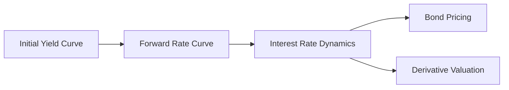

## 16.2.2 Heath-Jarrow-Morton (HJM) Framework

The Heath-Jarrow-Morton (HJM) framework is a sophisticated approach in the field of financial modeling, specifically designed to address the complexities of interest rate dynamics. This framework is renowned for its ability to model the entire forward rate curve, offering a comprehensive view of future interest rates. Unlike traditional models that focus on short-term interest rates, the HJM framework provides a no-arbitrage approach to understanding the evolution of forward interest rates over time.

### Introduction to the HJM Framework

The HJM framework was introduced by David Heath, Robert Jarrow, and Andrew Morton in their seminal 1992 paper, "Bond Pricing and the Term Structure of Interest Rates: A New Methodology." This model revolutionized the way financial analysts and investors approach interest rate modeling by shifting the focus from discrete points on the yield curve to the entire forward rate curve. By doing so, it provides a more holistic view of interest rate movements and their implications for bond pricing and derivative valuation.

### Key Concepts of the HJM Framework

#### Forward Rate Curve

At the heart of the HJM framework is the concept of the forward rate curve. This curve represents the future interest rates implied by current zero-coupon bond prices. It is a critical tool for investors and analysts as it provides insights into market expectations of future interest rate movements.

#### No-Arbitrage Condition

The HJM framework is grounded in the principle of no-arbitrage, ensuring that there are no risk-free profits to be made from discrepancies in the pricing of financial instruments. This condition is crucial for maintaining market equilibrium and is a foundational concept in financial modeling.

#### Modeling Forward Rates

Unlike traditional interest rate models that focus on short-term rates, the HJM framework models the evolution of forward interest rates directly. This approach allows for greater flexibility and accuracy in capturing the dynamics of interest rates over time.

### Flexibility of the HJM Model

One of the key advantages of the HJM framework is its flexibility in fitting the initial yield curve and volatility structures. This adaptability makes it a valuable tool for financial institutions and investors seeking to model complex interest rate environments.

#### Fitting the Initial Yield Curve

The HJM framework allows for precise calibration to the initial yield curve, ensuring that the model accurately reflects current market conditions. This feature is particularly important for institutions that rely on accurate interest rate forecasts for risk management and investment decision-making.

#### Volatility Structures

The HJM framework also offers flexibility in modeling volatility structures, allowing analysts to incorporate various sources of uncertainty and risk into their models. This capability is essential for pricing interest rate derivatives and managing interest rate risk.

### Applications in Pricing Interest Rate Derivatives

The HJM framework is widely used in the pricing of interest rate derivatives, such as options, swaps, and futures. Its ability to model the entire forward rate curve makes it an invaluable tool for understanding the complex interactions between interest rates and derivative pricing.

#### Interest Rate Options

Interest rate options, such as caps and floors, are financial instruments that provide protection against adverse interest rate movements. The HJM framework is used to model the underlying interest rate dynamics, providing accurate pricing and risk management solutions.

#### Interest Rate Swaps

Interest rate swaps are agreements between two parties to exchange cash flows based on different interest rate indices. The HJM framework helps in determining the fair value of these swaps by modeling the expected future interest rate movements.

#### Interest Rate Futures

Interest rate futures are contracts that allow investors to hedge against future interest rate changes. The HJM framework provides a robust methodology for pricing these contracts, ensuring that they accurately reflect market expectations.

### Practical Examples and Case Studies

To illustrate the practical applications of the HJM framework, consider the following examples:

#### Example 1: Pricing a Cap Using the HJM Framework

Suppose an investor wants to price a cap that provides protection against rising interest rates. By using the HJM framework, the investor can model the expected future interest rate movements and determine the fair value of the cap.

#### Example 2: Valuing an Interest Rate Swap

An institution is considering entering into an interest rate swap to manage its interest rate risk. By applying the HJM framework, the institution can model the expected cash flows and determine the swap's fair value, ensuring that it aligns with its risk management objectives.

### Real-World Applications and Regulatory Scenarios

The HJM framework is not only a theoretical model but also has real-world applications in the financial industry. It is used by banks, investment firms, and regulatory bodies to model interest rate dynamics and assess the impact of regulatory changes on interest rate derivatives.

#### Regulatory Considerations

Regulatory bodies, such as the Securities and Exchange Commission (SEC) and the Financial Industry Regulatory Authority (FINRA), require financial institutions to adhere to strict risk management and reporting standards. The HJM framework provides a robust methodology for meeting these requirements by offering accurate and transparent interest rate modeling.

### Step-by-Step Guidance for Implementing the HJM Framework

Implementing the HJM framework requires a thorough understanding of its mathematical foundations and practical applications. The following steps provide a guide for analysts and investors looking to apply the HJM framework in their interest rate modeling:

1. **Data Collection**: Gather historical interest rate data and current market information to calibrate the model.

2. **Model Calibration**: Fit the initial yield curve and volatility structures to the collected data, ensuring that the model accurately reflects current market conditions.

3. **Simulation**: Use the calibrated model to simulate future interest rate movements and assess their impact on bond pricing and derivative valuation.

4. **Analysis**: Analyze the simulation results to identify potential risks and opportunities, and make informed investment decisions.

5. **Reporting**: Document the modeling process and results, ensuring compliance with regulatory requirements and providing transparency to stakeholders.

### Diagrams and Visuals

To enhance understanding of the HJM framework, consider the following diagram representing the forward rate curve and its evolution over time:

### Best Practices and Common Pitfalls

When implementing the HJM framework, it is important to adhere to best practices and avoid common pitfalls:

- **Best Practices**: Ensure accurate data collection and model calibration, and regularly update the model to reflect changing market conditions.

- **Common Pitfalls**: Avoid overfitting the model to historical data, as this can lead to inaccurate predictions and increased risk.

### References

- Heath, D., Jarrow, R., Morton, A. (1992). "Bond Pricing and the Term Structure of Interest Rates: A New Methodology." Econometrica.
- Investopedia - [Heath-Jarrow-Morton Framework](https://www.investopedia.com/terms/h/hjm.asp)

### Summary

The Heath-Jarrow-Morton framework is a powerful tool for modeling interest rate dynamics and pricing interest rate derivatives. Its flexibility and no-arbitrage approach make it an invaluable asset for financial institutions and investors seeking to navigate the complexities of the fixed income markets. By understanding and applying the HJM framework, you can enhance your ability to make informed investment decisions and manage interest rate risk effectively.

---

## Bonds and Fixed Income Securities Quiz: Heath-Jarrow-Morton (HJM) Framework



### What is the primary focus of the HJM framework?

- [ ] Modeling short-term interest rates
- [x] Modeling the forward rate curve
- [ ] Modeling credit spreads
- [ ] Modeling equity prices

> **Explanation:** The HJM framework is primarily focused on modeling the entire forward rate curve, which provides insights into future interest rate movements.

### Which principle is the HJM framework based on?

- [x] No-arbitrage principle
- [ ] Mean-reversion principle
- [ ] Risk-neutral valuation
- [ ] Market efficiency

> **Explanation:** The HJM framework is grounded in the no-arbitrage principle, ensuring that there are no risk-free profits to be made from discrepancies in financial instrument pricing.

### How does the HJM framework differ from traditional interest rate models?

- [ ] It models equity prices
- [x] It models forward rates instead of short rates
- [ ] It focuses on credit risk
- [ ] It ignores volatility structures

> **Explanation:** Unlike traditional models that focus on short-term rates, the HJM framework models forward interest rates, offering a more comprehensive view of interest rate dynamics.

### What is a key advantage of the HJM framework?

- [ ] Simplicity in calculations
- [ ] Focus on short-term rates
- [x] Flexibility in fitting yield curves and volatility
- [ ] Ignoring market volatility

> **Explanation:** The HJM framework's flexibility in fitting initial yield curves and volatility structures makes it a valuable tool for modeling complex interest rate environments.

### In which area is the HJM framework widely used?

- [ ] Equity valuation
- [ ] Commodity pricing
- [x] Pricing interest rate derivatives
- [ ] Real estate valuation

> **Explanation:** The HJM framework is widely used in pricing interest rate derivatives, such as options, swaps, and futures, due to its ability to model the entire forward rate curve.

### What does the forward rate curve represent?

- [ ] Historical interest rates
- [ ] Current bond prices
- [x] Future interest rates implied by current bonds
- [ ] Equity market trends

> **Explanation:** The forward rate curve represents future interest rates implied by current zero-coupon bond prices, providing insights into market expectations.

### Which regulatory body might require adherence to risk management standards using the HJM framework?

- [ ] Federal Reserve
- [x] Securities and Exchange Commission (SEC)
- [ ] Department of Labor
- [ ] Internal Revenue Service (IRS)

> **Explanation:** The SEC may require financial institutions to adhere to risk management standards, for which the HJM framework provides robust modeling methodologies.

### What is a common pitfall when implementing the HJM framework?

- [ ] Underfitting the model
- [x] Overfitting the model to historical data
- [ ] Ignoring initial yield curves
- [ ] Focusing solely on short-term rates

> **Explanation:** Overfitting the model to historical data can lead to inaccurate predictions and increased risk, making it a common pitfall in HJM framework implementation.

### What is the first step in implementing the HJM framework?

- [ ] Model simulation
- [ ] Analysis of results
- [x] Data collection
- [ ] Reporting

> **Explanation:** The first step in implementing the HJM framework is data collection, which involves gathering historical interest rate data and current market information.

### Which of the following is NOT a component of the HJM framework?

- [ ] Forward rate curve
- [ ] No-arbitrage condition
- [x] Equity risk premium
- [ ] Volatility structures

> **Explanation:** The HJM framework focuses on the forward rate curve, no-arbitrage condition, and volatility structures, but not on the equity risk premium.


