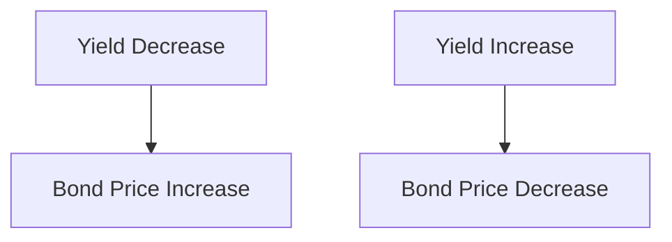
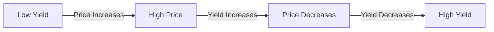

## 2.2.2 Relationship Between Price and Yield

Understanding the relationship between bond prices and yields is crucial for anyone involved in fixed income investing. This relationship is fundamental to bond valuation and helps investors make informed decisions in the bond markets. In this section, we will delve into the inverse relationship between bond prices and yields, explore how market interest rates affect bond prices, and discuss the concepts of bond premiums and discounts.

### The Inverse Relationship Between Bond Prices and Yields

At the core of bond pricing is the inverse relationship between bond prices and yields. This relationship is a fundamental principle in fixed income markets:

- **When bond prices rise, yields fall.**
- **When bond prices fall, yields rise.**

This inverse relationship can be understood through the lens of the bond's yield to maturity (YTM), which is the total return anticipated on a bond if held until it matures. The YTM takes into account the bond's current market price, its coupon interest payments, and its face value at maturity.

#### Why Prices and Yields Move Oppositely

The inverse relationship is primarily driven by the fixed nature of a bond's cash flows. When you purchase a bond, you are essentially buying a stream of future cash flows, which includes periodic coupon payments and the return of the bond's face value at maturity. The present value of these cash flows, discounted at the bond's yield, determines the bond's price.

- **If yields decrease:** The present value of the bond's fixed cash flows increases, leading to a higher bond price.
- **If yields increase:** The present value of the bond's fixed cash flows decreases, resulting in a lower bond price.

This relationship can be visualized through a price-yield curve, which is typically downward sloping, illustrating how price decreases as yield increases.

### Impact of Market Interest Rates on Bond Prices

Market interest rates are a critical determinant of bond yields and prices. When market interest rates change, they directly impact the yields required by investors, thus affecting bond prices.

#### Rising Interest Rates

When market interest rates rise, newly issued bonds offer higher yields to attract investors. As a result, existing bonds with lower coupon rates become less attractive, causing their market prices to drop. This is because investors can achieve better returns with new bonds, leading them to demand a discount on existing bonds to compensate for their lower yields.

#### Falling Interest Rates

Conversely, when market interest rates fall, existing bonds with higher coupon rates become more attractive. Investors are willing to pay a premium for these bonds, driving up their market prices. This is because the fixed coupon payments on these bonds are higher than what is available from newly issued bonds at the current lower interest rates.

### Bond Premiums and Discounts

Bonds can trade at a premium or a discount to their face value, depending on the relationship between their coupon rate and the current market interest rates.

- **Premium Bond:** A bond is said to be trading at a premium when its market price is above its face value. This occurs when the bond's coupon rate is higher than the prevailing market interest rates. Investors are willing to pay more for the bond's higher income stream.

- **Discount Bond:** A bond trades at a discount when its market price is below its face value. This happens when the bond's coupon rate is lower than the current market interest rates, making it less attractive compared to new issues.

#### Example: Calculating Premium and Discount

Let's consider a bond with a face value of $1,000 and a coupon rate of 5%. If the current market interest rate is 4%, the bond will trade at a premium because its coupon rate is higher than the market rate. Conversely, if the market rate is 6%, the bond will trade at a discount.

### Graphical Representation of Price-Yield Curves

To better understand the relationship between bond prices and yields, it's helpful to visualize it using a price-yield curve. This curve illustrates how bond prices change as yields fluctuate.

The curve demonstrates that as yields decrease, bond prices increase, and vice versa. This is a key concept for investors to grasp, as it underpins many investment strategies in the bond markets.

### Practical Implications for Investors

Understanding the price-yield relationship is essential for making informed investment decisions. Here are some practical implications:

- **Interest Rate Risk Management:** Investors need to be aware of interest rate risk, which is the risk that changes in market interest rates will affect bond prices. This is particularly important for long-term bonds, which are more sensitive to interest rate changes.

- **Investment Strategy:** Depending on their interest rate outlook, investors might choose to invest in bonds with different maturities or coupon structures. For instance, in a rising interest rate environment, short-duration bonds may be preferred to minimize price volatility.

- **Portfolio Diversification:** Bonds can be used to diversify an investment portfolio, providing stability and income. Understanding the price-yield relationship helps investors balance risk and return in their portfolios.

### Conclusion

The relationship between bond prices and yields is a cornerstone of fixed income investing. By understanding the inverse relationship and how market interest rates impact bond prices, investors can better navigate the bond markets and make informed investment decisions. Whether dealing with premium or discount bonds, this knowledge is crucial for optimizing investment strategies and managing risk.

### Further Reading and Resources

For more detailed insights into bond prices and yields, consider exploring the following resources:

- **Fidelity - [Bond Prices and Yields](https://www.fidelity.com/learning-center/investment-products/fixed-income-bonds/bond-prices-and-yields)**
- **FINRA - [Understanding Bond Yield and Price Relationships](https://www.finra.org/investors/learn-to-invest/types-investments/bonds/bond-yield-and-price)**

---

## Bonds and Fixed Income Securities Quiz: Relationship Between Price and Yield



### What happens to the price of a bond when its yield decreases?

- [x] The price increases.
- [ ] The price decreases.
- [ ] The price remains unchanged.
- [ ] The price becomes volatile.

> **Explanation:** When a bond's yield decreases, the present value of its fixed cash flows increases, leading to a higher bond price.

### How do rising market interest rates affect existing bond prices?

- [ ] Existing bond prices increase.
- [x] Existing bond prices decrease.
- [ ] Existing bond prices remain unchanged.
- [ ] Existing bond prices become more attractive.

> **Explanation:** Rising market interest rates lead to higher yields on new bonds, making existing bonds with lower coupon rates less attractive, thus decreasing their prices.

### What is a premium bond?

- [x] A bond selling above its face value.
- [ ] A bond selling below its face value.
- [ ] A bond with a high coupon rate.
- [ ] A bond with a low coupon rate.

> **Explanation:** A premium bond sells above its face value because its coupon rate is higher than the prevailing market interest rates.

### What is a discount bond?

- [ ] A bond selling above its face value.
- [x] A bond selling below its face value.
- [ ] A bond with a high coupon rate.
- [ ] A bond with a low coupon rate.

> **Explanation:** A discount bond sells below its face value because its coupon rate is lower than the current market interest rates.

### Which of the following is true about the price-yield curve?

- [x] It is downward sloping.
- [ ] It is upward sloping.
- [ ] It is flat.
- [ ] It is volatile.

> **Explanation:** The price-yield curve is downward sloping, showing that as yields increase, bond prices decrease.

### What does Yield to Maturity (YTM) represent?

- [ ] The coupon rate of a bond.
- [x] The total return anticipated on a bond if held until maturity.
- [ ] The current market price of a bond.
- [ ] The face value of a bond.

> **Explanation:** YTM represents the total return expected on a bond if it is held until it matures, taking into account its current market price, coupon payments, and face value.

### How does a decrease in market interest rates affect bonds with higher coupon rates?

- [x] They become more attractive.
- [ ] They become less attractive.
- [ ] They remain unchanged.
- [ ] They become riskier.

> **Explanation:** When market interest rates decrease, bonds with higher coupon rates become more attractive because they offer higher returns compared to new bonds issued at the lower rates.

### What is interest rate risk in the context of bonds?

- [ ] The risk of default by the bond issuer.
- [x] The risk that changes in market interest rates will affect bond prices.
- [ ] The risk of inflation eroding bond returns.
- [ ] The risk of currency fluctuations affecting bond returns.

> **Explanation:** Interest rate risk refers to the potential impact of changes in market interest rates on bond prices, which is a key consideration for bond investors.

### Why might an investor choose short-duration bonds in a rising interest rate environment?

- [ ] To maximize returns.
- [ ] To minimize returns.
- [x] To minimize price volatility.
- [ ] To maximize price volatility.

> **Explanation:** Short-duration bonds are less sensitive to interest rate changes, making them a preferred choice for minimizing price volatility in a rising interest rate environment.

### What does it mean when a bond is trading at a premium?

- [ ] It has a lower YTM than the market rate.
- [x] It has a higher coupon rate than the market rate.
- [ ] It is expected to default.
- [ ] It has a lower coupon rate than the market rate.

> **Explanation:** A bond trades at a premium when its coupon rate is higher than the prevailing market interest rates, making it more valuable and leading to a higher market price.



---
