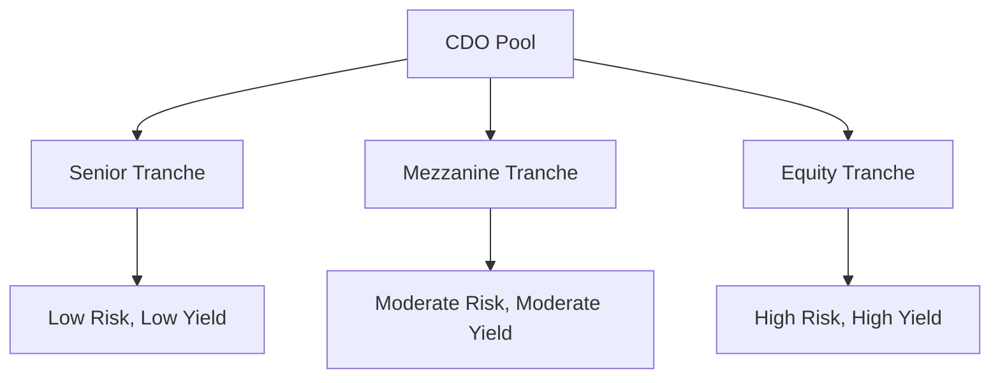

## 3.4.3 Collateralized Debt Obligations (CDOs)

Collateralized Debt Obligations (CDOs) are sophisticated financial instruments that have played a pivotal role in the evolution of the fixed income markets. Understanding CDOs is crucial for anyone involved in securities exams or the financial industry, as they encapsulate both the potential and pitfalls of structured finance. This section will delve into the definition, structure, risks, investor considerations, and regulatory aspects of CDOs, providing you with a comprehensive understanding of these complex products.

### Definition of Collateralized Debt Obligations (CDOs)

Collateralized Debt Obligations (CDOs) are structured finance products that pool together various types of debt instruments, such as bonds and loans, to create a new security. These instruments are then divided into different tranches, each with varying levels of risk and return. The primary objective of a CDO is to redistribute the credit risk of the underlying assets, offering investors a range of investment options based on their risk tolerance and return expectations.

### Structure of CDOs

The structure of a CDO is hierarchical, with the pooled assets divided into tranches that reflect different levels of credit risk and priority in receiving cash flows. Here's a closer look at the typical structure:

#### Tranches

1. **Senior Tranches**: These have the highest credit rating and the lowest risk. They have the first claim on the cash flows generated by the underlying assets. Consequently, they offer lower yields compared to other tranches. Senior tranches are typically rated AAA or AA.

2. **Mezzanine Tranches**: Positioned below the senior tranches, these carry a moderate level of risk and offer higher yields. They absorb losses only after the senior tranches are affected. Mezzanine tranches are generally rated A to BB.

3. **Equity Tranches**: Also known as the "first loss" tranches, these are the riskiest but offer the highest potential returns. They absorb initial losses and have the last claim on cash flows. Equity tranches are usually unrated or rated below investment grade.

The diagram below illustrates the typical structure of a CDO:

### Risks and Criticisms of CDOs

CDOs have been subject to significant scrutiny, especially following their role in the 2007-2008 financial crisis. Understanding the risks associated with CDOs is essential for investors and financial professionals.

#### Complexity Risk

CDOs are inherently complex, making it challenging for investors to fully assess the quality and risk of the underlying assets. The intricate structure and the pooling of diverse debt instruments can obscure the true risk profile, leading to potential mispricing and unexpected losses.

#### Correlation Risk

One of the critical risks in CDOs is correlation risk, where defaults among the underlying assets may be highly correlated. If multiple assets default simultaneously, it can severely impact the entire structure, particularly the mezzanine and equity tranches. This risk was starkly evident during the financial crisis, where defaults in subprime mortgages led to widespread losses across CDO tranches.

#### Role in the Financial Crisis

CDOs were central to the financial crisis due to their exposure to subprime mortgages. The high demand for CDOs drove the origination of riskier loans, and when the housing market collapsed, the defaults cascaded through the CDO structures, leading to massive financial losses and systemic instability.

### Investor Considerations

Investing in CDOs can offer high returns, but it is accompanied by significant risks. Here are key considerations for investors:

- **Due Diligence**: Thorough analysis of the CDO's structure and underlying assets is crucial. Investors should understand the credit quality of the pooled assets and the potential for correlated defaults.

- **Risk Appetite**: Investors must assess their risk tolerance and choose tranches accordingly. Senior tranches may suit conservative investors, while equity tranches might appeal to those seeking higher returns and willing to accept greater risk.

- **Market Conditions**: The performance of CDOs is heavily influenced by economic conditions, particularly in the sectors from which the underlying assets are drawn. Investors should be aware of macroeconomic trends and sector-specific risks.

### Regulatory Aspects

In response to the financial crisis, significant regulatory reforms were implemented to address the risks associated with CDOs. These reforms aimed to enhance transparency and accountability in the structured finance market.

#### Post-Crisis Reforms

- **Risk Retention Requirements**: Issuers of CDOs are now required to retain a portion of the risk, aligning their interests with those of investors. This "skin in the game" approach is intended to discourage the origination of low-quality assets.

- **Transparency and Disclosure**: Enhanced disclosure requirements mandate detailed reporting on the composition and performance of CDOs, enabling investors to make more informed decisions.

- **Regulatory Oversight**: Agencies such as the Securities and Exchange Commission (SEC) have increased their oversight of structured finance products, ensuring compliance with new standards and protecting investor interests.

### Glossary

- **Collateralized Debt Obligation (CDO)**: A structured financial product that pools together cash flow-generating assets and divides them into tranches with varying risk and return profiles.
- **Tranche**: A segment of a pooled set of securities, categorized by risk or other characteristics, with specific claims on cash flows.

### References

For further exploration of CDOs and their impact on financial markets, consider the following resources:

- [SEC – Collateralized Debt Obligations](https://www.sec.gov/answers/cdo.htm)
- [Investopedia – CDO Definition](https://www.investopedia.com/terms/c/cdo.asp)
- [Financial Crisis Inquiry Commission – Role of CDOs in the Financial Crisis](https://fcic-static.law.stanford.edu/cdn_media/fcic-reports/fcic_final_report_full.pdf)

---

## Bonds and Fixed Income Securities Quiz: Collateralized Debt Obligations (CDOs)



### What is a Collateralized Debt Obligation (CDO)?

- [x] A structured finance product backed by a pool of debt instruments.
- [ ] A type of equity security.
- [ ] A derivative used for hedging currency risk.
- [ ] A government bond issued to finance public projects.

> **Explanation:** A CDO is a structured financial product that pools together various debt instruments, such as bonds and loans, to create a new security divided into tranches.

### Which tranche in a CDO structure typically absorbs the initial losses?

- [ ] Senior Tranche
- [ ] Mezzanine Tranche
- [x] Equity Tranche
- [ ] Junior Tranche

> **Explanation:** The equity tranche, also known as the "first loss" tranche, is the riskiest and absorbs initial losses, offering the highest potential returns.

### What risk is associated with the difficulty of assessing the underlying assets in CDOs?

- [ ] Interest Rate Risk
- [x] Complexity Risk
- [ ] Liquidity Risk
- [ ] Currency Risk

> **Explanation:** Complexity risk arises from the intricate structure of CDOs, making it challenging for investors to assess the quality and risk of the underlying assets.

### How did CDOs contribute to the 2007-2008 financial crisis?

- [ ] By increasing government debt levels.
- [ ] By causing hyperinflation.
- [x] By being heavily exposed to subprime mortgages.
- [ ] By reducing interest rates globally.

> **Explanation:** CDOs were heavily exposed to subprime mortgages, and when the housing market collapsed, defaults cascaded through the CDO structures, leading to significant financial losses.

### What is a key regulatory reform for CDOs post-financial crisis?

- [ ] Elimination of all CDOs from the market.
- [x] Risk retention requirements for issuers.
- [ ] Introduction of new tax incentives for CDOs.
- [ ] Reduction in credit rating agency oversight.

> **Explanation:** Post-crisis reforms included risk retention requirements, where issuers must retain a portion of the risk to align their interests with investors.

### Which tranche in a CDO structure is typically rated AAA or AA?

- [x] Senior Tranche
- [ ] Mezzanine Tranche
- [ ] Equity Tranche
- [ ] Subordinated Tranche

> **Explanation:** The senior tranche is typically rated AAA or AA, as it has the highest credit rating and the first claim on cash flows.

### What is the primary objective of a CDO?

- [ ] To increase government revenue.
- [x] To redistribute the credit risk of underlying assets.
- [ ] To hedge against currency fluctuations.
- [ ] To provide liquidity to central banks.

> **Explanation:** The primary objective of a CDO is to redistribute the credit risk of the underlying assets, offering investors a range of investment options based on risk and return.

### What is a common criticism of CDOs?

- [ ] They are too simple and lack diversification.
- [x] They are complex and difficult to assess.
- [ ] They offer too low returns for the risk.
- [ ] They are only available to institutional investors.

> **Explanation:** A common criticism of CDOs is their complexity, which makes it difficult for investors to fully assess the risk and quality of the underlying assets.

### Which agency is responsible for increasing oversight of structured finance products like CDOs?

- [ ] Federal Reserve
- [ ] Department of the Treasury
- [x] Securities and Exchange Commission (SEC)
- [ ] Office of the Comptroller of the Currency

> **Explanation:** The Securities and Exchange Commission (SEC) is responsible for increasing oversight of structured finance products like CDOs to ensure compliance and protect investors.

### What is the role of the mezzanine tranche in a CDO?

- [ ] To absorb initial losses.
- [x] To offer moderate risk and yield.
- [ ] To provide liquidity to the equity tranche.
- [ ] To ensure all cash flows go to the senior tranche.

> **Explanation:** The mezzanine tranche offers moderate risk and yield, absorbing losses only after the senior tranches are affected.



By understanding the intricacies of CDOs, you can better navigate the complexities of structured finance and make informed decisions in the fixed income markets. This knowledge is not only crucial for exam success but also for a successful career in the securities industry.
