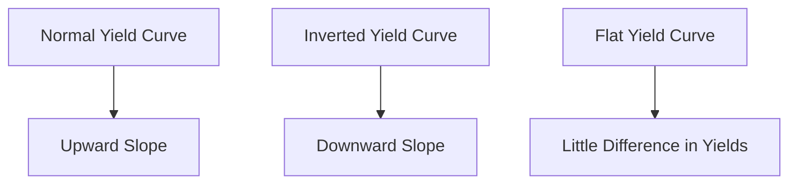

## 4.5.1 Understanding the Yield Curve

The yield curve is a fundamental concept in the bond markets, providing insights into interest rate expectations, economic activity, and investment strategies. A yield curve is a graphical representation that plots interest rates of bonds having equal credit quality but differing maturity dates. It is a critical tool for investors, economists, and policymakers to gauge the economic environment and make informed decisions.

### Definition

A **Yield Curve** is a graph that plots the yields of similar-quality bonds against their maturities, ranging from shortest to longest. The curve provides a snapshot of the interest rate environment at a specific point in time, reflecting the market's expectations for future interest rates and economic conditions.

### Types of Yield Curves

Understanding the different shapes of yield curves is essential for interpreting market signals and making investment decisions. The three primary types of yield curves are:

1. **Normal Yield Curve**: This is the most common shape, characterized by an upward slope. It indicates that longer-term bonds have higher yields than shorter-term bonds, compensating investors for the risks associated with time, such as inflation and uncertainty. A normal yield curve suggests expectations of economic growth and rising interest rates.

2. **Inverted Yield Curve**: An inverted curve slopes downward, where short-term yields exceed long-term yields. This shape is often viewed as a predictor of economic recession, as it suggests that investors expect future interest rates to decline due to an economic slowdown.

3. **Flat Yield Curve**: A flat curve occurs when there is little difference between short-term and long-term yields. This shape indicates uncertainty in the market, where investors are unsure about future economic conditions or interest rate movements.

### Components of the Yield Curve

The yield curve consists of two main components:

- **Term to Maturity**: Represented on the horizontal axis, this component indicates the time remaining until the bond's maturity. Bonds with varying maturities are plotted to form the curve.

- **Interest Rate (Yield)**: Shown on the vertical axis, this component represents the yield to maturity of the bonds. Yields are the returns investors expect to earn if they hold the bond until maturity.

### Importance of the Yield Curve

The yield curve is a vital tool for various stakeholders in the financial markets due to its ability to:

- **Reflect Market Expectations**: The shape of the yield curve reflects the market's expectations for future interest rates, inflation, and economic growth. An upward-sloping curve suggests optimism about economic expansion, while an inverted curve signals caution.

- **Guide Investment Decisions**: Investors use the yield curve to assess the relative attractiveness of bonds with different maturities. It helps in constructing bond portfolios that align with investment goals and risk tolerance.

- **Influence Corporate Financing**: Companies consider the yield curve when making financing decisions, such as issuing bonds or taking loans. A steep curve may encourage long-term borrowing, while a flat or inverted curve might lead to short-term financing.

- **Inform Monetary Policy**: Central banks monitor the yield curve to gauge the effectiveness of their monetary policy and its impact on the economy. An inverted curve may prompt central banks to lower interest rates to stimulate growth.

### Interpretation of the Yield Curve

Interpreting the yield curve involves understanding the economic signals it conveys:

- **Upward Sloping Curve**: Indicates expectations of economic growth and potential inflation. Investors demand higher yields for longer maturities due to perceived risks.

- **Inverted Curve**: Often seen as a precursor to economic recession. It suggests that investors expect lower future interest rates, possibly due to an anticipated economic downturn.

- **Flat Curve**: Reflects uncertainty in the market. It may indicate that investors are unsure about future economic conditions or that the economy is transitioning between growth and recession.

### Construction of the Yield Curve

The yield curve is typically constructed using yields of government securities, such as U.S. Treasury bonds, which are considered risk-free benchmarks. The process involves plotting the yields of bonds with different maturities on a graph to form the curve. The data for constructing the yield curve can be obtained from sources like the U.S. Department of the Treasury.

### Practical Examples and Scenarios

To illustrate the practical application of yield curves, consider the following scenarios:

- **Investment Strategy**: An investor analyzing a normal yield curve may decide to invest in long-term bonds to capitalize on higher yields, anticipating economic growth and rising interest rates.

- **Economic Forecasting**: Economists observing an inverted yield curve might predict an upcoming recession, prompting businesses to prepare for potential economic challenges.

- **Corporate Financing**: A company planning to issue bonds may choose short-term debt if the yield curve is flat, minimizing interest costs in an uncertain economic environment.

### Real-World Applications

In the real world, yield curves are used extensively by financial professionals to assess market conditions and make strategic decisions. For example, portfolio managers may adjust their bond holdings based on changes in the yield curve to optimize returns and manage risk.

### Visual Representation

To enhance understanding, let's visualize the different types of yield curves using a diagram:

### Best Practices and Common Pitfalls

When analyzing yield curves, consider the following best practices and avoid common pitfalls:

- **Stay Informed**: Keep abreast of economic indicators and central bank policies that influence yield curves.

- **Diversify Investments**: Use the yield curve as a guide but maintain a diversified bond portfolio to mitigate risks.

- **Avoid Overreliance**: While the yield curve is a valuable tool, it should not be the sole factor in investment decisions. Consider other market conditions and economic indicators.

### References and Further Reading

- U.S. Department of the Treasury – [Daily Treasury Yield Curve Rates](https://www.treasury.gov/resource-center/data-chart-center/interest-rates/pages/textview.aspx?data=yield)
- Investopedia – [Yield Curve](https://www.investopedia.com/terms/y/yieldcurve.asp)

By understanding the yield curve, you can gain valuable insights into the bond markets, make informed investment decisions, and anticipate economic trends. This knowledge is crucial for mastering bonds and fixed income securities, ultimately leading to investment success.

---

## Bonds and Fixed Income Securities Quiz: Understanding the Yield Curve



### What does an upward sloping yield curve typically indicate?

- [x] Expectations of economic growth and rising interest rates
- [ ] An impending economic recession
- [ ] Uncertainty in the market
- [ ] A decrease in inflation expectations

> **Explanation:** An upward sloping yield curve suggests that investors expect economic growth and rising interest rates, as longer-term bonds offer higher yields to compensate for increased risk.

### What is a key characteristic of an inverted yield curve?

- [ ] Long-term yields are higher than short-term yields
- [x] Short-term yields are higher than long-term yields
- [ ] All yields are the same regardless of maturity
- [ ] It indicates stable economic conditions

> **Explanation:** An inverted yield curve occurs when short-term yields are higher than long-term yields, often signaling an expectation of economic slowdown or recession.

### Which type of yield curve reflects market uncertainty?

- [ ] Normal Yield Curve
- [ ] Inverted Yield Curve
- [x] Flat Yield Curve
- [ ] Steep Yield Curve

> **Explanation:** A flat yield curve indicates little difference between short-term and long-term yields, reflecting uncertainty about future economic conditions.

### How is a yield curve typically constructed?

- [x] By plotting yields of government securities with different maturities
- [ ] By averaging yields of corporate bonds
- [ ] By using only short-term interest rates
- [ ] By considering inflation rates only

> **Explanation:** Yield curves are typically constructed using yields of government securities, such as U.S. Treasury bonds, which serve as risk-free benchmarks.

### What does a flat yield curve suggest about future interest rates?

- [ ] Interest rates are expected to rise significantly
- [ ] Interest rates are expected to fall sharply
- [x] Interest rates are uncertain or expected to remain stable
- [ ] Interest rates will become negative

> **Explanation:** A flat yield curve suggests uncertainty about future interest rates, indicating that they may remain stable or that the market is unsure about their direction.

### In which scenario might an investor prefer long-term bonds?

- [x] When the yield curve is upward sloping
- [ ] When the yield curve is inverted
- [ ] When the yield curve is flat
- [ ] When interest rates are negative

> **Explanation:** An investor might prefer long-term bonds when the yield curve is upward sloping to benefit from higher yields associated with longer maturities.

### What economic condition is often predicted by an inverted yield curve?

- [ ] Economic growth
- [x] Economic recession
- [ ] Inflation
- [ ] Stable economic conditions

> **Explanation:** An inverted yield curve is often seen as a predictor of economic recession, as it indicates that investors expect future interest rates to decline.

### Which axis represents the term to maturity on a yield curve graph?

- [x] Horizontal axis
- [ ] Vertical axis
- [ ] Diagonal axis
- [ ] No axis

> **Explanation:** The horizontal axis on a yield curve graph represents the term to maturity, showing the time remaining until the bonds mature.

### What role does the yield curve play in monetary policy?

- [x] It helps central banks gauge the effectiveness of their policy
- [ ] It determines the inflation rate
- [ ] It sets the interest rates for the economy
- [ ] It predicts stock market trends

> **Explanation:** The yield curve helps central banks gauge the effectiveness of their monetary policy by reflecting market expectations for interest rates and economic activity.

### How can a steep yield curve impact corporate financing decisions?

- [x] It may encourage long-term borrowing
- [ ] It discourages any form of borrowing
- [ ] It leads to increased short-term borrowing
- [ ] It has no impact on corporate financing

> **Explanation:** A steep yield curve may encourage companies to engage in long-term borrowing, as it indicates higher yields for longer maturities, suggesting favorable economic conditions.



By mastering the yield curve, you gain a powerful tool for understanding the bond markets, making strategic investment decisions, and anticipating economic trends. This knowledge is crucial for excelling in the US Securities Exams and achieving success in fixed income investing.
