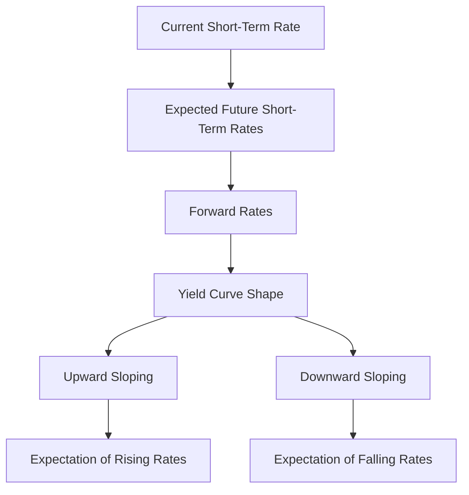

## 4.5.2.1 Expectations Theory

In the realm of fixed income securities, understanding the dynamics of interest rates is crucial for making informed investment decisions. One of the foundational theories that explain the shape of the yield curve is the **Expectations Theory**. This theory provides insights into how market participants form expectations about future interest rates and how these expectations influence the pricing of bonds.

### Definition of Expectations Theory

**Expectations Theory** posits that the long-term interest rates are essentially a reflection of the market's expectations for future short-term interest rates. In simpler terms, the yield on a long-term bond is determined by the geometric average of current and expected future short-term interest rates. This theory suggests that if investors expect future short-term rates to rise, the long-term rates will be higher to reflect these expectations, and vice versa.

### Key Concepts of Expectations Theory

#### Indifference Between Long-Term and Short-Term Bonds

A central tenet of Expectations Theory is that investors are indifferent between holding a long-term bond or a series of short-term bonds if both strategies yield the same expected return. This implies that the decision to invest in a long-term bond is based on the anticipation that the yield will compensate for the expected changes in short-term rates over the bond's life.

#### Forward Rates and Market Expectations

The forward rates implied by the current yield curve are seen as the market's expectations of future interest rates. Forward rates are interest rates or yields on a financial instrument for a future period, derived from the yield curve. According to Expectations Theory, these forward rates can be used to predict future short-term interest rates. For example, if the yield curve is upward sloping, it indicates that forward rates are higher than current rates, suggesting that the market expects interest rates to rise.

### Implications of Expectations Theory

#### Upward Sloping Yield Curve

An upward sloping yield curve, where long-term rates are higher than short-term rates, suggests that investors expect future interest rates to rise. This is often interpreted as an indication of economic growth and potential inflationary pressures, leading investors to demand higher yields for longer maturities to compensate for anticipated increases in rates.

#### Downward Sloping (Inverted) Yield Curve

Conversely, a downward sloping or inverted yield curve indicates that investors expect future interest rates to fall. This scenario often signals economic downturns or recessions, as market participants anticipate that central banks will lower rates in response to slowing economic activity.

### Limitations of Expectations Theory

While Expectations Theory provides a framework for understanding the yield curve, it has certain limitations:

#### Risk Premiums and Liquidity Preferences

Expectations Theory assumes that investors are risk-neutral and do not require additional compensation for holding long-term bonds over short-term bonds. However, in reality, investors often demand a risk premium for the uncertainty associated with longer maturities. This risk premium can distort the yield curve, making it difficult to rely solely on Expectations Theory for predictions.

#### Assumption of Risk Neutrality

The theory assumes that investors are indifferent to risk, which is rarely the case in practice. Most investors have a preference for liquidity and may require a premium for holding less liquid, long-term securities. This liquidity preference can lead to a yield curve that is steeper than what would be predicted by Expectations Theory alone.

### Practical Examples and Case Studies

To illustrate the application of Expectations Theory, consider the following scenarios:

1. **Economic Expansion and Rising Rates:**
   - During periods of economic expansion, central banks may raise interest rates to curb inflation. If investors anticipate this, the yield curve will likely be upward sloping, reflecting the expectation of higher future rates.

2. **Recession and Falling Rates:**
   - In contrast, during a recession, central banks might lower rates to stimulate the economy. If the market expects this, the yield curve may invert, indicating expectations of falling future rates.

### Real-World Applications

Expectations Theory is widely used by financial analysts and investors to gauge market sentiment and make investment decisions. By analyzing the yield curve, investors can infer the market's expectations for future interest rates and adjust their portfolios accordingly. For instance, if the yield curve suggests rising rates, investors might favor short-term bonds to avoid potential losses from declining bond prices.

### Diagrams and Visual Aids

To better understand Expectations Theory, consider the following diagram illustrating different yield curve shapes and their implications:

### Best Practices and Common Pitfalls

- **Best Practices:**
  - Regularly monitor economic indicators and central bank policies to better understand market expectations.
  - Use forward rates as a tool to anticipate future interest rate movements and adjust investment strategies accordingly.

- **Common Pitfalls:**
  - Relying solely on Expectations Theory without considering risk premiums and liquidity preferences can lead to inaccurate predictions.
  - Ignoring external factors such as geopolitical events and regulatory changes that can impact interest rate expectations.

### Conclusion

Expectations Theory offers valuable insights into the relationship between short-term and long-term interest rates and helps explain the shape of the yield curve. While it provides a useful framework for predicting future rate movements, it's essential to consider its limitations and complement it with other theories and market analyses. By understanding Expectations Theory, investors can make more informed decisions and optimize their fixed income investment strategies.

### Glossary

- **Expectations Theory:** A theory stating that long-term interest rates are a reflection of expected future short-term rates.
- **Yield Curve:** A graphical representation of interest rates across different maturities, typically showing the relationship between short-term and long-term rates.
- **Forward Rate:** The interest rate implied by current interest rates for a future period, used to predict future short-term rates.

### References

- Investopedia – [Pure Expectations Theory](https://www.investopedia.com/terms/p/pureexpectationstheory.asp)
- CFA Institute – [Term Structure Theories](https://www.cfainstitute.org/en/membership/professional-development/refresher-readings/term-structure-and-interest-rate-dynamics)

---

## Bonds and Fixed Income Securities Quiz: Expectations Theory



### What does Expectations Theory suggest about long-term interest rates?

- [x] They are determined by expected future short-term interest rates.
- [ ] They are always higher than short-term interest rates.
- [ ] They are unaffected by market expectations.
- [ ] They are set by central banks.

> **Explanation:** Expectations Theory posits that long-term interest rates are determined by the market's expectations of future short-term rates.

### What does an upward sloping yield curve indicate according to Expectations Theory?

- [x] Future interest rates are expected to rise.
- [ ] Future interest rates are expected to fall.
- [ ] There is no change in future interest rates.
- [ ] Investors prefer short-term bonds.

> **Explanation:** An upward sloping yield curve suggests that the market expects future interest rates to rise.

### What is a limitation of Expectations Theory?

- [x] It does not account for risk premiums.
- [ ] It perfectly predicts future interest rates.
- [ ] It assumes investors are risk-averse.
- [ ] It considers liquidity preferences.

> **Explanation:** Expectations Theory does not account for risk premiums and assumes investors are risk-neutral.

### How does Expectations Theory view forward rates?

- [x] As the market's expectations of future interest rates.
- [ ] As guaranteed future rates.
- [ ] As irrelevant to the yield curve.
- [ ] As set by government policy.

> **Explanation:** Forward rates are seen as the market's expectations of future interest rates according to Expectations Theory.

### What might a downward sloping yield curve indicate?

- [x] Expectations of falling future interest rates.
- [ ] Expectations of rising future interest rates.
- [ ] No change in future interest rates.
- [ ] A preference for long-term bonds.

> **Explanation:** A downward sloping yield curve indicates that the market expects future interest rates to fall.

### What assumption does Expectations Theory make about investors?

- [x] They are risk-neutral.
- [ ] They are risk-averse.
- [ ] They prefer long-term bonds.
- [ ] They prefer short-term bonds.

> **Explanation:** Expectations Theory assumes that investors are risk-neutral and indifferent between long-term and short-term bonds if the expected returns are the same.

### How can Expectations Theory be used in investment strategies?

- [x] By analyzing yield curves to predict future interest rate movements.
- [ ] By ignoring market expectations.
- [ ] By focusing solely on current interest rates.
- [ ] By assuming constant interest rates.

> **Explanation:** Investors can use Expectations Theory to analyze yield curves and predict future interest rate movements, aiding in investment decision-making.

### What is the relationship between forward rates and the yield curve?

- [x] Forward rates are derived from the yield curve.
- [ ] Forward rates are unrelated to the yield curve.
- [ ] Forward rates are always lower than the yield curve.
- [ ] Forward rates are set by central banks.

> **Explanation:** Forward rates are derived from the yield curve and represent the market's expectations of future interest rates.

### What does a flat yield curve suggest according to Expectations Theory?

- [x] Little change in future interest rates is expected.
- [ ] A significant rise in future interest rates is expected.
- [ ] A significant fall in future interest rates is expected.
- [ ] Investors prefer short-term bonds.

> **Explanation:** A flat yield curve suggests that the market expects little change in future interest rates.

### What factor is NOT considered by Expectations Theory?

- [x] Liquidity preferences.
- [ ] Future interest rate expectations.
- [ ] Current short-term rates.
- [ ] Forward rates.

> **Explanation:** Expectations Theory does not consider liquidity preferences, focusing solely on future interest rate expectations.



---
