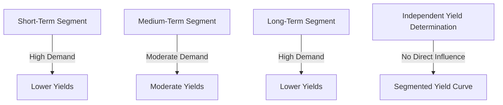

## 4.5.2.3 Market Segmentation Theory

Understanding the dynamics of bond yield curves is crucial for investors, financial professionals, and students alike. Among the various theories explaining the shape of the yield curve, Market Segmentation Theory offers a unique perspective by focusing on the supply and demand within specific maturity segments. This section delves into the intricacies of Market Segmentation Theory, its implications, and its practical applications in the bond markets.

### Definition

**Market Segmentation Theory** posits that the yield curve is shaped by the supply and demand for bonds within distinct maturity segments. Investors have specific maturity preferences, and these preferences lead to segmentation in the bond market. As a result, yields for each segment are determined independently, based on the supply and demand dynamics within that segment.

### Key Concepts

#### Segmentation Based on Maturity Preferences

Market Segmentation Theory suggests that the bond market is not a single, unified market but rather a collection of segmented markets, each corresponding to a different maturity range. The theory assumes that investors have distinct preferences for different maturities, which are influenced by their specific financial goals, risk tolerance, and regulatory constraints.

- **Short-Term Investors**: These investors, such as banks and money market funds, often prefer short-term bonds due to liquidity needs and regulatory requirements. They are less sensitive to interest rate changes over the long term and focus on maintaining liquidity and minimizing interest rate risk.

- **Medium-Term Investors**: Insurance companies and certain types of funds may prefer medium-term bonds to balance between yield and risk. These investors are often looking for a steady income stream without committing to the long durations of long-term bonds.

- **Long-Term Investors**: Pension funds and endowments typically prefer long-term bonds to match their long-term liabilities. These investors are more concerned with securing stable, long-term returns and are less affected by short-term interest rate fluctuations.

#### Independent Yield Determination

According to Market Segmentation Theory, yields in each maturity segment are determined independently. This independence implies that changes in interest rates in one segment do not necessarily affect rates in another segment. Each segment's yield is a function of the specific supply and demand dynamics within that segment, driven by the preferences of the investors who dominate that segment.

### Implications

#### Shape of the Yield Curve

The Market Segmentation Theory implies that the shape of the yield curve is primarily influenced by institutional factors and investor preferences. For instance, if there is a high demand for long-term bonds due to a surge in pension fund investments, the yield for long-term bonds may decrease, leading to a flatter yield curve.

#### Interest Rate Independence Across Segments

One of the critical implications of Market Segmentation Theory is that interest rates in one segment do not necessarily impact rates in another. This independence can lead to a yield curve that does not follow the traditional upward slope, as different segments may react differently to economic conditions and monetary policy changes.

### Examples

#### Banks and Short-Term Investments

Banks often prefer short-term investments to manage liquidity effectively. Their preference for short-term bonds can lead to a higher demand in this segment, potentially lowering yields. This behavior is particularly evident during periods of economic uncertainty when liquidity becomes a priority.

#### Pension Funds and Long-Term Bonds

Pension funds typically have long-term liabilities and thus prefer long-term bonds to match these liabilities. This preference can increase demand for long-term bonds, potentially reducing yields in this segment. The increased demand for long-term bonds by pension funds can lead to a steeper yield curve if short-term yields remain unchanged.

### Practical Applications

#### Portfolio Management

Understanding Market Segmentation Theory can aid portfolio managers in constructing bond portfolios that align with their investment goals and risk tolerance. By recognizing the maturity preferences of different investor segments, managers can better anticipate yield changes and adjust their strategies accordingly.

#### Yield Curve Analysis

Market Segmentation Theory provides a framework for analyzing yield curves based on investor behavior and market segmentation. Analysts can use this theory to interpret yield curve movements and make informed predictions about future interest rate changes.

### Diagrams and Visuals

To better understand Market Segmentation Theory, consider the following diagram illustrating the concept of segmented yield curves:

### Glossary

- **Market Segmentation Theory**: A theory stating that the yield curve is determined by supply and demand within distinct maturity segments, reflecting investor preferences for specific maturities.

### References

- Investopedia – [Market Segmentation Theory](https://www.investopedia.com/terms/m/marketsegmentationtheory.asp)
- CFA Institute – [Term Structure Theories](https://www.cfainstitute.org/en/membership/professional-development/refresher-readings/term-structure-and-interest-rate-dynamics)

### Summary

Market Segmentation Theory provides valuable insights into the dynamics of bond yield curves by emphasizing the role of investor preferences and market segmentation. By understanding this theory, investors and financial professionals can better navigate the complexities of the bond markets and develop strategies that align with their investment objectives.

---

## Bonds and Fixed Income Securities Quiz: Market Segmentation Theory



### What does Market Segmentation Theory propose about the yield curve?

- [x] It reflects the supply and demand for bonds within each maturity segment.
- [ ] It is solely influenced by central bank policies.
- [ ] It is determined by the overall economic growth rate.
- [ ] It is uniform across all maturities.

> **Explanation:** Market Segmentation Theory suggests that the yield curve is shaped by supply and demand dynamics within distinct maturity segments, reflecting investor preferences for specific maturities.

### According to Market Segmentation Theory, why might banks prefer short-term bonds?

- [x] To manage liquidity effectively.
- [ ] To maximize long-term returns.
- [ ] To hedge against inflation.
- [ ] To avoid interest rate risk.

> **Explanation:** Banks often prefer short-term bonds to manage liquidity effectively, as they need to meet short-term obligations and regulatory requirements.

### How does Market Segmentation Theory view interest rates in different segments?

- [x] Interest rates are determined independently in each segment.
- [ ] Interest rates are directly linked across all segments.
- [ ] Interest rates are primarily influenced by international markets.
- [ ] Interest rates are fixed by regulatory bodies.

> **Explanation:** Market Segmentation Theory posits that interest rates in each maturity segment are determined independently, based on the specific supply and demand dynamics within that segment.

### What might cause a steep yield curve according to Market Segmentation Theory?

- [x] Increased demand for long-term bonds by pension funds.
- [ ] A decrease in short-term interest rates by the central bank.
- [ ] Rising inflation expectations.
- [ ] A decrease in government bond issuance.

> **Explanation:** Increased demand for long-term bonds by pension funds can lower yields in the long-term segment, leading to a steeper yield curve if short-term yields remain unchanged.

### Which investor type is likely to prefer long-term bonds?

- [ ] Banks
- [ ] Money market funds
- [x] Pension funds
- [ ] Hedge funds

> **Explanation:** Pension funds typically prefer long-term bonds to match their long-term liabilities, making them more inclined to invest in this segment.

### What is a key implication of Market Segmentation Theory?

- [ ] All segments of the yield curve move in unison.
- [x] Institutional factors and investor preferences influence the yield curve shape.
- [ ] The yield curve is solely determined by inflation expectations.
- [ ] Short-term interest rates dictate long-term rates.

> **Explanation:** Market Segmentation Theory implies that institutional factors and investor preferences play a significant role in shaping the yield curve, with each segment being influenced by its own supply and demand dynamics.

### How does Market Segmentation Theory explain a flat yield curve?

- [x] Balanced supply and demand across all maturity segments.
- [ ] Uniform economic growth expectations.
- [ ] Central bank interventions across all segments.
- [ ] Rising inflation expectations.

> **Explanation:** A flat yield curve can occur when there is balanced supply and demand across all maturity segments, leading to similar yields across different maturities.

### What role do investor preferences play in Market Segmentation Theory?

- [x] They determine the demand for specific maturities.
- [ ] They have no impact on bond yields.
- [ ] They are overridden by central bank policies.
- [ ] They only affect short-term interest rates.

> **Explanation:** Investor preferences play a crucial role in Market Segmentation Theory, as they determine the demand for specific maturities, influencing the yield curve shape.

### What is the relationship between supply and demand in Market Segmentation Theory?

- [x] It determines yields within each maturity segment.
- [ ] It is irrelevant to bond pricing.
- [ ] It is controlled by government policies.
- [ ] It affects only corporate bonds.

> **Explanation:** In Market Segmentation Theory, the relationship between supply and demand within each maturity segment determines the yields, reflecting investor preferences and market dynamics.

### Why might a government issue bonds in different maturity segments?

- [x] To cater to diverse investor preferences.
- [ ] To manipulate the yield curve.
- [ ] To reduce national debt.
- [ ] To control inflation.

> **Explanation:** Governments issue bonds in different maturity segments to cater to diverse investor preferences, ensuring that they meet the demand from various investor types, such as banks, insurance companies, and pension funds.



---
