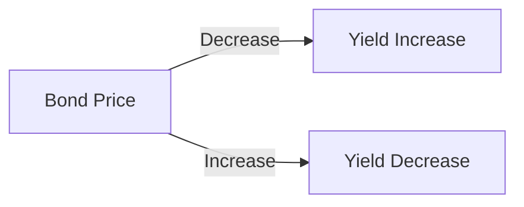

## 5.1.1 The Inverse Relationship Between Price and Yield

Understanding the inverse relationship between bond prices and yields is fundamental to mastering fixed income securities. This relationship is central to the dynamics of bond markets and is crucial for investors, finance professionals, and students aiming to optimize their investment strategies.

### The Basics of Bond Pricing and Yields

Bonds are fixed income securities that promise to pay a specified amount of interest, known as the coupon, at regular intervals until maturity, at which point the face value or par value is returned to the bondholder. The yield on a bond is the rate of return an investor can expect to earn if the bond is held until maturity. This yield is influenced by the bond's coupon rate, its price, and market interest rates.

#### Why Prices and Yields Move Inversely

The inverse relationship between bond prices and yields arises from the fixed nature of bond coupon payments. When market interest rates change, the attractiveness of existing bonds changes relative to new bonds issued at current rates. Here’s how it works:

- **Interest Rate Increase:** When market interest rates rise, new bonds are issued with higher coupon rates. Existing bonds with lower coupon rates become less attractive because investors can achieve better returns with new issues. As a result, the prices of existing bonds decrease to align their yields with the new market rates.

- **Interest Rate Decrease:** Conversely, when market interest rates fall, existing bonds with higher coupon rates become more attractive, as they offer better returns than new issues. This increased demand leads to a rise in the prices of existing bonds, reducing their yields to align with the lower market rates.

### Mathematical Illustration of Price-Yield Dynamics

To understand this relationship quantitatively, consider a bond with a face value of $1,000, a coupon rate of 5%, and a maturity of 10 years. If market interest rates rise to 6%, the bond's price will decrease to make its yield comparable to the new rate. Conversely, if market rates fall to 4%, the bond's price will increase.

#### Example Calculation

1. **Initial Scenario:** Bond with a 5% coupon rate, market rate at 5%.
   - Annual coupon payment = $1,000 * 5% = $50
   - Bond price = $1,000 (at par)

2. **Market Rate Increases to 6%:**
   - New bond yield = 6%
   - To calculate the new price, we discount the bond’s cash flows at 6%:
     
     \text{Price} = \sum_{t=1}^{10} \frac{50}{(1+0.06)^t} + \frac{1,000}{(1+0.06)^{10}}
     
   - This results in a lower price than the par value.

3. **Market Rate Decreases to 4%:**
   - New bond yield = 4%
   - Discounting the cash flows at 4%:
     
     \text{Price} = \sum_{t=1}^{10} \frac{50}{(1+0.04)^t} + \frac{1,000}{(1+0.04)^{10}}
     
   - This results in a higher price than the par value.

### Visualizing the Inverse Relationship

The inverse relationship can be graphically represented by plotting bond prices against yields. The resulting curve shows that as yields increase, prices decrease, and vice versa.

### Real-World Applications

Understanding this relationship is crucial for:

- **Portfolio Management:** Adjusting bond portfolios in response to expected interest rate changes.
- **Risk Management:** Hedging interest rate risk using derivatives or other financial instruments.
- **Investment Strategy:** Timing bond purchases and sales to capitalize on interest rate movements.

### Glossary

- **Interest Rate Risk:** The risk that changes in interest rates will affect the value of a bond.
- **Yield:** The annual return on a bond, expressed as a percentage of its price.

### References

- Investopedia - [Bond Prices and Interest Rates](https://www.investopedia.com/articles/bonds/09/how-interest-rates-affect-bonds.asp)
- CFA Institute - [Understanding the Relationship Between Bond Prices and Yields](https://www.cfainstitute.org/-/media/documents/support/programs/professional-learning/relationships-bond-prices-and-yields.ashx)

### Conclusion

The inverse relationship between bond prices and yields is a cornerstone of fixed income investing. By understanding this dynamic, you can better navigate the complexities of bond markets and optimize your investment strategies.

---

## Bonds and Fixed Income Securities Quiz: The Inverse Relationship Between Price and Yield



### What happens to the price of an existing bond when market interest rates increase?

- [x] The price decreases
- [ ] The price increases
- [ ] The price remains unchanged
- [ ] The price becomes volatile

> **Explanation:** When market interest rates increase, existing bonds with lower coupon rates become less attractive, leading to a decrease in their prices.

### Why do bond prices and yields move in opposite directions?

- [x] Because bond coupon payments are fixed
- [ ] Because bond coupon payments fluctuate
- [ ] Due to changes in bond maturity dates
- [ ] Due to changes in bond credit ratings

> **Explanation:** The fixed nature of bond coupon payments means that when market interest rates change, the relative attractiveness of existing bonds changes, causing prices and yields to move inversely.

### If a bond's yield increases, what can be inferred about its price?

- [ ] The price has increased
- [x] The price has decreased
- [ ] The price is stable
- [ ] The price is unpredictable

> **Explanation:** An increase in yield indicates a decrease in bond price, as the bond must offer a higher return to remain competitive with new issues.

### How does a decrease in market interest rates affect existing bonds with higher coupon rates?

- [x] Their prices increase
- [ ] Their prices decrease
- [ ] Their prices remain the same
- [ ] Their prices become unpredictable

> **Explanation:** Existing bonds with higher coupon rates become more attractive when market rates decrease, leading to an increase in their prices.

### What is the relationship between bond prices and yields?

- [x] Inverse relationship
- [ ] Direct relationship
- [ ] No relationship
- [ ] Complex relationship

> **Explanation:** Bond prices and yields have an inverse relationship; as one increases, the other decreases.

### What is the effect of a bond's fixed coupon rate on its price when interest rates change?

- [x] It causes the bond price to move inversely to interest rates
- [ ] It causes the bond price to move directly with interest rates
- [ ] It stabilizes the bond price
- [ ] It has no effect on the bond price

> **Explanation:** The fixed coupon rate means that as interest rates change, the bond's price must adjust inversely to maintain competitive yields.

### In bond investing, what does the term 'yield' refer to?

- [x] The rate of return on a bond investment
- [ ] The bond's face value
- [ ] The bond's maturity date
- [ ] The bond's credit rating

> **Explanation:** Yield refers to the annual rate of return on a bond investment, expressed as a percentage of its price.

### What happens to the yield of a bond if its price increases?

- [ ] The yield increases
- [x] The yield decreases
- [ ] The yield remains unchanged
- [ ] The yield becomes volatile

> **Explanation:** When a bond's price increases, its yield decreases because the fixed coupon payments represent a smaller percentage of the higher price.

### What is a common strategy for managing interest rate risk in bond portfolios?

- [x] Hedging with interest rate derivatives
- [ ] Increasing bond maturity
- [ ] Reducing bond credit quality
- [ ] Ignoring market trends

> **Explanation:** Hedging with interest rate derivatives is a common strategy to manage interest rate risk in bond portfolios.

### Which of the following best describes interest rate risk?

- [x] The risk of bond value reduction due to rising interest rates
- [ ] The risk of bond default
- [ ] The risk of bond liquidity
- [ ] The risk of bond inflation

> **Explanation:** Interest rate risk refers to the potential reduction in bond value due to rising interest rates.



---

This comprehensive section provides a deep dive into the inverse relationship between bond prices and yields, equipping you with the knowledge to make informed investment decisions in the fixed income market.
