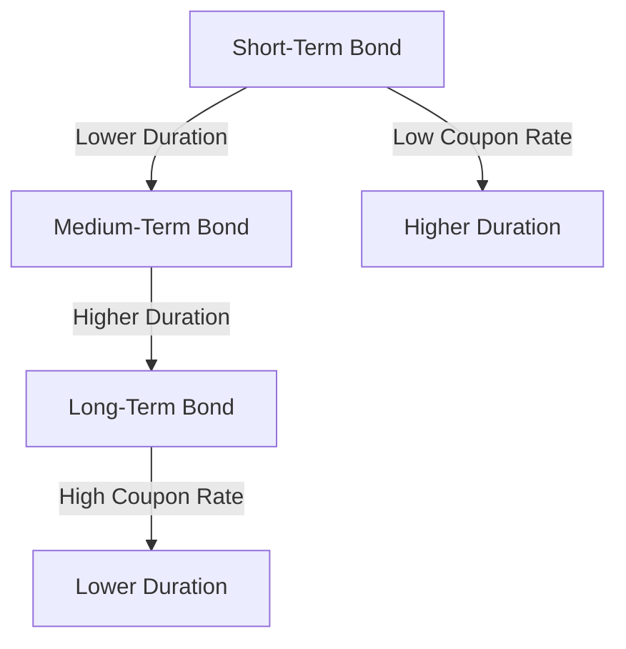

## 5.2.4.1 Duration and Time to Maturity

In the realm of fixed income securities, understanding the relationship between duration and time to maturity is crucial for assessing interest rate risk and making informed investment decisions. Duration serves as a vital measure of a bond's sensitivity to changes in interest rates, while time to maturity indicates the remaining lifespan of a bond until its principal is repaid. This section delves into the intricate dynamics between these two concepts, exploring how they interact and influence bond pricing and investment strategies.

### Understanding Duration

**Duration** is a measure of the sensitivity of a bond's price to changes in interest rates. It is expressed in years and represents the weighted average time it takes to receive the bond's cash flows. Duration is a critical tool for investors, as it helps quantify the potential impact of interest rate fluctuations on bond prices. Generally, the longer the duration, the more sensitive the bond is to interest rate changes.

### The Relationship Between Duration and Time to Maturity

The relationship between duration and time to maturity is generally direct: as the time to maturity increases, the duration of a bond also tends to increase. This is because longer-maturity bonds have cash flows that are spread out over a more extended period, making them more sensitive to interest rate changes. However, this relationship is not linear and can be influenced by several factors, including the bond's coupon rate and yield to maturity.

#### Key Factors Affecting Duration

1. **Coupon Rate**: Bonds with lower coupon rates typically have higher durations compared to bonds with higher coupon rates, assuming all other factors are equal. This is because lower coupon bonds have a greater proportion of their cash flows occurring at maturity, increasing their sensitivity to interest rate changes.

2. **Yield to Maturity (YTM)**: The yield to maturity also affects duration. As YTM increases, the duration of a bond generally decreases. This is because higher yields result in a greater discounting of future cash flows, reducing the bond's sensitivity to interest rate changes.

3. **Bond Type**: Different types of bonds exhibit varying duration characteristics. For example, zero-coupon bonds have durations equal to their time to maturity because they do not pay periodic interest, making their entire cash flow occur at maturity. In contrast, coupon-paying bonds have durations that are shorter than their time to maturity due to the periodic interest payments.

### Graphical Representation of Duration and Maturity

To visualize how duration changes with varying maturities, consider the following graphical representation:

This diagram illustrates that as bonds move from short-term to long-term, their duration generally increases. However, bonds with lower coupon rates will have higher durations compared to those with higher coupon rates, even if they have the same maturity.

### Exceptions to the General Rule

While the general rule is that longer maturities lead to higher durations, there are notable exceptions:

- **Low Coupon Bonds**: Bonds with very low or zero coupon rates can have durations that are disproportionately high relative to their maturities. This is because the bulk of their cash flows occur at maturity, making them highly sensitive to interest rate changes.

- **Callable Bonds**: Bonds with embedded options, such as callable bonds, may exhibit different duration characteristics. The potential for the issuer to call the bond before maturity can reduce the bond's effective duration, as the expected cash flows may be altered.

- **Floating Rate Bonds**: These bonds have interest payments that adjust with market rates, resulting in durations that are typically lower than those of fixed-rate bonds with similar maturities.

### Practical Applications and Investment Strategies

Understanding the relationship between duration and time to maturity is essential for developing effective bond investment strategies. Here are some practical applications:

1. **Interest Rate Risk Management**: Investors can use duration to manage interest rate risk in their portfolios. By matching the duration of their bond holdings with their investment horizon, they can minimize the impact of interest rate fluctuations on their portfolio's value.

2. **Immunization Strategies**: Duration matching is a key component of immunization strategies, where investors aim to protect their portfolios from interest rate changes by aligning the duration of assets and liabilities.

3. **Yield Curve Strategies**: Investors can exploit differences in duration across the yield curve to optimize their returns. For example, a barbell strategy involves holding a combination of short- and long-duration bonds to balance interest rate risk and return potential.

### Summary

The relationship between duration and time to maturity is a fundamental concept in fixed income investing. While longer maturities generally lead to higher durations, various factors such as coupon rates, bond types, and embedded options can influence this relationship. By understanding these dynamics, investors can make informed decisions to manage interest rate risk and optimize their bond portfolios.

### Glossary

- **Time to Maturity**: The remaining lifespan of a bond until its principal is repaid.
- **Duration**: A measure of a bond's sensitivity to interest rate changes, expressed in years.

### References

- CFI - [Duration and Maturity](https://corporatefinanceinstitute.com/resources/knowledge/trading-investing/relationship-duration-maturity/)

## Bonds and Fixed Income Securities Quiz: Duration and Time to Maturity



### What is the relationship between duration and time to maturity?

- [x] Generally, longer time to maturity leads to higher duration.
- [ ] Duration is always equal to time to maturity.
- [ ] Duration decreases as time to maturity increases.
- [ ] There is no relationship between duration and time to maturity.

> **Explanation:** Generally, the longer the time to maturity, the higher the duration, indicating greater interest rate risk.

### Which factor can cause a bond with a longer maturity to have a lower duration?

- [ ] Higher credit rating
- [ ] Lower market demand
- [x] Higher coupon rate
- [ ] Greater liquidity

> **Explanation:** A higher coupon rate results in more frequent cash flows, reducing the bond's sensitivity to interest rate changes and thus lowering its duration.

### How does a zero-coupon bond's duration compare to its time to maturity?

- [x] Duration is equal to time to maturity.
- [ ] Duration is less than time to maturity.
- [ ] Duration is more than time to maturity.
- [ ] Duration is not related to time to maturity.

> **Explanation:** A zero-coupon bond's duration equals its time to maturity because it makes no periodic interest payments, with all cash flows occurring at maturity.

### What effect does an increase in yield to maturity have on a bond's duration?

- [x] Duration decreases.
- [ ] Duration increases.
- [ ] Duration remains the same.
- [ ] Duration becomes negative.

> **Explanation:** As yield to maturity increases, the present value of future cash flows decreases, which reduces the bond's duration.

### Which type of bond typically has the lowest duration?

- [ ] Zero-coupon bond
- [ ] Fixed-rate bond
- [x] Floating-rate bond
- [ ] Callable bond

> **Explanation:** Floating-rate bonds have interest payments that adjust with market rates, resulting in lower durations compared to fixed-rate bonds.

### What is a key strategy for managing interest rate risk using duration?

- [ ] Short selling bonds
- [ ] Increasing portfolio turnover
- [x] Duration matching
- [ ] Leveraging bond positions

> **Explanation:** Duration matching involves aligning the duration of bond holdings with the investor's investment horizon to minimize interest rate risk.

### How does a callable bond's potential call feature affect its duration?

- [x] It reduces the bond's effective duration.
- [ ] It increases the bond's effective duration.
- [ ] It has no effect on duration.
- [ ] It makes duration irrelevant.

> **Explanation:** The possibility of the bond being called before maturity reduces its effective duration, as the expected cash flows may be altered.

### Which bond characteristic increases its sensitivity to interest rate changes?

- [ ] Short time to maturity
- [ ] High coupon rate
- [x] Long time to maturity
- [ ] High credit rating

> **Explanation:** A long time to maturity increases a bond's sensitivity to interest rate changes, resulting in a higher duration.

### What is the primary measure of a bond's interest rate risk?

- [ ] Yield to maturity
- [ ] Coupon rate
- [x] Duration
- [ ] Credit rating

> **Explanation:** Duration is the primary measure of a bond's sensitivity to interest rate changes and its associated risk.

### In a barbell strategy, what type of bonds are typically held?

- [ ] Only long-duration bonds
- [ ] Only short-duration bonds
- [x] A combination of short- and long-duration bonds
- [ ] Only medium-duration bonds

> **Explanation:** A barbell strategy involves holding a mix of short- and long-duration bonds to balance interest rate risk and potential returns.


