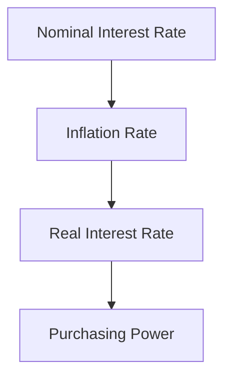

## 8.2.3 Real vs. Nominal Interest Rates

Understanding the difference between real and nominal interest rates is crucial for investors in the fixed income market. These concepts are fundamental to assessing the actual return on investments, especially in the context of inflation, which can erode purchasing power over time. In this section, we will delve into the definitions, calculations, and implications of real and nominal interest rates, providing you with the knowledge to make informed investment decisions.

### Defining Real and Nominal Interest Rates

**Nominal Interest Rate:** This is the stated interest rate on a bond or loan, unadjusted for inflation. It represents the percentage increase in money that the borrower pays to the lender, not considering the purchasing power of that money.

**Real Interest Rate:** This rate reflects the true cost of borrowing after accounting for inflation. It measures the increase in purchasing power that an investor gains from an investment. The real interest rate is crucial for evaluating the actual return on investment.

### The Fisher Equation

The relationship between nominal and real interest rates is succinctly captured by the Fisher Equation, named after economist Irving Fisher. This equation provides a way to calculate the real interest rate by adjusting the nominal rate for inflation:

 \text{Real Rate} \approx \text{Nominal Rate} - \text{Inflation Rate} 

**Example:**  
Suppose a bond offers a nominal interest rate of 5%, and the inflation rate is 2%. The real interest rate can be calculated as follows:

 \text{Real Rate} = 5\% - 2\% = 3\% 

This means that the investor's purchasing power increases by 3% after accounting for inflation.

### Importance of Real Interest Rates

Real interest rates are vital for investors because they reflect the true return on investments. While nominal rates might appear attractive, high inflation can significantly reduce the actual gains. Understanding real rates helps investors:

- **Assess Purchasing Power:** Real rates provide a clearer picture of how much more goods and services an investor can purchase over time.
- **Make Informed Decisions:** Investors can compare real rates across different investment opportunities to choose the most beneficial ones.
- **Plan for the Future:** By considering real rates, investors can better plan for long-term financial goals, ensuring that their investments keep pace with inflation.

### Real Interest Rates and Bond Pricing

In the bond market, real interest rates influence bond pricing and yields. When inflation expectations rise, nominal interest rates tend to increase to maintain attractive real rates for investors. This can lead to a decrease in bond prices, as existing bonds with lower nominal rates become less attractive compared to new issues with higher rates.

### Case Study: Inflation Impact on Bond Returns

Consider an investor holding a 10-year Treasury bond with a nominal yield of 4%. If inflation unexpectedly rises from 1% to 3%, the real yield drops from 3% to 1%. This decrease in real yield can lead to a decline in bond prices as investors demand higher nominal yields to compensate for the increased inflation.

### Practical Example: Calculating Real Returns

Let's calculate the real return on an investment with a nominal return of 6% in an economy experiencing 2% inflation.

 \text{Real Return} = 6\% - 2\% = 4\% 

This calculation shows that the investor's purchasing power increases by 4%, despite the nominal return being 6%.

### Real vs. Nominal Rates in Economic Policy

Central banks often focus on real interest rates when setting monetary policy. By influencing nominal rates, they aim to control inflation and stimulate economic growth. Understanding the distinction between real and nominal rates helps policymakers assess the effectiveness of their strategies.

### Diagrams and Visual Aids

To further illustrate the relationship between real and nominal interest rates, consider the following diagram:

This diagram shows how nominal rates are adjusted for inflation to determine real rates, which ultimately affect purchasing power.

### Common Pitfalls and Strategies

**Pitfalls:**

- **Ignoring Inflation:** Focusing solely on nominal rates can lead to overestimating returns.
- **Misjudging Inflation Trends:** Incorrect inflation forecasts can impact investment decisions.

**Strategies:**

- **Monitor Inflation Indicators:** Keep an eye on economic indicators that signal changes in inflation.
- **Diversify Investments:** Consider a mix of assets to hedge against inflation risks.

### Conclusion

Understanding real vs. nominal interest rates is essential for navigating the bond market and making informed investment decisions. By considering inflation, investors can better assess the true value of their returns and protect their purchasing power over time.

---

## Bonds and Fixed Income Securities Quiz: Real vs. Nominal Interest Rates



### What is the nominal interest rate?

- [ ] The interest rate adjusted for inflation.
- [x] The stated interest rate on a bond or loan, unadjusted for inflation.
- [ ] The interest rate that reflects the true cost of borrowing.
- [ ] The interest rate that measures the increase in purchasing power.

> **Explanation:** The nominal interest rate is the stated interest rate on a bond or loan, unadjusted for inflation. It represents the percentage increase in money the borrower pays to the lender.

### How is the real interest rate calculated using the Fisher Equation?

- [x] Real Rate ≈ Nominal Rate - Inflation Rate
- [ ] Real Rate ≈ Inflation Rate - Nominal Rate
- [ ] Real Rate ≈ Nominal Rate + Inflation Rate
- [ ] Real Rate ≈ Nominal Rate / Inflation Rate

> **Explanation:** The Fisher Equation calculates the real interest rate by subtracting the inflation rate from the nominal rate.

### Why are real interest rates important for investors?

- [ ] They show the nominal return on investment.
- [ ] They indicate the total amount of money received.
- [x] They reflect the true return on investments after accounting for inflation.
- [ ] They measure the risk associated with an investment.

> **Explanation:** Real interest rates are important because they reflect the true return on investments after accounting for inflation, showing the actual increase in purchasing power.

### What happens to bond prices when inflation expectations rise?

- [ ] Bond prices increase.
- [x] Bond prices decrease.
- [ ] Bond prices remain unchanged.
- [ ] Bond prices become volatile.

> **Explanation:** When inflation expectations rise, nominal interest rates tend to increase, leading to a decrease in bond prices as existing bonds with lower rates become less attractive.

### In the context of real and nominal rates, what does purchasing power refer to?

- [ ] The ability to borrow money.
- [ ] The amount of interest earned.
- [x] The ability to buy goods and services.
- [ ] The total value of investments.

> **Explanation:** Purchasing power refers to the ability to buy goods and services, which is affected by inflation and reflected in real interest rates.

### How does inflation affect the real interest rate?

- [ ] It increases the real interest rate.
- [x] It decreases the real interest rate.
- [ ] It has no effect on the real interest rate.
- [ ] It stabilizes the real interest rate.

> **Explanation:** Inflation decreases the real interest rate by reducing the purchasing power of money, thus lowering the actual return on investments.

### What is the impact of high inflation on nominal interest rates?

- [ ] Nominal interest rates decrease.
- [x] Nominal interest rates increase.
- [ ] Nominal interest rates remain constant.
- [ ] Nominal interest rates become unpredictable.

> **Explanation:** High inflation typically leads to an increase in nominal interest rates as lenders demand higher returns to compensate for the loss of purchasing power.

### Which of the following best describes the Fisher Equation?

- [ ] A formula for calculating bond prices.
- [x] A formula for adjusting nominal rates for inflation.
- [ ] A method for determining credit risk.
- [ ] A technique for predicting market trends.

> **Explanation:** The Fisher Equation is a formula for adjusting nominal rates for inflation to determine the real interest rate.

### What is a potential pitfall when focusing only on nominal interest rates?

- [ ] Overestimating inflation.
- [x] Overestimating returns.
- [ ] Underestimating risk.
- [ ] Ignoring economic indicators.

> **Explanation:** Focusing only on nominal interest rates can lead to overestimating returns by not accounting for the eroding effect of inflation on purchasing power.

### How can investors protect against inflation risks?

- [ ] By ignoring inflation indicators.
- [ ] By investing solely in nominal bonds.
- [ ] By focusing on short-term gains.
- [x] By diversifying investments.

> **Explanation:** Diversifying investments can help protect against inflation risks by spreading exposure across various asset classes that may react differently to inflation.



---

By understanding the distinction between real and nominal interest rates, you can better navigate the complexities of the bond market and make more informed investment decisions. Remember to consider inflation when evaluating returns, and use the Fisher Equation as a tool to assess the true value of your investments.
