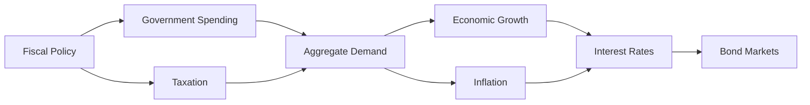

## 8.4.3 Impact of Fiscal Policy on Interest Rates and Bond Markets

Understanding the impact of fiscal policy on interest rates and bond markets is crucial for investors, finance professionals, and students preparing for US Securities Exams. Fiscal policy, which involves government spending and taxation, plays a significant role in shaping economic growth, inflation, and the overall financial environment. This section explores the complex interactions between fiscal policy, interest rates, and bond markets, providing insights into how these factors influence each other and affect investment decisions.

### The Influence of Fiscal Policy on Economic Growth and Inflation

Fiscal policy can stimulate or restrain economic activity through government spending and taxation. Expansionary fiscal policy, characterized by increased government spending and/or tax cuts, aims to boost economic growth by increasing aggregate demand. Conversely, contractionary fiscal policy, involving reduced government spending and/or higher taxes, seeks to cool down an overheated economy.

#### Expansionary Fiscal Policy

- **Increased Government Spending:** By injecting more money into the economy, the government can stimulate demand for goods and services, leading to higher economic growth. This can result in job creation and increased consumer spending.
- **Tax Cuts:** Reducing taxes leaves individuals and businesses with more disposable income, encouraging consumption and investment, which further fuels economic growth.

#### Contractionary Fiscal Policy

- **Reduced Government Spending:** By cutting back on expenditures, the government can reduce aggregate demand, slowing down economic growth.
- **Increased Taxes:** Higher taxes reduce disposable income, curbing consumer spending and investment, which can help control inflation.

### Interaction Between Government Borrowing, Crowding Out Effect, and Interest Rates

Government borrowing is a key component of fiscal policy, especially when expenditures exceed revenues. To finance deficits, governments issue bonds, which can influence interest rates and the broader bond market.

#### Government Borrowing and Interest Rates

- **Increased Demand for Funds:** When the government borrows heavily, it competes with the private sector for available funds in the financial markets. This increased demand can lead to higher interest rates, as lenders require higher returns to part with their money.
- **Interest Rate Implications:** Higher interest rates can increase the cost of borrowing for businesses and consumers, potentially slowing down economic activity.

#### Crowding Out Effect

- **Definition:** The crowding out effect occurs when increased government borrowing leads to higher interest rates, which in turn reduces private sector investment. This can offset the stimulative impact of government spending.
- **Impact on Private Investment:** As interest rates rise, borrowing becomes more expensive for businesses, leading to reduced capital investment. This can hinder long-term economic growth and innovation.

### Historical Instances of Fiscal Policy Shifts Affecting Bond Markets

Examining historical examples can provide valuable insights into how fiscal policy shifts have impacted bond markets.

#### The Reagan Era (1980s)

- **Tax Cuts and Military Spending:** The Reagan administration implemented significant tax cuts and increased military spending, leading to large budget deficits.
- **Impact on Interest Rates:** The increased government borrowing contributed to higher interest rates, which affected bond prices and yields.
- **Bond Market Reaction:** The bond market experienced volatility as investors adjusted to the new fiscal landscape, with long-term interest rates rising significantly.

#### The Global Financial Crisis (2008-2009)

- **Stimulus Packages:** In response to the financial crisis, governments worldwide implemented expansive fiscal policies, including stimulus packages and bailouts.
- **Impact on Bond Markets:** The increased issuance of government bonds to finance these measures led to fluctuations in bond yields, as investors assessed the long-term implications of rising public debt.

#### COVID-19 Pandemic (2020)

- **Massive Fiscal Stimulus:** Governments around the world enacted unprecedented fiscal measures to support economies during the pandemic, leading to a surge in government borrowing.
- **Bond Market Dynamics:** The bond markets experienced significant movements, with central banks intervening to stabilize markets and keep interest rates low.

### Practical Examples and Scenarios

To illustrate the impact of fiscal policy on interest rates and bond markets, consider the following scenarios:

#### Scenario 1: Expansionary Fiscal Policy

Imagine a government decides to implement an expansionary fiscal policy by increasing infrastructure spending and cutting taxes. This policy aims to boost economic growth and reduce unemployment.

- **Immediate Impact:** The increased government spending and tax cuts lead to higher aggregate demand, stimulating economic activity.
- **Interest Rate Response:** As the government borrows more to finance its spending, interest rates may rise due to increased demand for funds.
- **Bond Market Reaction:** Bond prices may fall as yields rise, reflecting the higher interest rates. Investors may demand higher yields to compensate for the increased supply of government bonds.

#### Scenario 2: Contractionary Fiscal Policy

Consider a scenario where a government decides to implement a contractionary fiscal policy by reducing public spending and increasing taxes to combat inflation.

- **Immediate Impact:** The reduction in government spending and higher taxes lead to decreased aggregate demand, slowing down economic growth.
- **Interest Rate Response:** With reduced government borrowing, interest rates may stabilize or decrease, as the demand for funds declines.
- **Bond Market Reaction:** Bond prices may rise as yields fall, reflecting the lower interest rates. Investors may see government bonds as a safe haven during economic uncertainty.

### Real-World Applications and Regulatory Scenarios

Understanding the impact of fiscal policy on interest rates and bond markets is essential for navigating the fixed income landscape. Investors and finance professionals must consider the following:

- **Investment Decisions:** Fiscal policy changes can influence interest rate expectations, affecting bond prices and yields. Investors need to assess the potential impact on their portfolios and adjust their strategies accordingly.
- **Regulatory Considerations:** Regulatory bodies, such as the Federal Reserve, monitor fiscal policy and its effects on interest rates and inflation. Understanding these dynamics can help investors anticipate regulatory actions and market responses.

### Step-by-Step Guidance for Analyzing Fiscal Policy Impact

To effectively analyze the impact of fiscal policy on interest rates and bond markets, follow these steps:

1. **Monitor Fiscal Policy Announcements:** Stay informed about government spending and taxation plans, as these can signal changes in fiscal policy.
2. **Assess Economic Indicators:** Analyze key economic indicators, such as GDP growth, inflation rates, and employment data, to gauge the effectiveness of fiscal policy measures.
3. **Evaluate Government Borrowing Trends:** Track government bond issuance and borrowing levels to understand the potential impact on interest rates.
4. **Analyze Interest Rate Movements:** Monitor changes in interest rates and yield curves to assess the bond market's response to fiscal policy shifts.
5. **Consider Global Influences:** Recognize that fiscal policy in one country can have international implications, affecting global bond markets and investor sentiment.

### Diagrams and Visuals

To enhance understanding, consider the following diagram illustrating the interaction between fiscal policy, interest rates, and bond markets:

### Best Practices and Common Pitfalls

- **Stay Informed:** Regularly update your knowledge of fiscal policy developments and their potential impact on interest rates and bond markets.
- **Diversify Investments:** Consider diversifying your bond portfolio to mitigate risks associated with fiscal policy changes.
- **Avoid Overreacting:** While fiscal policy shifts can influence markets, avoid making hasty investment decisions based on short-term movements.

### References and Additional Resources

For further exploration of fiscal policy and its impact on interest rates and bond markets, consider the following resources:

- Federal Reserve - [Fiscal Policy and Interest Rates](https://www.federalreserve.gov/econres/feds/files/2017107pap.pdf)
- U.S. Department of the Treasury - [Fiscal Data](https://fiscaldata.treasury.gov/)
- International Monetary Fund - [Fiscal Policy and Economic Growth](https://www.imf.org/en/Publications/WP/Issues/2016/12/31/Fiscal-Policy-and-Economic-Growth-43393)

### Summary

In summary, fiscal policy plays a pivotal role in shaping interest rates and bond markets. By understanding the interactions between government spending, taxation, and borrowing, investors can make informed decisions and optimize their fixed income strategies. Regularly monitoring fiscal policy developments and their economic implications is essential for navigating the dynamic landscape of bond markets.

## Bonds and Fixed Income Securities Quiz: Impact on Interest Rates and Bond Markets



### How does expansionary fiscal policy typically affect economic growth?

- [x] It increases economic growth by boosting aggregate demand.
- [ ] It decreases economic growth by reducing aggregate demand.
- [ ] It has no impact on economic growth.
- [ ] It only affects inflation, not economic growth.

> **Explanation:** Expansionary fiscal policy increases economic growth by boosting aggregate demand through increased government spending and/or tax cuts.

### What is the crowding out effect in the context of fiscal policy?

- [x] When increased government borrowing leads to higher interest rates, reducing private investment.
- [ ] When government spending increases private sector investment.
- [ ] When tax cuts lead to reduced government borrowing.
- [ ] When fiscal policy has no effect on interest rates.

> **Explanation:** The crowding out effect occurs when increased government borrowing leads to higher interest rates, which can reduce private sector investment.

### Which historical period saw significant fiscal policy shifts that affected bond markets?

- [x] The Reagan Era (1980s)
- [ ] The Great Depression (1930s)
- [ ] The Dot-com Bubble (1990s)
- [ ] The Industrial Revolution (1800s)

> **Explanation:** The Reagan Era saw significant fiscal policy shifts, including tax cuts and increased military spending, which affected bond markets.

### What is a potential impact of contractionary fiscal policy on interest rates?

- [x] Interest rates may stabilize or decrease.
- [ ] Interest rates will always increase.
- [ ] Interest rates will remain unchanged.
- [ ] Interest rates will become unpredictable.

> **Explanation:** Contractionary fiscal policy can lead to stabilized or decreased interest rates due to reduced government borrowing.

### How can fiscal policy influence inflation?

- [x] By affecting aggregate demand through government spending and taxation.
- [ ] By controlling the money supply directly.
- [ ] By setting interest rates.
- [ ] By regulating private sector investments.

> **Explanation:** Fiscal policy influences inflation by affecting aggregate demand through changes in government spending and taxation.

### What is a common effect of increased government borrowing on bond markets?

- [x] Bond prices may fall as yields rise.
- [ ] Bond prices will always increase.
- [ ] Bond yields will decrease.
- [ ] Bond markets will become more stable.

> **Explanation:** Increased government borrowing can lead to higher interest rates, causing bond prices to fall as yields rise.

### In which scenario might investors demand higher yields on government bonds?

- [x] When government borrowing increases significantly.
- [ ] When government spending decreases.
- [ ] When taxes are increased.
- [ ] When inflation is low.

> **Explanation:** Investors may demand higher yields on government bonds when government borrowing increases significantly, due to perceived higher risk.

### What role do central banks play in the context of fiscal policy and bond markets?

- [x] They monitor fiscal policy and its effects on interest rates and inflation.
- [ ] They directly set fiscal policy measures.
- [ ] They issue government bonds.
- [ ] They have no role in fiscal policy.

> **Explanation:** Central banks monitor fiscal policy and its effects on interest rates and inflation, influencing their monetary policy decisions.

### How can fiscal policy changes affect bond yields?

- [x] By altering interest rate expectations.
- [ ] By directly changing bond maturities.
- [ ] By setting bond prices.
- [ ] By issuing more corporate bonds.

> **Explanation:** Fiscal policy changes can affect bond yields by altering interest rate expectations, impacting investor demand.

### What is a recommended strategy for investors during fiscal policy shifts?

- [x] Diversify bond portfolios to mitigate risks.
- [ ] Concentrate investments in a single bond type.
- [ ] Ignore fiscal policy changes.
- [ ] Only invest in government bonds.

> **Explanation:** Diversifying bond portfolios is recommended to mitigate risks associated with fiscal policy changes.



---
