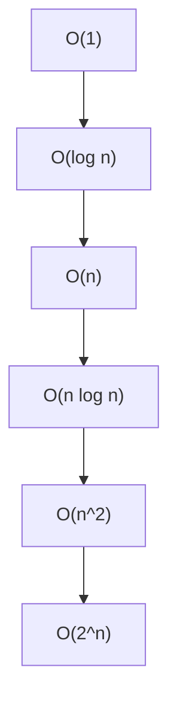

# Securities Exams Mastery

---

## Contact Us

Have questions or need recommendations? **[Contact our support team](mailto:info@tokenizer.ca?subject=SecuritiesExamsMastery.com)** – we're here to help!

### This is test of Mermaid diagram:

